---
lab:
    title: 'ラボ 1 - Azure AD Privileged Identity Management'
    module: 'モジュール 1：ID 管理とアクセス管理'
---

# モジュール 1：ラボ 1 - Azure AD Privileged Identity Management


**シナリオ**

このラボでは、Azure Privileged Identity Management (PIM) を使用してジャストインタイム管理を有効にし、特権操作を実行できるユーザー数を制御する方法を学習します。また、使用可能なさまざまなディレクトリロールと、PIM がリソースレベルでロールの割り当てに拡張されるなどの新しい機能についても学習します。次のレッスンが含まれます。

- PIM の使用開始
- PIM セキュリティウィザード
- ディレクトリロールの PIM
- ロールリソースの PIM

✔️ ID の管理コースでは、Azure RBAC および Azure Active Directory も取り上げます。このコンテンツは、コースの残りの部分のコンテキストと基盤を提供するためにも含まれています。


## Azure AD Privileged Identity Management

## 実習 1 - Azure リソースの発見と管理

### タスク 1：ラボの設定


このラボでは、PIM に使用される予定のユーザーが必要です。


1.  **Azure Portal** で、**Cloud Shell** を **PowerShell** モードで開きます。プロンプトが表示されたら、**ストレージを作成する** をクリックします。

1.  次の PowerShell コマンドを実行して、デフォルトドメインに AD ユーザーとパスワードを作成します

    ```powershell
    $PasswordProfile = New-Object -TypeName Microsoft.Open.AzureAD.Model.PasswordProfile
    ```
    ```powershell
    $PasswordProfile.Password = "Pa55w.rd"
    ```
    ```powershell
    $domainObj = get-azureaddomain
    ```
    ```powershell
    $domain = $domainObj[0].name
    ```
    ```powershell
    New-AzureADUser -DisplayName "Isabella Simonsen" -PasswordProfile $PasswordProfile -UserPrincipalName "Isabella@$domain" -AccountEnabled $true -MailNickName "Isabella"
    ```
### タスク 2：  Azure AD Premium P2 トライアルを有効にして、テストユーザーを作成します。

1.  Azure Portal で、[ハブ]メニューの **Azure Active Directory** をクリックします。

1.  **管理** にある **ライセンス** をクリックします。

    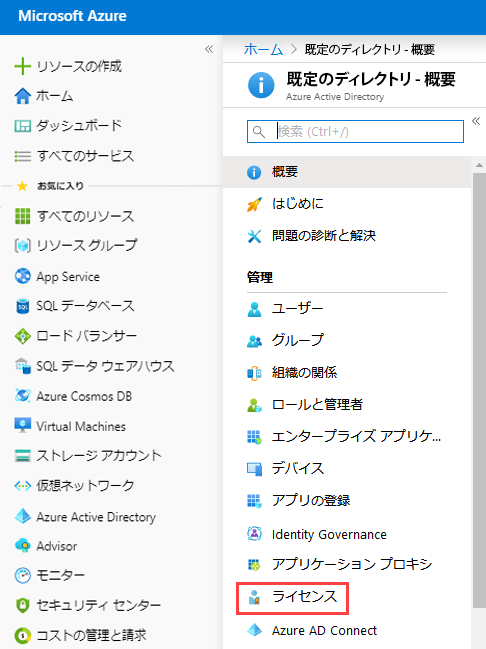

1.  **すべての製品** を選択します。

     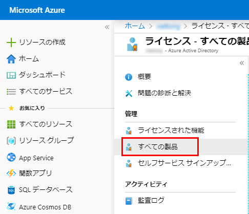


1.  **試用/購入** をクリックします。

     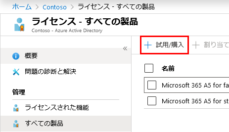

1.  ドロップダウン矢印をクリックして、**Azure AD Premium P2** 製品に対して **有効化** を選択します。

     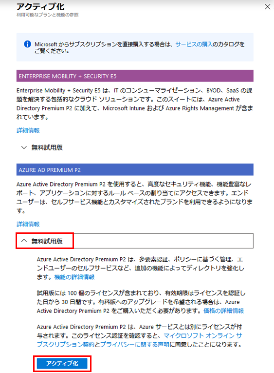

**更新するには、Azure ポータルからログアウトし、再度ログインする必要がある場合があります**

### タスク 3：リソースを発見する

1.  Azure Portal で、**すべてのサービス** をクリックして、**Azure AD Privileged Identity Management** を検索して選択します。

     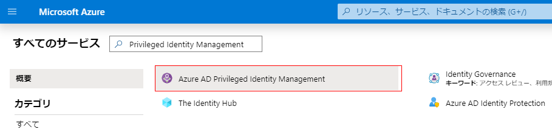

1.  クリックして、PIM に同意します。

     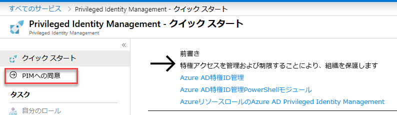

1.  **ID を確認** をクリックします。

     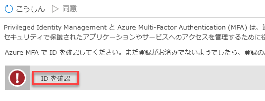

1.  **次へ** をクリックします。

     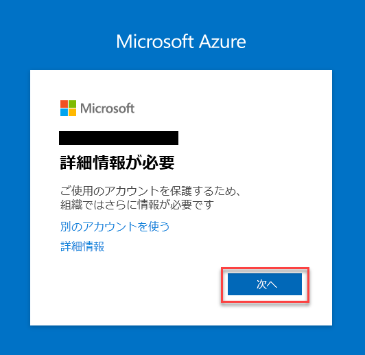

1.  携帯電話の詳細を入力して、**次へ** をクリックします。

     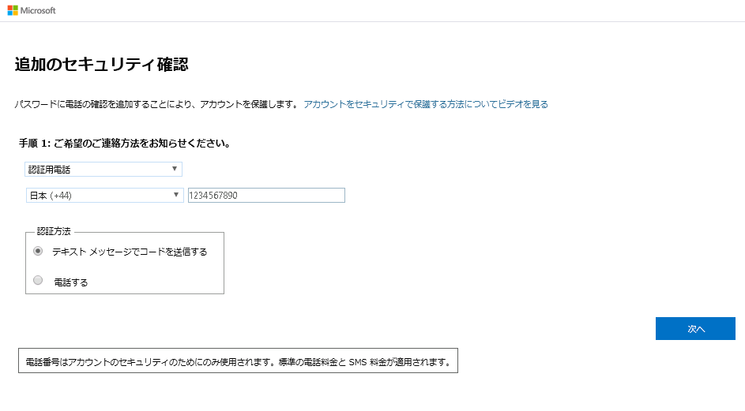
 
1.  SMS 経由でコードを受信したら入力して、**確認** をクリックします。

     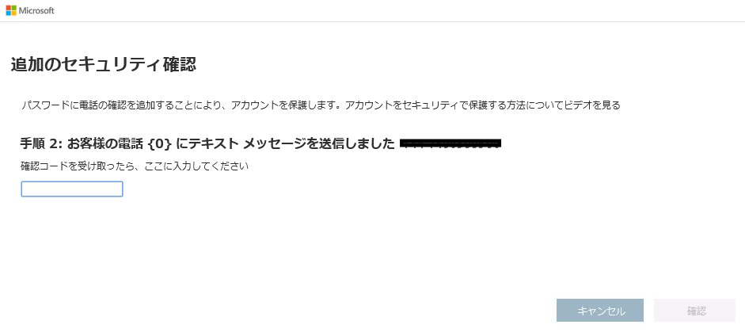

1. 検証が成功したら、**完了** をクリックします。

1.  Azure Portal で、**すべてのサービス** をクリックして、**Azure AD Privileged Identity Management** を検索して選択します。

     

1.  クリックして、PIM に同意します。

     

1.  **PIM ブレードに同意** に戻り、**同意** をクリックして、**はい** をクリックします。

     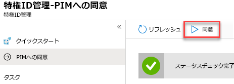

1.  **F5** を押して Azure Portal を更新します。
   
    **注記**：ブラウザでポータルを更新しても PIM が有効になっていると表示されない場合は、ログアウトしてから Azure Portal に戻ってください。

2.  **Azure リソース** をクリックします。

     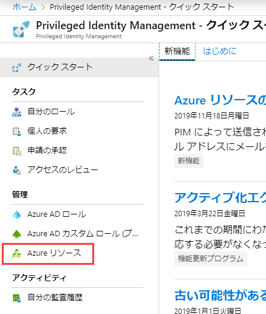


3.  **リソースを発見する** をクリックして、発見体験を開始します。

     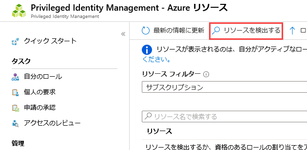


4.  [検出] ウィンドウで、**リソース状態フィルター** を使用して、**リソースタイプを選択** して、書き込み権限がある管理グループまたはサブスクリプションをフィルタリングします。**すべて** を最初に始めることがおそらく最も簡単でしょう。

     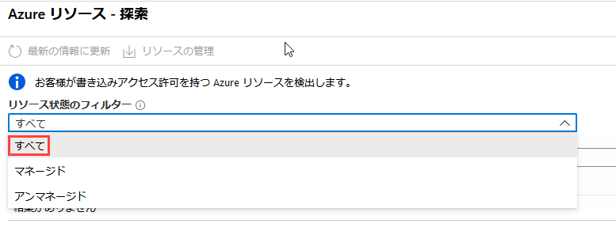

5.  Azure サブスクリプションの横にチェックマークを追加します。
   
     
 
6.  **リソースを管理する** をクリックして、選択したリソースの管理を開始します。

     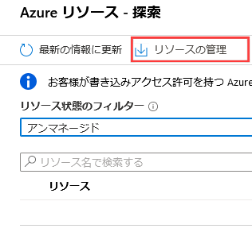

7.  プロンプトが表示されたら、**はい** をクリックします。


    **注記**：PIM を使用して管理する管理グループまたはサブスクリプションリソースのみを検索および選択できます。PIM で管理グループまたはサブスクリプションを管理する場合、その子リソースも管理できます。


    **注記**：管理グループまたはサブスクリプションを管理対象に設定すると、管理対象から外すことはできません。これにより、別のリソース管理者が PIM 設定を削除できなくなります。


## 演習 2 - ディレクトリロールの割り当て

### タスク 1：  ユーザーをロールに対して適格にする


次のタスクでは、ユーザーに Azure AD ディレクトリロールに対して適格にします。


1.  Azure portal にサインインします

1.  Azure Portal で、**すべてのサービス** をクリックして、**Azure AD Privileged Identity Management** を検索して選択します。

     

1.  **Azure AD のロール** を選択します。

     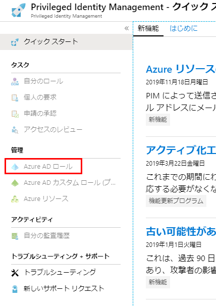
 
1.  **Azure AD ロールの PIM にサインアップする** をクリックします。

     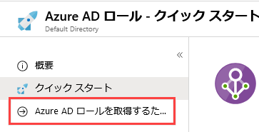


1.  **サインアップ** をクリックしてから、**はい** をクリックします。

     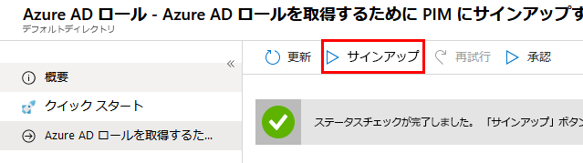

1.  **ブラウザーをリフレッシュ** します。

1.  **ロール** をクリックします。

     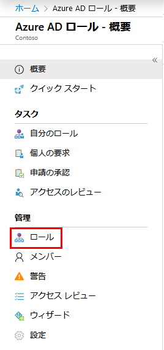


1.  **メンバーを追加** をクリックして、[管理メンバーの追加]を開きます。

     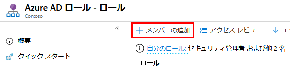

1.  **ロールを選択** をクリックして、**課金管理者** をクリックしてから、**選択** をクリックします。

     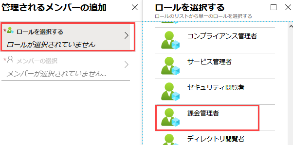

1.  **メンバーを選択** をクリックして、**イザベラ** を選択してから **選択** をクリックします。

     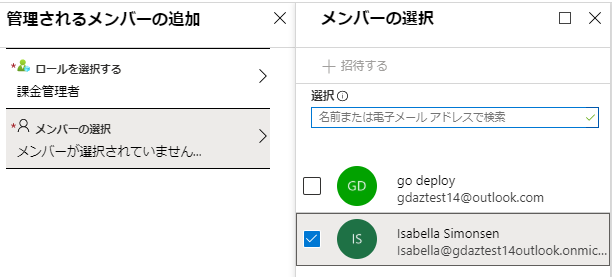

1.  [管理メンバーの追加] で、**OK** をクリックして、ユーザーをロールに追加します。

1.  追加されたメンバーを確認する

     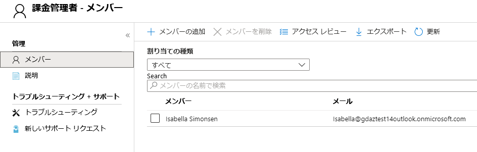

1.  ロールが割り当てられると、選択したユーザーがメンバーリストにそのロールに **適格** として表示されます。


### タスク 2：ロールの割り当てを永続にする


デフォルトでは、新しいユーザーはディレクトリロールに対してのみ適格となります。ロールの割り当てを永続にする場合は、次の手順に従います。


1.  Azure Portal で、**すべてのサービス** をクリックして、**Azure AD Privileged Identity Management** を検索して選択します。

     

1.  **Azure AD ロール** をクリックします。

     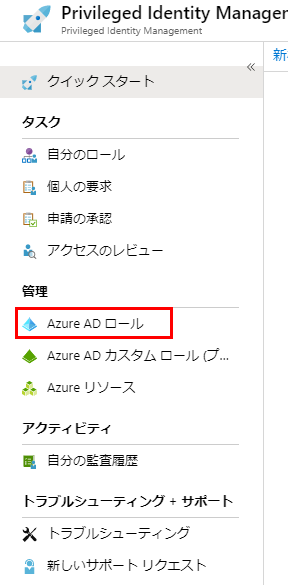

1.  **メンバー** をクリックします。

     

1.  永続にしたい **適格** なロールをクリックします。

     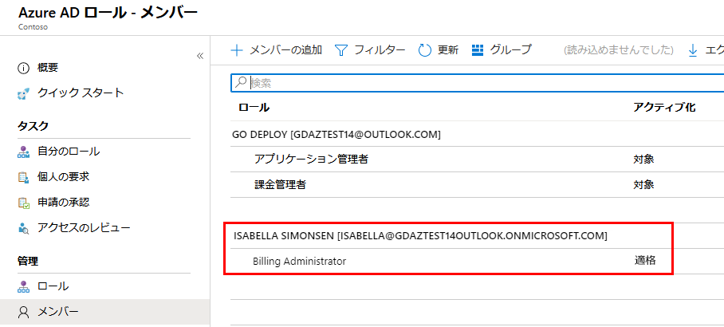
 
1.  **詳細** をクリックしてから、**永続にする** をクリックします。

     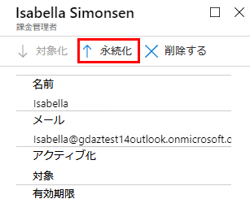
 

**結果**：このロールは **永続** としてリストされました。


### タスク 3：ロールからユーザーを削除する


ロールの割り当てからユーザーを削除できますが、永続なグローバル管理者であるユーザーが常に少なくとも1人いることを確認してください。


1.  Azure Portal で、**すべてのサービス** をクリックして、**Azure AD Privileged Identity Management** を検索して選択します。

     

1.  **Azure AD ロール** をクリックします。

     

1.  **メンバー** をクリックします。

     

1.  削除するロールの割り当てをクリックします。

     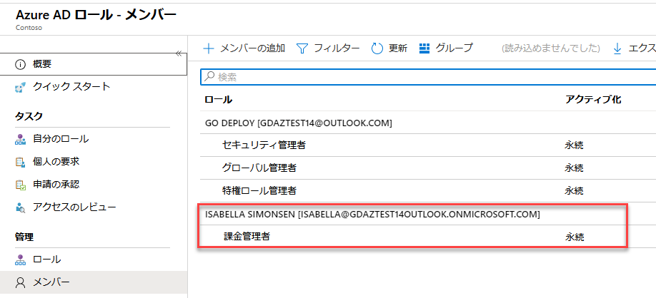
 
1.  **詳細** をクリックしてから、**削除** をクリックします。

     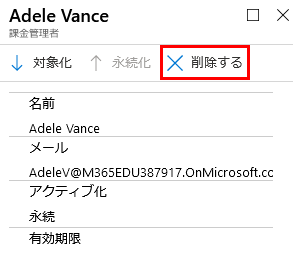
 
1.  確認を求めるメッセージで、**はい** をクリックします。ロールの割り当てが削除されます。


## 演習3 - PIM ロールの有効化と無効化

### タスク 1：ロールをアクティブ化する


Azure AD ディレクトリロールを引き受ける必要がある場合は、PIM のナビゲーションオプションにある **自分のロール** を使用してアクティベーションをリクエストできます。


1.  Azure Portal で、**すべてのサービス** をクリックして、**Azure AD Privileged Identity Management** を検索して選択します。

     

1.  **Azure AD ロール** をクリックします。

     
 
1.  **クイックスタート** をクリックしてから、**適格性を割り当てる** をクリックします。

     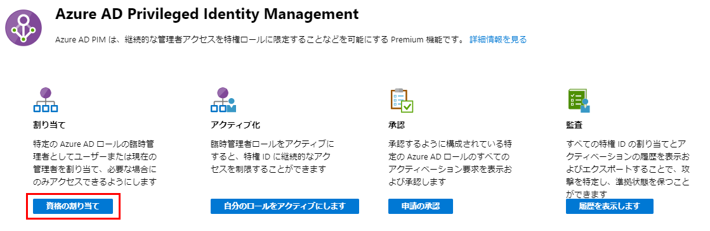

1.  **課金管理者** をクリックして、イザベラを再び **課金管理者** ロールに追加します。


1.  **In Private** ブラウジングセッションを開いて **「https：//portal.azure.com」** に移動し、パスワード **Pa55w.rd** を使用して **イザベラ** としてログインします。  プロンプトが表示されたら、イザベラのパスワードを変更します。

1.  Azure Portal で、**すべてのサービス** をクリックして、**Azure AD Privileged Identity Management** を検索して選択します。

     

1.  Azure Portal で、**すべてのサービス** をクリックして、**Azure AD Privileged Identity Management** を検索して選択します。

     

1.  **Azure AD ロール** をクリックします。

     

1.  **クイックスタート** をクリックして、**ロールをアクティベートする** をクリックします。

     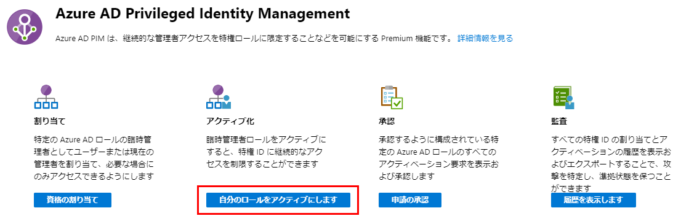

1.  課金管理者のロールで、右にスクロールして **アクティベート** をクリックします。

     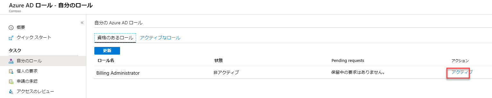

1.  **続行する前に ID を確認してください** をクリックします。セッションごとに1回だけ認証する必要があります。ウィザードを実行して、イザベラを認証します。

     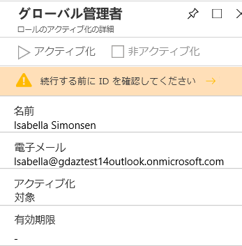
 
1.  Azure Portal に戻ったら、**すべてのサービス** をクリックして、**Azure AD Privileged Identity Management** を検索して選択します。

     

1.  **Azure AD ロール** を選択してから、クイックスタートブレードで、**ロールをアクティベートする** をクリックします。

1.  課金管理者のロールで、右にスクロールして **アクティベート** をクリックします。

     

1.  **アクティベート** をクリックします。

     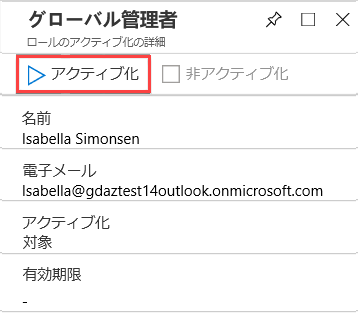

1.  アクティベーションの理由を入力して、**アクティベート** をクリックします

     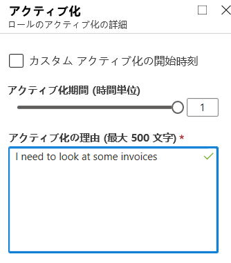

デフォルトでは、設定で明示的に構成されていない限り、ロールは承認を必要としません。 

 ロールに承認が必要ない場合は、アクティブ化され、アクティブなロールの一覧に追加されます。すぐにロールを使用する場合は、次のセクションの手順に従ってください。

 ロールのアクティベートに承認が必要な場合、ブラウザーの右上隅に、要求が承認待ちであることを知らせる通知が表示されます。


### タスク 2：アクティベーション直後にロールを使用する


PIM で役割をアクティブにすると、目的の管理ポータルにアクセスしたり、特定の管理ワークロード内で機能を実行したりするまでに最大 10 分かかる場合があります。アクセス許可の更新を強制的に行うには、次の手順で説明されるとおりに **アプリケーションアクセス** ページを使用します。


1.  **サインアウト** をクリックします。

     

1.  イザベラとして再度ログインします。


### タスク 3：リクエストのステータスを確認する


保留中のリクエストのステータスを表示して、アクティベートすることができます。


1.  まだ **イザベラ** としてサインインしている場合、Azure Portalで **すべてのサービス** をクリックして、**Azure AD Privileged Identity Management** を検索して選択します。

     

1.  **Azure AD ロール** をクリックします。

1.  **私のリクエスト** をクリックして、リクエストのリストを表示します。

     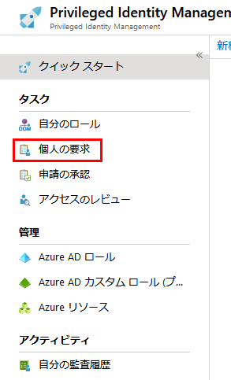

### タスク 4：ロールを非アクティブ化する


役割がアクティブ化されると、その時間制限 (有効期間) に達すると自動的に非アクティブ化されます。

管理者のタスクを早期に完了した場合、Azure AD Privileged Identity Management でロールを手動で非アクティブ化することもできます。


1.  まだ **イザベラ** としてサインインしている状態で、Azure AD Privileged Identity Management を開きます。

1.  **Azure AD ロール** をクリックします。

1.  **自分のロール** をクリックします。

     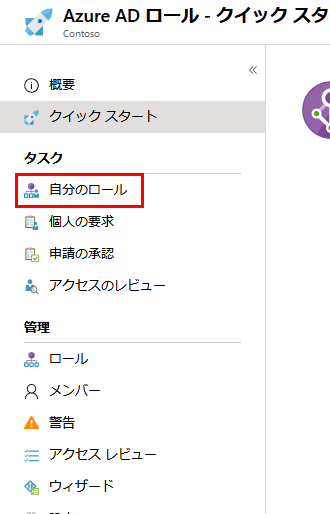

1.  **アクティブなロール** をクリックして、アクティブなロールのリストを表示します。

     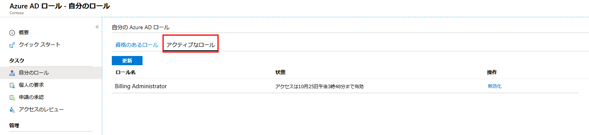

1.  使用済みの役割を見つけて、**非アクティブ化** をクリックします。

     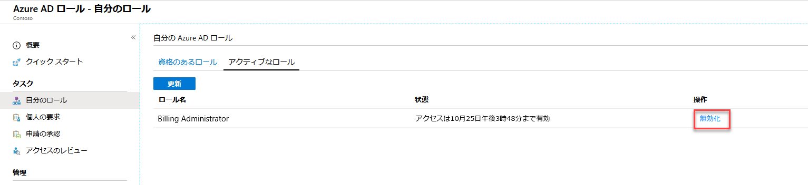

1.  もう一度 **非アクティブ化** をクリックします。

     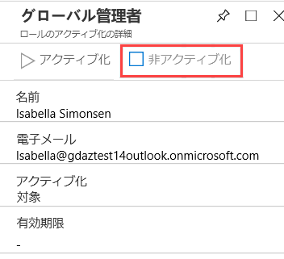

1.  **はい** をクリックして、確認します。


### タスク 5：保留中のリクエストをキャンセルする


承認が必要なロールのアクティブ化が必要ない場合は、保留中のリクエストをいつでもキャンセルできます。


1.  **Azure AD Privileged Identity Management を開きます**。

1.  **Azure AD ロール** をクリックします。

1.  **自分のリクエスト** をクリックします。

1.  キャンセルする役割については、**キャンセル** ボタンをクリックします。

**注記**：リクエストが承認されると、このタスクのキャンセルボタンはグレー表示されます。

[キャンセル] をクリックすると、リクエストはキャンセルされます。ロールを再度アクティブ化するには、アクティブ化の新しいリクエストを送信する必要があります。


## 演習4 - ディレクトリの役割 (一般)

### タスク 1：PIM で Azure AD ディレクトリロールのアクセスレビューを開始する


ユーザーが不要になった特権アクセスがある場合、ロールの割り当ては「古くなった」状態になります。これらの古いロールの割り当てに関連するリスクを軽減するために、特権ロール管理者またはグローバル管理者は定期的にアクセスレビューを作成し、管理者にユーザーに与えられたロールのレビューを依頼する必要があります。このタスクでは、Azure AD Privileged Identity Management (PIM) でアクセスレビューを開始する手順について説明します。


1.  グローバル管理者アカウントとしてログインしているブラウザに戻ります。

1.  PIM アプリケーションのメインページから、**管理** セクションで **Azure AD のロール** をクリックして、**アクセスレビュー** をクリックして、**新規** をクリックします。

     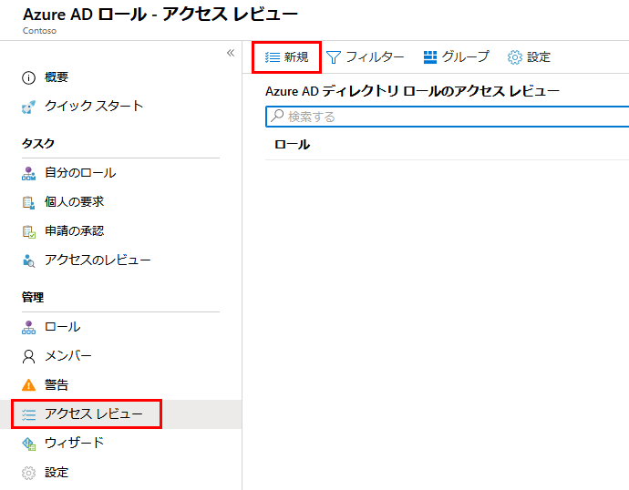

1.  次の詳細を入力して、**開始** をクリックします：

      - レビュー名：  **グローバル管理者レビュー**
      - 頻度： **一度**
      - 開始日:  **今日の日付** 
      - 終了日:  **来月の終わり**
      - ロールメンバーシップのレビュー：  **グローバル管理者**
      - レビュー担当者：  **アカウントを選択します**
 
 
     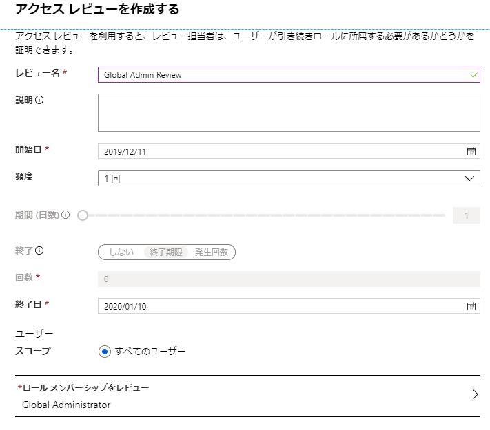
 
1.  レビューが完了し、ステータスがアクティブになります。  **グローバル管理者レビュー** をクリックします。

1.  結果を選択し、**レビューなし** の結果を確認します。

     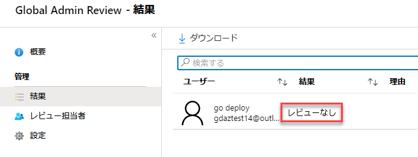

### タスク 2：アクセスを承認または拒否する


アクセスを承認または拒否する場合は、このロールを引き続き使用するかどうかをレビュー担当者に伝えるだけです。ロールにとどまる場合は [承認] を選択し、アクセスが不要な場合は [拒否] を選択します。レビュー担当者が結果を適用するまで、ステータスはすぐには変更されません。アクセスレビューを見つけて完了するには、次の手順に従います。


1.  PIM アプリケーションで、**アクセスをレビュー** を選択します。 

2.  **グローバル管理者レビュー** を選択します。

     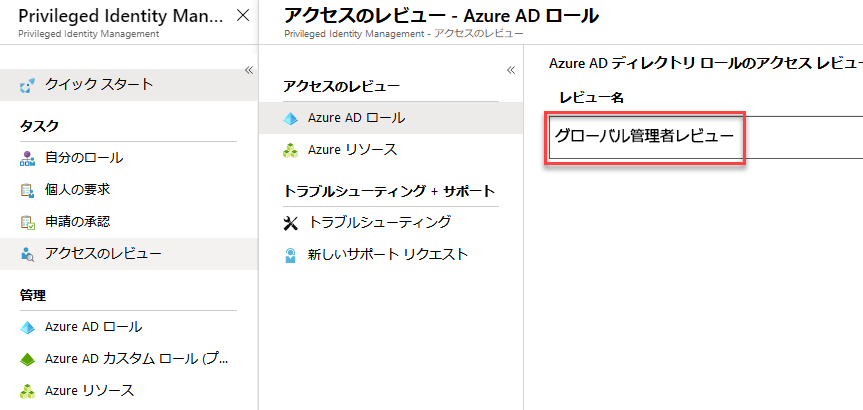

3.  レビューを作成していない限り、あなたはレビューの唯一のユーザーとして表示されます。名前の横にあるチェックマークを選択します。

     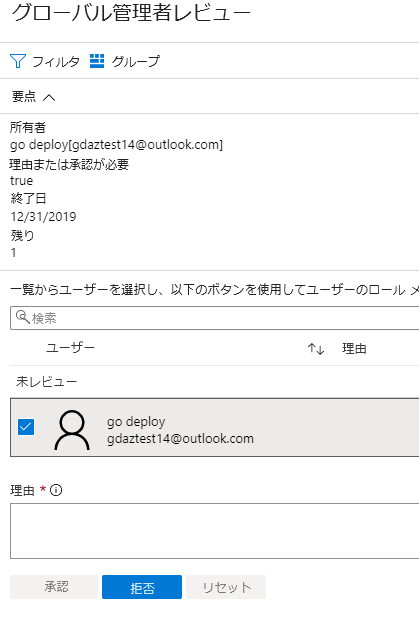

5.  **Azure AD のロールをレビューする** ブレードを閉じます。

### タスク 3：PIM で Azure AD ディレクトリロールのアクセスレビューを完了する


特権ロール管理者は、アクセスレビューが開始されると、特権アクセスをレビューできます。Azure AD Privileged Identity Management (PIM) は、ユーザーにアクセスの確認を促すメールを自動的に送信します。ユーザーがメールを受け取っていない場合は、アクセスレビューの実行方法に関する指示を送信できます。

アクセスレビュー期間が終了するか、すべてのユーザーがセルフレビューを終了したら、このタスクの手順に従ってレビューを管理し、結果を確認します。


1.  Azureポータルに移動して、 **Azure AD Privileged Identity Management** を選択します。

1.  **Azure AD のロール** を選択します。

2.  **アクセスレビュー** を選択します。


3.  グローバル管理者レビューを選択します。


1.  ブレードをレビューします。

     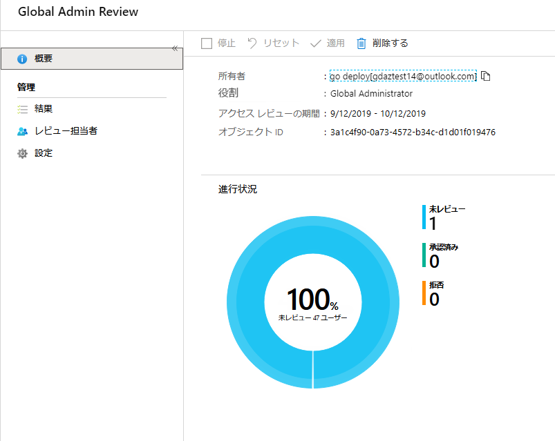


### タスク 4：PIM で Azure AD ディレクトリロールのセキュリティアラートを構成する


PIM のセキュリティアラートの一部をカスタマイズして、環境とセキュリティの目標に合わせて機能させることができます。以下の手順に従って、セキュリティ警告設定を開きます。


1.  **Azure AD Privileged Identity Management** を開きます。

1.  **Azure AD ロール** をクリックします。

1.  **設定** をクリックしてから **アラート** をクリックします。


1.  アラート名をクリックして、そのアラートの設定を構成します。


## 演習5 - PIM リソースワークフロー

### タスク 1：  承認が必要になるようにグローバル管理者ロールを構成します。

1.  **Azure AD Privileged Identity Management** を開きます。

1.  **Azure AD ロール** をクリックします。

1.  **設定** をクリックします 

1.  **ロール** をクリックして、**グローバル管理者** を選択します。

1.  下にスクロールして、**承認が必要** を **有効にする** に変更して、**保存** をクリックします。

     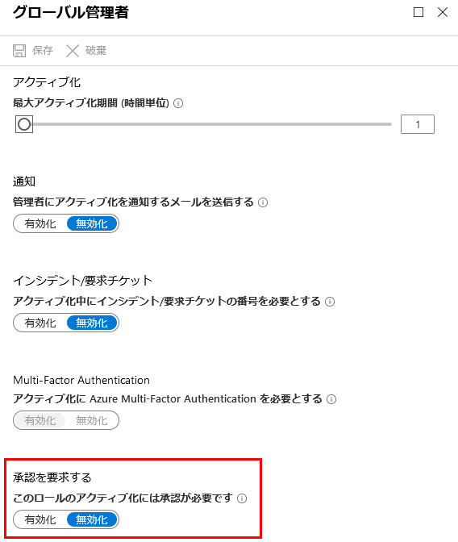

### タスク 2：グローバル管理者特権でイザベラを有効にします。

1.  **Azure AD Privileged Identity Management** を開きます。

1.  **Azure AD ロール** をクリックします。

1.  **クイックスタート** をクリックして、**適格性を割り当てる** を選択します。

     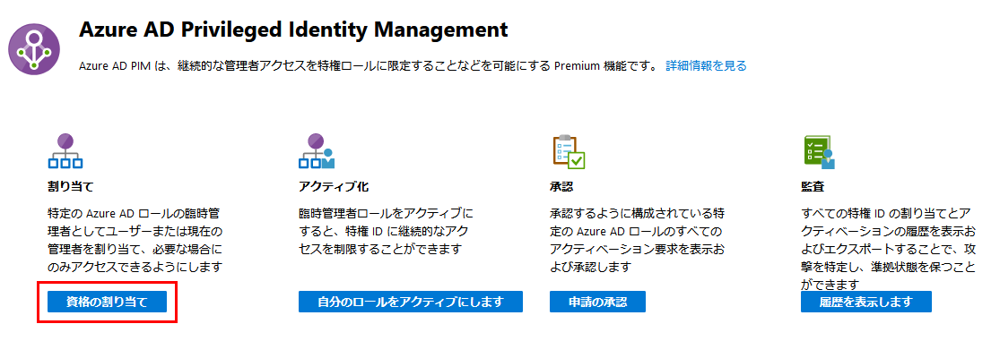

1.  **グローバル管理者** を選択します。


1.  **メンバーを追加** を選択して、**イザベラ** を選択します。


1.  Private Browsing セッションを開き、イザベラとして portal.azure.com にログインします。

1.  **Azure AD Privileged Identity Management** を開きます。

1.  **自分のロール** を選択します。

     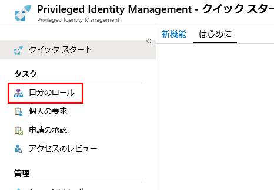

1.  グローバル管理者のロールを **アクティベート** します。

     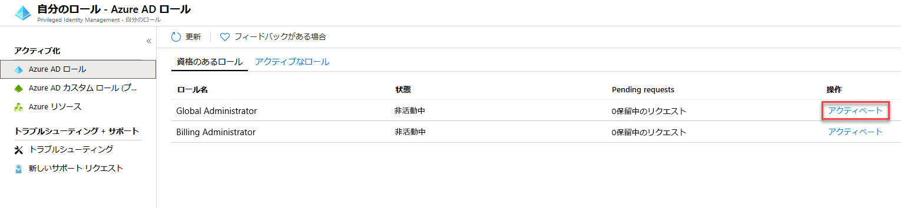

1.  ウィザードを使用してイザベラの身元を確認します。

     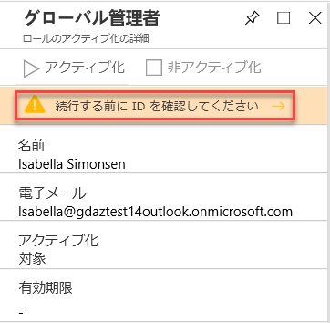

1.  **Azure AD Privileged Identity Management** で **私のロール** に戻ります。

1.  グローバル管理者のロールを **アクティベート** します。

1.  **アクティベート** をクリックします。

     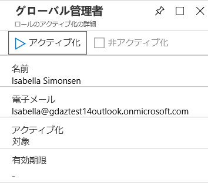

1.  理由 **いくつかの管理タスクを実行する必要があります** を入力して、**アクティベート** をクリックします。

     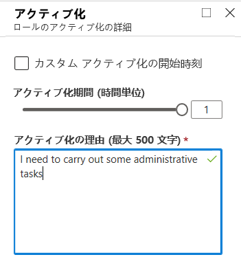


### タスク 3：PIM で Azure リソースロールのリクエストを承認または拒否する


Azure AD Privileged Identity Management (PIM) を使用すると、アクティブ化の承認を必要とするロールを構成し、委任承認者として1つまたは複数のユーザーまたはグループを選択できます。この記事の手順に従って、Azure リソースロールのリクエストを承認または拒否します。


###### 保留中のリクエストを表示


委任された承認者として、Azure リソースロールリクエストが承認を保留しているときに電子メール通知を受け取ります。PIM でこれらの保留中の要求を表示できます。


1.  グローバル管理アカウントでサインインしているブラウザーに切り替えます。

1.  **Azure AD Privileged Identity Management** を開きます。

1.  **リクエストの承認** をクリックします。

     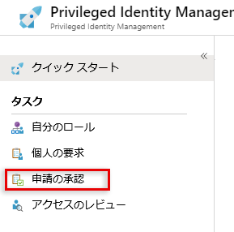

1.  イザベラからのリクエストをクリックして、**承認** をクリックします。

     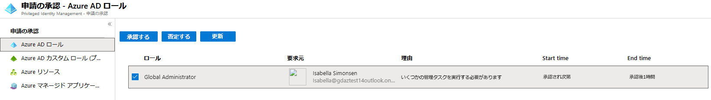

1.  **このタスクに付与** されている理由を入力して、**承認をクリックします**。

      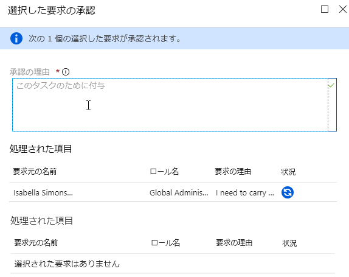

1.  承認の通知が表示されます。

     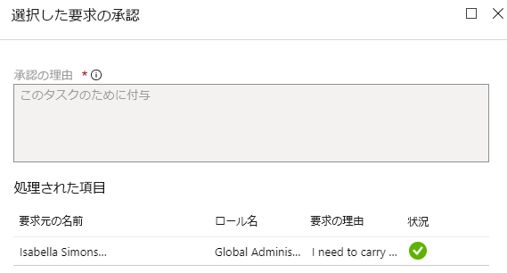

1.  イザベラがサインインしているプライベートブラウジングセッションに戻り、[自分のロール] をクリックして、ステータスが承認されたことを確認します。

     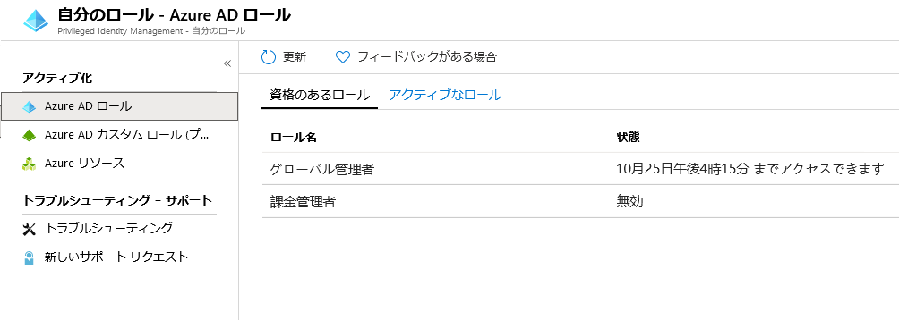

## 演習6 - PIM で Azure AD ロールの監査履歴を表示する


Azure Active Directory (Azure AD) Privileged Identity Management (PIM) 監査履歴を使用して、すべての特権ロールの過去 30 日以内のすべてのロールの割り当てとアクティベーションを確認できます。ディレクトリ内のアクティビティ (管理者、エンドユーザー、同期アクティビティなど) の完全な監査履歴を表示する場合。


### タスク 1：監査履歴を表示する


次の手順に従って、Azure AD ロールの監査履歴を表示します。


1.  **Azure AD Privileged Identity Management** を開きます。

1.  **Azure AD ロール** をクリックします。

1.  **ディレクトリロールの監査履歴** をクリックします。

    監査履歴に応じて、総アクティベーション数、1日あたりの最大アクティベーション数、1日あたりの平均アクティベーション数とともに縦棒グラフが表示されます。

    ページの下部に、利用可能な監査履歴の各アクションに関する情報を含む表が表示されます。列には次の意味があります。

    | Column | 説明 |
    | --- | --- |
    | 時間 | 操作が発生した時間。 |
    | 要求元 | ロールのアクティブ化または変更を要求したユーザー。値が **Azure System** である場合、詳細については Azure 監査履歴を確認してください。 |
    | アクション | 要求元が実行したアクション。アクションには、Assign、Unassign、Activate、Deactivate、または AddedOutsidePIM を含めることができます。 |
    | メンバー | アクティブ化またはロールに割り当てられているユーザー。 |
    | 役割 | ユーザーによって割り当てられた、またはアクティブ化されたロール。 |
    | 理由 | アクティブ化中に理由フィールドに入力されたテキスト。 |
    | 有効期限 | アクティブ化されたロールの有効期限が切れる時間。適格なロールの割り当てにのみ適用されます。 |

1.  監査履歴をソートするには、**時間**、**アクション**、そして **ロール** ボタンをクリックします。

### タスク 2：監査履歴をフィルタする

1.  監査履歴ページの上部で、**フィルター** ボタンをクリックします。

    **チャートパラメーターの更新** ペインが表示されます。

1.  **時間範囲** で、時間範囲を選択します。

1.  **ロール** で、表示するロールにチェックマークを追加します。

1.  **完了** をクリックして、フィルタリングされた監査履歴を表示します。


**結果**：これで、このラボを完了しました。


