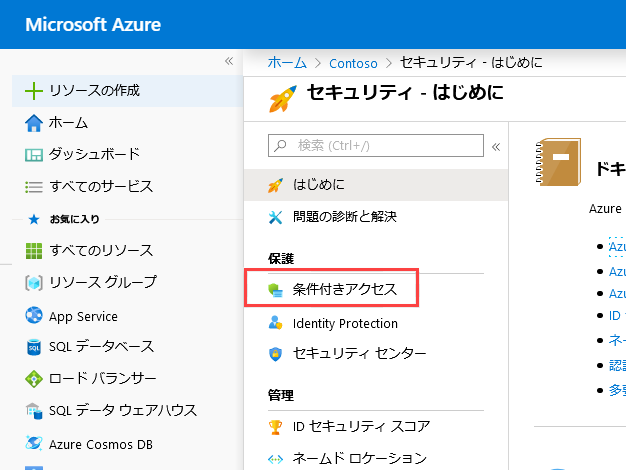
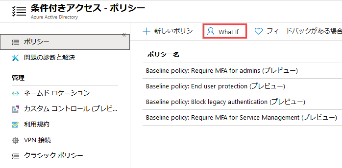
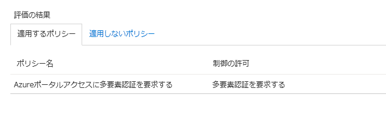
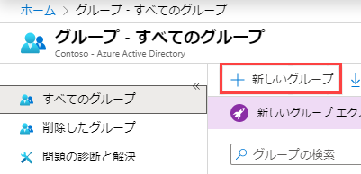
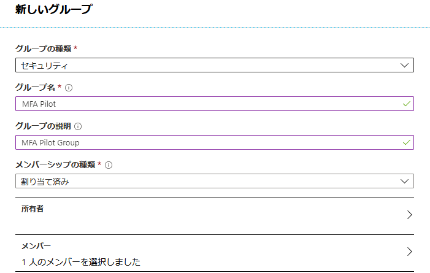

---
lab:
    title: 'ラボ 2: 安全なアクセスのための Multi-Factor Authentication の使用'
    module: 'モジュール 1：ID 管理とアクセス管理'
---

# ラボ 2: 安全なアクセスのための Multi-Factor Authentication の使用

このモジュールでは、Multi-Factor Authentication (MFA) によるサインインプロセスの保護について学習します。MFA の仕組みと、オンプレミスシナリオとクラウドシナリオの実装の違いを学習します。また、条件付きアクセスポリシーを使用して、環境内のアプリとリソースをよりきめ細かく制御する方法についても学習します。

- Azure の Multi-Factor Authentication
- SSE を実装する

# ラボ 2: 安全なアクセスのための Multi-Factor Authentication の使用

## 演習 1：MFA 認証パイロット (Azure Active Directory の条件付きアクセスで特定のアプリに MFA を要求する)

### タスク 1：条件付きアクセスポリシーを作成する 

このセクションでは、必要な条件付きアクセスポリシーを作成する方法を示します。シナリオは以下を使用します。

- MFA を必要とするクラウドアプリのプレースホルダーとしての Azure ポータル。 
- 条件付きアクセスポリシーをテストするサンプルユーザー。  

ポリシーで、次を設定します。

|設定 |値|
|---     | --- |
|ユーザーとグループ | イザベラ・シモンセン |
|クラウドアプリ | Microsoft Azure Sentinel |
|アクセス権を付与する | Multi-Factor Authentication を要求する |

 
1.  Azure Portal にサインインします。

2.  Azure ポータルのハブメニューで、[管理] セクションで **セキュリティ** をクリックします。

3. **セキュリティ - ブレードを開始する** で、**条件付きアクセス** をクリックします。

     
 
5.  **条件付きアクセス** ページで、上部のツールバーで、**新しいポリシー** をクリックします。

    **注意**：これがグレー表示されている場合は、ブラウザセッションを更新します。

6.  **新しい** ページの **名** テキストボックスで、**Azure portal へのアクセスに MFA が必要** と入力します。

7.  **割り当て** セクションで、**ユーザーとグループ** をクリックします。

8.  **ユーザーとグループ** ページで、次の手順を実行します。

    a. **ユーザーとグループを選択** をクリックしてから、**ユーザーとグループ** を選択します。

    b. **選択** をクリックします。

    c. **選択** ページで、**イザベラ・シモンセン** を選択してから、**選択** をクリックします。

    d. **ユーザーとグループ** ページで、**OK** をクリックします。

9.  **クラウドアプリまたはアクション** をクリックします。

10. **クラウドアプリ** ページで、次の手順を実行します。

    a. **アプリを選択** をクリックします。

    b. **選択** をクリックします。

    c. **選択** ページで、**Microsoft Azure の管理** を選択してから、**選択** をクリックします。

    d. **クラウドアプリ** ページで、**完了** をクリックします。

11.  **アクセス制御** セクションで、**付与** をクリックします。

12.  **付与** ページで、次のタスクを実行します。
     1. **アクセスを付与** を選択します。
     2.  **Multi-Factor Authentication** を選択します。
     3.  **選択** をクリックします。

13.  **ポリシーを有効にする** セクションで、**オン** をクリックします。

14.  **作成** をクリックします。

### タスク 2：シミュレートされたサインインを評価する

条件付きアクセスポリシーを構成したので、おそらく期待どおりに動作するかどうかを知りたいでしょう。最初のステップとして、条件付きアクセス what if ポリシーツールを使用して、テストユーザーのサインインをシミュレートします。シミュレーションは、このサインインがポリシーに与える影響を推定し、シミュレーションレポートを生成します。  

what if ポリシー評価ツールを初期化するには、以下を設定します。

- ユーザーとして **イザベラ・シモンセン** 
- クラウドアプリとして **Microsoft Azure の管理**

 **What If** をクリックすると、以下を示すシミュレーションレポートを作成します。

- **適用されるポリシー** で **Azure portal へのアクセスに MFA が必要** 
- **付与制御** として **多要素認証が必要**。

1.  条件付きアクセス - ポリシーページの上部のメニューで、**What If** をクリックします。  
 
     

2.  **ユーザー** をクリックして、**イザベラ・シモンセン** を選択してから、**選択** をクリックします。

3.  クラウドアプリを作成するには、次の手順を実行します。

    a. **クラウドアプリまたはアクション** をクリックします。

    b. **クラウドアプリページ** で、**アプリを選択** をクリックします。

    c. **選択** をクリックします。

    d. **選択** ページで、**Microsoft Azure の管理** を選択してから、**選択** をクリックします。

    e. クラウドアプリページで、**完了** をクリックします。

4.  **What If** をクリックします。

5.  結果に注意してください。Azure portal へのアクセスには MFA が必要です。

     

### タスク 3：条件付きアクセスポリシーをテストする

前のセクションでは、シミュレートされたサインインを評価する方法を学習しました。シミュレーションに加えて、条件付きアクセスポリシーもテストして、期待どおりに機能することを確認する必要があります。 

ポリシーをテストするには、 **イザベラ・シモンセン** テスト アカウントを使用して、Azure portal **「https：//portal.azure.com」** にサインインしてみてください。追加のセキュリティ検証のためにアカウントを設定する必要があるダイアログが表示されます。

## 演習 2：MFA 条件付きアクセス (Azure Multi-Factor Authentication パイロットロールアウトを完了する)

このラボでは、Azure portal にログインするときに、Azure Multi-Factor Authentication (Azure MFA) を有効にする条件付きアクセスポリシーを構成します。ポリシーは、パイロットユーザーの特定のグループに展開され、テストされます。条件付きアクセスを使用した Azure MFA の展開は、従来の強制的な方法と比較して、組織および管理者に大きな柔軟性を提供します。

- Azure Multi-Factor Authentication を有効化する
- Azure Multi-Factor Authentication をテストする

### タスク 1：Azure Multi-Factor Authentication を有効化する

1.  グローバル管理者アカウントとしてログインしている Azure portal に戻ります。

1.  [ハブ] メニューで、**Azure Active Directory** をクリックし、

1.  **グループ** をクリックして、**+ 新規グループ** をクリックします。

     

1.  次の情報を入力してから、**作成** をクリックします。

      * グループの種類、**セキュリティ**
      * グループ名：**MFAパイロット**
      * グループの説明：**MFA パイロットグループ**
      * メンバーシップタイプ：**割り当て済み**
      * メンバー：**イザベラ** を選択します
  
  
      
  
2.  **Azure Active Directory** をブラウザで表示して、[セキュリティ] をクリックして、**セキュリティ** ブレードで **条件付きアクセス** をクリックします。

 

3.  **+ 新しいポリシー** を選択します

 

4.  ポリシーに **MFAパイロット** と名前を付けます
5.  **ユーザーとグループ** で、**ユーザーとグループを選択** チェックボックスを選択します
    * パイロットグループを **MFAパイロット** として選択します
    * **選択** をクリックします
    * **完了** をクリックします
     
6.  **クラウドアプリまたはアクション** で、**アプリを選択** ラジオボタンを選択します
    * Azure portal のクラウドアプリは、**Microsoft Azure の管理** です
    * **選択** をクリックします
    * **完了** をクリックします
     
7.  **条件** セクションをスキップします
8.  **付与** で、**アクセス権の付与** ラジオボタンが選択されていることを確認します
    * **Multi-Factor Authentication が必要** のチェックボックスをオンにします
    * **選択** をクリックします
     
9.  **セッション** セクションをスキップします
10. **ポリシーの有効化** を **オン** に設定します
11. **作成** をクリックします

### タスク 2：Azure Multi-Factor Authentication をテストする

条件付きアクセスポリシーが機能することを証明するには、MFA を必要としないリソースへのログインをテストしてから、MFA を必要とする Azure portal へのログインをテストします。

1.  InPrivate モードまたはシークレットモードで新しいブラウザーウィンドウを開き、**「https：//account.activedirectory.windowsazure.com」** を参照します
    * この記事の前提条件セクションの一部として作成されたテストユーザーでログインし、MFA を完了するように求められないことに注意してください。
    * ブラウザウィンドウを閉じます。

2.  InPrivate モードまたはシークレットモードで新しいブラウザーウィンドウを開き、**「https：//portal.azure.com」** を参照します

       * この記事の前提条件セクションの一部として作成されたテストユーザーでログインし、Azure Multi-Factor Authentication に登録して使用する必要があることに注意してください。
       * ブラウザウィンドウを閉じます。

| 警告：続行する前に、このラボで使用したすべてのリソースを削除する必要があります。  **Azure Portal** でこれを行うには、**リソース グループ** をクリックします。  作成したリソース グループを選択します。  リソース グループ ブレードで、**リソース グループを削除** をクリックし、リソース グループ名を入力して、**削除** をクリックします。  作成した可能性のある追加のリソース グループに対してプロセスを繰り返します。**これを行わないと、他のラボで問題が発生する可能性があります。** |
| --- |

**結果** : これで、このラボを完了しました。
