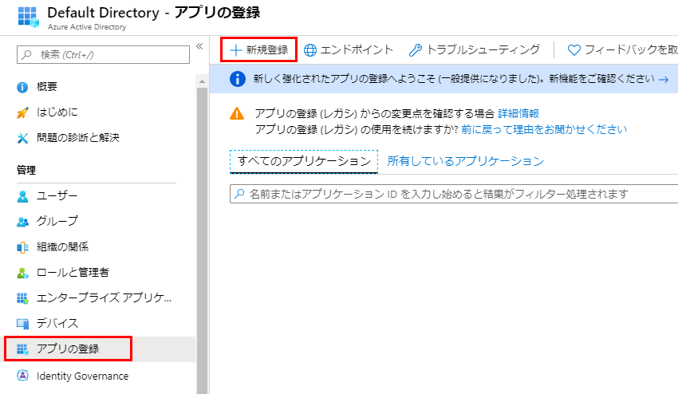
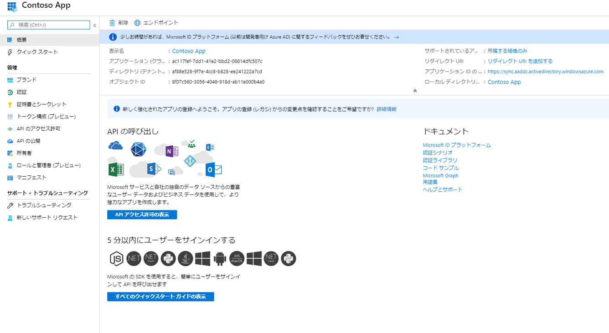

---
lab:
    title: 'ラボ 3: アプリの登録'
    module: 'モジュール 1：ID 管理とアクセス管理'
---

# ラボ 3: アプリの登録

**シナリオ**

エンタープライズ開発者やサービスとしてのソフトウェア (SaaS) プロバイダーは、Azure Active Directory (Azure AD) と統合できる商用クラウドサービスまたは基幹業務アプリケーションを開発し、自社のサービスにセキュリティで保護されたサインインと認可を実現することができます。

このラボでは、Azure portal のアプリ登録エクスペリエンスを使用してアプリケーションを追加および登録し、アプリを Microsoft ID プラットフォームと統合できるようにする方法を示します。

## 演習 1：アプリケーション登録

### タスク 1：Azure portal を使用して新しいアプリケーションを登録する

1.  Azure portal にサインインします。

1.  左側のナビゲーションペインで、 **Azure Active Directory** サービスを選択してから、**アプリの登録>新規登録** を選択します。

     

1.  **アプリケーションの登録** ページが表示されたら、アプリケーションの登録情報を入力します。

       - **名前** - 入力: **Contosoアプリ**
       - **サポートされているアカウントの種類** -  **この組織ディレクトリ内のアカウントのみ** 選択します (以下のオプションをお読みください)。

       | サポートされているアカウントの種類 | 説明 |
       |-------------------------|-------------|
       | **この組織ディレクトリ内のアカウントのみ** | 基幹業務 (LOB) アプリケーションを構築する場合は、このオプションを選択します。アプリケーションをディレクトリに登録していない場合、このオプションは使用できません。   このオプションは、Azure AD のみのシングルテナントにマップされます。   これは、ディレクトリ外でアプリを登録する場合を除き、デフォルトのオプションです。アプリがディレクトリ外で登録されている場合、デフォルトは Azure AD マルチテナントおよび個人の Microsoft アカウントです。 |
       | **組織ディレクトリ内のアカウント** | すべてのビジネスおよび教育機関の顧客を対象とする場合は、このオプションを選択します。  このオプションは、Azure AD のみのマルチテナントにマップします。   Azure AD のみとしてアプリを登録した場合、テナントは、Azure AD マルチテナントに更新し、**認証** ブレードからシングルテナントに戻すことができます。 |
       | **組織ディレクトリ内のアカウントと個人の Microsoft アカウント** | 最も幅広い顧客をターゲットにするには、このオプションを選択します。  このオプションは、Azure AD のマルチテナントおよび個人の Microsoft アカウントにマッピングされます。   アプリを Azure AD マルチテナントおよび個人の Microsoft アカウントとして登録した場合、UI でこれを変更することはできません。代わりに、アプリケーションマニフェストエディターを使用して、サポートされているアカウントの種類を変更する必要があります。 |

       - **リダイレクト URI (オプション)** -  **ウェブ** を選択して、**「https：//app.contoso.com」** を入力します
         - Web アプリケーションの場合は、アプリのベース URL を指定します。ローカルコンピューターで実行されている Web アプリの URL であれば、たとえば「http://localhost:31544」のようになります。ユーザーはこの URL を使用して Web クライアント アプリケーションにサインインすることになります。
         - ネイティブ アプリケーションの場合は、トークン応答を返すために Azure AD に使用される URI を指定します。「myapp://auth」などのアプリケーションに固有の値を入力します。
 

1.  完了したら、**登録** を選択します。

1.  Azure AD によってアプリケーションに一意のアプリケーション (クライアント) ID が割り当てられ、アプリケーションの **概要** ページが表示されます。アプリケーションに機能を追加するには、ブランド、証明書とシークレット、APIアクセス許可など、他の構成オプションを選択できます。

     
 

**結果**：これで、このラボを完了しました。

