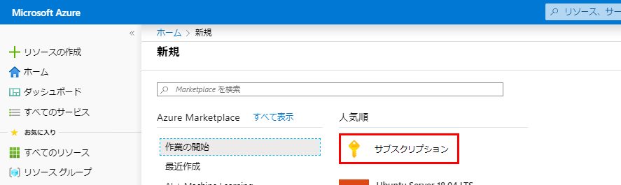
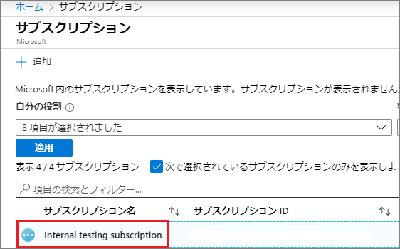
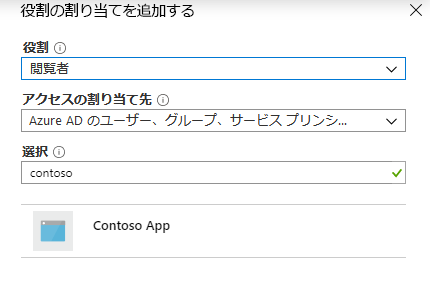
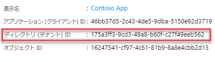
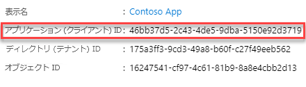
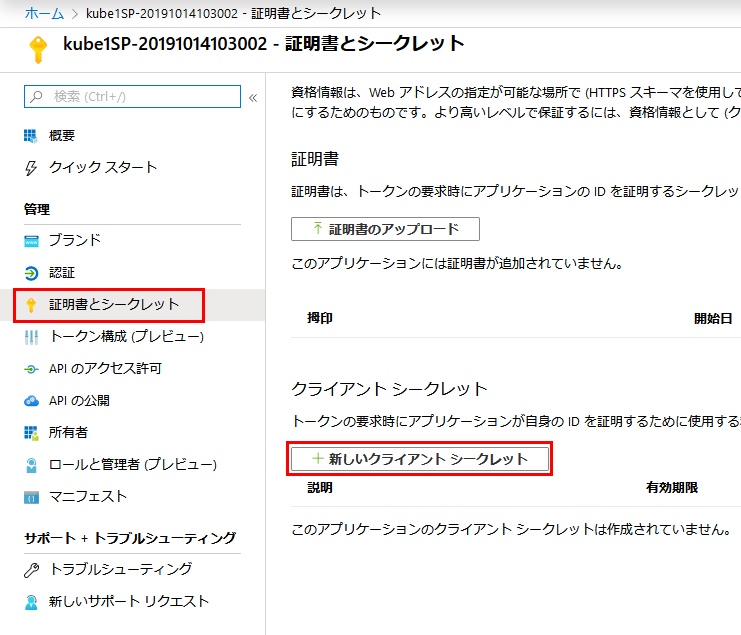
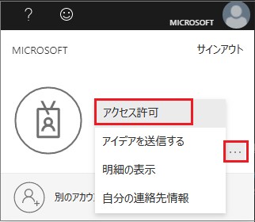
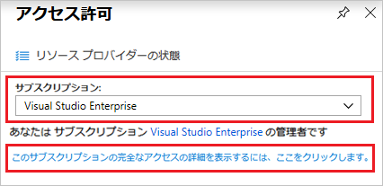

---
lab:
    title: 'ラボ 4 - アプリケーションサービスプリンシパル'
    module: 'モジュール 1：ID 管理とアクセス管理'
---

# ラボ 4 - アプリケーションサービスプリンシパル

**シナリオ**

このラボでは、ロールベースのアクセス制御で使用できる新しい Azure Active Directory (Azure AD) アプリケーションとサービスプリンシパルを作成する方法を示します。リソースにアクセスまたは変更する必要があるコードがある場合、アプリの ID を作成できます。この ID は、サービスプリンシパルと呼ばれます。その後、必要な権限をサービスプリンシパルに割り当てることができます。この記事では、ポータルを使用してサービスプリンシパルを作成する方法を示します。アプリケーションが1つの組織内でのみ実行されることを意図しているシングルテナントアプリケーションに焦点を当てています。通常、組織内で実行される基幹業務アプリケーションにはシングルテナントアプリケーションを使用します。

## 演習 1：ポータルを使用して、リソースにアクセスできるサービスプリンシパルを作成します

サブスクリプション、リソース グループ、リソースなど、複数のレベルにスコープを指定できます。権限はより低いレベルのスコープに継承されます。たとえば、アプリケーションをリソース グループの閲覧者ロールに追加すると、リソース グループとそれに含まれるリソースを読み取ることができます。

### タスク 1：アプリケーションをロールに割り当てる

1.  アプリケーションを割り当てるスコープのレベルに移動します。たとえば、サブスクリプションスコープでロールを割り当てるには、**すべてのサービス** と **サブスクリプション** を選択します。

       

1.  サブスクリプションを選択します。

       

1.  **アクセス制御 (IAM)** を選択します。
1.  **追加** を選択して、**ロールの割り当てを追加する** を選択します。
1.  アプリケーションに割り当てる共同作成者のロールを選択します。アプリケーションが **再起動**、**開始**、**停止** インスタンスなどのアクションを実行できるようにするには、**共同作成者** ロールを選択します。既定では、Azure AD アプリケーションは利用可能なオプションに表示されません。アプリケーションを見つけるには、**Contoso アプリ** の名前を検索し、それを選択します。

     

1.  **保存** を選択して、ロールの割り当てを終了します。そのスコープのロールに割り当てられたユーザーのリストにアプリケーションが表示されます。

サービスプリンシパルが設定されます。これを使用して、スクリプトまたはアプリを実行できます。次のセクションでは、プログラムでサインインするときに必要な値を取得する方法を示します。

### タスク 2：サインインの値を取得する

プログラムでサインインする場合、認証リクエストにテナント ID を渡す必要があります。また、アプリケーションの ID と認証キーも必要です。これらの値を取得するには、次の手順を使用します。

1.  **Azure Active Directory** を選択します。
1.  Azure AD の **アプリ登録** から、**Contoso アプリ** のアプリケーションを選択します。
1.  ディレクトリ (テナント) ID をコピーし、アプリケーションコードに保存します。

       

1.  **アプリケーション ID** をコピーして、アプリケーションコードに保存します。

       

### タスク 3：新しいアプリケーションシークレットを作成する

証明書またはアプリケーションシークレットを選択できます。  このタスクでは、アプリケーションシークレットを作成します。

1.  **証明書とシークレット** を選択します。
1.  **クライアントシークレット->新しいクライアントシークレット** を選択します。
 
     

1.  シークレットの説明と期間を入力します。完了したら、**追加** を選択します。

クライアントシークレットを保存すると、クライアントシークレットの値が表示されます。後でキーを取得できないため、この値をコピーしておきます。キー値にアプリケーション ID を指定して、アプリケーションとしてサインインします。アプリケーションが取得できるキー値を保存します。

  
### タスク 4：Azure AD のアクセス許可を確認する

1.  **Azure Active Directory** を選択します。

1.  **ユーザー設定** を選択します。
1.  **アプリ登録** 設定をチェックします。この値を設定できるのは管理者のみです。**はい** に設定すると、Azure AD テナント内の任意のユーザーがアプリを登録することができます。

 アプリの登録設定が **いいえ** に設定されると、管理者のロールを持つユーザーのみがこれらのタイプのアプリケーションを登録できます。

### タスク 5：Azure サブスクリプションのアクセス許可を確認する

Azure サブスクリプションで、AD アプリをロールに割り当てるには、アカウントに「Microsoft.Authorization/*/Write」のアクセス権が必要です。このアクションは、所有者ロールまたはユーザーアクセス管理者を通じて付与されます。

サブスクリプションのアクセス許可を確認するには：

1.  右上隅でアカウントを選択し、以下を選択します...->私の許可。

       

1.  ドロップダウンリストから、サービスプリンシパルを作成するサブスクリプションを選択します。次に、**このサブスクリプションの完全なアクセスの詳細を表示するには、ここをクリックしてください** を選択します。

       
   
1.  **ロールの割り当て** を選択して、割り当てられたロールを表示し、AD アプリをロールに割り当てるための適切な権限があるかどうかを判断します。そうでない場合は、サブスクリプション管理者に依頼して、ユーザーアクセス管理者ロールに追加してもらいます。次の画像では、ユーザーは所有者ロールに割り当てられています。つまり、ユーザーは適切な権限を持っています。

       
   

**結果**：これで、このラボを完了しました。

