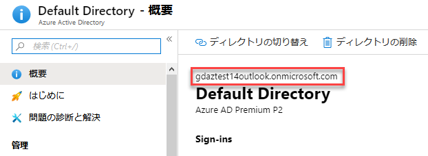
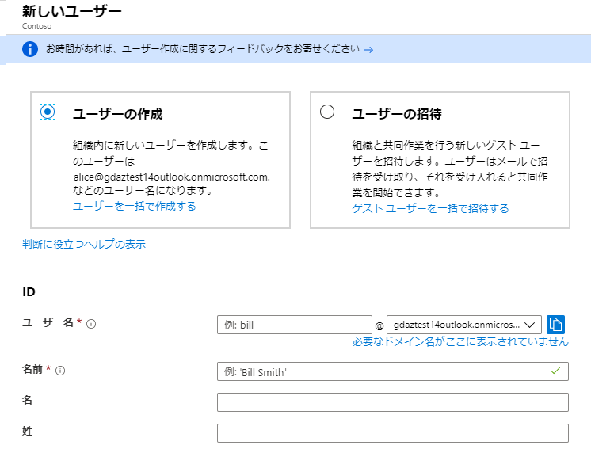
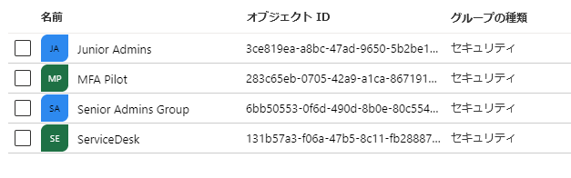
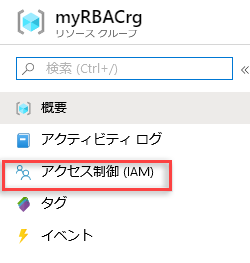
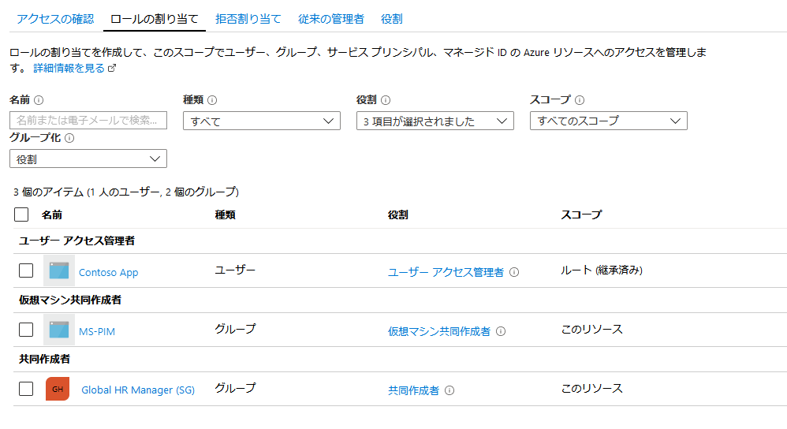

---
lab:
    title: 'ラボ 5: Azure での Identity Protection の概要'
    module: 'モジュール 1：ID 管理とアクセス管理'
---

# モジュール 1：ID 管理とアクセス管理 


**シナリオ**

このモジュールでは、最小特権の原則に基づいて組織の管理アクセスを整理および管理するための基盤としてのロールベースのアクセス制御について学習します。また、Azure Active Directory の概念を確認し、特権アクセスの侵害によって IT 組織にさらされる脅威の状況とセキュリティリスクについての洞察を得ます。次のレッスンが含まれます。

- ロールベースのアクセス制御
- Azure Active Directory (リフレッシャー)
- 環境での特権アクセスの保護

# ラボ 5: Azure での Identity Protection の概要

## 演習 1：ロールベースのアクセス制御

### タスク 1：ユーザーを作成する

1.  必要に応じて、Azure portal **「https://portal.azure.com/」** にサインインします。

1.  **Azure Active Directory** を選択して、概要ブレードでテナントドメインを書き留めます。

     

1.  **ユーザー** を選択してから、**新しいユーザー** を選択します。


3.  **ユーザー** ページで、次の情報をブレードに入力します。

      - **ユーザー名**: ビル
      - **名前**: ビル・スミス


     

4.  **パスワード** ボックスで提供される自動生成されたパスワードを表示します。最初のサインインプロセスでは、このパスワードをユーザーに提供する必要があります。
  
  

5.  **作成** を選択します。

    ユーザーが作成され、Azure AD テナントに追加されます。

8.  Azure Portal の上部にある PowerShell アイコンをクリックして **Azure Cloud Shell** を起動し、プロンプトが表示されたら PowerShell を選択します。

  
9.  **次のコマンドを入力して**、PS クラウドシェルでユーザーを作成するには、ドメインが以前に書き留められた **ドメインを置き換えます**

     ```powershell
      $PasswordProfile = New-Object -TypeName Microsoft.Open.AzureAD.Model.PasswordProfile
      ```
       ```powershell
      $PasswordProfile.Password = "Pa55w.rd"
      ```
       ```powershell
      New-AzureADUser -DisplayName "Mark" -PasswordProfile $PasswordProfile     -UserPrincipalName "Mark@yourdomain.onmicrosoft.com" -AccountEnabled $true -MailNickName "Mark"

     ```
 
     

10.  次のコマンドを実行して、Azure AD のユーザーのリストを取得します 

      ```powershell
      Get-AzureADUSer 
      ```
 
11.  ドロップダウンメニューを使用して、Azure クラウドシェルを Bash で Azure CLI モードに変更します

     

12.  次のコマンドを **Azure CLI** に入力して、Azure CLI でユーザーを作成するには、先ほど書き留めたドメインを使用して、**ドメインを置き換えます**。
 
       ```cli
      az ad user create --display-name Tracy --password Pa55w.rd --user-principal-name Tracy@yourdomain.onmicrosoft.com
       ```


これで、Azure AD に 3 ユーザーが登録されました。


### タスク 2：ポータル、PowerShell、および CLI でグループを作成する

1.  Azure Portal で、**Azure AD ブレード** の **Azure Active Directory**、**グループ** の順にクリックして、**新規グループ** を選択します。
 
16.  次の詳細を詳細に入力します。
  
       - **グループタイプ**：セキュリティ
       - **グループ名**：上級管理者グループ 
    
17.  **メンバー** をクリックし、**ビル** を選択する

18.  **作成** をクリックします

1.  Azure Portal の上部にある PowerShell アイコンをクリックして、**クラウド Shell Bash** を起動します。

19.  **Cloud Shell** で、次のコマンドを入力します。

       ```cli
      az ad group create --display-name ServiceDesk --mail-nickname ServiceDesk
       ```

20.  Cloud Shellを **PowerShell** に変更して、次のコマンドを入力します。

       ```powershell
      New-AzureADGroup -DisplayName "Junior Admins" -MailEnabled $false -SecurityEnabled $true -MailNickName JuniorAdmins
       ```
 
1.  **Cloud Shell** を終了します。

21.  **Active Directory ブレード** で、**グループ** をクリックして、**4** つのグループがあることを確認します

     


## 演習 2：練習 - RBAC

### タスク 1：リソース グループを作成する

1.  ナビゲーションリストで、**リソース グループ** を選択します。

1.  **追加** を選択して、**リソース グループ ブレード** を開きます。

1.  **リソース グループ名** については、**myRBACrg** を入力します

1.  サブスクリプションと **米国東部** の場所を選択します。

1.  **作成** を選択して、リソース グループを作成します。

1.  **更新** を選択して、リソース グループのリストを更新します。

   新しいリソース グループがリソース グループ リストに表示されます。

### タスク 2：アクセス権を付与する


RBAC では、アクセスを付与するために、ロールの割り当てを作成します。


1.  **リソース グループ** のリストで、新しい **myRBACrg** リソース グループを選択します。

1.  **アクセス制御 (IAM)** を選択して、ロールの割り当ての現在のリストを表示します。

       

1.  **追加** を選択して、**ロールの割り当てを追加する** ペインを開きます。

    ロールを割り当てる権限がない場合は、**追加** オプションは表示されません。

1.  **ロール** ドロップダウンリストで、**仮想マシンの共同作成者** を選択します。

1.  **選択** リストで、**ビル・スミス** を選択します。

1.  **保存** を選択して、ロールの割り当てを作成します。

   しばらくすると、ユーザーには rbac-quickstart-resource-group リソース グループ範囲で仮想マシン共同作成者のロールが割り当てられます。

  
### タスク 3：アクセス権を削除する


RBAC でアクセスを削除するには、ロールの割り当てを削除します。


1.  [ロールの割り当て] タブをクリックします。

1.  ロールの割り当てのリストで、仮想マシン共同作成者のロールを持つユーザーの横にチェックマークを追加します。
  
      

1.  **削除** を選択します。

1.  表示されるロール割り当ての削除メッセージで、**はい** を選択します。  
   
  
## 演習 3：  PowerShell を使用したロールベースのアクセス制御 (RBAC)


この演習では、PowerShell で次の操作を行います：

-   Get-AzureRMRoleAssignment コマンドを使用して、ロールの割り当てを一覧表示します
-   Remove-AzureRmResourceGroup コマンドを使用してアクセスを削除します


### タスク 1：アクセス権を付与する
  

ユーザーにアクセスを付与するには、New-AzureRmRoleAssignment コマンドを使用してロールを割り当てます。セキュリティプリンシパル、ロール定義、およびスコープを指定する必要があります。  


1.  **Cloud Shell PowerShell** を起動します。
  
1.  **「Get-AzureRmSubscription」** コマンドを使用してサブスクリプションの ID を取得します 。
  
       ```powershell
      Get-AzureRmSubscription
       ```

  
1.  000000 をサブスクリプション ID で置き換える変数にサブスクリプションスコープを保存します。
  
       ```powershell
      $subScope = "/subscriptions/00000000-0000-0000-0000-000000000000" 
       ```  
  

  
1.  Follownig コマンドを使用して、サブスクリプションスコープのユーザーに閲覧者のロールを割り当てます (ドメインを前述のテナントドメインに置き換えます)。
  
       ```powershell
      New-AzureRmRoleAssignment -SignInName bill@yourdomain.onmicrosoft.com -RoleDefinitionName "Reader" -Scope $subScope  
       ```
  
      
  
1.  次のコマンドを使用して、リソース グループスコープでユーザーに共同作成者のロールを割り当てます。
  
       ```powershell
      New-AzureRmRoleAssignment -SignInName bill@yourdomain.onmicrosoft.com -RoleDefinitionName "Contributor" -ResourceGroupName "myRBACrg"
       ```

  
### タスク 2：アクセス権を一覧表示する  
  
1.  サブスクリプションへのアクセスを確認するには、Get-AzureRmRoleAssignment コマンドを使用して、次のコマンドを使用してロールの割り当てを一覧表示します。
  
       ```powershell
      Get-AzureRmRoleAssignment -SignInName bill@yourdomain.onmicrosoft.com -Scope $subScope
       ```

       

    出力では、サブスクリプションスコープで閲覧者のロールが RBAC チュートリアルユーザーに割り当てられていることがわかります。

2.  リソース グループへのアクセスを確認するには、Get-AzureRmRoleAssignment コマンドを使用してロールの割り当てを一覧表示し、次のコマンドを使用します。
  
     ```powershell
    Get-AzureRmRoleAssignment -SignInName bill@yourdomain.onmicrosoft.com     -ResourceGroupName "myRBACrg"
     ```


 出力では、共同作成者と閲覧者の両方のロールが RBAC チュートリアルユーザーに割り当てられていることがわかります。共同作成者ロールは rbac-tutorial-resource-group スコープにあり、閲覧者ロールはサブスクリプションスコープに継承されます。

### タスク 3：アクセス権を削除する
  

ユーザー、グループ、およびアプリケーションのアクセスを削除するには、Remove-AzureRmRoleAssignment を使用してロールの割り当てを削除します。


1.  次のコマンドを使用して、リソース グループスコープでユーザーの共同作成者のロールの割り当てを削除します。
  
     ```powershell
    Remove-AzureRmRoleAssignment -SignInName bill@yourdomain.onmicrosoft.com -RoleDefinitionName "Contributor" -ResourceGroupName "myRBACrg"
     ```
  
  
1.  次のコマンドを使用して、サブスクリプションスコープでユーザーの閲覧者のロールの割り当てを削除します。

     ```powershell
    Remove-AzureRmRoleAssignment -SignInName bill@yourdomain.onmicrosoft.com -RoleDefinitionName "Reader" -Scope $subScope
     ```
  
  
1.  次のコマンドを実行してリソース グループを削除します (確認を求められたら、Y キーを押して Enter キーを押します)。
  
     ```powershell
    Remove-AzureRmResourceGroup -Name "myRBACrg"
     ```

1.  **Cloud Shell** を閉じます。  


**結果**：これで、このラボを完了しました。
