---
lab:
    title: 'ラボ 6: Azure Policy'
    module: 'モジュール 1：ID 管理とアクセス管理'
---

# モジュール 1：ID 管理とアクセス管理

企業標準とサービスレベル契約。このラボでは、Azure Policy を使用して、組織全体のポリシーの作成、割り当て、および管理に関連する次のようなより一般的なタスクをいくつか実行します。

> - 今後作成するリソースに対して条件を強制するポリシーを割り当てる
> - 複数のリソースについてコンプライアンスを追跡するイニシアチブ定義を作成して割り当てる
> - 準拠していないリソースまたは拒否されたリソースを解決する
> - 組織全体で新しいポリシーを実施する


## ラボ 6: Azure Policy

### 演習 1：Azure でポリシーを作成および管理する方法を理解することは、企業の標準と SLA への準拠を維持するために重要です。

### タスク 1：ポリシーを割り当てる


Azure ポリシーへの準拠を強制する最初のステップは、ポリシー定義を割り当てることです。ポリシー定義は、ポリシーが適用される条件と実行する効果を定義します。この例では、すべての SQL Server データベースが v12.0 に準拠する必要があるという条件を強制するため、*SQL Server バージョン 12.0 が必要* という組み込みのポリシー定義を割り当てます。


1.  Azure portal で **すべてのサービス** をクリックしてから、**方針** を検索して選択することで、Azure Policy サービスを起動します。

    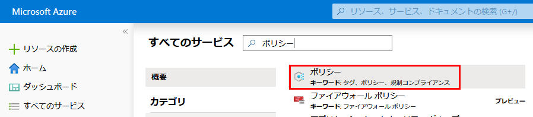

2.  Azure Policy ページの左側にある、**課題** を選択します。割り当てとは、
   特定の範囲内で行われるように割り当てられるポリシーです。

    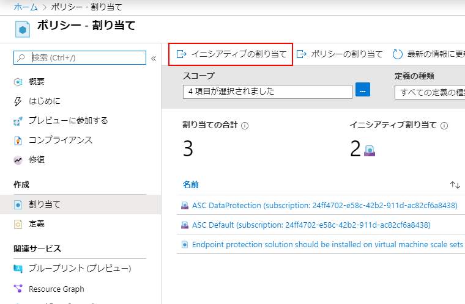

3.  **ポリシー - 割り当て** ページの最上部から、**ポリシーを割り当てる** を選択します。

    

4.  **ポリシーを割り当てる** ページで、省略記号をクリックして、管理グループまたはサブスクリプションを選択することで、**範囲** を選択します。オプションとして、リソース グループを選択します。範囲により、ポリシー割り当てが適用されるリソースまたはリソースのグループを決定します。次に、**範囲** ページの最下部にある、**選択** をクリックします。

    この例では **Contoso** サブスクリプションを使用しています。サブスクリプションは異なる場合があります。

5.  リソースは、**範囲** に基づいて除外することができます。**除外** は、**範囲** のレベルより 1 つ低いレベルで開始します。**除外** はオプションであるため、ここでは空白のままにします。

6.  **ポリシー定義** の省略記号を選択して、使用可能な定義のリストを開きます。ポリシー定義の **タイプ** を *ビルトイン* にフィルタリングして、すべてを表示して、説明を読むことができます。

7.  **SQL Server バージョン 12.0 が必要** を選択します。すぐに見つからない場合は、検索ボックスに **SQLサーバーを必須とする** を入力して Enter キーを押すか、検索ボックスの外をクリックします。ポリシー定義を見つけて選択したら、**利用可能な定義** ページの最下部にある **選択** をクリックします。

    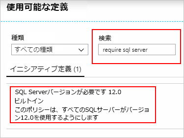

1.  **割り当て名** は、選択したポリシー名が自動的に入力されますが、変更できます。この例では、*SQL Serverバージョン12.0 を必須とする* のままにします。オプションの **説明** を追加することもできます。説明には、このポリシーの割り当てに関する詳細が記載されています。**担当者** は、ログインしているユーザーに基づいて自動的に入力されます。このフィールドはオプションであるため、カスタム値を入力できます。

1.  **管理されたIDを作成する** のチェックを外したままにしておきます。このボックスは **「deployIfNotExists」** 効果を伴うポリシーが含まれている場合、チェックされなければ_なりません_。このチュートリアルで使用されるポリシーはそうではないので、空白のままにします。 

1.  **割り当て** をクリックします。

### タスク 2：新しいカスタムポリシーを実装する

組み込みのポリシー定義を割り当てたので、Azure Policy でさらに多くのことができます。次に、新しいカスタムポリシーを作成して、環境で作成された VM が G シリーズに含まれないことを検証して、コストを節約します。この方法では、組織内のユーザーが G シリーズで VM を作成しようとするたびに、要求が拒否されます。

1.  Azure ポリシーページの左側にある **オーサリング** で、**定義** を選択します。

    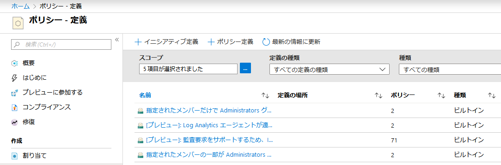
  
1.  ページの最上部にある **+ ポリシー定義** を選択します。このボタンを押すと、**ポリシー定義** ページを開きます。

1.  次の情報を入力します。

    - ポリシー定義が保存される管理グループまたはサブスクリプション。**定義場所** にある省略記号を使用して、
     選択します。

       **注記**：このポリシー定義を複数のサブスクリプションに適用する場合、場所は、ポリシーを割り当てるサブスクリプションを含む管理グループである必要があります。イニシアチブの定義についても同様です。


    - ポリシー定義の名前- *G シリーズよりも小さい VM SKU が必須*
    - ポリシー定義の目的の説明 - *このポリシー定義により、
     この範囲で作成されたすべての VM の SKU を G シリーズよりも小さくなり、
     コストが削減されます。*
    - 既存のオプション (_Compute_ など) から選択するか、このポリシー定義に対して新しいカテゴリを
     作成します。
    - 次の JSON コードをコピーしてから、必要に応じて次に対して更新を行います。
      - ポリシーのパラメーター。
      - ポリシールール/条件、この場合 - G シリーズに等しい VM SKU サイズ
      - この場合のポリシー効果 - **拒否**。

    JSON は次のようになります。修正したコードを Azure portal に貼り付けます。

   ```json
   {
       "policyRule": {
           "if": {
               "allOf"：[{
                       "field": "type":
                       "equals": "Microsoft.Compute/virtualMachines"
                   },
                   {
                       "field": "Microsoft.Compute/virtualMachines/sku.name",
                       "like": "Standard_G*"
                   }
               ]
           },
           "then": {
               "effect": "deny"
           }
       }
   }
   ```

  
   ポリシールールの *フィールド*プロパティは、次の値のいずれかである必要があります。名前、タイプ、場所、タグ、またはエイリアス。エイリアスの例は**`"Microsoft.Compute/VirtualMachines/Size"`** となる場合があります

4.  **保存** を選択します。

### タスク 3：イニシアチブ定義を作成して割り当てる

イニシアチブ定義を使用すると、複数のポリシー定義をグループ化して、1つの包括的な目標を達成できます。イニシアチブは、含まれるポリシーへのコンプライアンスのために、割り当ての範囲内でリソースを評価します。 


1.  Azure ポリシーページの左側にある **オーサリング** で、**定義** を選択します。

    

1.  ページの最上部で **+ イニシアチブの定義** を選択して、**イニシアチブの定義** ページを
   開きます。

    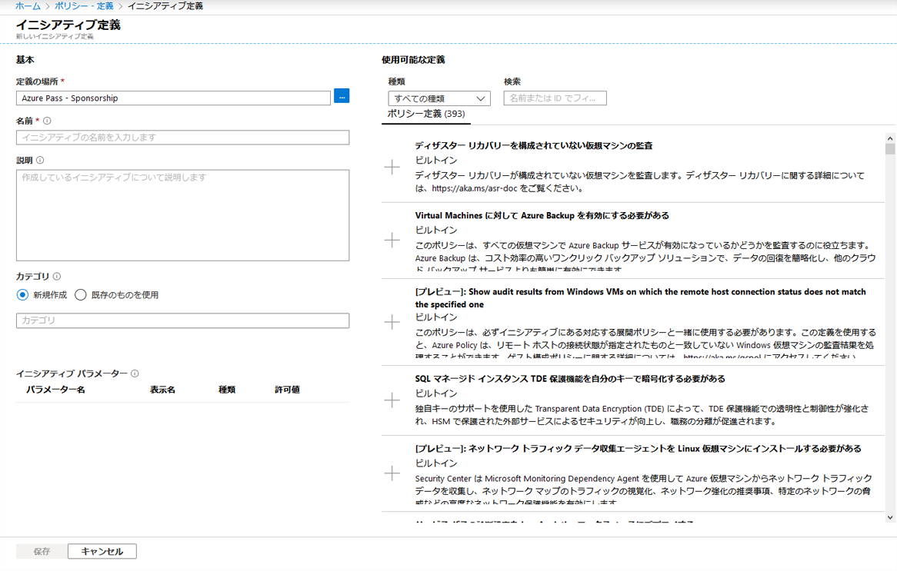

1.  **定義場所** の省略記号を使用して、定義を保存する管理グループまたはサブスクリプションを選択します。前のページの範囲が単一の管理グループまたはサブスクリプションに限定されていた場合、**定義場所** は自動的に入力されます。

1.  イニシアチブの **名前** と **説明** を入力します。

    この例では、リソースがセキュアになることに関するポリシー定義に準拠していることを検証します。イニシアチブに **Get Secure** と名前を付け、説明を次のように設定します。**このイニシアチブは、リソースの保護に関連するすべてのポリシー定義を処理するために作成されました**。

1.  **カテゴリー** については、既存のオプションから選択するか、新しいカテゴリを作成します。

1.  **利用可能な定義** (右半分 **イニシアチブの定義** ページの
   右半分) のリストを参照して、このイニシアチブに追加するポリシー定義を選択します。**Get 
   Secure** イニシアチブについては、ポリシー定義情報の横にある **+** をクリックするか、
   ポリシー定義行をクリックし、詳細ページの **+ 追加**
   オプションをクリックして、次の組み込みポリシー定義を追加します。

    - SQL Server バージョン 12.0 が必要
    - [プレビュー]: Security Center で保護されていない Web アプリケーションを監視します。
    - [プレビュー]: Security Center 内の許容ネットワークを監視します。
    - [プレビュー]: Security Center でアプリのホワイトリスト登録を監視します。
    - [プレビュー]: Security Center で、暗号化されていない VM ディスクを監視します。

    リストからポリシー定義を選択すると、**ポリシーとパラメーター** に追加されます。

    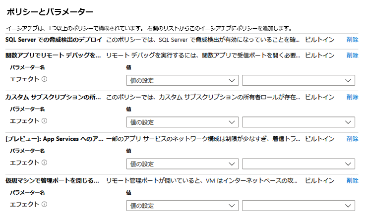

1.  イニシアチブに追加されるポリシー定義にパラメーターがある場合、それらは
   **ポリシーとパラメーター** エリア内のポリシー名に表示されます。その_値_は「値の設定」
   (このイニシアチブのすべての割り当てに対してハードコード化されている) または「イニシアチブパラメータを使用する」 (
   各イニシアチブの割り当て時に設定) のいずれかに設定できます。「値の設定」が選択されている場合、_値_の右側にあるドロップダウンにより
   値を入力または選択できます。「イニシアティブパラメーターを使用」が選択されている場合、新しい
   **イニシアチブパラメーター** セクションが表示されると、イニシアチブの割り当て中に設定するパラメーターを
   定義することができます。このイニシアチブパラメーターで許可される値は、さらに
   イニシアチブの割り当て時に設定できるものを制限します。

    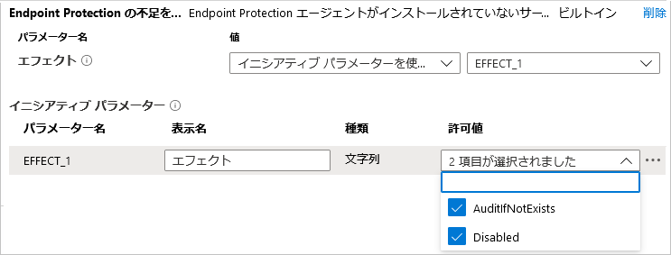

    **注記**：一部の「strongType」パラメータの場合、値のリストは自動的に決定できません。これらの場合、パラメーター行の右側に省略記号が表示されます。その記号をクリックすると、「パラメータースコープ (&lt;パラメーター名;)」ページが開きます。このページで、値オプションの提供に使用するサブスクリプションを選択します。このパラメータースコープは、イニシアチブ定義の作成中にのみ使用され、割り当てられたときのポリシー評価またはイニシアチブのスコープには影響しません。

2.  **保存** をクリックします。

### タスク 4：イニシアチブ定義を割り当てる

1.  Azure ポリシーページの左側にある **オーサリング** で、**定義** を選択します。

1.  以前に作成した **Get Secure** イニシアチブ定義を探し、クリックします。ページの最上部にある **割り当て** を選択して、**安全を確保する：イニシアチブを割り当てる** ページを開きます。

    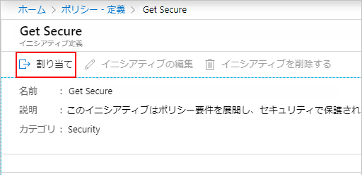
  
    選択した行を右クリックするか、行の最後にある省略記号を左クリックしてコンテキストメニューを表示することもできます。次に、**割り当て** を選択します。

    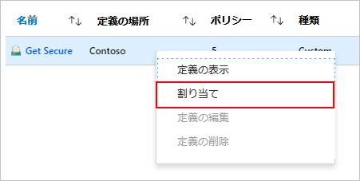

1.  次のサンプル情報を入力して、**Get Secure: 割り当てイニシアチブ** ページを入力します。独自の情報を使用できます。

    - 範囲: イニシアチブを保存した管理グループまたはサブスクリプションがデフォルトになります。範囲を変更して、イニシアチブを保存場所内のサブスクリプションまたはリソース グループに割り当てることができます。
    - 除外：イニシアチブの割り当てが適用されないように、範囲内のリソースを構成します。
    - イニシアチブの定義と割り当て名：セキュアの取得 (割り当てられるイニシアチブの名前として事前入力されます)。
    - 説明: このイニシアチブ割り当ては、このグループのポリシー定義を実施するように調整されています。
    - 担当者：ログインしているユーザーに基づいて自動的に入力されます。このフィールドはオプションであるため、カスタム値を入力できます。

2.  **管理されたIDを作成する** のチェックを外したままにしておきます。このボックスは **「deployIfNotExists」** 効果を伴うポリシーが含まれている場合、チェックされなければ_なりません_。このチュートリアルで使用されるポリシーはそうではないので、空白のままにします。 

3.  **割り当て** をクリックします。

### タスク 5：初期コンプライアンスを確認する

1.  Azure Policy ページの左側にある **コンプライアンス** を選択します。

1.  **ソースを取得** イニシアチブを探します。おそらくまだ **開始していません** の_コンプライアンス状態_です。イニシアチブをクリックして、割り当ての進行状況に関する詳細を取得します。

     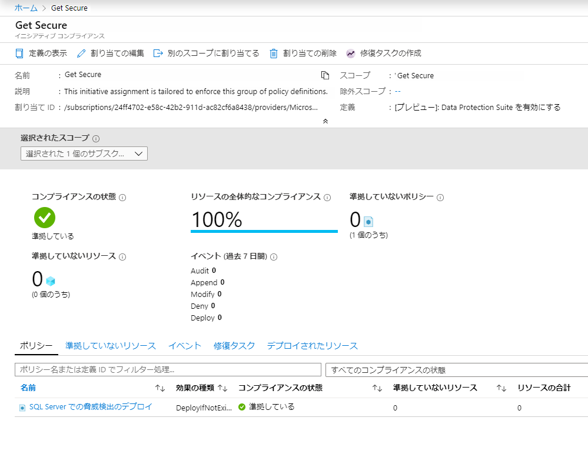

1.  イニシアチブの割り当てが完了すると、コンプライアンスページが更新され、**準拠** の_コンプライアンス状態_が更新されます。

     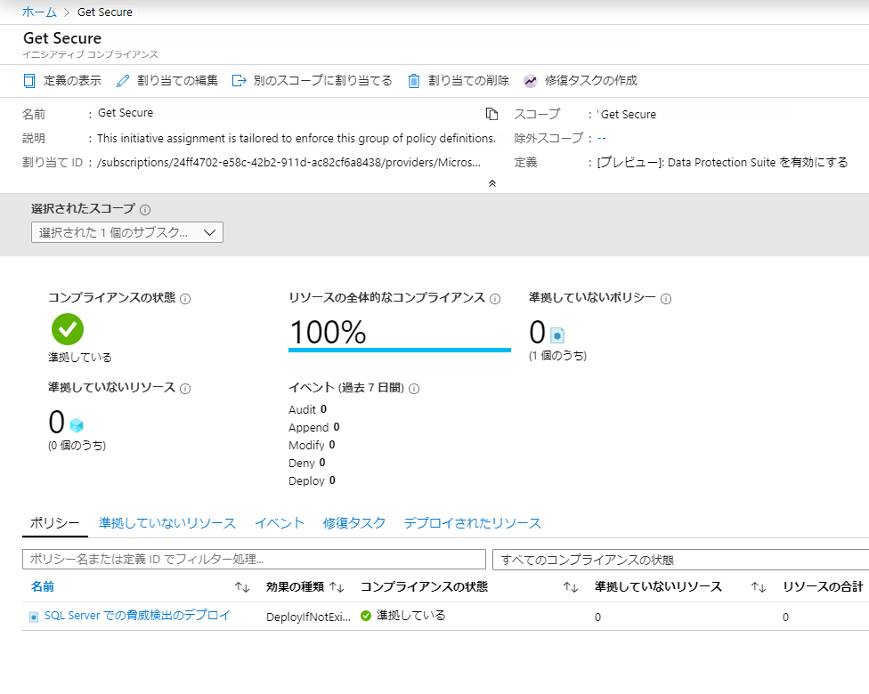

1.  イニシアチブコンプライアンスページのポリシーをクリックすると、そのポリシーに対するコンプライアンスの詳細ページが
   開きます。このページには、コンプライアンスのリソースレベルで詳細が表示されます。

### タスク 6：除外を使用して、非準拠または拒否されたリソースを除外する

上記の例に従って、SQL サーバーバージョン 12.0 を要求するポリシー定義を割り当てた後、12.0 以外のバージョンで作成された SQL サーバーは拒否されます。このタスクでは、単一のリソース グループで除外を作成して、拒否された要求を解決し、SQL サーバーを作成します。除外することにより、そのリソースに対するポリシー (またはイニシアチブ) の実施が妨げられます。次の例では、単一のリソース グループで任意の SQL サーバーバージョンを使用できます。除外はサブスクリプション、リソース グループに適用できます。または、除外を個々のリソースに絞り込むことができます。


割り当てられたポリシーまたはイニシアチブによって防止された展開は、次の 2 つの場所で表示できます。

- 展開の対象となるリソース グループ: ページの左側にある **デプロイ** を選択してから、デプロイに失敗した **デプロイ名** をクリックします。拒否されたリソースは、_禁止_のステータスとともに一覧表示されます。リソースを拒否したポリシーまたはイニシアチブと割り当てを決定するには、**失敗しました** をクリックします。**詳細については、ここをクリックしてください ->** 「デプロイの概要」ページ。ページの右側にエラー情報とともにウィンドウが開きます。関連するポリシーオブジェクトのGUIDは、**エラーの詳細** にあります。 

  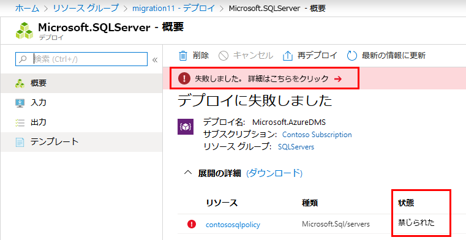

- Azureポリシーページで：ページの左側にある **コンプライアンス** を選択し、**SQL Serverバージョン 12.0 が必須** ポリシーをクリックします。開いたページでは、**拒否** カウントが増えて表示されます。**イベント** タブでは、誰がポリシーで拒否された展開を試みたかを確認することもできます。

 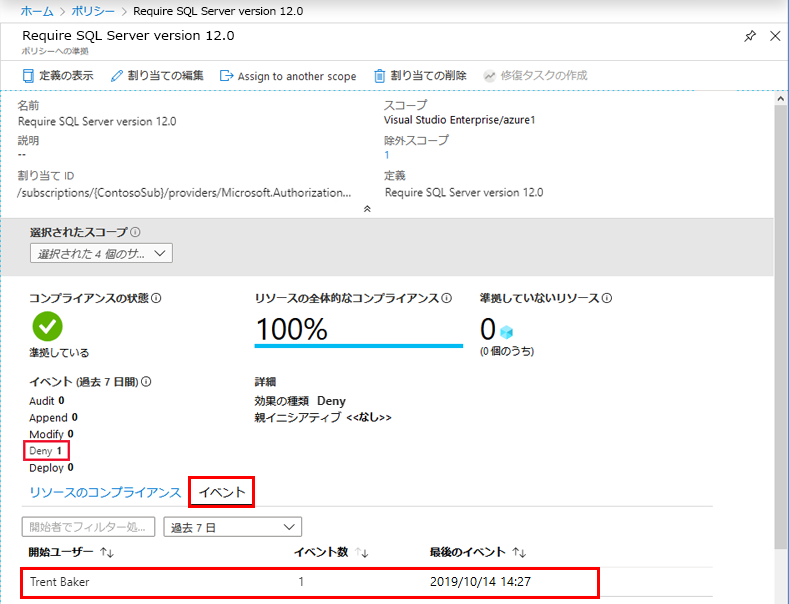

この例では、Contoso のシニア仮想化スペシャリストの 1 人であるトレント・ベイカーが必要な作業を行っていました。トレントに例外を与える必要がありますが、バージョン 12.0 以外の SQL サーバーがリソース グループだけに含まれるのは望ましくありません。新しいリソース グループ **SQLServers_Excluded** を作成したので、このポリシー割り当てへの例外が許可されます。

### タスク 7：除外を使用して割り当てを更新する

1.  Azure ポリシーページの左側にある **オーサリング** で **割り当て** を選択します。

2.  すべてのポリシー割り当てを参照し、*SQL Server バージョン 12.0 が必須* 割り当てを開きます。

3.  省略記号をクリックして、除外するリソース グループを選択することで、**除外** を設定します。 
   この例では *SQLServers_Excluded* を除外します。

    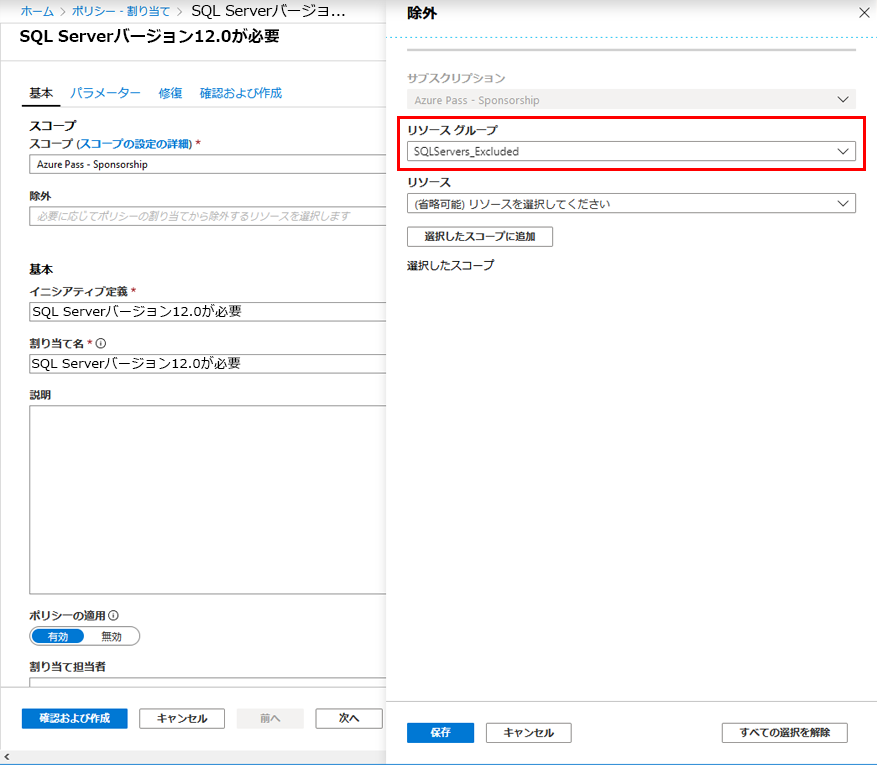

    **注記**：  ポリシーとその効果に応じて、割り当てのスコープ内のリソース グループ内の特定のリソースに除外を許可することもできます。このチュートリアルでは、**拒否** エフェクトが使用されましたが、既に存在する特定のリソースに除外を設定することは意味がありません。
@@@

1.  **選択** をクリックしてから、**保存** をクリックします。

このセクションでは、単一のリソース グループに除外を作成して、拒否された要求を解決しました。


### タスク 8：リソースをクリーンアップします

この実習ラボのリソースでの作業が完了したら、次の手順を使用して、上記で作成した割り当てまたは定義を削除します。


1.  **定義**(または割り当てを削除しようとしている場合に **割り当て**) をAzure Policy ページの左側にある **オーサリング** で選択します。

1.  削除する新しいイニシアチブまたはポリシー定義 (または割り当て) を検索します。

1.  行を右クリックするか、定義 (または割り当て) の最後にある省略記号を選択して、**定義を削除** (または **割り当てを削除**) を選択します。

このラボでは、次のタスクを正常に達成しました。

> - 今後作成するリソースに条件を強制するポリシーを割り当てる
> - 複数のリソースについてコンプライアンスを追跡するイニシアチブ定義を作成して割り当てる
> - 準拠していないリソースまたは拒否されたリソースを解決する
> - 組織全体で新しいポリシーを実施する


**結果**：これで、このラボを完了しました。

