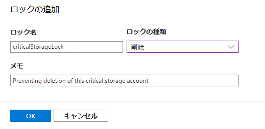

---
lab:
    title: 'ラボ 7: リソースマネージャーロックによる Azure リソースの保護'
    module: 'モジュール 1：ID 管理とアクセス管理'
---

# モジュール 1：ID 管理とアクセス管理


**シナリオ**

リソースマネージャーロックは、管理者が Azure リソースをロックダウンして、リソースの削除または変更を防ぐ方法を提供します。これらのロックは、ロールベースのアクセス制御 (RBAC) 階層の外側にあり、適用されると、すべてのユーザーのリソースに制限が課されます。これらは、ユーザーが削除または変更できないようにする必要がある重要なリソースがサブスクリプションにある場合に非常に役立ち、偶発的および悪意のある変更または削除を防ぐのに役立ちます。

適用できる 2 種類のリソースロックがあります。

 - **CanNotDelete** - これにより、ロックが設定されている間は誰もリソースを削除できなくなりますが、変更を加えることができます。
 - **ReadOnly** - 名前が示すように、リソースを読み取り専用にするため、変更を加えたり削除したりすることはできません。
リソースロックは、必要に応じてサブスクリプション、リソース グループ、または個々のリソースに適用できます。サブスクリプションをロックすると、そのサブスクリプションのすべてのリソース (後で追加されたものを含む) が同じロックを継承します。適用されると、これらのロックはロールに関係なくすべてのユーザーに影響を与えます。ロックが設定されているリソースを削除または変更する必要が生じた場合は、ロックを解除する必要があります。

**アクセス許可**

ロックを設定および削除する権限には、次の RBAC 権限のいずれかにアクセスする必要があります。

- `Microsoft.Authorization/*`
- `Microsoft.Authorization/locks/*`

デフォルトでは、これらのアクションは、RBAC ロールに組み込まれた所有者およびユーザーアクセス管理者でのみ使用できますが、必要に応じてカスタムロールに追加できます。前述のように、これらのロールを持つユーザーは引き続きロックの対象になりますが、必要に応じてそれらを削除できることは明らかです。ロックの作成と削除は、Azure アクティビティログで追跡されます。


# ラボ 7: リソースマネージャーロックによる Azure リソースの保護


ロックは、ARM テンプレート内のリソースの作成時、または後でポータルまたは PowerShell を使用して作成できます。


## 演習 1：ロックを作成する


ロックが適切に配置され、リソースを保護するための最良の方法は、実行時にロックを作成し、ARM テンプレートで設定することです。ロックはトップレベルの ARM リソースであり、ロックされるリソースの下にはありません。ロックされているリソースを参照するため、最初に存在する必要があります。 


### タスク 1：ロックの追加 (ポータル)

1.  Cloud Shell (PowerShell) を開き、次のコマンドを実行してリソース グループとストレージ アカウントを作成します。  _(コマンド内の XXXXXX を一意のものに変更します)_

     ```powershell
    New-AzResourceGroup -Name LockRG -Location EastUS
     ```
    
     ```powershell
    New-AzStorageAccount -ResourceGroupName LockRG -Name XXXXXX -Location  EastUS -SkuName Standard_LRS -Kind StorageV2 
     ```

1.  ストレージ アカウントを見つけて選択します。メインブレードで、「ロック」アイコンをクリックします

     


1.  **追加** をクリックします。

1.  ロックに名前と説明を付け、タイプ、削除、または読み取り専用を選択します。

     


1.  **OK** をクリックしてロックを保存すると、リソースが保護されるようになります。

1.  単に **ロック** に戻るだけでロックを解除し、ロックを選択してから削除します。

### タスク 2：ロックの追加 (PowerShell)

1.  Cloud Shell (PowerShell)を開き、次のコマンドを実行して、ストレージアカウントにロックを作成します。_(コマンドのXXXXXXをストレージ アカウントの名前に変更します)_

     ```powershell
    New-AzureRmResourceLock -LockLevel CanNotDelete -LockName criticalStorageLock -ResourceName XXXXXX  -ResourceType Microsoft.Storage/storageAccounts -ResourceGroupName LockRG
     ```

1.  ロックを削除するには、次のコマンドを実行します。_(コマンドのXXXXXXをストレージ アカウントの名前に変更します)_

     ```powershell
    Remove-AzureRmResourceLock -LockName criticalStorageLock -ResourceName  XXXXX -ResourceGroupName LockRG -ResourceType Microsoft.Storage/storageAccounts
     ```


リソースログを使用することにより、最も重要なリソースの偶発的または悪意のある変更や削除に対する追加の防御ラインを配置できます。管理者がこれらのロックを削除できるため、完全ではありませんが、ロックを削除する唯一の目的はロックを回避することであるため、意識的な努力が必要です。これらのロックは RBAC の外部にあるため、それらを適用して、付与したロールまたはカスタム権限に関係なく、すべてのユーザーに確実に影響を与えることができます。


**結果**：これで、このラボを完了しました。
