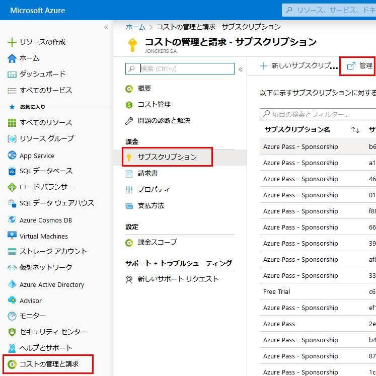
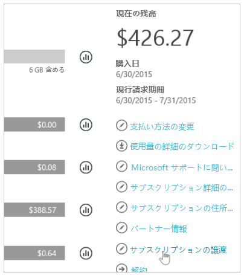
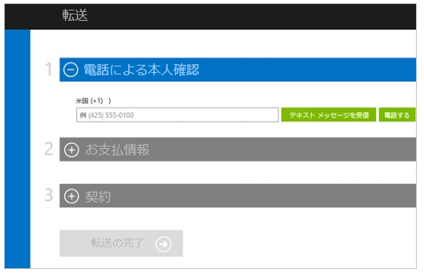

---
lab:
    title: 'ラボ 8: サブスクリプション'
    module: 'モジュール 1：ID 管理とアクセス管理'
---

# モジュール 1：ID 管理とアクセス管理

# ラボ 8: サブスクリプション

**シナリオ**

所有者から Azure AD テナントにサブスクリプションを譲渡する必要が生じる場合があります。Azure AD 所有者から別のサブスクリプションにサブスクリプションを転送するには、別のサブスクリプションにアクセスする必要があります。複数のサブスクリプションにアクセスできない場合、
下記のプロセスを確認してください。

## 演習 1：Azure AD テナント間で Azure サブスクリプションを譲渡する

### タスク 1：Azure サブスクリプションの所有権を譲渡するには、次の操作を行います。

1.  アカウント管理者として Azure Portal にサインインします。

1.  **Cost Management + Billing** > **サブスクリプション** に移動して、**管理** をクリックします。

     

2.  サブスクリプションを選択します。

3.  サポートされているオファーの一覧に対してオファーとオファー ID にチェックを付け、サブスクリプションがセルフサービスの譲渡の対象であることを確認します。

    **注記**：執筆時点では、Azure Pass - スポンサーシップサブスクリプションは譲渡の対象ではありません。  参照用にこのガイドに従ってください。

4.  **サブスクリプションの譲渡** を選択します。

     

5.  譲受人を指定します。

    **注記**: サブスクリプションを新しい Azure AD テナントに譲渡する場合は、RBAC のすべてのロールの割り当てがソース テナントから完全に削除され、ターゲット テナントに移行されません。

     

6.  譲受人は、承諾のリンクが記載されたメールを自動的に受信します。
7.  譲受人はリンクをクリックし、支払い情報の入力などの指示に従います。

     

8.  Azure はサブスクリプションの譲渡を完了します。

 この時点で、Azure サブスクリプションの請求所有権は、新しいサブスクリプションに移行されます。

**結果**：これで、このモジュールを完了しました。