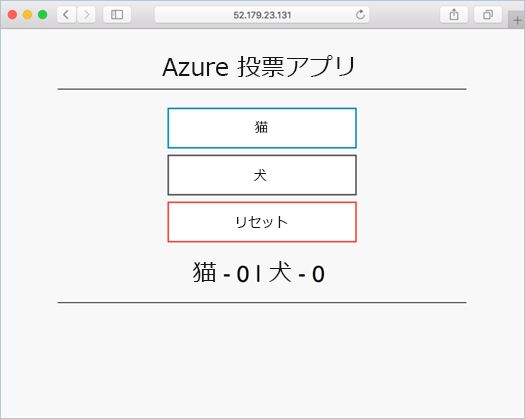

---
lab:
    title: 'ラボ 3 - Kubernetes クラスターの作成'
    module: 'モジュール 2 - プラットフォーム保護を実装する'
---

# モジュール 2：ラボ 3 - Kubernetes クラスターの作成


Azure Kubernetes Service（AKS）は、管理された Kubernetes サービスであり、クラスターをすばやくデプロイおよび管理できます。このクイックスタートで、Azure CLI を使用して AKS クラスターをデプロイします。Web フロントエンドと Redis インスタンスを含むマルチコンテナー アプリケーションがクラスターで実行されます。次に、アプリケーションを実行するクラスターとポッドの正常性を監視する方法を確認します。

## 演習 1：AKS 環境の作成

### タスク 1：環境を準備し、リソース グループを作成します。

1.  ブラウザを開いて、 **Azure Portal** **「https：// portal.azure.com」** に移動します

1.  **Cloudshell** アイコンをクリックします。

     

1.  必要に応じて、**Azure CLI BASH** を選択し、ストレージアカウントを作成します。

1.  **Cloud Shell** で以下のコマンドを実行し、新しい **リソース グループ** を作成します。

     ```cli
    az group create --name myResourceGroup --location eastus
     ```

### タスク 2：CLI で AKS クラスターを作成する

1.  次のコマンドを **CloudShell** で実行します。

     ```cli
    az aks create  --resource-group myResourceGroup --name myAKSCluster --node-count 1 --enable-addons monitoring --generate-ssh-keys
     ```
 
1.  数分後、コマンドは完了し、クラスターに関する **JSON 形式** の情報を返します。

### タスク 3：クラスタに接続します


Kubernetes クラスターを管理するには、Kubernetes コマンドライン クライアントである kubectl を使用します。Azure Cloud Shell を使用する場合、「kubectl」は既にインストールされています。


1.  **Azure Cloud Shell** で、次のコマンドを入力します

     ```azurecli
    az aks install-cli
     ```


1.  **Kubernetes クラスター** に接続するように kubectl を設定するには、az aks get-credentials コマンドを使用します。このコマンドは、資格情報をダウンロードし、それらを使用するように **Kubernetes CLI** を構成します。


     ```azurecli-interactive
    az aks get-credentials --resource-group myResourceGroup --name myAKSCluster
     ```

1.  クラスターへの接続を確認するには、kubectl-get コマンドを使いクラスター ノードのリストを返します。


    ```azurecli-interactive
    kubectl get nodes
    ```

1.  次の出力の例は、前の手順に作成した単一ノードを示しています。ノードが *準備完了* の状態であることを確認します。

    ```json
    NAME                       STATUS   ROLES   AGE     VERSION
    aks-nodepool1-31718369-0   Ready    agent   6m44s   v1.9.11
    ```

### タスク 4：アプリケーションの実行


Kubernetes マニフェスト ファイルは、実行するコンテナー イメージを含め、クラスターに必要な状態を定義します。このラボでは、マニフェストを使用して、Azure Vote アプリケーションの実行に必要なすべてのオブジェクトを作成します。このマニフェストには、Azure Vote Python アプリケーション用と Redis インスタンス用の 2 つの kubernetes-deployment が含まれます。また、Redis インスタンスの内部サービスと、インターネットから Azure Vote アプリケーションにアクセスするための外部サービスの 2 つの Kubernetes サービスが作成されます。マニフェストファイルが作成され、この実習ラボの godeply Github ページに保存されました。ファイルはazure-vote.yamlであり、次の場所にあります。 **「https://raw.githubusercontent.com/MicrosoftLearning/AZ-500-Azure-Security/master/Allfiles/Labs/Mod2_Lab03/azure-vote.yaml」**


1.  Cloud Shell で次のコマンドを実行します。これにより、godeploy github から必要な yaml ファイルが直接プルされ、AKS アプリケーションがデプロイされます。

     ```cli
    kubectl apply -f https://raw.githubusercontent.com/MicrosoftLearning/AZ-500-Azure-Security/master/Allfiles/Labs/Mod2_Lab03/azure-vote.yaml
     ```

2.  次の出力例は、正常に作成された **デプロイメントとサービス** を示しています。

     ```json
    deployment "azure-vote-back" created
    service "azure-vote-back" created
    deployment "azure-vote-front" created
    service "azure-vote-front" created
     ```

**注記**：アプリケーションが実行されると、Kubernetes サービスによってアプリケーション フロント エンドがインターネットに公開されます。このプロセスが完了するまでに数分かかる場合があります。


### タスク 5：アプリケーションをテストします


アプリケーションが実行されると、Kubernetes サービスによってアプリケーション フロント エンドがインターネットに公開されます。このプロセスが完了するまでに数分かかる場合があります。


1.  進行状況を監視するには、 「--watch」引数を使用して「kubectl-get」コマンドを使用します。

     ```azurecli-interactive
    kubectl get service azure-vote-front --watch
     ```

1.  最初に、*azure-vote-front* サービスに対して *EXTERNAL-IP* が *保留中* として表示されます。

     ```
    NAME               TYPE           CLUSTER-IP   EXTERNAL-IP   PORT(S)         AGE
    azure-vote-front   LoadBalancer   10.0.37.27   <pending>     80:30572/TCP    6s
     ```


1.  *EXTERNAL-IP* アドレスが *保留中* から実際のパブリック IP アドレスに変わったら、*Ctrl-C* を使用して「kubectl」ウォッチ プロセスを停止します。次の出力例は、サービスに割り当てられている有効なパブリック IP アドレスを示しています。

     ```
    azure-vote-front   LoadBalancer   10.0.37.27   52.179.23.131   80:30572/    TCP   2m
     ```

2.  Azure Vote アプリが動作していることを確認するには、Web ブラウザーを開いて、前のコマンドの結果として表示されるサービスの外部 IP アドレスにアクセスします。

     


### タスク 6：正常性とログの監視


AKS クラスターが作成され、コンテナーの Azure Monitor が有効になり、クラスター ノードとポッドの両方の正常性メトリックが取得できるようになりました。これらの正常性メトリックは、Azure ポータルで使用できます。


Azure Vote ポッドの現在のステータス、アップタイム、およびリソースの使用状況を確認するには、次の手順を実行します。

1.  Web ブラウザーを開いて、Azure portal を開きます。

1.  *myResourceGroup* などのリソース グループを選択し、*myAKSCluster* などの AKS クラスターを選択します。
1.  左側の **監視** で **分析情報** を選択します。
1.  上部で、**+フィルタを追加** を選択します。
1.  プロパティとして *名前空間* を選択し、*\<All but kube-system\>* を選択します。
1.  **コンテナー** の表示を選択します。

    次の例に示すように、*azure-vote-back* コンテナーと *azure-vote-front* コンテナーが表示されます。


1.  `azure-vote-front` ポッドのログを表示するには、コンテナー リストの右側にある **コンテナー ログの表示** リンクを選択します。これらのログには、 コンテナーからの *stdout* ストリームと *stderr* ストリームが含まれます。


### タスク 7：クラスターの削除


クラスターが不要になったら、 **「az グループの削除」** コマンドを使用して、リソース グループ、コンテナーサービス、およびすべての関連リソースを削除します。


1.  次のコマンドを実行して、クラスターを削除します。

     ```cli
    az group delete --name myResourceGroup --yes --no-wait
     ```


**結果**：これで、このラボを完了しました。
