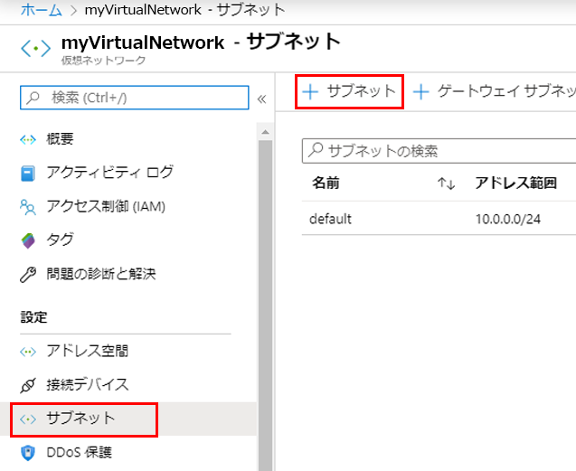
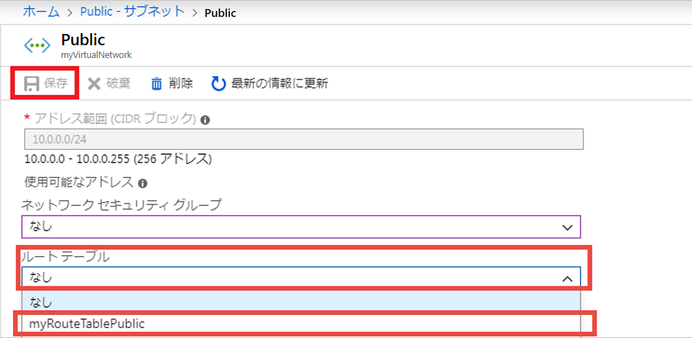
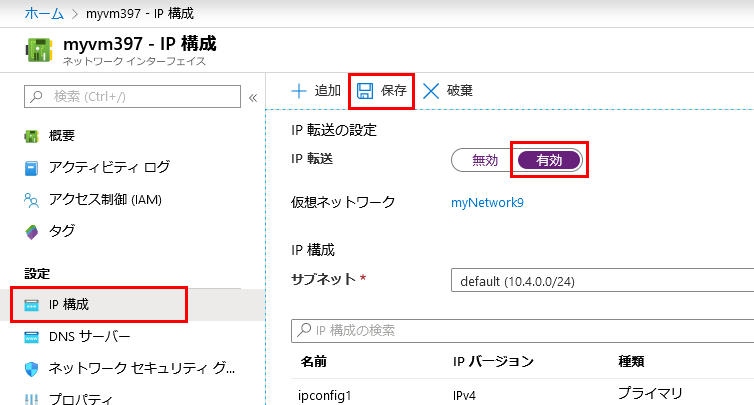

---
lab:
    title: 'ラボ 6 - NVA'
    module: 'モジュール 2 - プラットフォーム保護を実装する'
---

# モジュール 2：ラボ 6 - NVA


**シナリオ**

Azure は、仮想ネットワーク内のすべてのサブネット間のトラフィックをデフォルトでルートします。独自のルートを作成して、Azure のデフォルトルーティングをオーバーライドできます。カスタムルートを作成する機能は、たとえば、ネットワーク仮想アプライアンス（NVA）からサブネット間でトラフィックをルーティングする場合に役立ちます。このラボでは、次の方法を学習します。


> * ルートテーブルを作成する
> * ルートを作成する
> * 複数のサブネットがある仮想ネットワークを作成する
> * ルートテーブルをサブネットに関連付ける
> * トラフィックをルーティングする NVA を作成する
> * 仮想マシン（VM）を異なるサブネットにデプロイする
> * NVA を介して 1 つのサブネットから別のサブネットにトラフィックをルーティングする

## 演習 1：Azure portal を使用してルートテーブルでネットワークトラフィックをルーティングする

### タスク 1：ルートテーブルを作成する

1.  画面の左上にある **リソースの作成** > **ネットワーク** > **ルートテーブル** を選択します。

1.  **ルートテーブルの作成** で、次の情報を入力または選択します。

    | 設定 | 値 |
    | ------- | ----- |
    | 名前 | *myRouteTablePublic* を入力します。 |
    | サブスクリプション | サブスクリプションを選択します。 |
    | リソース グループ | **新規作成** を選択し、*myResourceGroup* と入力して、*OK* を選択します。 |
    | 保存先 | デフォルトの **米国東部** のままにします。
    | BGP ルート伝達 | デフォルトの **無効** のままにします。 |

1.  **作成** を選択します。

### タスク 2：ルートを作成する

1.  ポータルの検索バーに *myRouteTablePublic* と入力します。

1.  検索結果に **myRouteTablePublic** が表示されたら、それを選択します。

1.  **設定** の **myRouteTablePublic** で、**ルート** > **+ 追加** を選択します。


1.  **ルートの追加** で、次の情報を入力または選択します。

    | 設定 | 値 |
    | ------- | ----- |
    | ルート名 | *ToPrivateSubnet* を入力します。 |
    | アドレス プレフィックス | *10.0.1.0/24* と入力します。 |
    | 次のホップのタイプ | **仮想アプライアンス** を選択します。 |
    | 次のホップのアドレス | *10.0.2.4* を入力します。 |

1.  **OK** を選択します。

### タスク 3：ルートテーブルをサブネットに関連付ける


ルートテーブルをサブネットに関連付ける前に、仮想ネットワークとサブネットを作成する必要があります。


1.  画面の左上隅で、**リソースの作成** > **ネットワーク** > **仮想ネットワーク** を選択します。

1.  **仮想ネットワークの作成** で、次の情報を入力または選択します。

    | 設定 | 値 |
    | ------- | ----- |
    | 名前 | *myVirtualNetwork* と入力します。 |
    | アドレス空間 | *10.0.0.0/16* と入力します。 |
    | サブスクリプション | サブスクリプションを選択します。 |
    | リソース グループ | ***既存の選択*** > **myResourceGroup** を選択します。 |
    | 保存先 | デフォルトの **米国東部** のままにします。 |
    | サブネット - 名前 | *パブリック* を入力します。 |
    | サブネット - アドレス範囲 | *10.0.0.0/24* と入力します。 |

1.  残りのデフォルト設定をそのままにして、**作成** を選択します。

### タスク 4：サブネットを仮想ネットワークに追加します。

1.  ポータルの検索バーに、*myVirtualNetwork* と入力します。

1.  検索結果に **myVirtualNetwork** が表示されたら、それを選択します。

1.  **設定** の **myVirtualNetwork** で、**サブネット** > **+ サブネット** を選択します。

       

1.  **サブネットを追加** で、次の情報を入力します。

    | 設定 | 値 |
    | ------- | ----- |
    | 名前 | *プライベート* を入力します。 |
    | アドレス空間 | *10.0.1.0/24* と入力します。 |

1.  残りのデフォルト設定をそのままにして、**OK** を選択します。

1.  **+ サブネット** をもう一度選択します。今回は、次の情報を入力します。

    | 設定 | 値 |
    | ------- | ----- |
    | 名前 | *DMZ* を入力します。 |
    | アドレス空間 | *10.0.2.0/24* と入力します。 |

1.  前回と同様に、残りのデフォルトをそのままにして、**OK** を選択します。

    Azure は次の 3 つのサブネットを表示します。**パブリック**、 **プライベート**、**DMZ**。

### タスク 5：myRouteTablePublic をパブリック サブネットに関連付ける

1.  **パブリック** を選択します。

1.  **パブリック** で、**ルートテーブル** > **MyRouteTablePublic** > **保存** を選択します。

       

### タスク 6：NVA を作成する

NVA は、ルーティングやファイアウォールの最適化などのネットワーク機能を支援する VM です。必要に応じて、別のオペレーティングシステムを選択できます。このチュートリアルでは、**Windows Server 2016 Datacenter** を使用していることを前提としています。

1.  画面の左上にある **リソースの作成** > **コンピューティング** > **Windows Server 2016 Datacenter** を選択します。

1.  **「仮想マシンの作成 - 基本」** で、次の情報を入力または選択します。

    | 設定 | 値 |
    | ------- | ----- |
    | **プロジェクトの詳細** | |
    | サブスクリプション | サブスクリプションを選択します。 |
    | リソース グループ | **myResourceGroup** を選択します。 |
    | **インスタンスの詳細** |  |
    | 仮想マシン名 | *myVmNva* を入力する |
    | リージョン | **米国東部** と入力します。 |
    | 可用性オプション | 既定値の **インフラストラクチャ冗長は必要ありません** のままにします。 |
    | イメージ | 既定の **Windows Server 2016 Datacenter** のままにします。 |
    | サイズ | 既定の **Standard DS1 v2** のままにします。 |
    | **管理者アカウント** |  |
    | ユーザー名 | 選択したユーザー名を入力します。 |
    | パスワード | Pa55w.rd1234|
    | パスワードを確定する | パスワードを再入力します。 |
    | **受信ポート ルール** |  |
    | パブリック受信ポート | 既定の **None** のままにします
    | **コストを削減** |  |
    | 既に Windows ライセンスをお持ちですか?  | 既定の **いいえ** のままにします |

1.  **「次へ : ディスク」** を選択します。

1.  **仮想マシンの作成 - ディスク** で、ニーズに合った設定を選択します。

1.  **Next :** を選択します **「ネットワーク」** を選択します。

1.  **「仮想マシンの作成 - ネットワーク」** で、次の情報を選択します。

    | 設定 | 値 |
    | ------- | ----- |
    | 仮想ネットワーク | 既定の **myVirtualNetwork** のままにします。 |
    | サブネット | **DMZ（10.0.2.0/24）** を選択します。 |
    | パブリック IP | **なし** を選択します。パブリック IP アドレスは必要ありません。VM はインターネット経由で接続しません。|

1.  残りのデフォルト設定をそのままにして、**次へ：** を選択します。**管理** を選択します。

1.  **「仮想マシンの作成 - 管理」** で、**「診断ストレージ アカウント」** に **「新規作成」** を選択します。

1.  **「ストレージ アカウントの作成」** で、次の情報を入力または選択します。

    | 設定 | 値 |
    | ------- | ----- |
    | 名前 | *mynvastorageaccount* と入力します。 |
    | アカウントの種類 | 既定値 **ストレージ (汎用 v1)** のままにします。 |
    | パフォーマンス | 既定の **標準** のままにします。 |
    | レプリケーション | 既定の **ローカル冗長ストレージ (LRS)** のままにしておきます。

1.  **OK** を選択します。

1.  **「確認および作成」** を選択します。**「確認および作成」** ページが表示され、Azure が構成を検証します。

1.  **検証が成功した** ことを確認したら、**作成** を選択します。

    TM が作成するまでに数分かかります。Azure が VM の作成を完了するまで続行しないでください。**デプロイが進行中です** ページにデプロイの詳細が表示されます。

1.  VM の準備ができたら、**リソースに移動** を選択します。

### タスク 7：IP 転送をオンにする


*myVmNva* の IP 転送をオンにします。Azure がネットワークトラフィックを *myVmNva* に送信するとき、トラフィックが異なる IP アドレスを宛先とする場合、IP 転送はトラフィックを正しい場所に送信します。


1.  **設定** の **myVmNva** で、**「ネットワーク」** を選択します。

1.  **myvmnva123** を選択します。これが、Azure が VM 用に作成したネットワークインターフェイスです。それはあなたのためにそれを一意にするために数字の文字列を持つようになります。

1.  **設定** で、**IP 構成** を選択します。

1.  **myvmnva123 - IP 構成** で、**IP 転送** に **有効化** を選択してから、**保存** を選択します。

       

### タスク 8：パブリックおよびプライベートの仮想マシンを作成する


仮想ネットワークにパブリック VM とプライベート VM を作成します。後で、それらを使用して Azure が NVA を介して *パブリック* サブネットトラフィックを *プライベート* にルーティングするのを確認します。


1.  NVA の作成タスクの手順 1 ? 12 を完了します。ほとんどの同じ設定を使用します。これらの値は異なっていなければならないものです：

 | 設定 | 値 |
 | ------- | ----- |
 | **PUBLIC VM** | |
 | BASICS |  |
 | 仮想マシン名 | *myVmPublic* を入力します。 |
 | NETWORKING | |
 | サブネット | **パブリック（10.0.0.0/24）** を選択します。 |
| パブリック IP アドレス | デフォルトを受け入れます。 |
| パブリック受信ポート | **「選択したポートを許可する」** を選択します。 |
| 受信ポートを選択する | **HTTP** と **RDP** を選択します。 |
| MANAGEMENT | |
| 診断ストレージ アカウント | 既定の **mynvastorageaccount** のままにします。 |
| **PRIVATE VM** | |
| BASICS |  |
| 仮想マシン名 | *myVmPrivate* を入力します。 |
| NETWORKING | |
| サブネット | **プライベート（10.0.1.0/24）** を選択します。 |
| パブリック IP アドレス | デフォルトを受け入れます。 |
| パブリック受信ポート | **「選択したポートを許可する」** を選択します。 |
| 受信ポートを選択する | **HTTP** と **RDP** を選択します。 |
| MANAGEMENT | |
| 診断ストレージ アカウント | 既定の **mynvastorageaccount** のままにします。 |

Azure が *myVmPublic* VM を作成中に *myVmPrivate* VM を作成できます。Azure が両方の VM の作成を完了するまで、残りの手順を続行しないでください。

### タスク 9：NVA を介したトラフィックのルーティング

1.  リモートデスクトップ経由で myVmPrivate にサインインする

1.  ポータルの検索バーに *myVmPrivate* と入力します。

1.  検索結果に **myVmPrivate** が表示されたら、それを選択します。

1.  **接続** を選択して、*myVmPrivate* VM へのリモートデスクトップ接続を作成します。

1.  **仮想マシンに接続する** で、**RDP ファイルをダウンロードする** を選択します。Azure はリモート デスクトップ プロトコル (*.rdp*) ファイルを作成し、コンピュータにダウンロードします。

1.  ダウンロードした *rdp* ファイルを開きます。

    1. プロンプトが表示された場合は、**「接続」** を選択します。

    1. プライベート VM の作成時に指定したユーザー名とパスワードを入力します。

    1. **その他の選択肢** > **別のアカウントを使用する** を選択して、プライベート VM 資格情報を使用する必要がある場合があります。

1.  **OK** を選択します。

    サインイン プロセス中に証明書の警告が表示されることがあります。

1.  **はい** を選択して、VM に接続します。

### タスク 10：Windows ファイアウォールを介して ICMP を有効にする


後の手順では、トレース ルート ツールを使用してルーティングをテストします。トレース ルートは、Windows ファイアウォールが既定で拒否するインターネット制御メッセージプロトコル（ICMP）を使用します。Windows ファイアウォールを介して ICMP を有効にします。


1.  *myVmPrivate* のリモート デスクトップで PowerShell を開きます。

1.  次のコマンドを入力します。

    ```powershell
    New-NetFirewallRule -DisplayName "Allow ICMPv4-In" -Protocol ICMPv4
    ```

    このチュートリアルでは、トレース ルートを使用してルーティングをテストしています。運用環境では、Windows ファイアウォールから ICMP を許可することはお勧めしません。

### タスク 11：myVmNva で IP 転送をオンにする


Azure を使用して VM のネットワークインターフェイスの IP 転送をオンにしました。VM のオペレーティングシステムもネットワークトラフィックを転送する必要があります。これらのコマンドを使用して、*myVmNva* Vmのオペレーティングシステムへの IP 転送をオンにします。


1.  *myVmPrivate* VM のコマンドプロンプトから、リモートデスクトップを *myVmNva* VM に開きます。

    ```cmd
    mstsc /v:myvmnva
    ```

1.  *myVmNva* の PowerShell から、次のコマンドを入力して IP 転送をオンにします。

    ```powershell
    Set-ItemProperty -Path HKLM:\SYSTEM\CurrentControlSet\Services\Tcpip\Parameters -Name IpEnableRouter -Value 1
    ```

1.  *myVmNva* VM を再起動します。タスクバーから、**スタートボタン** > **電源ボタン**、**その他（予定）** > **続行** を選択します。

    また、リモートデスクトップセッションも切断されます。

1.  *myVmNva* VMが再起動したら、*myVmPublic* VM にリモート デスクトップ セッションを作成します。*myVmPrivate* VM へ接続されたまま、コマンドプロンプトを開き、次のコマンドを実行します。

    ```cmd
    mstsc /v:myVmPublic
    ```
1.  *myVmPublic* のリモート デスクトップで PowerShell  を開きます。

1.  次のコマンドを入力して、Windows ファイアウォールを介して ICMP を有効にします。

    ```powershell
    New-NetFirewallRule -DisplayName "Allow ICMPv4-In" -Protocol ICMPv4
    ```

### タスク 12：ネットワーク トラフィックのルーティングのテスト


最初に、*myVmPublic* VM から *myVmPrivate* VM へのネットワークトラフィックのルーティングをテストしましょう。


1.  *myVmPublic* VM の PowerShell から、次のコマンドを入力します。

    ```powershell
    tracert myVmPrivate
    ```

    応答は次の例に類似しています。

    ```powershell
    Tracing route to myVmPrivate.vpgub4nqnocezhjgurw44dnxrc.bx.internal.cloudapp.net [10.0.1.4]
    over a maximum of 30 hops:

    1    <1 ms     *        1 ms  10.0.2.4
    2     1 ms     1 ms     1 ms  10.0.1.4

    Trace complete.
    ```

    最初のホップが 10.0.2.4 であることがわかります。NVA のプライベート IP アドレスです。2番目のホップは、*myVmPrivate* VM のプライベート IP アドレスです。 10.0.1.4. 以前に、*myRouteTablePublic* ルートテーブルにルートを追加し、それに *パブリック* サブネットを関連付けました。その結果、Azure は *プライベート* サブネットへ直接トラフィックを送信するのではなく、NVA からトラフィックを送信しました。

1.  *myVmPublic* VM へのリモートデスクトップセッションを閉じると、*myVmPrivate* VM へ接続したままになります。

1.  *myVmPrivate* VM のコマンドプロンプトから、次のコマンドを入力します。

    ```cmd
    tracert myVmPublic
    ```

    *myVmPrivate* VM から *myVmPublic* VM へのネットワーク トラフィックのルーティングをテストします。応答は次の例に類似しています。

    ```cmd
    Tracing route to myVmPublic.vpgub4nqnocezhjgurw44dnxrc.bx.internal.cloudapp.net [10.0.0.4]
    over a maximum of 30 hops:

    1     1 ms     1 ms     1 ms  10.0.0.4

    Trace complete.
    ```

    Azure が *myVmPrivate* VM から *myVmPublic* VM へ直接ルーティングするのを確認できます。デフォルトでは、Azure はサブネット間でトラフィックを直接ルーティングします。

1.  *myVmPrivate* へのリモート デスクトップ セッションを閉じます。


| 警告：続行する前に、このラボで使用したすべてのリソースを削除する必要があります。  **Azure Portal** でこれを行うには、**リソース グループ** をクリックします。  作成したリソース グループを選択します。  リソース グループ ブレードで、**リソース グループを削除** をクリックし、リソース グループ名を入力して、**削除** をクリックします。  作成した可能性のある追加のリソース グループに対してプロセスを繰り返します。**これを行わないと、他のラボで問題が発生する可能性があります。** |
| --- |
    


**結果** : これで、このラボを完了しました。


