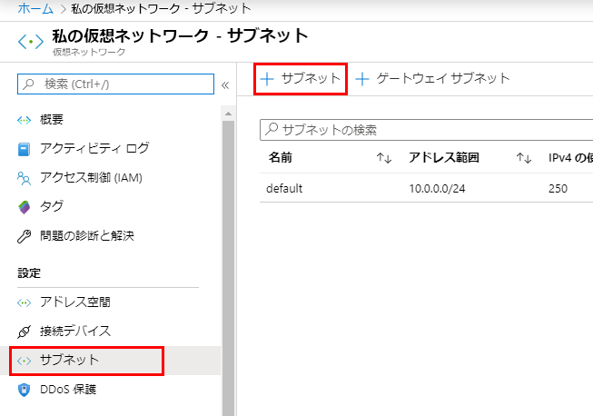
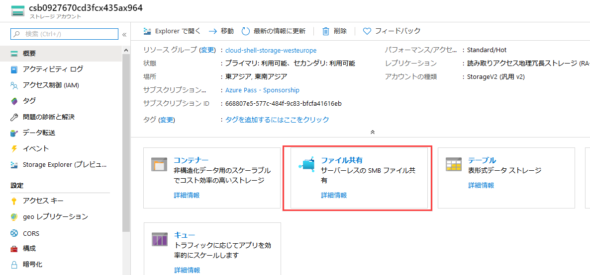
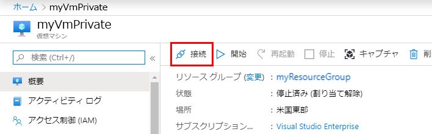
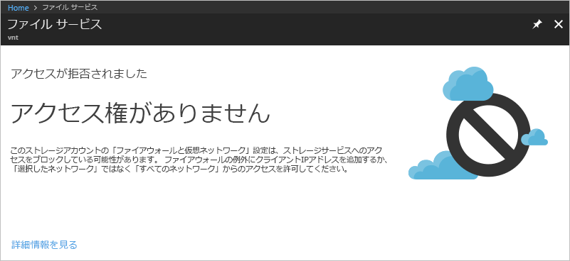

---
lab:
    title: 'ラボ 7 - サービス エンドポイント'
    module: 'モジュール 2 - プラットフォーム保護を実装する'
---

# モジュール 2：ラボ 7: サービス エンドポイント


仮想ネットワーク サービス エンドポイントを有効にすると、一部の Azure サービス リソースへのネットワーク アクセスを仮想ネットワークサブネットに制限できます。リソースへのインターネットアクセスを削除することもできます。サービス エンドポイントは、仮想ネットワークからサポートされている Azure サービスへの直接接続を提供し、仮想ネットワークのプライベートアドレス空間を使用して Azure サービスにアクセスできるようにします。サービス エンドポイントを介した Azure リソース宛てのトラフィックは、常に Microsoft Azure バックボーンネットワークに留まります。このチュートリアルには、下記を説明します：

- 1 つのサブネットがある仮想ネットワークを作成する
- サブネットを追加し、サービス エンドポイントを有効にする
- Azure リソースを作成し、サブネットのみからのネットワークアクセスを許可する
- 仮想マシン（VM）を各サブネットにデプロイする
- サブネットからリソースへのアクセスを確認する
- サブネットおよびインターネットからのリソースへのアクセスが拒否されることを確認する


## 演習 1：Azure portal を使用して、仮想ネットワーク サービス エンドポイントで PaaS リソースへのネットワークアクセスを制限する

### タスク 1：仮想ネットワークを作成する

1.  Azure portal の左上隅にある **+ リソースの作成** を選択します。
2.  **ネットワーク** を選択してから、**仮想ネットワーク** を選択します。
3.  次の情報を入力または選択してから、**作成** を選択します。

   |設定|値|
   |----|----|
   |名前| myVirtualNetwork |
   |アドレス空間| 10.0.0.0/16|
   |サブスクリプション| サブスクリプションを選択します。|
   |リソース グループ | **新規作成** を選択し、*MyResourceGroup* と入力します。|
   |保存先| **米国東部** を選択する |
   |サブネット名| 公開|
   |サブネットアドレス範囲| 10.0.0.0/24|
   |DDoS 保護| ベーシック|
   |サービスエンドポイント| 無効|
   |ファイアウォール| 無効|


### タスク 2：サービスエンドポイントを有効にする


サービス エンドポイントは、サービスごと、サブネットごとに有効になります。サブネットを作成し、サブネットのサービスエンドポイントを有効にします。


1.  ポータルの最上部にある **リソース、サービス、ドキュメントを検索する** ボックスに、*myVirtualNetwork* を入力します。検索結果に **myVirtualNetwork** が表示されたら、それを選択します。
2.  サブネットを仮想ネットワークに追加します。**設定** で、**サブネット** を選択してから、次の図で示すように **+ サブネット** を選択します。

       

3.  **サブネットを追加** で、次の情報を選択または入力してから、**OK** を選択します。

    |設定|値|
    |----|----|
    |名前| 非公開 |
    |アドレス範囲| 10.0.1.0/24|
    |サービス エンドポイント| **サービス** で、**Microsoft.Storage** を選択する|

### タスク 3：サブネットのネットワークアクセスを制限する


デフォルトでは、サブネット内のすべての VM はすべてのリソースと通信できます。ネットワーク セキュリティ グループを作成し、サブネットに関連付けることにより、サブネット内のすべてのリソースとの通信を制限できます。


1.  Azure portal の左上隅にある **+ リソースの作成** を選択します。
2.  **ネットワーク** を選択してから、**ネットワーク セキュリティ グループ** を選択します。
3.  **ネットワーク セキュリティ グループを作成する** で、次の情報を入力または選択してから、**作成** を選択します。

    |設定|値|
    |----|----|
    |名前| myNsgPrivate |
    |サブスクリプション| サブスクリプションを選択します。|
    |リソース グループ | **既存の使用** を選択して、*myResourceGroup* を選択します。|
    |保存先| **米国東部** を選択する |

4.  ネットワーク セキュリティ グループが作成されたら、*myNsgPrivate* をポータルの最上部にある **リソース、サービス、ドキュメントを検索する** ボックスに入力します。検索結果に **myNsgPrivate** が表示されたら、それを選択します。
5.  **設定** で、**送信セキュリティ規則** を選択します。
6.  **+ Add** を選択します。
7.  Azure Storage サービスへの送信通信を許可する規則を作成します。次の情報を入力または選択してから、**追加** を選択します。

    |設定|値|
    |----|----|
    |ソース| **VirtualNetwork** を選択する |
    |送信元ポート範囲| * |
    |デスティネーション | **サービス タグ** を選択する|
    |宛先サービス タグ | **ストレージ** を選択する|
    |宛先ポート範囲| * |
    |プロトコル|任意|
    |アクション|Allow|
    |優先度|100|
    |名前|Allow-Storage-All|

8.  インターネットへの通信を拒否する別の送信セキュリティ規則を作成します。この規則は、送信インターネット通信を許可するすべてのネットワーク セキュリティ グループのデフォルト規則を上書きします。次の値を使用して、手順 5 ? 7 を再度実行します。

    |設定|値|
    |----|----|
    |ソース| **VirtualNetwork** を選択する |
    |送信元ポート範囲| * |
    |デスティネーション | **サービス タグ** を選択する|
    |宛先サービス タグ| **インターネット** を選択する|
    |宛先ポート範囲| * |
    |プロトコル|任意|
    |アクション|Deny|
    |優先度|110|
    |名前|Deny-Internet-All|

9.  **設定** で、**受信セキュリティ規則** を選択します。
10.  **+ Add** を選択します。
11.  どこからでもサブネットへのリモートデスクトッププロトコル（RDP）トラフィックを許可する受信セキュリティ規則を作成します。この規則は、インターネットからのすべての受信トラフィックを拒否するデフォルトのセキュリティ規則をオーバーライドします。サブネットへのリモートデスクトップ接続が許可されているため、後の手順で接続をテストできます。**設定** で、**受信セキュリティ規則** を選択肢し、**+ 追加** を選択し、次の値を入力してから、**追加** を選択します。

        |設定|値|
        |----|----|
        |ソース| 任意 |
        |送信元ポート範囲| * |
        |デスティネーション | **VirtualNetwork** を選択する|
        |宛先ポート範囲| 3389 |
        |プロトコル|任意|
        |アクション|Allow|
        |優先度|120|
        |名前|Allow-RDP-All|

12.  **設定** で、**サブネット** を選択します。
13.  **+ アソシエイト** を選択する
14.  **サブネットを関連付ける** で、**仮想ネットワーク** を選択してから、**仮想ネットワークを選択する** で **myVirtualNetwork** を選択します。
15.  **サブネットを選択する** で、**プライベート** を選択してから、**OK** を選択します。

### タスク 4：リソースへのネットワークアクセスを制限する


サービスエンドポイントで利用可能な Azure サービスを通じて作成されたリソースへのネットワーク アクセスを制限するために必要な手順は、サービスによって異なります。各サービスの特定の手順については、個々のサービスのドキュメントを参照してください。このチュートリアルの残りの部分には、例として、Azure ストレージアカウントのネットワークアクセスを制限する手順が含まれています。


1.  Azure portal の左上隅にある **+ リソースの作成** を選択します。
2.  **ストレージ** を選択してから、**ストレージアカウント - BLOB、ファイル、テーブル、キュー** を選択します。
3.  次の情報を入力または選択し、残りのデフォルトを受け入れてから、**作成** を選択します。

    |設定|値|
    |----|----|
    |名前| 数字と小文字のみを使用して、3 ? 24 文字のすべての Azure 保存先で一意の名前を入力します。|
    |アカウントの種類|StorageV2 (general purpose v2)|
    |保存先| **米国東部** を選択する |
    |レプリケーション| ローカル冗長ストレージ (LRS)|
    |サブスクリプション| サブスクリプションを選択します。|
    |リソース グループ | **既存の使用** を選択して、*myResourceGroup* を選択します。|

### タスク 5：ストレージアカウントにファイル共有を作成する

1.  ストレージアカウントが作成されたら、ストレージアカウントの名前をポータルの最上部にある **リソース、サービス、ドキュメントを検索する** ボックスに入力します。ストレージ アカウントの名前が検索結果に表示されたら、それを選択します。
2.  次の図に示すように、**ファイル共有** を選択します。

       

3.  **+ ファイル共有** を選択します。
4.  **名前** で *my-file-share* を入力してから、**OK** を選択します。
5.  **ファイルサービス** ボックスを閉じます。

### タスク 6：サブネットへのネットワークアクセスを制限する


デフォルトでは、ストレージ アカウントは、インターネットを含む任意のネットワーク上のクライアントからの接続を受け入れます。インターネット、およびすべての仮想ネットワーク内の他のすべてのサブネットからのネットワークアクセスを拒否します。ただし、*myVirtualNetwork* 仮想ネットワークの *プライベート* サブネットは除きます。


1.  ストレージ アカウントの **設定** で、**ファイアウォールと仮想ネットワーク** を選択します。
2.  **選択されているネットワーク** を選択します。
3.  **+ 既存の仮想ネットワークを追加** を選択します。
4.  **ネットワークを追加する** で、次の値を選択してから、 **追加** を選択します。

    |設定|値|
    |----|----|
    |サブスクリプション| サブスクリプションを選択します。|
    |仮想ネットワーク|**仮想ネットワーク** で、**myVirtualNetwork** を選択する|
    |サブネット| **サブネット** で、**プライベート** を選択する|


5.  [**保存**] を選択します。
6.  **ファイアウォールと仮想ネットワーク** ボックスを閉じます。
7.  ストレージ アカウントの **設定** で、**アクセス キー** を選択します。

8.  ファイル共有を VM のドライブ文字にマッピングするときに、後の手順で手動で入力する必要があるため、**キー** の値に注意してください。

### タスク 7：仮想マシンを作成する


ストレージアカウントへのネットワークアクセスをテストするには、各サブネットに VM をデプロイします。


1.  Azure portal の左上隅にある **+ リソースの作成** を選択します。
2.  **計算** を選択してから、**仮想マシン** を選択します。
3.  次の情報を入力または選択してから、**OK** を選択します。

   |設定|値|
   |----|----|
   |名前| myVmPublic|
   |ユーザー名|選択したユーザー名を入力します。|
   |パスワード| Pa55w.rd1234 |
   |サブスクリプション| サブスクリプションを選択します。|
   |リソース グループ| **既存の使用** を選択して、**myResourceGroup** を選択します。|
   |保存先| **米国東部** と入力します。|
   |イメージ| **Windows Server 2019 Datacenter** を選択します。|

   
4.  仮想マシンのサイズを選択してから、**選択** を選択します。
5.  **ネットワーク** タブで、**myVirtualNetwork** を選択します。次に **サブネット** を選択して、**パブリック** サブネットを選択します。

   
6.  **ネットワーク セキュリティ グループ** で、**ベーシック** を選択して、ポート 3389 を許可します。 

1.  **「確認および作成」** をクリックします。

7.  **概要** ページで、**作成** を選択して、仮想マシンのデプロイを開始します。VM のデプロイには数分かかりますが、VM の作成中に次の手順に進むことができます。

1.  手順 1 ? 8 を再度実行しますが、手順 3 では仮想マシンに *myVmPrivate* と名前を付け、ステップ 5 で、**プライベート** サブネットを選択します。

VM がデプロイを完了するまでに数分かかります。作成が完了してその設定がポータルで開くまで、次の手順に進まないでください。

### タスク 8：ストレージアカウントへのアクセスを確認する

1.  *myVmPrivate* VM が作成を終了すると、Azure はその設定を開きます。次のスクリーンショットに示すように、**接続** ボタンを選択して、VM に接続します。

       

2.  **接続** ボタンを選択したら、リモート デスクトップ プロトコル（.rdp）ファイルが作成され、コンピューターにダウンロードされます。  
3.  ダウンロードした rdp ファイルを開きます。プロンプトが表示された場合は、**「接続」** を選択します。VM の作成時に指定したユーザー名とパスワードを入力します。VM 作成時に入力した資格情報を指定するには、 **その他** を選択してから、**別のアカウントを使用する** を選択する必要があります。 
4.  **OK** を選択します。
5.  サインイン プロセス中に証明書の警告が表示されることがあります。警告が表示されたら、**はい** または **続行** を選択して、接続を続行します。
6.  *myVmPrivate* VM で、PowerShell を使用して Azure ファイル共有をドライブ Z にマップします。以下のコマンドを実行する前に、「<ストレージアカウントキー>」および「<ストレージアカウント名>」を、**ストレージ アカウントを作成する** タスクで指定および取得した値に置き換えてください。

       ```powershell
       $acctKey = ConvertTo-SecureString -String "<storage-account-key>" -AsPlainText -Force
       $credential = New-Object System.Management.Automation.PSCredential -ArgumentList "Azure\<storage-account-name>", $acctKey
       New-PSDrive -Name Z -PSProvider FileSystem -Root "\\<storage-account-name>.file.core.windows.net\my-file-share"  -Credential $credential
       ```

     Azure ファイル共有が Z ドライブに正常にマップされました。

7.  VM にコマンドプロンプトからインターネットへの送信接続がないことを確認します。

       ```
       ping bing.com
       ```

    *プライベート* サブネットに関連付けられているネットワーク セキュリティ グループは、インターネットへの送信アクセスを許可しないため、返信を受け取ることはありません。

8.  *myVmPrivate* へのリモート デスクトップ セッションを閉じます。

### タスク 9：ストレージ アカウントへのアクセスが拒否されていることを確認する

1.  ポータルの最上部にある **リソース、サービス、ドキュメントを検索する** ボックスに、*myVmPublic* を入力します。
2.  検索結果に **myVmPublic** が表示されたら、それを選択します。
3.  [*myVmPublic* VM のストレージ アカウント タスクへのアクセスを確認する] で手順 1 ? 6 を完了します。

       少し待ってから、「New-PSDrive：アクセスが拒否されました」エラーを受け取ります。*myVmPublic* VM が *パブリック* サブネットにデプロイされているため、アクセスが拒否されています。*パブリック* サブネットには、Azure Storage に対応したサービス エンドポイントがありません。ストレージ アカウントは、*パブリック* サブネットではなく *プライベート* サブネットからのネットワーク アクセスのみ許可します。

4.  *myVmPublic* VM へのリモート デスクトップ セッションを閉じます。

5.  コンピューターから、Azure portal を参照します。
6.  **リソース、サービス、ドキュメントを検索する** ボックスで作成したストレージ アカウントの名前を入力します。ストレージ アカウントの名前が検索結果に表示されたら、それを選択します。
7.  **ファイル** を選択します。
8.  次のスクリーンショットに表示されているエラーを受け取ります。

      

      お使いのコンピューターが *MyVirtualNetwork* 仮想ネットワークの *プライベート* サブネットにないため、アクセスが拒否されています。


| 警告：続行する前に、このラボで使用したすべてのリソースを削除する必要があります。  **Azure Portal** でこれを行うには、**リソース グループ** をクリックします。  作成したリソース グループを選択します。  リソース グループ ブレードで、**リソース グループを削除** をクリックし、リソース グループ名を入力して、**削除** をクリックします。  作成した可能性のある追加のリソース グループに対してプロセスを繰り返します。**これを行わないと、他のラボで問題が発生する可能性があります。** |
| --- |

**結果** : これで、このラボを完了しました。
