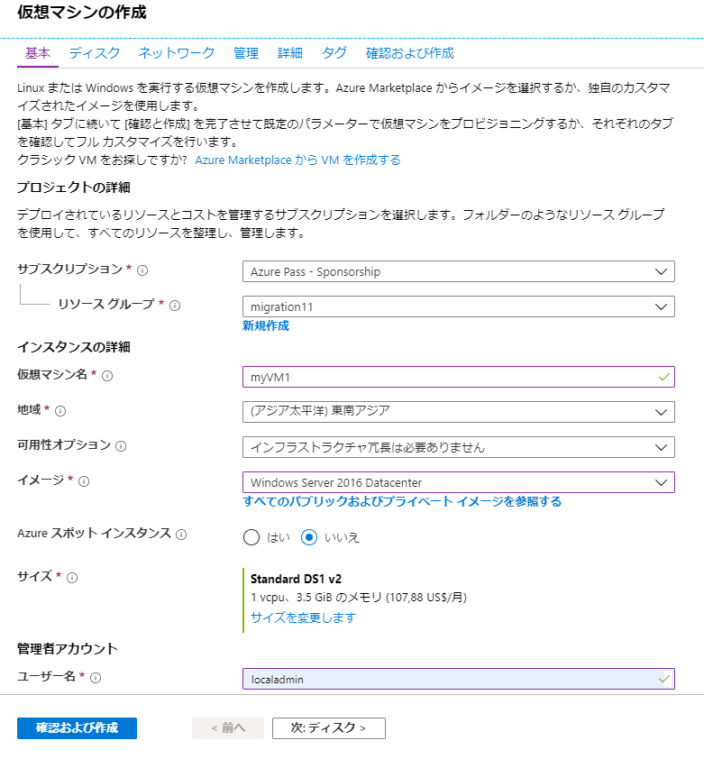
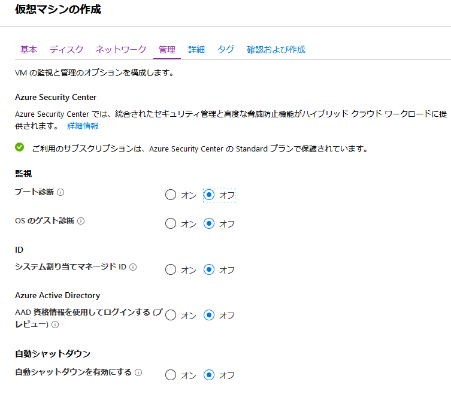

---
lab:
    title: 'ラボ 8 - VNet ピアリング'
    module: 'モジュール 2 - プラットフォーム保護を実装する'
---

# モジュール 2：ラボ 8 - VNet ピアリング


**シナリオ**

仮想ネットワークピアリングを使用して、仮想ネットワークを相互に接続できます。これらの仮想ネットワークは、同じリージョンまたは異なるリージョン（グローバル VNet ピアリングとも呼ばれる）に存在できます。仮想ネットワークがピアリングされると、両方の仮想ネットワークのリソースは、リソースが同じ仮想ネットワークにあるかのように同じ待機時間と帯域幅で相互に通信できます。このチュートリアルには、下記を説明します：

- 仮想ネットワークを作成する
- 2 つの仮想ネットワークを仮想ネットワークピアリングで接続する
- 仮想マシン（VM）を各仮想ネットワークにデプロイするする
- VM 間の通信


### 演習 1：仮想ネットワークを作成し、ピアリングを実装します。

### タスク 1：仮想ネットワークを作成する

1.  Azure portal の左上隅にある **+ リソースの作成** を選択します。
2.  **ネットワーク** を選択してから、**仮想ネットワーク** を選択します。
3.  次の情報を入力または選択し、残りの設定についてはデフォルトを受け入れてから、**作成** を選択します：

    |設定|値|
    |---|---|
    |名前|myVirtualNetwork1|
    |アドレス空間|10.0.0.0/16|
    |サブスクリプション| サブスクリプションを選択します。|
    |リソース グループ| **新規作成** を選択し、*MyResourceGroup* と入力します。|
    |保存先| **米国東部** と入力します。|
    |サブネット名|Subnet1|
    |サブネットアドレス範囲|10.0.0.0/24|


4.  次の変更を加えて、手順 1 ? 3 を再度実行します。

    |設定|値|
    |---|---|
    |名前|myVirtualNetwork2|
    |アドレス空間|10.1.0.0/16|
    |リソース グループ| **既存の使用** を選択してから、**myResourceGroup** を選択します。|
    |サブネットアドレス範囲|10.1.0.0/24|

### タスク 2：仮想ネットワークをピアリングする

1.  Azure portal の最上部にある検索ボックスで、*MyVirtualNetwork1* の入力を開始します。検索結果に **myVirtualNetwork1** が表示されたら、それを選択します。
2.  **設定** で、**ピアリング** を選択してから、**追加** を選択します。

3.  次の情報を入力または選択し、残りの設定のデフォルトを受け入れてから、**OK** を選択します。

    |設定|値|
    |---|---|
    |名前|myVirtualNetwork1-myVirtualNetwork2|
    |サブスクリプション| サブスクリプションを選択します。|
    |仮想ネットワーク|myVirtualNetwork2 - *myVirtualNetwork2* 仮想ネットワークを選択するには、**仮想ネットワーク** を選択してから、**myVirtualNetwork2** を選択します。同じリージョンまたは異なるリージョンの仮想ネットワークを選択できます。|
    |名前|myVirtualNetwork2-myVirtualNetwork1|


    次のスクリーンショットが示すように、**ピアリング ステータス** は *開始済み* です。


    ステータスが表示されない場合は、ブラウザを更新してください。

    **ピーリング ステータス** は *接続済み* です。Azure は、*myVirtualNetwork2-myVirtualNetwork1* ピアリングのピアリング ステータスを *開始済み* から *接続済み* に変更しました。両方の仮想ネットワークのピアリング ステータスが *接続済み* を表示するまで、仮想ネットワークのピアリングは正常に確立されません。 
    
    

### タスク 3：仮想マシンを作成する

1.  Azure portal の左上隅にある **+ リソースの作成** を選択します。
2.  **計算** を選択してから、**Windows Server 2016 Datacenter** を選択します。別のオペレーティングシステムを選択できますが、残りの手順では **Windows Server 2016 Datacenter** を選択したことを前提としています 。 
3.  **基礎** には次の情報を入力または選択し、残りの設定のデフォルトを受け入れてから、**作成** を選択します。

    |設定|値|
    |---|---|
    |リソース グループ| **myResourceGroup** を選択します。|
    |名前|myVM1|
    |リージョン| 米国東部|
    |ユーザー名| localadmin |
    |パスワード| Pa55w.rd1234 |
       
     
   

5.  ネットワークタブを選択します。

    |設定|値|
    |---|---|
    |仮想ネットワーク| myVirtualNetwork1 - まだ選択されていない場合は、**仮想ネットワーク** を選択してから、**仮想ネットワークを選択** で **myVirtualNetwork1** を選択します。|
    |サブネット| Subnet1 - まだ選択されていない場合は、**サブネット** を選択してから、**サブネットを選択** で、**Subnet1** を選択します。|
    |パブリック受信ポート| **選択したポートを許可する** を選択する|
    |受信ポートを選択する| **RDP** |


1.  [管理] タブを選択し、すべてのラジオボタンを **オフ** に切り替えます。

     

6.  **「確認および作成」** を選択し、**「作成」** をクリックします。


1.  以下の変更を加えて、上記の手順を再度完了します（VM の作成には数分かかります。両方の VM が作成されるまで、残りの手順を続行しないでください。）：

 |設定|値|
 |---|---|
 |名前 | myVM2|
 |仮想ネットワーク | myVirtualNetwork2|


### タスク 4：VM 間の通信

1.  ポータルの最上部にある *Search* ボックスに、*myVM1* と入力を開始します。検索結果に **myVM1** が表示されたら、それを選択します。
2.  **接続** を選択して、*myVm1* VM へのリモート デスクトップ接続を作成します。

3.  VM に接続するには、ダウンロードした RDP ファイルを開きます。プロンプトが表示された場合は、**「接続」** を選択します。
4.  VM の作成時に指定したユーザー名とパスワードを入力してから（VM の作成時に入力した資格情報を指定するために **その他の選択肢** を選択してから、**別のアカウントを使用する** を選択する必要がある場合があります）、**OK** を選択します。
5.  サインイン プロセス中に証明書の警告が表示されることがあります。**はい** を選択して、接続を続行します。
6.  後のステップでは、ping を使用して、*myVm1* VM からの *myVm2* VM との通信を行います。ping はインターネット制御メッセージプロトコル（ICMP）を使用します。デフォルトでは、Windows ファイアウォールを介して拒否されます。*myVm1* VM で、Windows ファイアウォールを介して ICMP を有効にして、PowerShell を使用して、後の手順で *myVm2* からこの VM に ping を実行できるようにします。

    ```powershell
    New-NetFirewallRule -DisplayName "Allow ICMPv4-In" -Protocol ICMPv4
    ```
    
    このチュートリアルでは、VM 間の通信に ping を使用していますが、運用環境デプロイメントで Windows ファイアウォールを介して ICMP を許可することはお勧めしません。

7.  *myVm2* VM に接続するには、*myVm1* VM のコマンドプロンプトから次のコマンドを入力します。

    ```cli
    mstsc /v:10.1.0.4
    ```
    
8.  *myVm1* で ping を有効化したため、IP アドレスで ping できるようになりました。

    ```cli
    ping 10.0.0.4
    ```
    
9.  *myVM1* と *myVM2* の両方への RDP セッションを切断します。


10. すべてのリソースを実行したままにします。  後のラボで使用します。


**結果**：これで、このラボを完了しました。

