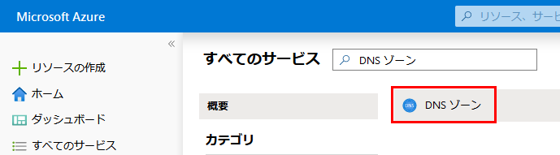
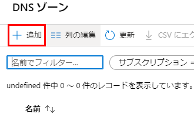
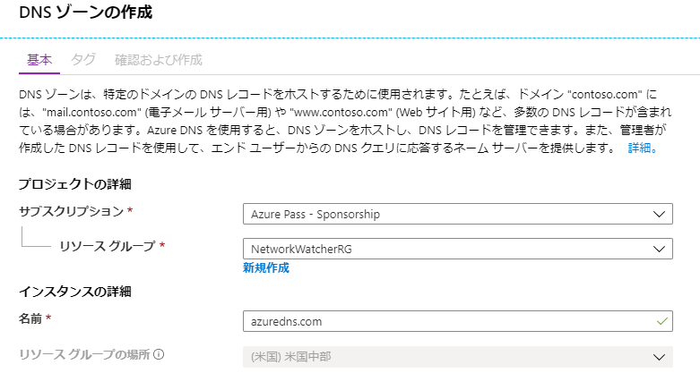
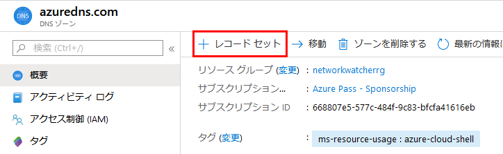
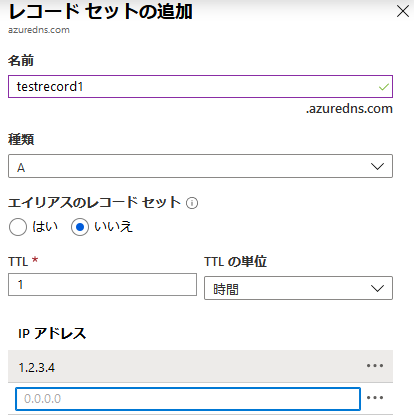
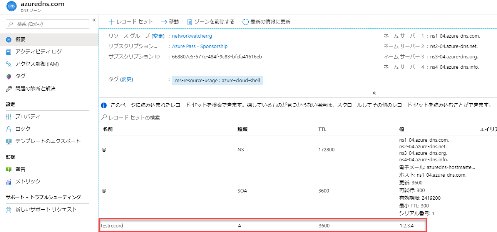
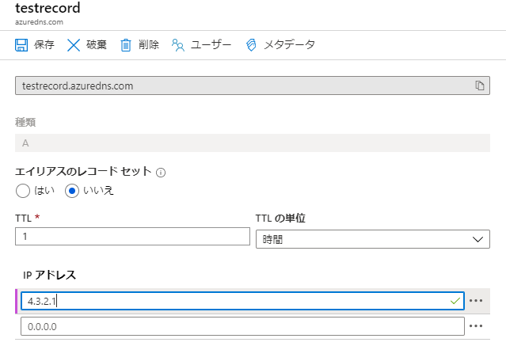
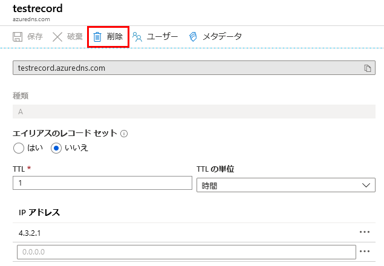

---
lab:
    title: 'ラボ 9 - Azure DNS'
    module: 'モジュール 2 - プラットフォーム保護を実装する'
---

# ラボ 9: Azure DNS

**シナリオ**

このモジュールでは、DNS の基本、および Azure DNS の具体的な実装について学習します。DNS の基本レッスンでは、DNS ドメイン、ゾーン、レコード タイプ、および解決方法を確認します。Azure DNS レッスンでは、委任、メトリック、アラート、DNS ホスティング スキームについて説明します。 

**目標**

次のレッスンが含まれます。

 * Azure DNS の基本
 * Azure DNS の実装

## 演習 1：DNS ゾーン

### タスク 1：DNS ゾーンを作成する

1.  Azure Portal にサインインします。
2.  [ハブ] メニューで、**すべてのサービス** をクリックし、**DNS ゾーン** を検索して選択します。

     

1. **+追加** をクリックします。

     

4.  **DNS ゾーンを作成する** ブレードで、次の値を入力してから、**レビュー + 作成** をクリックしてから、**「作成」** をクリックします。

     | **設定** | **値** | **詳細** |
     |------|---|---|
     |**サブスクリプション**|_**お使いのサブスクリプション**_|DNS ゾーンを作成するサブスクリプションを選択します。|
     |**リソース グループ**|新規作成： **_myResourceGroup_**|リソース グループを作成するリソース グループ名は、選択したサブスクリプション内で一意とならなければなりません。 
     |**名前**|**_詳細を見る**_|DNS ゾーンの名前（一意である必要があります） |
     |**場所**|米国東部||

     

## 演習 2：Azure portal を使用して DNS レコードとレコード セットを管理する

この演習では、Azure portal を使用して DNS ゾーンのレコードセットとレコードを管理する方法を示します。

### タスク 1：レコードセットに新しいレコードを追加する

1.  Azure portal で、**すべてのリソース** に移動し、前のタスクで作成した DNS ゾーンを選択します。

**注記：** 各 DNS ゾーンは独自のリソースであり、レコード セットやネーム サーバーの数などの情報はこのビューから表示できます。 

 
3.  **+ レコード セット** をクリックします。
 
     

4.  名前に **テスト レコード** と入力し、IP アドレスに **1.2.3.4** と入力して、**OK** をクリックします。

     

### タスク 2：レコードを更新する

1.  DNS ゾーンの [概要] ブレードで、作成したテストレコードを選択します。

      
 
2.  [IP アドレス] で、**4.3.2.1** のテストアドレスを追加し、**保存** をクリックします。

     
 
### タスク 3：レコードセットからレコードを削除する

Azure portal を使用して、レコード セットからレコードを削除できます。レコード セットから最後のレコードを削除しても、レコード セットは削除されないことに注意してください。

1.  DNS ゾーンの概要ペインで、作成したテスト レコードを選択します。

     

2.  プロンプトが表示されたら、**削除** を選択して、**はい** をクリックします。

      
 

**NS および SOA レコードを操作する**

自動的に作成される NS および SOA レコードは、他のレコードタイプとは異なる方法で管理されます。

**SOA レコードを変更する**

ゾーンの頂点（名前 = 「\@」）で自動的に作成された SOA レコードセットからレコードを追加または削除することはできません。ただし、SOA レコード内の任意のパラメーター（「ホスト」を除く）およびレコードセット TTL を変更できます。

**ゾーンの頂点で NS レコードを変更する**

ゾーンの頂点に設定された NS レコードは、各 DNS ゾーンで自動的に作成されます。ゾーンに割り当てられた Azure DNS ネーム サーバーの名前が含まれています。

この NS レコード セットにネーム サーバーを追加して、複数の DNS プロバイダーとの共同ホスティング ドメインをサポートできます。このレコード セットの TTL とメタデータを変更することもできます。ただし、事前に設定された Azure DNS ネーム サーバーを削除または変更することはできません。

これは、ゾーンの頂点にある NS レコード セットにのみ適用されることに注意してください。ゾーン内の他の NS レコード セット（子ゾーンの委任に使用される）は、制約なしに変更できます。

**SOA または NS レコード セットを削除する**

ゾーンの作成時に自動的に作成されるゾーンの頂点（名前= 「\@」）の SOA および NS レコード セットは削除できません。これらは、ゾーンを削除すると自動的に削除されます。

DNS ゾーンを削除することを確認するプロンプトが表示されます。DNS ゾーンを削除すると、そのゾーンに含まれるすべてのレコードも削除されます。

| 警告：続行する前に、このラボで使用したすべてのリソースを削除する必要があります。  **Azure Portal** でこれを行うには、**リソース グループ** をクリックします。  作成したリソース グループを選択します。  リソース グループ ブレードで、**リソース グループを削除** をクリックし、リソース グループ名を入力して、**削除** をクリックします。  作成した可能性のある追加のリソース グループに対してプロセスを繰り返します。**これを行わないと、他のラボで問題が発生する可能性があります。** |
| --- |
