---
lab:
    title: 'ラボ 10 - ロードバランサー'
    module: 'モジュール 2 - プラットフォーム保護を実装する'
---

# モジュール 2：ラボ 10 - ロードバランサー


**シナリオ**

このモジュールでは、ネットワークトラフィックを分散する 3 つの方法について学習します。Azure Load Balancer、Azure Traffic Manager、および Azure Application Gateway。Azure Load Balancer は、高可用性とネットワーク パフォーマンスをアプリケーションに提供します。Azure Traffic Manager を使用すると、サービスエンドポイントへのユーザー トラフィックの分散を制御できます。Azure Application Gateway は、Web アプリケーションへのトラフィックを管理できる Web トラフィック ロード バランサーです。 

**次のレッスンが含まれます。**

- Azure Load Balancer
- Azure Traffic Manager 
- Azure Application Gateway


## 演習 1：Standard Load Balancer を使用したネットワークトラフィックの分散


このセクションでは、仮想マシンの負荷分散に役立つパブリック ロードバランサーを作成します。Standard Load Balancer は、標準パブリック IP アドレスのみをサポートします。Standard Load Balancer を作成する場合、Standard Load Balancer 用にフロントエンドとして構成された新しい標準パブリック IP アドレスも作成する必要があります（名前はデフォルトで *LoadBalancerFrontend*）。 


### タスク 1：パブリック ロード バランサーを作成する

1.  画面の左上で、**リソースを作成する** > **ネットワーク** > **Load Balancer** をクリックします。  

2.  **ロードバランサーを作成する** ページで、次の情報を入力または選択し、残りの設定のデフォルトを受け入れてから、**レビュー + 作成** を選択します。

    | 設定                 | 値                                              |
    | ---                     | ---                                                |
    | サブスクリプション               | サブスクリプションを選択します。    |
    |リソース グループ | **新規作成** を選択してから、myResourceGroupLB と入力します。    |
    | 名前                   | *myLoadBalancer*                                   |
    | リージョン           | **米国東部** と入力します。                          |
    | タイプ          | 公開                                        |
    | SKU           | Standard                          |
    | パブリック IP アドレス | **新規作成** を選択して、名前ボックスに *myPublicIP* を入力します。  |
    | 可用性ゾーン               | **ゾーン冗長**    |
    
      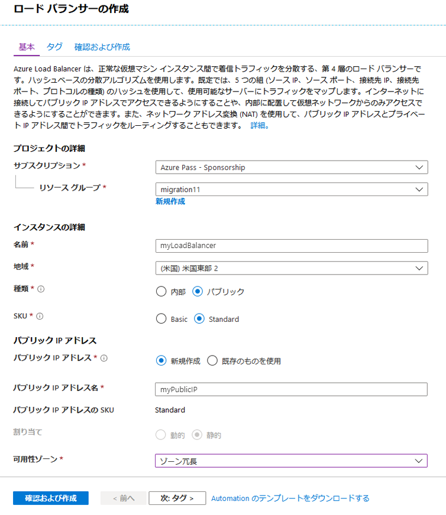

1.  検証画面で **作成** をクリックします。

### タスク 2：仮想ネットワークを作成する

1.  画面の左上で **リソースを作成する** > **ネットワーク** > **仮想ネットワーク** をクリックして、仮想ネットワークにこれらの値を入力します。
    - **myVnet** -  仮想ネットワークの名前用。
    - **10.0.0.0/16** -  アドレス空間用
    - **myResourceGroupLB** -  既存のリソース グループの名前用
    - **myBackendSubnet** -  サブネット名用。
    - **10.0.0.0/24** -  サブネットアドレス範囲用
    </br>

2.  **作成** をクリックして、仮想ネットワークを作成します。

     

### タスク 3：仮想マシンを作成する

1.  画面の左上で、**リソースを作成する** > **計算** > **仮想マシン** をクリックして、仮想マシンにこれらの値を入力します。
          
    - **リソース グループ** に **myResourceGroupLB** -  を入力し、ドロップダウン メニューから *myResourceGroupLB* を選択します。
    - **myVM1** -  仮想マシンの名前用。  
    - **イメージ** -  Windows Server 2019 Datacenter。
    - **Localadmin** -  **ユーザー名** 用
    - **Pa55w.rd1234** -  **パスワード** 用
    - **HTTP（80）およびRDP（3389）** -  受信ポート規則用。
</br>

     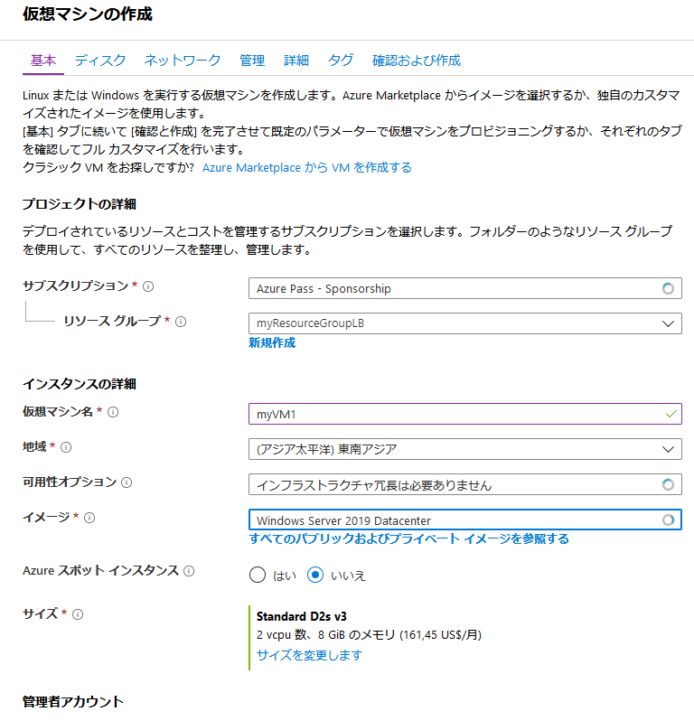

1.  [ネットワーク] タブをクリックし、[パブリックIP] で **新規作成** をクリックします。  IP アドレスに **myPIP1** と名前を付け、**Standard SKU** をクリックしてから、**OK** をクリックします。

    **注記**：ここで Standard SKU を選択しないと、ラボで後から問題が発生します。


     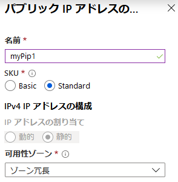

2.  **管理** タブを選択して、すべてのラジオボタンが **いいえ** または **オフ** となっていることを確認します。

1.  **「確認および作成」** をクリックしてから、**「作成」** をクリックします。

7.  上記の手順を繰り返して、新しいパブリック IP アドレスに _**myPIP2**_ を使用して、***myVM2*** という 2 番目の VM を作成します。 
 
### タスク 4：IIS をインストールする

1.  左側のメニューで **すべてのリソース** をクリックして、リソース リストから *myResourceGroupLB* リソース グループにある **myVM1** をクリックします。

2.  **概要** ページで、RDP への **接続** をクリックして、VM に接続します。
3.  ユーザー名で *localadmin* VM にログインします。
4.  PowerShell を開き、次のコマンドを実行して IIS をインストールします。

     ```powershell
    Install-WindowsFeature Web-Server
     ```

7.  仮想マシン *myVM2* に対して手順 1 ? 4 を繰り返します。 

### タスク 5：ロード バランサー リソースを作成する


このセクションでは、バックエンド アドレス プールと正常性プローブのロード バランサー設定を構成し、ロード バランサー規則を指定します。

VM にトラフィックを分散するために、バックエンド アドレス プールには、ロード バランサーに接続されている仮想 NIC の IP アドレスが含まれます。バックエンド アドレス プール *myBackendPool* を作成し、*VM1* と *VM2* を含めます。


1.  左側のメニューで、**すべてのリソース** をクリックしてから、リソース リストから **myLoadBalancer** をクリックします。

2.  **設定** で、**バックエンド プール** をクリックしてから、**追加** をクリックします。

     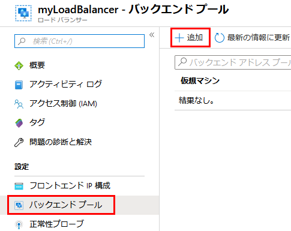

3.  **バックエンド プールを追加する** ページで、次の操作を行います。
   - バックエンド プールの名前として、*myBackendPool* を入力します。
   - **仮想ネットワーク** については、*myVNet* を選択します。
   - *myVM1* と *my VM2* を対応する IP アドレスとともに、**仮想マシン** に追加してから、**追加** を選択します。
 </br>
 
     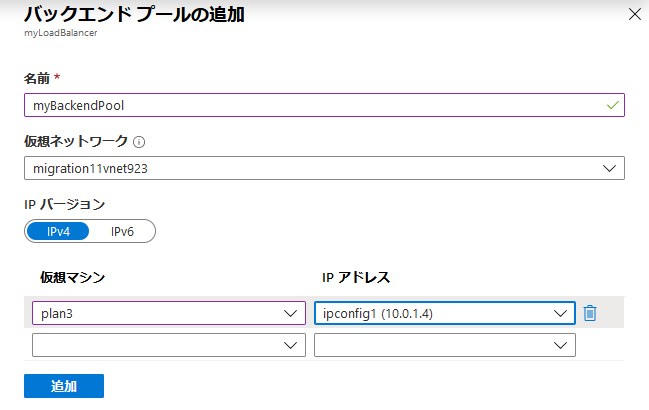

3.  ロード バランサーのバックエンド プール設定で **VM1** と **VM2** の両方を表示していることを確認してください。

     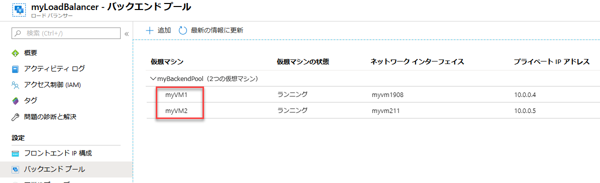

### タスク 6：正常性プローブを作成する


ロード バランサーでアプリの状態を監視するには、正常性プローブを使用します。正常性プローブは、正常性チェックへの応答に基づいて、ロード バランサーの回転から VM を動的に追加または削除します。正常性プローブ *myHealthProbe* を作成し、VMの正常性を監視します。


1.  ロード バランサー ブレードの **設定** で、**正常性プローブ** をクリックしてから、**追加** をクリックします。

     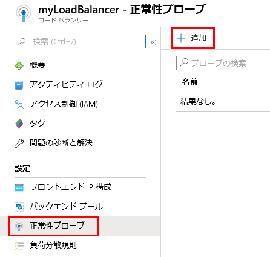

3.  これらの値を使用して、正常性プローブを作成します。
    - 正常性 probe 名の *myHealthProbe* - 。
    - **HTTP** -  プロトコル タイプ用。
    - ポート番号 *80* - 。
    - */* -  URI パス用。 
    - *15* -  プローブ試行間の秒単位での **サイクル間隔**。
    - *2* - **異常なしきい値** または、VM が異常と見なされる前に発生する連続的なプローブ障害の数。
</br>
 
     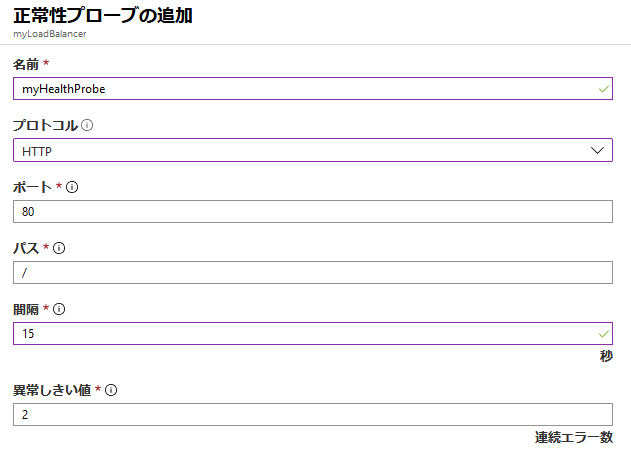


4.  **OK** をクリックします。


### タスク 7：ロード バランサー規則を作成する


ロード バランサー規則は、VM へのトラフィックの分散方法を定義するために使用されます。受信トラフィック用のフロントエンド IP 構成と、トラフィックを受信するためのバックエンド IP プールを、必要な発信元ポートと宛先ポートと共に定義します。フロントエンド *FrontendLoadBalancer* のポート 80 をリッスンし、ポート 80 も使用してバックエンド アドレス プール *myBackEndPool* に負荷分散ネットワーク トラフィックを送信する負荷分散ルール *myLoadBalancerRuleWeb* を作成します。 


1.  ロードバランサー ブレードで、**設定** で、**負荷分散ルール**、**追加する** の順にクリックします。

     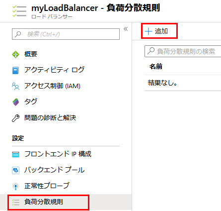


3.  これらの値を使用して、負荷分散ルールを構成します。
    - *myHTTPRule* - 負荷分散ルールの名前用。
    - **TCP** - プロトコル タイプ用。
    - *80* - ポート番号用。
    - *80* - バックエンドポート用。
    - *myBackendPool* - バックエンドプールの名前用。
    - 正常性 probe 名の *myHealthProbe* - 。
    </br>
    
      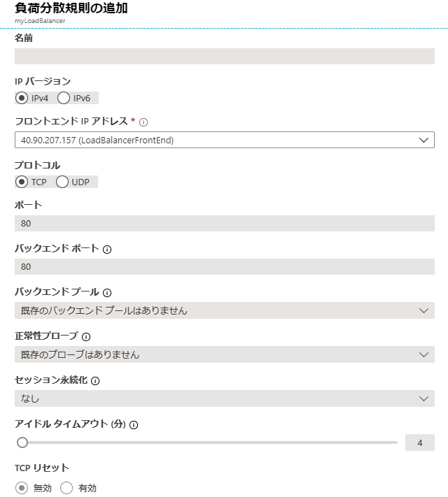
    
4.  **OK** をクリックします。
    
### タスク 8：ロード バランサーをテストする

1.  **概要** 画面で、ロードバランサーのパブリック IP アドレスを検索します。

     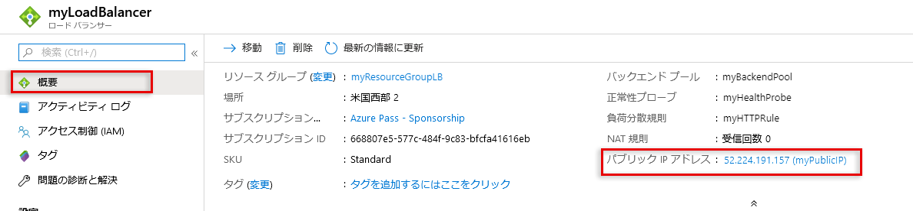
  
2.  パブリック IP アドレスをコピーして、ブラウザーのアドレスバーに貼り付けます。IIS Web サーバーのデフォルトページがブラウザに表示されます。

     

1.  IIS のデフォルトページがロードされることに注意してください。

1.  Azure Portal で、ハブメニューにある **仮想マシン** をクリックします。  myVM1 を選択し、**概要** ブレードで、**停止** をクリックして、**はい** を確定します。

     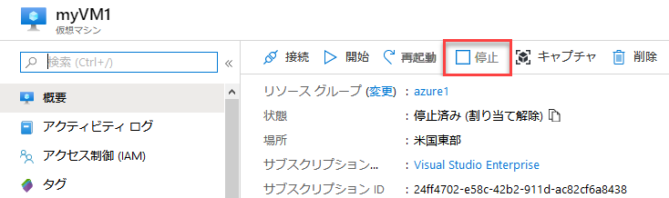
 
1.  myVM1 仮想マシンが停止するまで待ってから、ロード バランサーのパブリック IP を使用してブラウザータブに戻り、[更新] をクリックして、myVM2 がリクエストを処理し続け、ロードバランサーが期待どおりに機能していることを確認します。

## 演習 2：  ロード バランサー ARM デプロイメント

### タスク 1：ARM テンプレートをデプロイする 


このテンプレートを使用すると、ロード バランサーの下に 2 台の仮想マシンを作成し、ポート 80 にロード バランシング ルールを構成できます。このテンプレートは、ストレージ アカウント、仮想ネットワーク、パブリック IP アドレス、可用性セット、およびネットワーク インターフェイスもデプロイします。このテンプレートでは、リソースループ機能を使用して、ネットワークインターフェイスと仮想マシンを作成します


1.  ブラウザの新しいタブで、次のURL **「https：//aka.gd/2E2MAjh」** に移動する

1.  **Azure にデプロイする** をクリックします

     

1.  開いたテンプレート ブレードで、次の詳細を入力します。

      - リソース グループ：  **myResourceGroupLB**
      - 管理者ユーザー名：  **localadmin**
      - 管理者のパスワード：  **Pa55w.rd1234**

1.  **同意する....** をクリックし、**購入** をクリックします。
# 演習 3：Application Gateway のデプロイ

### タスク 1：アプリケーション ゲートウェイを作成する


作成するリソース間の通信には、仮想ネットワークが必要です。この例では、2 つのサブネットが作成されます。1 つはアプリケーションゲートウェイ用で、もう 1 つはバックエンドサーバー用です。アプリケーションゲートウェイの作成と同時に仮想ネットワークを作成できます。


1.  最初に、Application Gateway が常駐するサブネットを作成する必要があります。ハブメニューで **仮想ネットワーク** をクリックして、**myVNet** を選択します。

     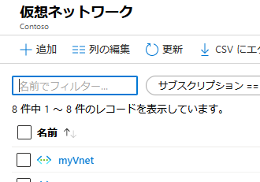
 
1.  **サブネット** をクリックし、**+ サブネット** をクリックします。

     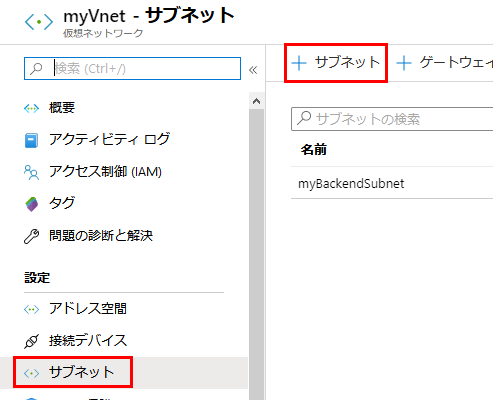
 
1.  **myAppGWSubnet** を名前として入力し、**OK** をクリックします。

     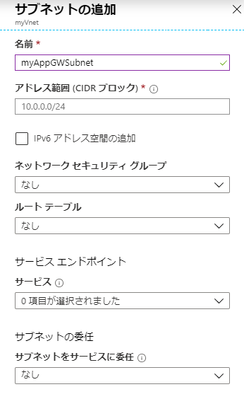

1.  Azure portal の左上隅にある **リソースの作成** をクリックします。

2.  **ネットワーク** をクリックしてから、注目リストで **Application Gateway** をクリックします。

     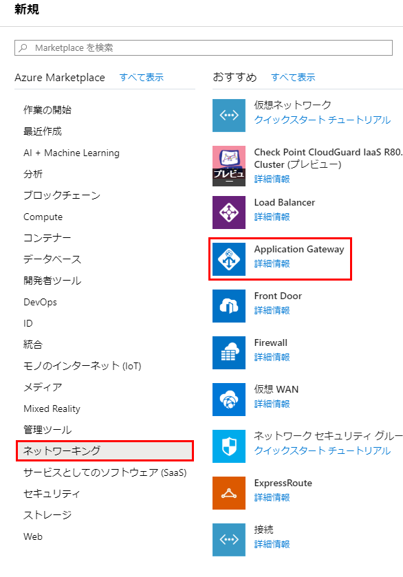

1.  アプリケーション ゲートウェイの基本ブレードにこれらの値を入力し、アプリケーション テーマの名前として **次**：

    - *myAppGateway* -  をクリックします。
    - *myResourceGroupLB* -  既存のリソース グループを選択します。
    - *myVnet* -  既存の仮想ネットワークを選択します。
</br>
    
        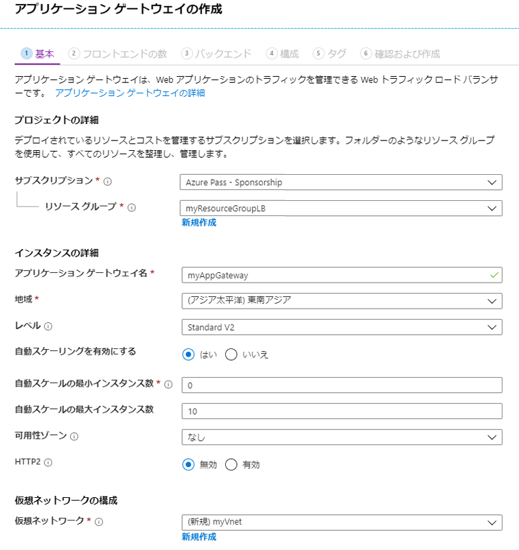

7.  **フロント エンド構成** ブレードで、**IP アドレスの種類** が **パブリック** に設定されていることを確認し、**パブリック IP アドレス** で、**新規作成** をクリックします。パブリック IP アドレス名に ***myAGPublicIPAddress*** と入力してから、**OK** をクリックします。

     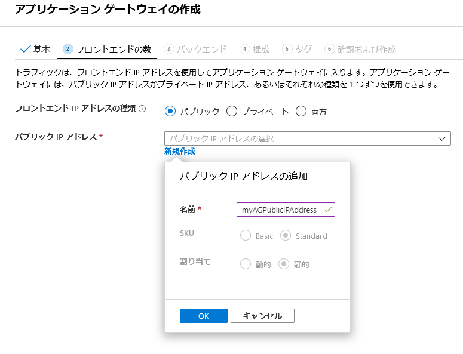
 
1. **次へ** をクリックします。

1. **+ バックエンド プールを追加する** を選択します。

1. 名前に **appGatewayBackendPool** と入力します。  バックエンド ターゲットで **仮想マシン** を選択し、myVM1 および myVM2 仮想マシンとそれらに関連付けられたネットワーク インターフェイスを追加し、**追加** をクリックします。

     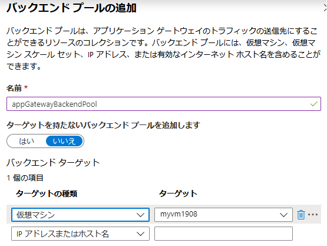

1. **次へ** をクリックします。

1. **構成** タブで、ルーティング規則を使用して作成したフロントエンド プールとバックエンド プールを接続します。

1. **ルーティング規則** 列の **ルールを追加する** を選択します。

2. **ルーティング規則を追加する** ウィンドウが開いたら、**ルール名** に *myRoutingRule* と入力します。

3. ルーティング規則にはリスナーが必要です。**ルーティングルールを追加する** ウィンドウ内の **リスナー** タブで、リスナーに次の値を入力します。

    - **リスナー名**：リスナーの名前に *myListener* と入力します。
    - **フロントエンド IP**：**パブリック** を選択し、フロントエンド用に作成したパブリック IP を選択します。
  
      **リスナー** タブのその他の設定に規定値を受け入れたら、**バックエンド ターゲット** タブをクリックして、残りのルーティング規則を設定します。

       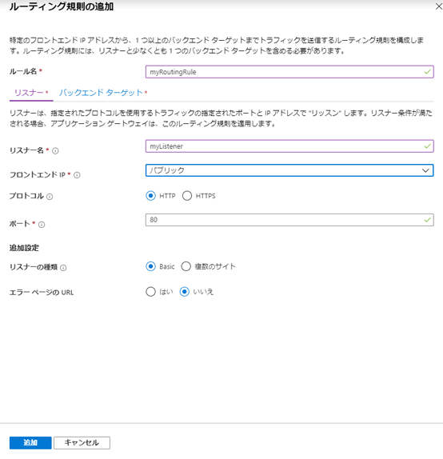

4. **バックエンド ターゲット** タブで、**バックエンドターゲット** に **myBackendPool** を選択します。

5. **HTTP 設定** については、**新規作成** を選択して、新しい HTTP 設定を作成します。HTTP 設定により、ルーティング規則の動作が決まります。**HTTP 設定を追加する** ウィンドウが開いたら、**HTTP 設定名** に *myHTTPSetting* と入力します。**HTTP 設定を追加する** ウィンドウの他の設定に規定値を受け入れてから、**追加** を選択して、**ルーティングルールを追加する** ウィンドウズに戻ります。 


    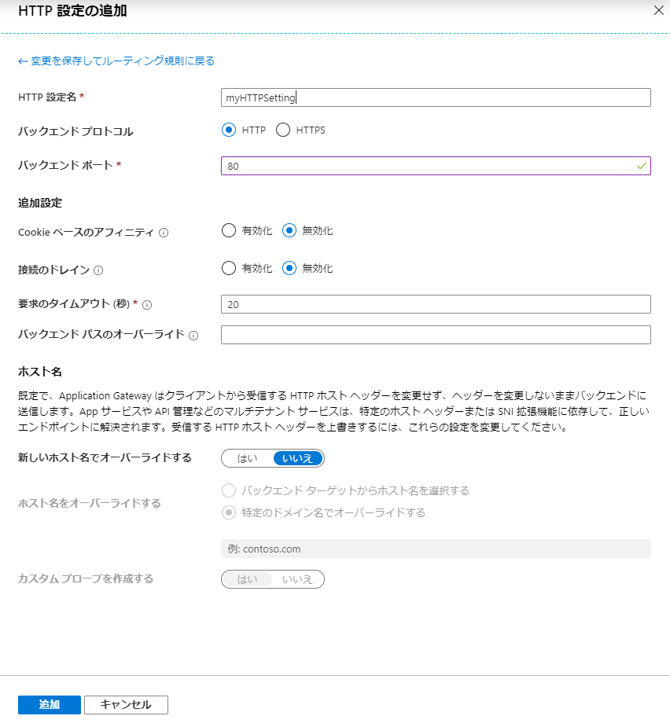

6. **ルーティングルールを追加する** ウィンドウで、**追加** を選択して、ルーティング規則を保存して、**構成** タブに戻ります。

      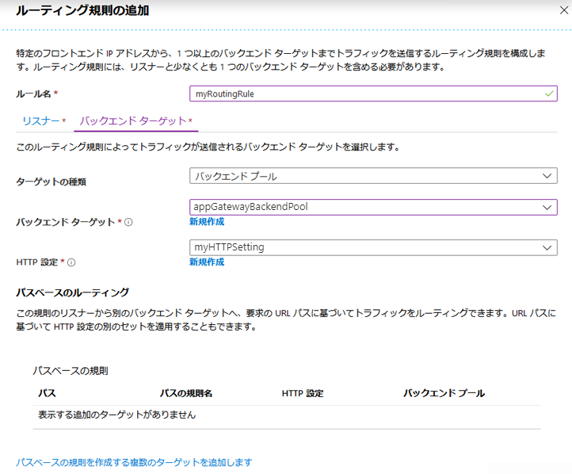

7. **次へ：** **タグ** を選択し、**次へ：「確認および作成」** を選択します。


### タスク 2：アプリケーション ゲートウェイをテストする

1.  [概要] 画面でアプリケーション ゲートウェイのパブリック IP アドレスを見つけます。**すべてのリソース** をクリックしてから、**myAGPublicIPAddress** をクリックします。

     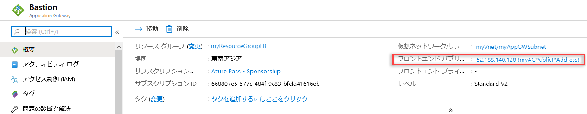
 
2.  パブリック IP アドレスをコピーして、ブラウザーのアドレスバーに貼り付けます。

     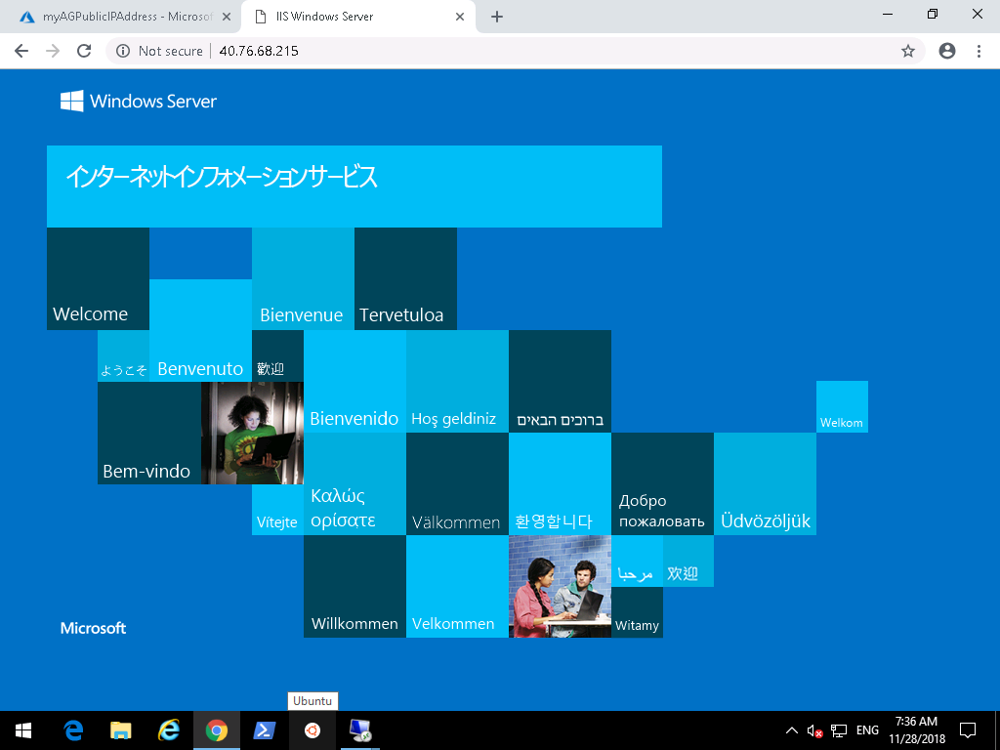


| 警告：続行する前に、このラボで使用したすべてのリソースを削除する必要があります。  **Azure Portal** でこれを行うには、**リソース グループ** をクリックします。  作成したリソース グループを選択します。  リソース グループ ブレードで、**リソース グループを削除** をクリックし、リソース グループ名を入力して、**削除** をクリックします。  作成した可能性のある追加のリソース グループに対してプロセスを繰り返します。**これを行わないと、他のラボで問題が発生する可能性があります。** |
| --- |
**結果**：これで、このラボを完了しました。
