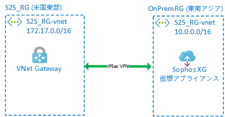
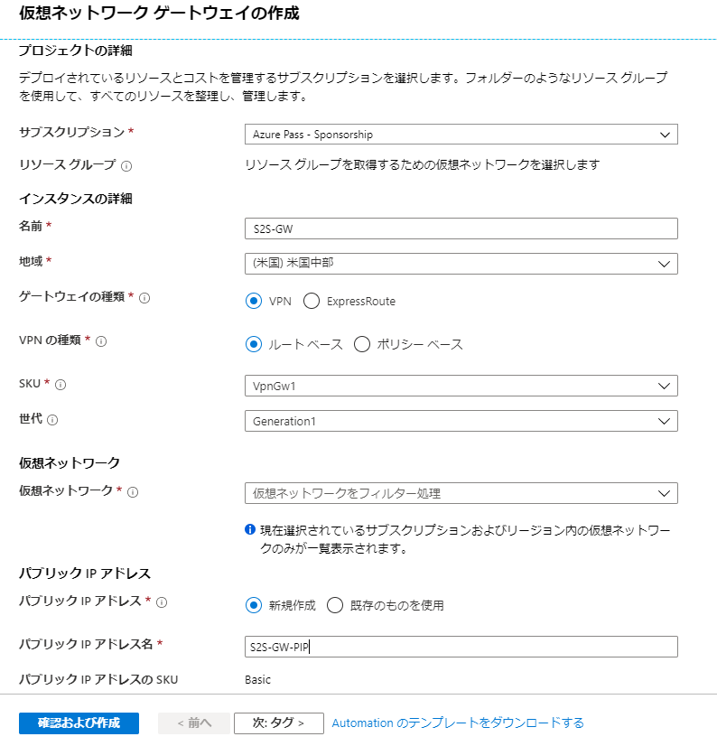
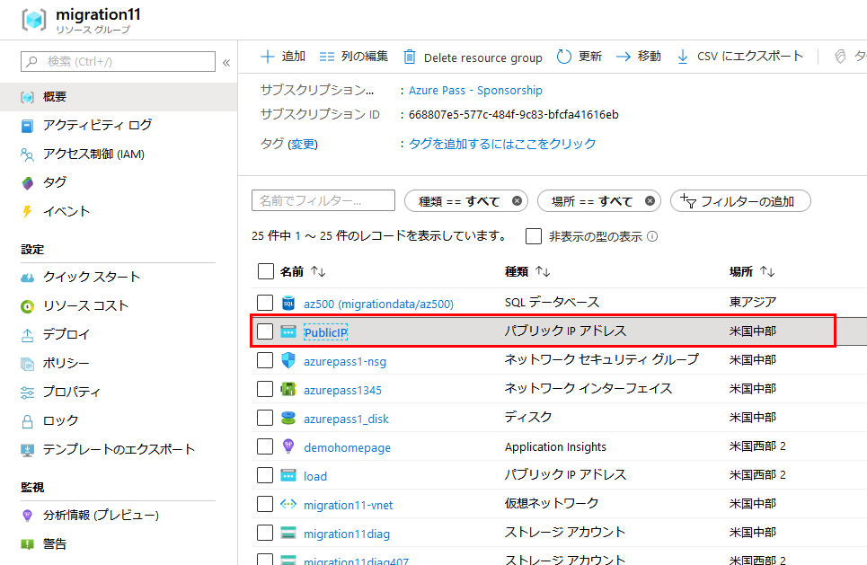
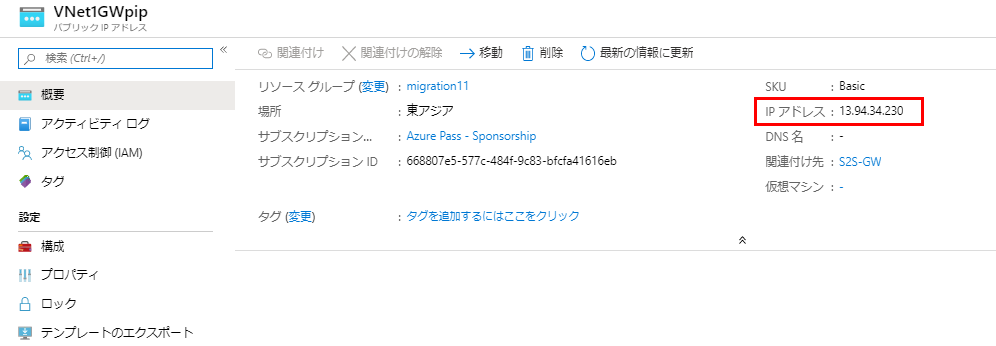
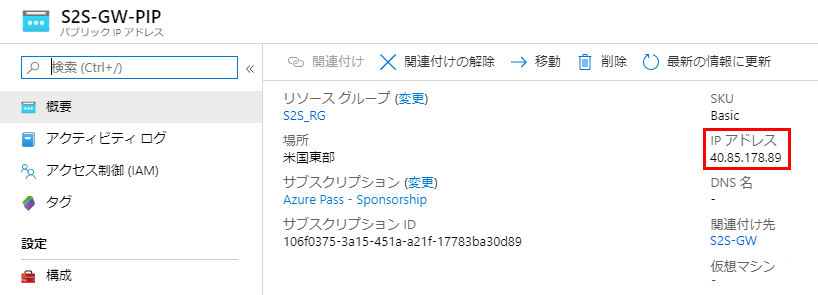
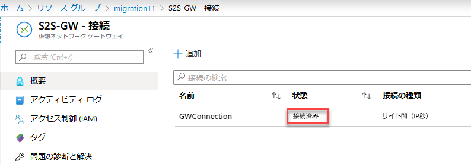

---
lab:
    title: 'ラボ 11 - オンプレミスから Azure への接続 - VPN Gateways とトンネリング'
    module: 'モジュール 2 - プラットフォーム保護を実装する'
---

# モジュール 2：ラボ 11: オンプレミスから Azure への接続 - VPN Gateways とトンネリング

## 演習 1：サイト間接続性のため、仮想アプライアンスとゲートウェイをデプロイします。

### タスク 1：仮想アプライアンスをデプロイします。


このタスクでは、オンプレミス デバイスをエミュレートする Sophos XG Virtual Appliance を作成します。  このレイアウトは、以下のダイアグラムに描かれています

   

1.  PowerShell を開いて、次のコマンドを実行します。

     ```powershell
    start "https://portal.azure.com/#create/Microsoft.Template/uri/https%3A%2F%2Fraw.githubusercontent.com%2FMicrosoftLearning%2FAZ-500-Azure-Security%2Fmaster%2FAllfiles%2FLabs%2FMod2_Lab11%2Ftemplate.json"
     ```
 
2.  必要に応じてポータルにログインします。

3.  カスタム デプロイで、次の詳細を入力または選択します。

 | 設定 | 値 |
 |---|---|
 | リソース グループ | _新規作成_ **OnPremRG** |
 | 保存先 | **東南アジア** |
 | 管理者のパスワード | **Pa55w.rd1234** |
 | パブリック IP DNS | _一意の名前を入力する_ |
 | ストレージ名 | _一意の名前を入力する_ |
 
4.  ブレードの一番下までスクロールし、「契約条件に同意します.....」の横にあるチェックボックスをクリックして、**購入** をクリックします。 
 
### タスク 2：リソース グループと VNet を作成する


このタスクでは、エミュレートされたオンプレミス環境への接続に使用される新しいリソース グループ内に仮想マシンと仮想ネットワークを作成します。


1.  Azure Portal **「https：//portal.azure.com」** にログインします

1.  **リソースを作成する** > **ネットワーク** > **仮想ネットワーク** をクリックします

1.  **仮想ネットワークを作成する** ブレードの値を変更し、以下の出力と同じになるように値を変更します。

      - **名前** S2S_RG-vnet
      - **アドレス空間** 172.17.0.0/16
      - **リソース グループ** 新規作成：S2S_RG
      - **保存先**: 米国東部
      - **サブネットアドレス範囲** 172.17.0.0/24

1.  **作成** をクリックします。
**注記：**  デプロイが完了するのを待たずに、次のタスクに進むことができます。


### タスク 2：ゲートウェイ サブネットと仮想ネットワーク ゲートウェイを作成します。


このタスクでは、ゲートウェイ サブネットと仮想ネットワーク ゲートウェイを作成します。これにより、オンプレミスと Azure VNet 間の接続を行うことができます。


1.  Azure Portal で、ハブメニューの **リソース グループ** をクリックします。
 
1.  あなたのために作成された **S2S_RG** リソース グループをクリックします。

1.  S2S_RG リソース グループ ブレードで、**S2S_RG-vnet** をクリックします。

1.  **S2S_RG-vnet** メニューで、**サブネット** をクリックします。

1.  **+ ゲートウェイ サブネット** をクリックします。  

    **注記：** Gateway マシンを配置するには、Gateway サブネットを作成する必要があります。すべてのルーティングは、Azure Software Defined Networking によって行われます。


1.  **サブネットを追加** ブレードにあるオプションをデフォルトのままにして、**OK** をクリックします。

1.  **+ リソースの作成** をクリックします。

1.  Virtual Network Gateway を検索して、**仮想ネットワークゲートウェイ** 選択します。

1.  **作成** をクリックします。

1.  **仮想ネットワークゲートウェイを作成する** ブレードで、次の情報を入力します。

      - **名前**: S2S-GW
      - **名前**: （米国）米国東部
      - **ゲートウェイ タイプ**：VPN
      - **VPN タイプ**：ルートに基づいて
      - **SKU**：ベーシック
      - **仮想ネットワーク**: S2S_RG-vnet を選択します（これは VM を展開したときに作成されたものです）
      - **パブリック IP アドレス**: （新規作成） 名前：S2S-GW-PIP


     

1.  **「確認および作成」** をクリックしてから、要約画面で **「作成」** をクリックします。

**注記：**  ただし、ゲートウェイの展開には最大 45 分かかる場合があります。ほとんどの場合、はるかに高速です。  ベルのアイコンをクリックすることで、これを監視します。ゲートウェイのデプロイ中に次のタスクに進むことができます。


### タスク 3：Sophos 仮想アプライアンスを構成する

1.  Azure Portal Hub メニューで、**リソース グループ** をクリックします。

1.  **OnPremRG** リソース グループを選択します。

1.  **PublicIP** リソースを選択します。

     

1.  割り当てられたパブリック IP アドレスを書き留めます。

     

1.  新しいブラウザセッションを開いて、**「https：//xxxx：4444」** （ここで、x.x.x.x は上記のパブリック IP アドレスです）に移動します。

1.  ご使用のブラウザに応じて、接続を続行するためのさまざまなオプションがある場合があります。

     

1.  次の資格情報でファイアウォールにログインします。

      - 管理者
      - Pa55w.rd1234
 
1.  ライセンス契約に同意します。

1.  ファイアウォールの登録ページで **シリアル番号がありません（試用を開始します）** をクリックし、**今すぐ登録したくない** を選択してから **続行** をクリックします。

     

1.  警告ポップアップで **続行** をクリックします。

1.  Azure Portal に戻ります。  **S2S_RG** リソース グループを開き、**S2S-GW-PIP** パブリック IP を書き留めてください。

    **注記**：これは、IPSec VPN を介して Sophos 仮想アプライアンスに接続するパブリック IP です。


     
 
1.  Sophos Portal に戻ります。

1.  **VPN> IPsec 接続** に移動し、[**追加**] を選択し、次の設定を構成します。

    **一般設定セクション：**

      - **名前**: On_Prem_to_Azure
      - **IP バージョン**： IPv4.
      - **保存時に有効化**： 選択済み。
      - **ファイアウォール ルールを作成する**： 選択済み。
      - **説明**： On Prem から Azure VNet へのサイト間接続。
      - **接続の種類**： サイト間。
      - **ゲートウェイ タイプ**： 応答のみ。

     

    **暗号化セクション**：

      - **ポリシー**：Microsoft Azure。
      - **認証タイプ**：事前共有キー。
      - **事前共有キー**：123456789
      - **事前共有キーを繰り返す**：123456789

     

    **ゲートウェイ設定セクション**：

      - **リスニング インターフェイス**：既定のままにします。
      - **ゲートウェイ アドレス**：前述の Azure VPN ゲートウェイのパブリック IP を入力します。
      - **ローカル ID**：IPアドレス
      - **リモートID**：IPアドレス
      - **ローカル ID**：オンプレミスの Sophos XG Firewall のパブリック IP を入力します。
      - **リモートID**：前にメモした Azure VPN ゲートウェイのパブリック IP を入力します。
      - **ローカルサブネット**：10.0.0.0/16（255.255.0.0）のローカルサブネットを入力します


      

      - **リモートサブネット**：リモートサブネット172.17.0.0/16（255.255.0.0）を入力します
</br>

        

1.  **詳細**：デフォルト設定のままにします。

1.  **保存** をクリックすると、IPsec 接続がアクティブになります。

**注記**：**接続** 列のボタンをクリックしないでください。IPsec 接続で設定された構成設定を上書きしてしまいます（**ゲートウェイタイプ：応答のみ**）。これは、Azure がトンネルを開始する必要があるため、問題を回避するためです。


### タスク 4：Azure 接続の作成。


このタスクでは、Azure Gateway でオンプレミス ファイアウォールへの接続を作成し、接続を確立します。


1.  **ハブメニュー** の **リソース グループ** をクリックします。

2.  **S2S_RG** リソース グループを選択します。 
 
1.  **S2S-GW** ゲートウェイを選択します。 

1.  S2S-GW メニューから **接続** をクリックします。

1.  **追加** をクリックします。

1.  **接続を追加** ブレードで次の情報を入力します。

      - **名前:** GWConnection
      - **接続タイプ：** サイト間 (IPSec)
      - **仮想ネットワーク ゲートウェイ** S2S-GW

1.  **ローカル ネットワーク ゲートウェイ** をクリックします

1.  **新規作成** をクリックします。

1.  次の情報を **ローカルネットワークゲートウェイを作成する** ブレードに入力します。

      - **名前:** OnPremGW
      - **IP アドレス：**_以前に記録した Sophos オンプレミス ファイアウォールの IP アドレスを入力する_
      - **アドレス空間：** 10.0.0.0/16  _（注意：  これは、オンプレミスサーバーの IP 範囲です）_

 
1.  **OK** をクリックします。

2.  **共有キー（PSK）** ボックスに「123456789」と入力してから、**OK** をクリックします。

    **注記：**  このキーはこのラボ専用です。  現実の世界では、より複雑なものを使用します。


1.  ページを更新すると、接続が確立されるはずです。

    **注記：**  接続の確立には30秒かかる場合があります。

 
     


| 警告：続行する前に、このラボで使用したすべてのリソースを削除する必要があります。  **Azure Portal** でこれを行うには、**リソース グループ** をクリックします。  作成したリソース グループを選択します。  リソース グループ ブレードで、**リソース グループを削除**をクリックし、リソース グループ名を入力して、**削除** をクリックします。  作成した可能性のある追加のリソース グループに対してプロセスを繰り返します。**これを行わないと、他のラボで問題が発生する可能性があります。** |
| --- |  


**結果**：これで、このラボを完了しました。
