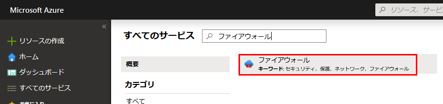
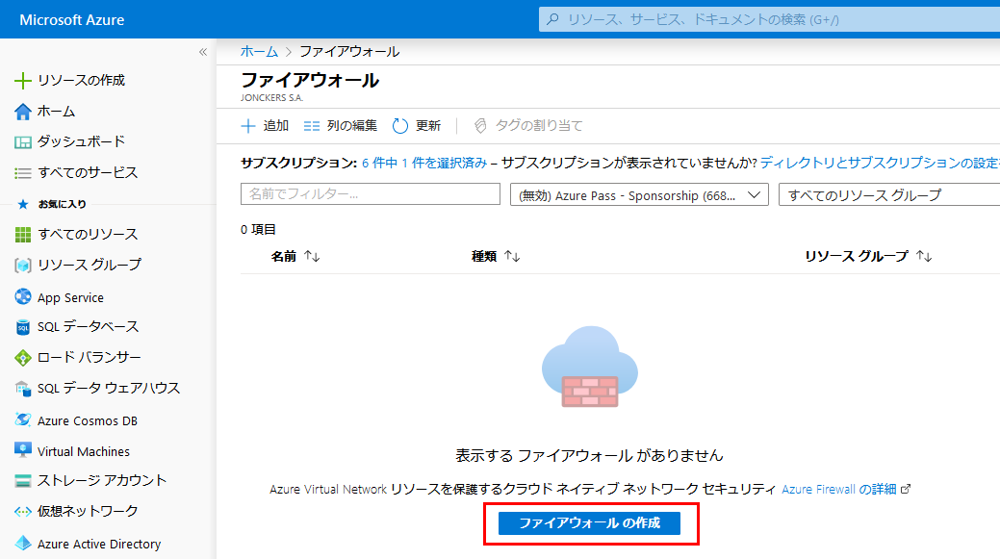
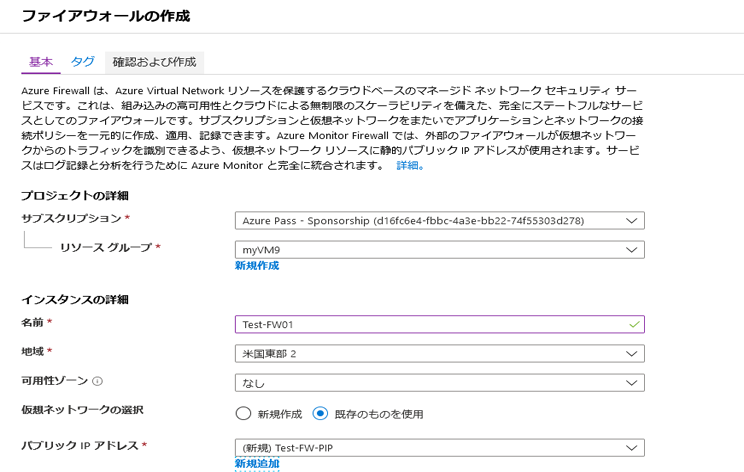
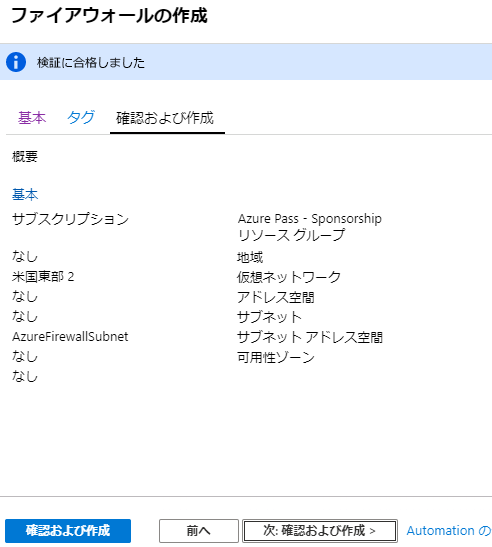

---
lab:
    title: 'ラボ 12 - Azure Firewall'
    module: 'モジュール 2 - プラットフォーム保護を実装する'
---

# モジュール 2：ラボ 12 - Azure Firewall


**シナリオ**

送信ネットワーク アクセスを制御することは、ネットワーク セキュリティ プラン全体の重要な要素です。たとえば、Web サイトへのアクセスを制限することができます。また、アクセスできる送信 IP アドレスとポートを制限することもできます。

Azure サブネットからの送信ネットワーク アクセスを制御する方法の 1 つとして、Azure Firewall の使用が挙げられます。Azure Firewall を使用して、次のルールを構成できます。

* サブネットからアクセスできる完全修飾ドメイン名（FQDN）を定義するアプリケーション規則です。
* 送信元アドレス、プロトコル、宛先ポート、宛先アドレスを定義するネットワーク規則です。

ネットワーク トラフィックは、サブネットの既定ゲートウェイとしてのファイアウォールにルーティングしたときに、構成されているファイアウォール ルールに制約されます。

## 演習 1：Azure Firewall をデプロイする

### タスク 1：ラボの設定

1.  Powershell を開き、次の Powershell コマンドを実行して、このラボ全体で使用されるリソースをデプロイする ARM テンプレートを開きます。  _プロンプトが表示されたら、選択するブラウザーとして Chrome を選択します。_

     ```powershell
    start "https://portal.azure.com/#create/Microsoft.Template/uri/ https%3A%2F%2Fraw.githubusercontent. com%2FGoDeploy%2FAZ500%2Fmaster%2FAZ500%20Mod2%20Lab%207%2Ftemplate.json"
     ```
 
2.  リソース グループで **新規作成** をクリックして、**Test-FW-RG** のリソース グループ名を使用します。  

3.  **米国東部** の場所を選択する  

4.  他のすべてのフィールドは事前設定されたデフォルトのままにする

5.  [同意します...] チェックボックスを選択して、**購入** をクリックして、デプロイが完了するまで待ちます。

    このラボ セットアップ テンプレートは、ラボ用に次のリソースをセットアップします。

 |名前     |タイプ     | 保存先|
 |---------|---------|---------|
azureFirewalls-ip|	パブリック IP アドレス|	米国東部	
Firewall-route |	ルート テーブル|	米国東部	
Srv-Jump|	仮想マシン|	米国東部	
Srv-Jump_OsDisk|	Disk|	米国東部	
srv-jump121	|ネットワーク インターフェイス|	米国東部	
Srv-Jump-nsg|	ネットワーク セキュリティ グループ|	米国東部	
Srv-Jump-PIP|	パブリック IP アドレス|	米国東部	
Srv-Work|	仮想マシン|	米国東部	
Srv-Work_OsDisk_1 |	Disk|	米国東部	
srv-work267|	ネットワーク インターフェイス|	米国東部	
Srv-Work-nsg|	ネットワーク セキュリティ グループ|	米国東部	
Test-FW-VN|	仮想ネットワーク|	米国東部


### タスク 2：ファイアウォールをデプロイする


このタスクでは、Azure Firewall を VNet にデプロイします。


1.  Azure portal で、**すべてのサービス** をクリックし、**Azure Firewall** を検索して選択します。

     

3.  **Firewall** ブレードで、**ファイアウォールを作成する** をクリックします。 

     

4.  **ファイアウォールを作成する** ブレードで、次のテーブルを使用してファイアウォールを構成します。

   |設定  |値  |
   |---------|---------|
   |サブスクリプション     |_your subscription_|
   |リソース グループ     |**既存の使用**： Test-FW-RG |
   |名前     |Test-FW01|
   |保存先     |米国東部|
   |仮想ネットワークを選択する     |**既存の使用**：Test-FW-VN|
   |パブリック IP アドレス     |**新規作成**。**TEST-FW-PIP** パブリック IP アドレスは Standard SKU タイプである必要があります。|
   
   

5.  **レビュー + 作成** をクリックします。
6.  要約をレビューしてから、**作成** をクリックして、ファイアウォールを作成します。

     

    このデプロイには数分かかります。

7.  展開が完了したら、 **Test-FW-RG** リソース グループに移動し、 **Test-FW01** ファイアウォールをクリックします。

8.  **プライベート IP** アドレスをメモします。後でデフォルト ルートを作成するときに使用します。

     

### タスク 3：デフォルト ルートを作成する


**ワークロード-SN** サブネットについては、ファイアウォールを通過する送信デフォルト ルートを設定します。


1.  Azure portal のホーム ページから、**すべてのサービス** をクリックします。
2.  **ネットワーク** で、**ルート テーブル** をクリックします。
3.  **追加** をクリックします。
4.  **名前** については、**ファイアウォール ルート** を入力します。
5.  **サブスクリプション** で、 自分のサブスクリプションを選択します
6.  **リソース グループ** については、**既存の使用** を選択し、**Test-FW-RG** を選択します。
7.  **場所** については、**米国東部** を選択します。
8.  **作成** をクリックします。
9.  **更新** をクリックしてから、**ファイアウォール ルート** のルートテーブルをクリックします。
10.  **サブネット** > **アソシエイト** をクリックします。
11.  **仮想ネットワーク** > **Test-FW-VN** をクリックします。
12.  **サブネット** については、**ワークロード-SN** をクリックします。このルートには **ワークロード-SN** サブネットのみを選択していることを確認します。それ以外の場合には、ファイアウォールが正しく機能しません。

13.  **OK** をクリックします。
14.  **ルート** > **追加** をクリックします。
15.  **ルート名** については、**FW-DG** と入力します。
16.  **アドレス プレフィックス** については、**0.0.0.0/0** と入力する
17.  **ネクストホップタイプ** で、**仮想アプライアンス** を選択してください。

        Azure Firewall は実際にはマネージド サービスですが、この状況では仮想アプライアンスが機能します。

18.  **ネクスト ホップ アドレス** で、先ほどメモしたファイアウォールのプライベート IP アドレスを入力します。
19.  **OK** をクリックします。

### タスク 4：アプリケーション ルールを構成する


このタスクでは、「msn.com」への送信アクセスを許可するアプリケーションルールを作成します。


1.  **Test-FW-RG** リソース グループを開き、**Test-FW01** ファイアウォールをクリックします。

2.  **Test-FW01** ページで、**設定** セクションで、**ルール** をクリックします。
3.  **アプリケーション規則コレクション** タブをクリックします。
4.  **アプリケーション規則コレクションを追加する** をクリックします。
5.  **名前** については、**App-Coll01** と入力します。
6.  **優先度** については、**200** を入力します。
7.  **アクション** については、**許可** を選択します。
8.  **規則** では、**対象 FQDN** の **名前** として、**AllowGH** を入力します。
9.  **送信元アドレス** については、**10.0.2.0/24** を入力します。
10.  **プロトコル：ポート** については、**http、https** を入力します。
11.  **ターゲット FQDN** については、**msn.com** を入力します
12.  **追加** をクリックします。

 Azure Firewall には、既定で許可されているインフラストラクチャ FQDN のルールコレクションが組み込まれています。これらの FQDN はプラットフォーム固有のものであり、他の目的には使用できません。 

### タスク 5：ネットワーク規則を構成する


このタスクでは、ポート 53（DNS）の 2 つの IP アドレスへのアウトバウンドアクセスを許可するネットワーク規則を作成します。


1.  **ネットワーク規則コレクション** タブをクリックします。
2.  **ネットワーク規則コレクションを追加する** をクリックします。
3.  **名前** については、**Net-Coll01** と入力します。
4.  **優先度** については、**200** を入力します。
5.  **アクション** については、**許可** を選択します。

6.  **IP アドレス** セクションの **規則** で、 **名前** については **AllowDNS** と入力します。
7.  **プロトコル**で、**UDP** を選択します。
8.  **送信元アドレス** については、**10.0.2.0/24** を入力します。
9.  [宛先アドレス] については、**209.244.0.3,209.244.0.4** と入力する
10.  **宛先ポート** については、**53** と入力します。
11.  **追加** をクリックします。

### タスク 6：**Srv-Work**ネットワーク インターフェースに対してプライマリおよびセカンダリ DNS アドレスを変更します


このチュートリアルでテストを行うため、プライマリおよびセカンダリ DNS アドレスを構成します。これは一般的な Azure Firewall の要件ではありません。


1.  Azure portal から、**Test-FW-RG** リソース グループを開きます。

2.  **Srv-Work** 仮想マシンのネットワーク インターフェイスをクリックします。

3.  **設定** で、**DNS サーバー** をクリックします。

4.  **DNS サーバー** で、**カスタム** をクリックします。

5.  **209.244.0.3** を **DNS サーバーを追加** テキストボックスに入力し、次のテキストボックスに **209.244.0.4** と入力します。

6.  [**保存**] をクリックします。 

7.  **Srv-Work** 仮想マシンを再起動します。

### タスク 7：ファイアウォールをテストする


このタスクでは、ファイアウォールをテストして、期待どおりに機能することを確認します。


1.  Azure portal から、**Srv-Work** 仮想マシンのネットワーク設定をレビューし、プライベート IP アドレスを書き留めます。

2.  RDP を使用して **Srv-Jump** 仮想マシンに接続し、そこから、**Srv-Work** プライベート IP アドレスに対するリモートデスクトップ接続を開きます。

	-	**ユーザー名**：localadmin
    -	**パスワード**：Pa55w.rd1234
</br>
3.  Internet Explorer を開き、**「https：//msn.com」** を参照する

4.  セキュリティ アラートで、**OK** > **閉じる** をクリックします。

   MSN のホーム ページが表示されるはずです。

5.  **「Https：//www.msn.com」** を参照する

       - ファイアウォールでブロックされるはずです。
       - これで、ファイアウォール規則が機能していることを確認できました。
          - 許可された FQDN を参照できますが、他の FQDN は参照できません。
          - 設定された外部 DNS サーバーを使用して DNS 名を解決できます。


1. 次のラボのために、すべてのリソースを残しておきます。


**結果**：これで、このラボを完了しました。


