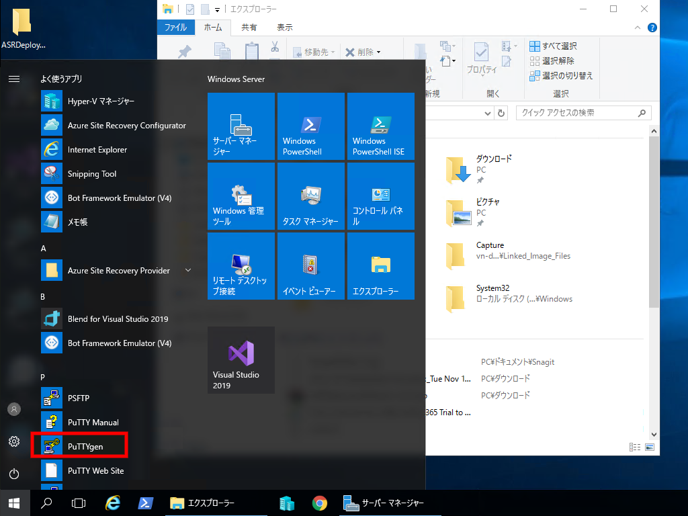
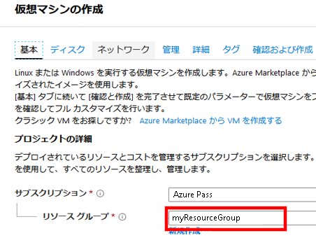
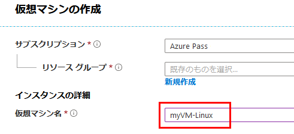
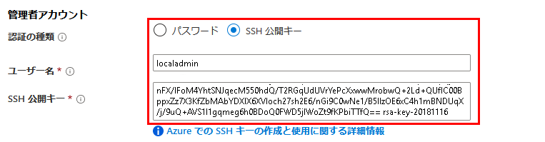
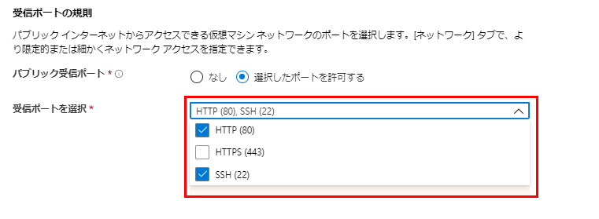
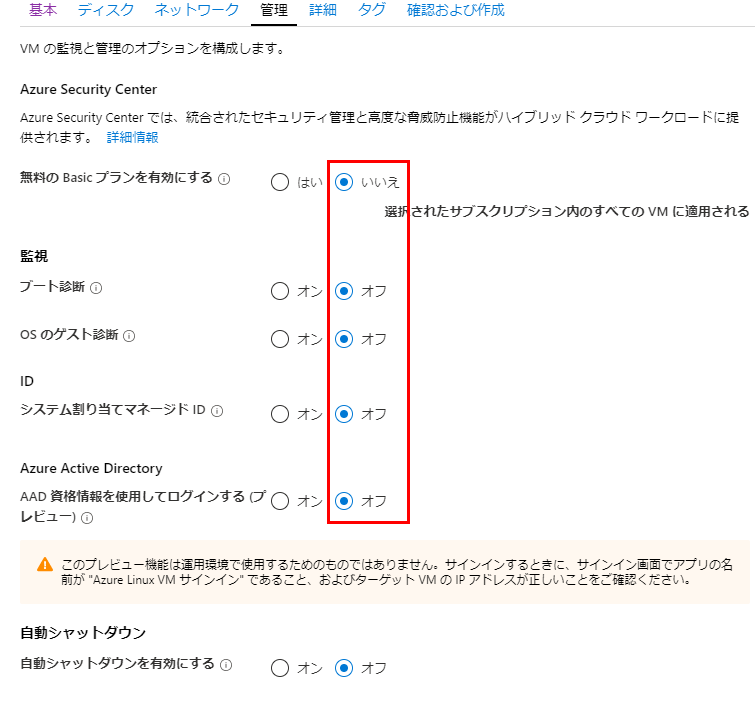
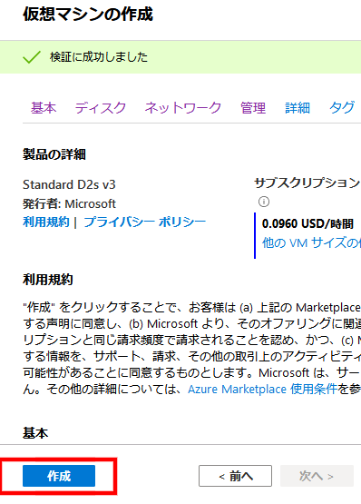
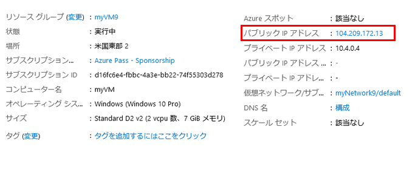
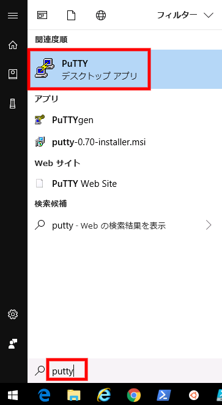

---
lab:
    title: 'ラボ 13 - 安全な管理者のアクセス'
    module: 'モジュール 2 - プラットフォーム保護を実装する'
---

# モジュール 2 - プラットフォーム保護を実装する

## ラボ 13 - 安全な管理者のアクセス 


SSH は、セキュリティ保護のない接続を経て安全にログインできるようにする暗号化された接続プロトコルです。SSH は、Azure でホストされている Linux VM のデフォルトの接続プロトコルです。SSH 自体は暗号化された接続を提供しますが、SSH 接続を持つパスワードを使用すると、VM はブルート フォース攻撃やパスワードの推測に対して脆いままです。SSH を使用して VM に接続するより安全で推奨される方法は、SSH キーとも呼ばれる公開キーと秘密キーのペアを使用することです。

- 公開キーは、Linux VM または公開キー暗号化で使用するその他のサービスに配置されます。

- ローカルシステムの秘密キーは、Linux VM に接続するときに、SSH クライアントが ID を確認するために使用します。この秘密キーを保護します。共有しないでください。

- 組織のセキュリティ ポリシーに応じて、単一の公開キーと秘密キーのペアを再利用して、複数の Azure VM とサービスにアクセスできます。アクセスする VM またはサービスごとに、個別のキーペアは要りません。

公開キーは誰とでも共有できますが、秘密キーを所有できるのは自分 (またはローカル セキュリティ インフラストラクチャ) だけです。

## 演習 1：Azure VM のデプロイと接続を安全に行います。

### タスク 1：PuTTYgen を使用して SSH キーを作成する

1.  ブラウザを開き、次のURLに移動します。

     ```cli
    http://www.chiark.greenend.org.uk/~sgtatham/putty/download.html 
     ```

1.  **Putty Installer** をダウンロードしてインストールします。

     

1.  **開始** をクリックして、**PuTTYgen** に移動します。

     

1.  生成をクリックします。デフォルトでは、PuTTYgen は 2048 ビットの SSH-2 RSA キーを生成します。

     

1.  空白領域でマウスを動かして、キーのランダム性を提供します。

     

1.  公開キーが生成されたら、オプションでパスフレーズを入力して確認します。プライベート SSH キーを使用して VMへ認証すると、パスフレーズの入力を求めるメッセージが表示されます。パスフレーズとして **Pa55w.rd1234** を入力します。

    パスフレーズがなければ、誰かがあなたの秘密キーを取得した場合、そのキーを使用する任意の VM またはサービスにサインインできてしまいます。パスフレーズを作成することをお勧めします。ただし、パスフレーズを忘れると、それを回復する方法はありません。


1.  公開キーはウィンドウの上部に表示されます。この公開キー全体をコピーして、Linux Vmを作成するときに Azure portal または Azure Resource Manager テンプレートに貼り付けることができます。マシン上の場所に公開キーを保存し、ファイルを **パブリック** として呼び出します。

     

2.  秘密キーを同じ場所に保存しますが、ファイル名を **プライベート** とします。

     
 
1.  上部のウィンドウから公開キーを強調表示してコピーします。

     

### タスク 2：Azure portal での Linux Virtual Machines を作成する

1.  **Azure Portal** に戻ります。

1.  Azure portal の左上隅にある **リソースの作成** を選択します。

1.  Azure Marketplace リソースの一覧の上にある検索ボックスに、Canonical で **Ubuntu Server 18.04 LTS** 選択し、**作成** を選択します。

1.  **プロジェクトの詳細** の **基本** タブで、正しいサブスクリプションが選択されていることを確認してから、**リソース グループ** *myResourceGroup* を選択します。 

     

1.  **インスタンスの詳細** で、**仮想マシン名** に *myVM-Linux* を入力し、**リージョン** として *米国東部* を選択します。他の既定値をそのままにします。
 
     

1.  **管理者アカウント** で、**SSH 公開キー** を選択し、ユーザー名 **localadmin** を入力し、公開キーをテキストボックスに貼り付けます。公開キーの先頭または末尾の空白を削除します。

       

1.  **受信ポートの規則** で、**選択したポートを許可します** を選択してから、ドロップダウンから **SSH (22)** と **HTTP** を選択します。 

    

1.  **管理** タブをクリックし、すべてのオプションに **いいえ** または **オフ** を選択します。

     

1.  残りの既定値をそのままにして、ページの下部にある　**確認および作成** ボタンを選択しまｓす。

1.  **仮想マシンを作成する** ページで、作成しようとしている VM の詳細を確認できます。準備ができたら、**作成** を選択します。

     
 

VM がデプロイされるまで数分かかります。デプロイが完了したら、次のセクションに進みます。 


### タスク 3：VM に接続する


Windows から Linux VM への SSH 接続を確立する 1 つの方法は、SSH クライアントを使用することです。これは、Windows システムに SSH クライアントがインストールされている場合、または Azure Cloud Shell の Bash で SSH ツールを使用する場合に推奨される方法です。GUI ベースのツールが必要な場合は、PuTTY で接続できます。  このタスクでは、PuTTY を使用します。


1.  **Azure Portal Hub メニュー** で、**仮想マシン** をクリックしてから、**myVM-Linux** マシンを選択します。


1.  概要ブレードで、お使いの仮想マシンの **パブリックIPアドレス** をメモするか、コピーします。

    **注記：** パブリック IP は、スクリーンショットに表示されるものとは異なります。


     

1.  [スタート]メニューをクリックしてPuTTYを検索して、**PuTTy** を開始します。

     

2.  Linux Azure Linux VM のパブリック IP アドレスを入力または貼り付けます。

       

3.  **接続** > **SSH** > **認証** カテゴリーを選択します。PuTTY 秘密キー（.ppk ファイル）を参照して選択します。

     

4.  **開く** をクリックして、VM に接続します。

5.  **はい** をクリックして、ポップアップを続行します。

1.  「ログイン」画面で **localadmin** を押して **Enter** を押します。

     
 
1.  これで、Azure でホストされている Linux VM にログインしました。

     


**結果**：これで、このラボを完了しました。
