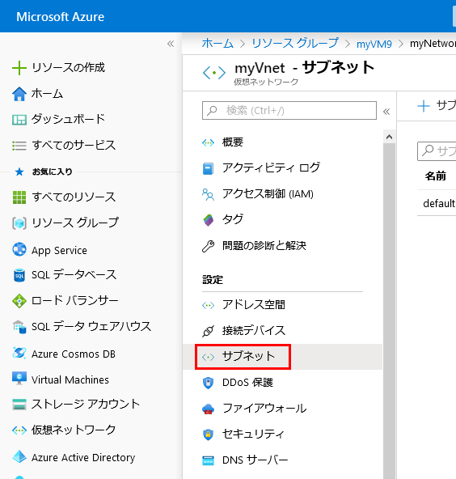
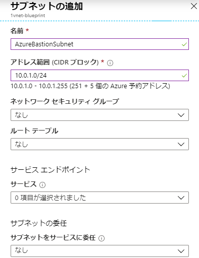
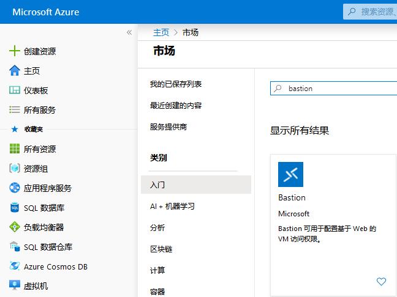
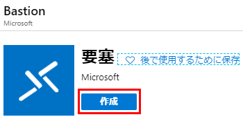
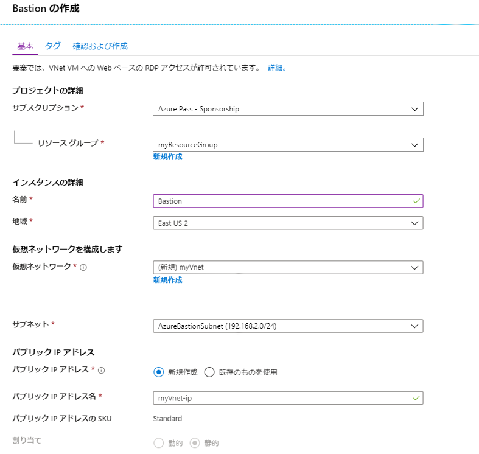
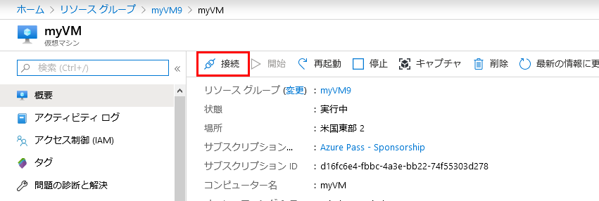
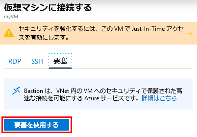
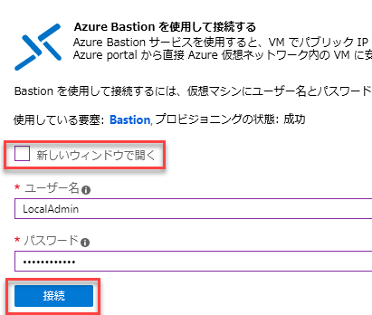
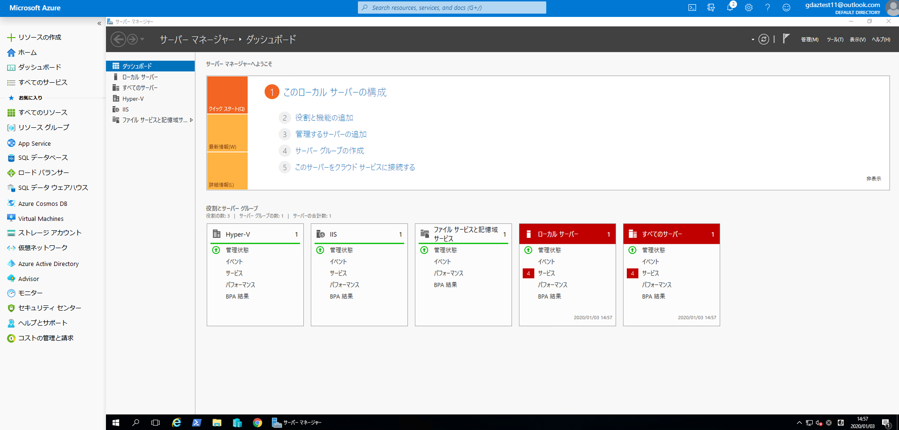

---
lab:
    title: 'ラボ 14 - Azure Bastion'
    module: 'モジュール 2 - プラットフォーム保護を実装する'
---

# モジュール 2：ラボ 14 - Azure Bastion


**シナリオ**

Azure Bastion サービスは、仮想ネットワーク内でプロビジョニングする、完全にプラットフォーム管理された新しい PaaS サービスです。SSL を介して Azure portal で直接仮想マシンに安全でシームレスな RDP/SSH 接続を提供します。Azure Bastion 経由で接続する場合、仮想マシンにパブリック IP アドレスは必要ありません。

Bastion は、プロビジョニングされた仮想ネットワーク内のすべての VM への安全な RDP および SSH 接続を提供します。Azure Bastion を使用すると、RDP/SSHを使用して安全なアクセスを提供しながら、RDP/SSHポートを外部に公開することから仮想マシンを保護できます。Azure Bastion を使用すると、Azure portal から仮想マシンに直接接続できます。追加のクライアント、エージェント、またはソフトウェアは必要ありません。


## 演習 1：Azure Bastion を実装する

### タスク 1：サブスクリプションで Azure Bastion を有効にする

1.  **Cloud Shell（PowerShell）** を開き、必要に応じてストレージを作成します。

1.  次の 2 つのコマンドを実行して、リソース グループと仮想マシンおよび Vnet を作成し、Azure Bastion サービスをテストします。

     ```powershell
    New-AzureRmResourceGroup -Name myResourceGroup -Location "East US"
     ```
    
     ```powershell
    New-AzVm -ResourceGroupName "myResourceGroup" -Name "myVM" -Location "East  US" -VirtualNetworkName "myVnet" -SubnetName "mySubnet" -SecurityGroupName   "myNetworkSecurityGroup" -OpenPorts 80,3389
     ```

    **注記**：VM はパブリック IP アドレスなしで作成されています。


1.  プロンプトが表示されたら、**LocalAdmin** と **Pa55w.rd1234** を資格情報に入力します。

1.  Azure Portalで、**myVnet** に移動して、**サブネット** をクリックします。

     
 
1.  **+ サブネット** をクリックして、次の詳細を使用してサブネットを作成します。

      - 名前: **AzureBastionSubnet** _（これは大文字と小文字が区別されることに注意してください）_
      - アドレス範囲：**192.168.2.0/24**

1.  **OK** をクリックします。

     

### タスク 2：要塞ホストを作成する

1.  **Azure portal** のホームページから、**+ リソースの作成** をクリックします。 

1.  **新しい** ページで、 *マーケットプレイスを検索* フィールドで、**要塞** を入力してから、**Enter** をクリックして、検索結果にアクセスします。

1.  結果から、**要塞** をクリックします。 

     

1.  **要塞** ページで、**作成** をクリックして、**要塞を作成する** ページを開きます。

     

1.  **要塞を作成する** ページで、新しい Bastion リソースを構成します。以下の構成設定を指定します。

    * **サブスクリプション**: サブスクリプションを選択します。
    * **リソース グループ**: myResourceGroup
    * **名前**: 要塞
    * **リージョン**: 米国東部
    * **仮想ネットワーク**: **myVnet**
    * **パブリック IP アドレス**: RDP/SSHにアクセスする Bastion リソースのパブリック Ip（ポート 443 経由）。新規パブリック IP を作成するか、既存のパブリック IP を削除します。パブリック IP アドレスは、作成している Bastion リソースと同じリージョンにある必要があります。
    * **パブリック IP アドレス名**：デフォルトのままにする
    * **パブリック IP アドレス SKU**：デフォルトでは **標準** に事前設定済みです。Azure Bastion は、Standard パブリック IP SKU のみを使用/サポートします。
    * **割り当て**：デフォルトでは **静的** に事前設定済みです。
</br>

1.  設定の指定が終了したら、**レビュー + 作成** をクリックします。これにより値が検証されます。検証に合格すると、作成プロセスを開始できます。

     

1.  要塞の作成ページで、**作成** をクリックします。
1.  デプロイが進行中であることを知らせるメッセージが表示されます。リソースが作成されると、このページにステータスが表示されます。Bastion リソースの作成とデプロイには約5分かかります。

### タスク 3：要塞ホストを使用して VM に接続する 


既存の VM を使用してポータルに要塞ホストを作成する場合、仮想マシンや仮想ネットワークに対応するさまざまな設定が自動的にデフォルトになります。


1.  **Azure portal - Bastion プレビュー** で、仮想マシンに移動してから、**接続** をクリックします。

       

1.  右側のサイドバーで、**Bastion** をクリックしてから、**Bastionを使用する** をクリックします。

       

1.  ]新しいウィンドウで開く] の選択を解除してから、 **LocalAdmin** と **Pa55w.rd1234** を資格情報として入力し、**接続** をクリックします。

     

1.  これで、お使いの VM に接続されるはずです。

     
 

| 警告：続行する前に、このラボで使用したすべてのリソースを削除する必要があります。  **Azure Portal** でこれを行うには、**リソース グループ** をクリックします。  作成したリソース グループを選択します。  リソース グループ ブレードで、**リソース グループを削除**をクリックし、リソース グループ名を入力して、**削除** をクリックします。  作成した可能性のある追加のリソース グループに対してプロセスを繰り返します。**これを行わないと、他のラボで問題が発生する可能性があります。** |
| --- |

**結果**：これで、このラボを完了しました。

