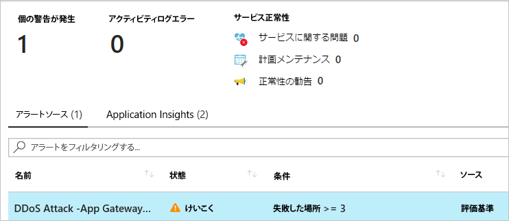

---
lab:
    title: 'ラボ 15 - Azure DDoS Protection Standard の管理'
    module: 'モジュール 2 - プラットフォーム保護を実装する'
---

# モジュール 2：ラボ 15 - Azure DDoS Protection Standard の管理

このラボでは、分散サービス拒否（DDoS）保護を有効または無効にする方法、およびテレメトリを使用して Azure DDoS Protection Standard で DDoS 攻撃を軽減する方法を学習します。DDoS Protection Standard は、Azure パブリック IP アドレスが割り当てられた仮想マシン、ロード バランサー、アプリケーションゲートウェイなどの Azure リソースを保護します。 

## 演習 1：Azure に DDoS 保護を実装します。

### タスク 1：DDoS Protection プランを作成する

DDoS Protection プランは、サブスクリプションで DDoS Protection Standard が有効になっている仮想ネットワークを定義します。組織で 1 つの DDoS Protection プランを構成し、複数のサブスクリプションから同じプランに仮想ネットワークをリンクできます。DDoS Protection プランは、プランの作成時に選択したサブスクリプションに関連付けられます。DDoS Protection プランは、地域およびサブスクリプション全体で機能します。例 - リージョンを米国東部でプランを作成し、テナントのサブスクリプション #1 にリンクできます。同じプランを、テナント全体の異なる地域の他のサブスクリプションからの仮想ネットワークにリンクできます。そのサブスクリプションでは、プランに対する月額料金が請求されるほか、保護されているパブリック IP アドレスの数が 100 を超える場合は超過料金が請求されます。 

ほとんどの組織では、複数のプランを作成する必要はありません。プランをサブスクリプション間で移動することはできません。プランが存在するサブスクリプションを変更する場合は、既存のプランを削除し、新しいプランを作成する必要があります。

1.  Azure portal の左上隅にある **リソースの作成** を選択します。
2.  *DDoS* を検索します。検索結果に **DDos Protection プラン** が表示されたら、それを選択します。
3.  **作成** を選択します。
4.  独自の値を入力または選択するか、次の例の値を選択してから、 **作成** を選択します。

    |設定        |値                                              |
    |---------      |---------                                          |
    |名前           | myDDosProtectionPlan                              |
    |サブスクリプション   | サブスクリプションを選択します。                         |
    |リソース グループ | **新規作成** を選択し、*myResourceGroup* と入力します。 |
    |保存先       | 米国東部                                           |

### タスク 2：新規の仮想ネットワークに対して DDoS を有効にする

1.  Azure portal の左上隅にある **リソースの作成** を選択します。
2.  **ネットワーク** を選択してから、**仮想ネットワーク** を選択します。
3.  独自の値を入力または選択するか、次の例の値を選択してから、 **作成** を選択します。

    | 設定         | 値                                                        |
    | ---------       | ---------                                                    |
    | 名前            | myVirtualNetwork                                             |
    | サブスクリプション    | サブスクリプションを選択します。                                    |
    | リソース グループ  | **既存の使用** を選択してから、**myResourceGroup** を選択する |
    | 保存先        | 米国東部                                                      |
    | DDos 保護 | **Standard** を選択してから、**DDoS 保護** で、**myDdosProtectionPlan** を選択します。選択したプランは仮想ネットワークと同じサブスクリプションまたは異なるサブスクリプションのどちらにあっても構いませんが、両方のサブスクリプションが同じ Azure Active Directory テナントに関連付けられている必要があります。|

 DDoS Standard が仮想ネットワークで有効になっている場合、仮想ネットワークを別のリソース グループまたはサブスクリプションに移動することはできません。DDoS Standard を有効にして仮想ネットワークを移動する必要がある場合は、まず DDoS Standard を無効にし、仮想ネットワークを移動してから、DDoS Standard を有効にします。移動後、仮想ネットワーク内のすべての保護されたパブリック IP アドレスの自動調整ポリシーのしきい値がリセットされます。

### タスク 3：既存の仮想ネットワークに対して DDoS を有効にする

1.  Azure portal の左上隅にある **リソースの作成** を選択します。

3.  ポータルの上部にある **検索リソース、サービス、ドキュメントボックス** に DDoS Protection Standard を有効にする仮想ネットワークの名前を入力します。仮想ネットワークの名前が検索結果に表示されたら、それを選択します。
4.  **設定** で **DDoS 保護** を選択します。
5.  **Standard** を選択します。**DDoS 保護プラン** で、既存の DDoS 保護プランまたは手順 1 で作成したプランを選んでから、**保存** を選択します。選択したプランは仮想ネットワークと同じサブスクリプションまたは異なるサブスクリプションのどちらにあっても構いませんが、両方のサブスクリプションが同じ Azure Active Directory テナントに関連付けられている必要があります。

### タスク 3：仮想ネットワークに対して DDoS を無効にする

1.  DDoS 保護標準を無効にする仮想ネットワークの名前を、ポータルの上部にある **検索リソース、サービス、ドキュメントボックス** に入力します。仮想ネットワークの名前が検索結果に表示されたら、それを選択します。

2.  **設定** で **DDoS 保護** を選択します。
3.  **DDoS 保護プラン** の **基本** で **保存** を選択します。

### タスク 4：DDoS 保護プランを処理する

1.  ポータルの左上にある **すべてのサービス** を選択します。

2.  **フィルター** ボックスに *DDoS* と入力します。検索結果に **DDoS 保護プラン** が表示されたら、それを選択します。
3.  リストから表示する保護プランを選択します。
4.  プランに関連付けられているすべての仮想ネットワークがリストされます。
5.  プランを削除する場合、最初にすべての仮想ネットワークをプランから分離する必要があります。 

### タスク 5：DDoS Protection メトリックのアラートを構成する

Azure Monitor アラート構成を使用して、攻撃中にアクティブな緩和策がある場合にアラートとして使用可能な DDoS 保護メトリックを選択できます。条件が満たされると、指定されたアドレスはアラートメールを受信します。

1.  ポータルの左上にある **すべてのサービス** を選択します。
2.  **フィルター** ボックスに *監視* と入力します。**監視** が結果に表示されたら、それを選択します。
3.  **共有サービス** で **メトリック** を選択します。
4.  独自の値を入力または選択するか、次の例の値を入力し、残りのデフォルトを受け入れてから、**作成** を選択します。

    |設定                  |値                                                                                               |
    |---------                |---------                                                                                           |
    |名前                     | myDdosAlert                                                                                        |
    |サブスクリプション             | アラートを受信するパブリック IP アドレスを含むサブスクリプションを選択します。        |
    |リソース グループ           | アラートを受信するパブリック IP アドレスを含むリソース グループを選択します。      |
    |リソース                 | アラートを受信するパブリック IP アドレスを含むパブリック IP アドレスを選択します。DDoS は、仮想ネットワーク内のリソースに割り当てられたパブリック IP アドレスを監視します。                   |
    |メトリック                   | DDoS 攻撃を受けているかどうか                                                                            |
    |しきい値                | 1- **1** 攻撃を受けていることを意味します。**0** 攻撃を受けていないことを意味します。                         |
    |期間                   | 選択した値を選択します。                                                                   |
    |メールで通知         | チェックボックスをオンにします                                                                                  |
    |追加の管理者 | サブスクリプションのメール所有者、共同作成者、または閲覧者でない場合は、メールアドレスを入力します。 |

    攻撃を検出してから数分以内に、Azure Monitor メトリックから次の図のようなメールを受け取ります。

       

### タスク 6：DDoS 保護テレメトリを使用する

攻撃に関するテレメトリは、Azure Monitor を介してリアルタイムで提供されます。テレメトリは、パブリック IP アドレスが緩和されている期間のみ利用可能です。攻撃が軽減される前または後のテレメトリは表示されません。

1.  ポータルの左上にある **すべてのサービス** を選択します。

2.  **フィルター** ボックスに *監視* と入力します。**監視** が結果に表示されたら、それを選択します。
3.  **共有サービス** で **メトリック** を選択します。
4.  テレメトリが必要なパブリックIPアドレスが含まれている **サブスクリプション** と **リソース グループ** を選択します。
5.  **リソース タイプ** に **パブリック IP アドレス** を選択し、テレメトリが必要な特定のパブリック IP アドレスを選択します。
6.  **利用可能なメトリック** のシリーズが画面の左側に表示されます。これらのメトリックは、選択されると、概要画面で **Azure Monitor メトリックチャート** 内にグラフ化されます。
7.  **集計** タイプを **最大** として選択する

 メトリック名は、次のように各メトリックのタグ名の基本的な構成とともに、異なるパケットタイプ、およびバイトとパケットを表します。

  - **ドロップされたタグ名** （たとえば、**Inbound Packets Dropped DDoS**）：DDoS 保護システムによってドロップ/スクラブされたパケットの数。
  - **転送されたタグ名** （たとえば、**Inbound Packets Forwarded DDoS**）：DDoS システムによって宛先 VIP に転送されたパケットの数 - フィルタリングされなかったトラフィック。
  - **タグ名なし** （たとえば、**Inbound Packets DDoS**）：スクラビングシステムに到着したパケットの総数 - ドロップおよび転送されたパケットの合計を表します。

### タスク 7：DDoS 軽減ポリシーを表示する

DDoS Protection Standard は、DDoS が有効になっている仮想ネットワークで、保護されたリソースのパブリック IP アドレスごとに3つの自動調整緩和ポリシー（TCP SYN、TCP＆UDP）を適用します。ポリシーのしきい値を表示するには、次の図に示すように、**集約** タイプを「最大」とするとともに、**DDoS 緩和をトリガーする受信 TCP パケット** と **DDoS 緩和をトリガーする受信 UDP パケット** メトリックスを選択します。 

   

ポリシーのしきい値は、Azure の機械学習ベースのネットワーク トラフィック プロファイリングによって自動構成されます。ポリシーのしきい値に違反した場合にのみ、攻撃を受けている IP アドレスの DDoS 緩和が行われます。

### タスク 8：DDoS 攻撃の軽減策レポートを構成する

攻撃軽減レポートは、リソースへの攻撃に関する詳細情報を提供するために集約された Netflow プロトコルデータを使用します。パブリック IP リソースが攻撃を受けている場合は常に、軽減策が開始されるとすぐにレポート生成が開始されます。5 分ごとに生成される増分レポートと、緩和期間全体の緩和後レポートがあります。これにより、DDoS 攻撃が長時間継続する場合に、5 分ごとに軽減レポートの最新のスナップショットを表示し、攻撃軽減が終了すると完全な概要を表示できるようになります。 

1.  ポータルの左上にある **すべてのサービス** を選択します。

2.  **フィルター** ボックスに *監視* と入力します。**監視** が結果に表示されたら、それを選択します。
3.  **設定** で、**診断設定** を選択します。
4.  ログに記録するパブリックIPアドレスが含まれている **サブスクリプション** と **リソース グループ** を選択します。
5.  **リソースタイプ** に **パブリック IP アドレス** を選択して、メトリックスを記録する特定のパブリック IP アドレスを選択します。
6.  **診断をオンにして DDoSMitigationReports ログを収集する** を選択してから、必要な数の次のオプションを選択します。

    - **ストレージアカウントにアーカイブします**：データは Azure Storage アカウントに書き込まれます。 
    - **イベントハブへのストリーム**：ログ レシーバーが Azure Event Hub を使用してログを取得できるようにします。イベント ハブにより、Splunk または他の SIEM システムとの統合が可能になります。 
    - **ログ分析に転送される**：ログを Azure Monitor サービスに書き込みます。 
 

 増分および攻撃後の緩和レポートには、次のフィールドが含まれる
 
  - 攻撃ベクトル
  - トラフィック統計
  - ドロップされたパケットの理由
  - 関係するプロトコル
  - 上位10のソース国またはリージョン
  - トップ10ソースASN

### タスク 9：DDoS 攻撃の軽減フロー ログを構成する

攻撃軽減フロー ログを使用すると、アクティブな DDoS 攻撃中に、ドロップされたトラフィック、転送されたトラフィック、その他の興味深いデータポイントをほぼリアルタイムで確認できます。イベントハブを介してこのデータの絶え間ないストリームを SIEM システムに取り込み、ほぼリアルタイムの監視を行い、潜在的なアクションを実行し、防衛操作のニーズに対応できます。 

1.  ポータルの左上にある **すべてのサービス** を選択します。

2.  **フィルター** ボックスに *監視* と入力します。**監視** が結果に表示されたら、それを選択します。
3.  **設定** で、**診断設定** を選択します。
4.  ログに記録するパブリックIPアドレスが含まれている **サブスクリプション** と **リソース グループ** を選択します。
5.  **リソースタイプ** に **パブリック IP アドレス** を選択して、メトリックスを記録する特定のパブリック IP アドレスを選択します。
6.  **診断をオンにして DDoSMitigationReports ログを収集する** を選択してから、必要な数の次のオプションを選択します。

    - **ストレージアカウントにアーカイブします**：データは Azure Storage アカウントに書き込まれます。リリース ゲートの詳細について学習するには。
    - **イベントハブへのストリーム**：ログ レシーバーが Azure Event Hub を使用してログを取得できるようにします。イベント ハブにより、Splunk または他の SIEM システムとの統合が可能になります。 
    - **ログ分析に転送される**：ログを Azure Monitor サービスに書き込みます。 
1.  Azure 分析ダッシュボードでフロー ログ データを表示するには。

 フロー ログには次のフィールドがあります。 

  - ソース IP
  - 宛先 IP
  - ソース ポート 
  - 宛先ポート 
  - プロトコルの種類 
  - 軽減策実行中に取られたアクション

### タスク 10：DDoS 検出の検証（オプションであり、AZ-500 コースの一部ではありません）

**注記**：このタスクを実行するのは、希望する場合にのみに実行してください。  このタスクはコースの一部ではなく、希望する学生のためのストレッチとなる実習です。

マイクロソフトは [BreakingPoint Cloud](https://www.ixiacom.com/products/breakingpoint-cloud) と提携し、シミュレーション用に DDoS Protection 対応のパブリック IP アドレスに対してトラフィックを生成できるインターフェイスをビルドします。BreakPoint Cloud シミュレーションでは、次のことができます。

- Microsoft Azure DDoS Protection が Azure リソースを DDoS 攻撃から保護する方法を検証する
- DDoS 攻撃を受けている間のインシデント対応プロセスを最適化する
- DDoS コンプライアンスの文書化
- ネットワークセキュリティチームをトレーニングする

**アクセス許可**

DDoS 保護プランを使用するには、アカウントをネットワーク共同作成者ロール、または次の表にリストされている適切なアクションが割り当てられているロールに割り当てる必要があります。

| アクション                                            | 名前                                     |
| ---------                                         | -------------                            |
| Microsoft.Network/ddosProtectionPlans/read        | DDoS 保護プランを読む              |
| Microsoft.Network/ddosProtectionPlans/write       | DDoS 保護プランを作成または更新する  |
| Microsoft.Network/ddosProtectionPlans/delete      | DDoS 保護プランを削除する            |
| Microsoft.Network/ddosProtectionPlans/join/action | DDoS 保護プランに参加する              |

仮想ネットワークの DDoS 保護を有効にするには、アカウントに仮想ネットワークの適切なアクションも割り当てる必要があります。

| 警告：続行する前に、このラボで使用したすべてのリソースを削除する必要があります。  **Azure Portal** でこれを行うには、**リソース グループ** をクリックします。  作成したリソース グループを選択します。  リソース グループ ブレードで、**リソース グループを削除**をクリックし、リソース グループ名を入力して、**削除** をクリックします。  作成した可能性のある追加のリソース グループに対してプロセスを繰り返します。**これを行わないと、他のラボで問題が発生する可能性があります。** |
| --- |

**結果**：これで、このラボを完了しました。
