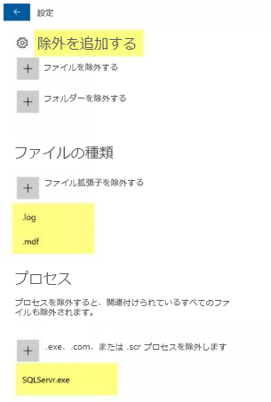

---
lab:
    title: 'ラボ 16 - VM のマルウェア対策'
    module: 'モジュール 2 - プラットフォーム保護を実装する'
---

# モジュール 2：ラボ 16 - VM のマルウェア対策

**シナリオ**

Azure Security Center は、マルウェア保護の状態を監視し、「Endpoint protection issues」 (Endpoint Protection の問題) ブレードでこれを報告します。Security Center では、VM やコンピューターをマルウェアの脅威に対して脆弱にする可能性のある問題 (検出された脅威や不十分な保護など) が示されます。 
「Endpoint protection issues」 (Endpoint Protection の問題) に表示される情報を使用して、特定された問題に対処する計画を立てることができます。 

Security Center では、次の Endpoint Protection の問題が報告されます。 

- Azure VM に Endpoint Protection がインストールされていない。サポートされているマルウェア対策ソリューションがこれらの Azure VM にはインストールされていません。 
- 非 Azure コンピューターに Endpoint Protection がインストールされていない。サポートされているマルウェア対策がこれらの非 Azure コンピューターにインストールされていません。
- Endpoint Protection の正常性の問題:  

- **シグネチャが古い**。これらの VM とコンピューターにはマルウェア対策ソリューションがインストールされていますが、ソリューションに最新のマルウェア対策シグネチャがありません。 
  - **リアルタイム保護がない。** これらの VM とコンピューターにはマルウェア対策ソリューションがインストールされていますが、リアルタイム保護を使用するようにソリューションが構成されていません。サービスが無効になっている可能性があります。または、ソリューションがサポートされていないために、Security Center が状態を取得できない可能性があります。 
 - **報告なし**。マルウェア対策ソリューションはインストールされていますが、データが報告されていません。 
 - **不明**。マルウェア対策ソリューションはインストールされていますが、状態が不明であるか、不明なエラーが報告されています。

## 演習 1：Azure VM にマルウェア対策をデプロイする

## タスク 1：Antimalware 拡張機能を使用して Azure Virtual Machine を作成する

VM のプロビジョニングの間に Azure portal を使用して Azure VM の Microsoft Antimalware を有効化および構成するには、次の手順に従ってください。 

1.  **Azure portal** **「https://portal.azure.com」** にサインインする

2.  新しい VM を作成するには、**仮想マシン** に移動し、[追加] を選択してから、**イメージドロップダウンで Windows Server** を選択します。

1.  VM の次の詳細を入力します。

 | オプション | 回答 |
 | -- | --|
 | リソース グループ | 新規作成 > **myResourceGroup** |
 | VM 名 | **myVM** |
 | リージョン | **米国東部** |
 | イメージ | **Windows Server 2019 Datacenter** |
 | ユーザー名 | **localadmin** |
 | パスワード | **Pa55w.rd1234** |

1.  **管理** タブをクリックして、すべてのラジオボタンが **オフ** になっていることを確認します。

1.  **詳細** タブをクリックして、**インストールする拡張機能を選択する** をクリックします。

1.  **Microsoft Antimalware** 拡張機能を選択します。  _拡張機能を表示するには、リストの下部にある [さらに読み込む] をクリックする必要がある場合があります。_

11.  **Microsoft Antimalware** ブレードで、**作成** をクリックします。 
12.  [拡張機能のインストール] セクションで、ファイル、場所、プロセスの除外、その他のスキャン オプションを構成できます。 

1.  [除外するファイルの種類] に .mdf、.log と入力する

1.  除外プロセスに、**SQLServr.exe** と入力する 

1.  **OK** を選択します。 

14.  [設定] セクションに戻り、**レビュー + 作成** を選択します。 
15.  検証画面で **作成** をクリックします。 
16.  VM が RDP を介して VM にログオンし、Microsoft Antimalware > Exclusions を開いて、デプロイが成功したことを確認します。

     

| 警告：続行する前に、このラボで使用したすべてのリソースを削除する必要があります。  **Azure Portal** でこれを行うには、**リソース グループ** をクリックします。  作成したリソース グループを選択します。  リソース グループ ブレードで、**リソース グループを削除** をクリックし、リソース グループ名を入力して、**削除** をクリックします。  作成した可能性のある追加のリソース グループに対してプロセスを繰り返します。**これを行わないと、他のラボで問題が発生する可能性があります。** |
| --- |

**結果**：これで、このラボを完了しました。

