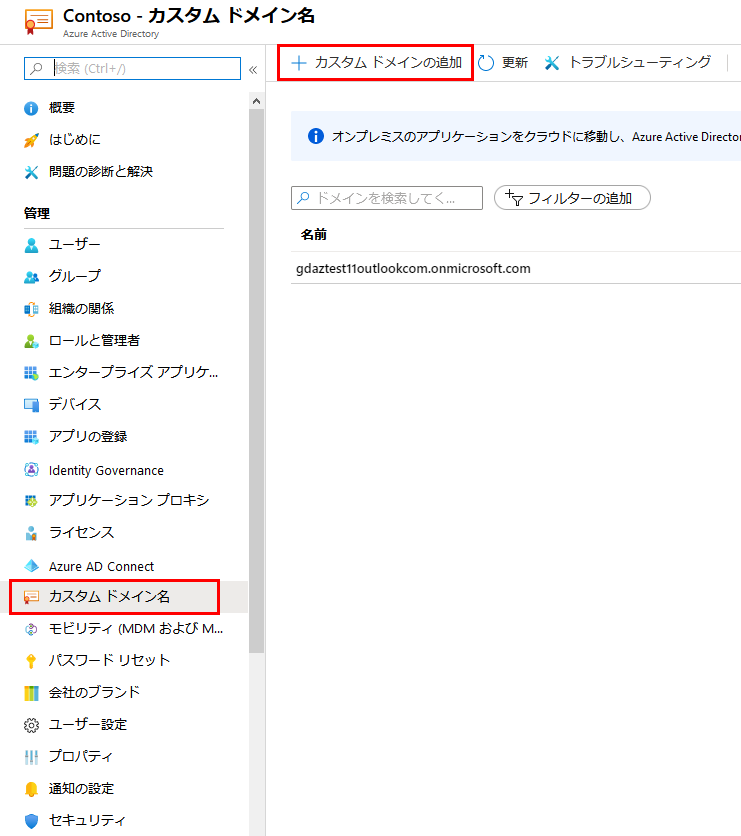
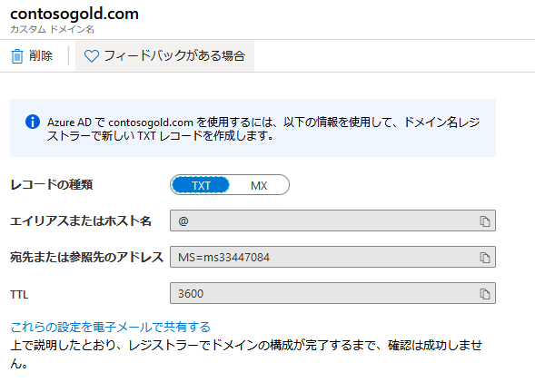
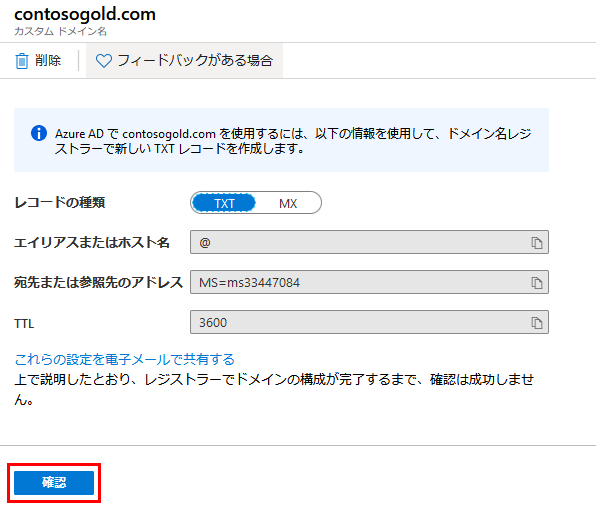
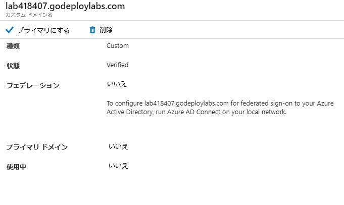

---
lab:
    title: 'ラボ 18 - カスタム ドメイン'
    module: 'モジュール 2 - プラットフォーム保護を実装する'
---

# モジュール 2：ラボ 18 - カスタム ドメイン

**シナリオ**

すべての新しい Azure AD テナントには、初期ドメイン名 domainname.onmicrosoft.com が付いています。初期ドメイン名を変更または削除することはできませんが、組織の名前をリストに追加することはできます。カスタム ドメイン名を追加すると、alain@ contoso.com など、ユーザーに馴染みのあるユーザー名を作成できます。

### 演習 1：Azure Active Directory ポータルを使用してカスタムドメイン名を追加する

### タスク 1：カスタムドメイン名を Azure AD に追加する

1.  Azure portal で、**Azure Active Directory** を選択します。

1.  **カスタム ドメイン名** を選択してから、**カスタム ドメインを追加** を選択します。

       

2.  ラボ環境の [DNS] タブに移動して、割り当てられた一意のカスタムドメイン名を特定します。  これは、labxxxxxx.customdomainname.com の形式になります。

1.  [カスタムドメイン名] フィールドに、前の手順で特定したドメイン名を入力し、**ドメインを追加** をクリックします。

    未検証のドメインが追加され、DNS 情報ページを示す **labxxxxx.customdomainname.com** ページが表示されます。

4.  **labxxxxx.customdomainname.com** ページから DNS 情報をコピーします。例としては、MS=ms64983159 です。

       

### タスク 2：DNS 情報をドメインレジストラーに追加します

カスタムドメイン名を Azure AD に追加したら、ドメインレジストラーに戻り、コピーした TXT ファイルから Azure AD DNS 情報を追加する必要があります。ドメイン用にこの TXT レコードを作成すると、ドメイン名の所有権が「検証」されます。

1.  ラボ環境の [DNS] タブに戻り、コピーした DNS 情報に基づいてドメインの新しい TXT レコードを作成します。  値レコードを入力するだけです。  名前フィールドを空白のままにして、**保存** をクリックします。

**注記**：必要なだけドメイン名を登録できます。ただし、各ドメインは Azure AD から独自の TXT レコードを取得します。ドメインレジストラーで TXT ファイル情報を入力するときは注意してください。入力を間違えたり、誤って情報を複製した場合、TTL がタイムアウト（60 分）するまで待ってから再試行できます。

### タスク 2：カスタムドメイン名を確認する

カスタムドメイン名を登録したら、Azure AD で有効であることを確認する必要があります。ドメインレジストラーから Azure AD への伝達は、ドメインレジストラーに応じて、瞬時に行われる場合もあれば、数日かかる場合もあります。

1.  Azure Portal **labxxxxx.customdomainname.com** ページに戻り、**検証** をクリックします。

     

1.  ドメインを検証する必要があります。

     

1.  カスタム ドメイン名を検証したら、検証 TXT レコードを削除できます。

**結果**：これで、このラボを完了しました。

