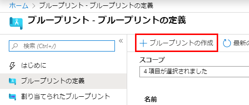
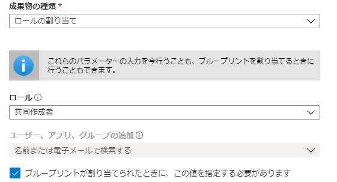
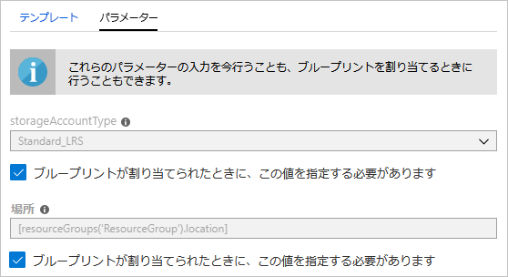
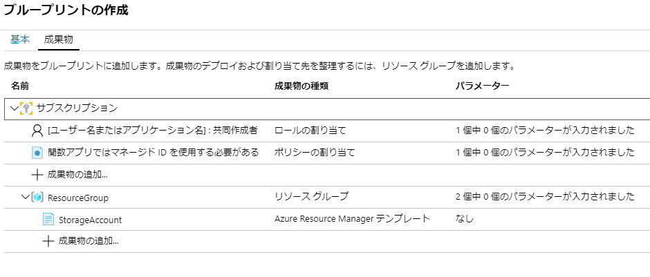
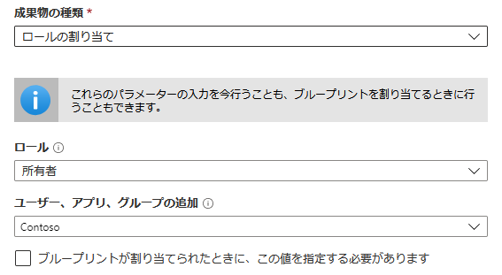
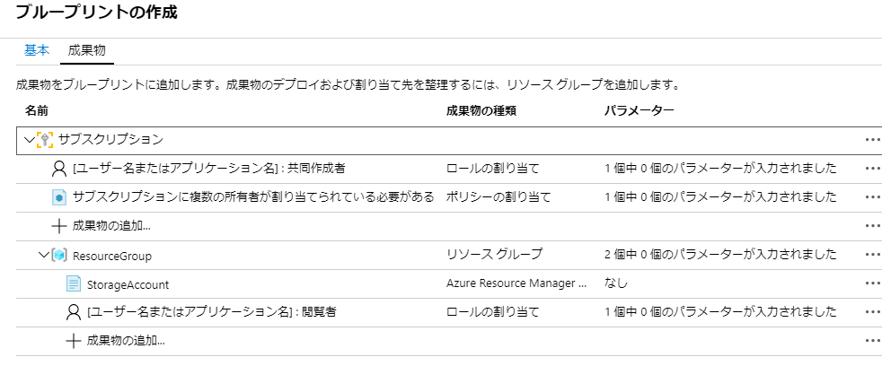
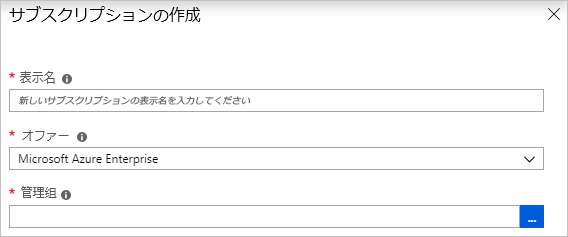
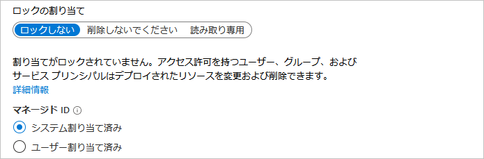
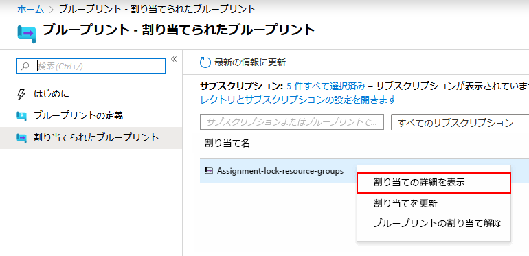

---
lab:
    title: 'ラボ 20 - Azure Blueprints に関する考慮事項'
    module: 'モジュール 2 - プラットフォーム保護を実装する'
---

# モジュール 2：ラボ 20 - Azure Blueprints に関する考慮事項


**シナリオ**

ブループリントの作成と割り当ての方法を学習すると、一般的なパターンを定義して、Azure Resource Manager テンプレート、ポリシー、セキュリティなどに基づいて再利用可能で迅速に展開可能な構成を開発できます。このチュートリアルでは、Azure Blueprints を使用して、組織全体のブループリントの作成、割り当て、および管理に関連する次のような一般的なタスクをいくつか実行します。これらのタスクは次のとおりです。

- 新しいブループリントを作成し、サポートされているさまざまな成果物を追加する
- まだドラフトにある既存のブループリントを変更する
- 公開済みを使用して、青写真を割り当てる準備ができているとマークする
- ブループリントを既存のサブスクリプションに割り当てる
- 割り当てられたブループリントのステータスと進行状況を確認する
- サブスクリプションに割り当てられているブループリントを削除する


## 演習 1：ポータルにブループリントを作成する

### タスク 1：ブループリントを作成する


コンプライアンスの標準パターンを定義する最初のステップは、利用可能なリソースからブループリントを作成することです。この例では、**MyBlueprint** という名前の新しいブループリントを作成し、サブスクリプションに対して役割とポリシーの割り当てを構成します。次に、新しいリソース グループを追加し、新しいリソース グループにリソースマネージャーテンプレートとロールの割り当てを作成します。


1.  左側のペインで **すべてのサービス** を選択します。**Blueprints** を検索して選択します。 

1.  左側のページから **ブループリントの定義** を選択し、ページの最上部にある **ブループリントを作成する**
   ボタンを選択します。

    または、**開始** ページから **作成** を選択して、ブループリントの作成に直接進みます。

       

1.  **MyBlueprint** などの **ブループリント名** を入力します。（最大 48 文字の英数字を使用できますが、スペースや特殊文字は使用できません）。**ブループリントの説明** は今のところ空白にしておきます。

1.  **定義場所** ボックスで、右側の省略記号を選択し、ブループリントを保存するサブスクリプションを選択して、**選択** を選択します。

1.  情報が正しいことを確認してください。**ブループリント名** と **定義場所** フィールドは後で変更できません。次に、**次へ:** を選択します。ページの最下部にある **成果物** またはページ最上部の **成果物** タブ。

1.  サブスクリプションレベルでロールの割り当てを追加します。

   1. **サブスクリプション** にある **+ 成果物を追加** 行を選択します。**成果物を追加** ウィンドウが
      ブラウザの右側で開きます。

   1. **成果物タイプ** に **ロールの割り当て** を選択します。

   1. **ロール** で、**共同作成者** を選択します。**ユーザー、アプリ、またはグループを追加する** ボックスを
      動的パラメーターを示すチェックボックスに。

   1. **追加** を選択して、この成果物をブループリントに追加します。

      

        **注記**：ほとんどの成果物はパラメーターをサポートしています。ブループリントの作成中に値が割り当てられるパラメーターは *静的パラメーター* です。ブループリントの割り当て中にパラメーターが割り当てられている場合、それは *動的パラメータ* です。


1.  サブスクリプションレベルでポリシー割り当てを追加します。

   1. ロール割り当て成果物にある **+ 成果物を追加** 行を選択します。

   1. **成果物タイプ** に **ポリシーの割り当て** を選択します。

   1. **タイプ** を **ビルトイン** に変更します。**Search** で、**タグ** を入力します。

   1. **Search** 以外からクリックすると、フィルタリングが発生します。**追加タグとそのリソース グループに対するデフォルト値
      ** を選択します。

   1. **追加** を選択して、この成果物をブループリントに追加します。

1.  ポリシー割り当ての行 **タグとそのデフォルト値をリソース グループに追加する** を選択します。

1.  ブループリント定義の一部として成果物にパラメーターを提供するウィンドウが開き、割り当て中（動的パラメーター）ではなく、このブループリントに基づいてすべての割り当て（静的パラメーター）のパラメーターを設定できます。この例では、ブループリントの割り当て中に動的パラメーターを使用するため、デフォルトのままにして、**キャンセル** を選択します。

1.  サブスクリプションレベルでリソース グループを追加します。

   1. **サブスクリプション** にある **+ 成果物を追加** 行を選択します。

   1. **成果物タイプ** に対して **リソース グループ** を選択します。

   1. **成果物の表示名**、 **リソース グループ名**、そして **ロケーション** ボックスを空白のままにしますが、各パラメーター プロパティのチェックボックスがオンになっていることを確認して、動的パラメータにします。

   1. **追加** を選択して、この成果物をブループリントに追加します。

1.  リソース グループにテンプレートを追加します。

   1. **ResourceGroup** エントリにある **+ 成果物を追加** の行を選択します。

   1. **成果物タイプ** に **Azure Resource Manager テンプレート** を選択し 、**成果物の表示名** に **StorageAccount** を設定し、**説明** を空白のままにしておきます。

   1. エディターボックスの **テンプレート** タブで、次の Resource Manager テンプレートを貼り付けます。  テンプレートを貼り付けた後、 **パラメーター** タブを開き、テンプレートパラメーター **storageAccountType** と **保存先** が検出されました。各パラメーターは自動的に検出および入力されましたが、動的パラメーターとして構成されました。

        ```json
              {
                  "$schema": "https://schema.management.azure.com/schemas/      2015-01-01/deploymentTemplate.json#",
                  "contentVersion": "1.0.0.0",
                  "parameters": {
                      "storageAccountType": {
                          "type": "string",
                          "defaultValue": "Standard_LRS",
                          "allowedValues": [
                              "Standard_LRS",
                              "Standard_GRS",
                              "Standard_ZRS",
                              "Premium_LRS"
                          ],
                          "metadata": {
                              "description": "Storage Account type"
                          }
                      },
                      "location": {
                          "type": "string",
                          "defaultValue": "[resourceGroup().location]",
                          "metadata": {
                              "description": "Location for all resources."
                          }
                      }
                  },
                  "variables": {
                      "storageAccountName": "[concat('store', uniquestring      (resourceGroup().id))]"
                  },
                  "resources": [{
                      "type": "Microsoft.Storage/storageAccounts",
                      "name": "[variables('storageAccountName')]",
                      "location": 「[parameters('location')]」,
                      "apiVersion": "2018/07/01",
                      "sku": {
                          "name": "[parameters('storageAccountType')]"
                      },
                      "kind": "StorageV2",
                      "properties": {}
                  }],
                  "outputs": {
                      "storageAccountName": {
                          "type": "string",
                          "value": "[variables('storageAccountName')]"
                      }
                  }
              }
        ```

1. **storageAccountType** チェックボックスをクリアにして、ドロップダウンリストには
      **allowedValues** の Resource Manager テンプレートに含まれる値しか含まれないことに注意してください。ボックスを選択して
      動的パラメーターに戻します。

1. **追加** を選択して、この成果物をブループリントに追加します。

      

1.  完成したブループリントは次のようになるはずです。各成果物には **パラメーター** 列に **_y_ 個のうち _x_ 個の入力されたパラメーター** があります。動的パラメーターは、ブループリントの各割り当て中に設定されます。

       

1.  計画されたすべての成果物が追加されたので、選択します **下書きを保存** ページの下部にあります。

### タスク 2：  ブループリントを編集する


ブループリントの作成では、説明を入力したり、新しいリソース グループに役割の割り当てを追加したりしませんでした。次の手順に従って、両方を修正できます。


1.  左側のページから **ブループリントの定義** を選択します。

1.  ブループリントのリストで、以前に作成したものを右クリックし、**
   ブループリント**。

1.  **ブループリントの説明** で、ブループリントとそれを構成する成果物に関する情報を提供します。この場合、次のように入力します。**このブループリントは、サブスクリプションにタグポリシーとロール割り当てを設定し、ResourceGroup を作成し、リソーステンプレートとロール割り当てをその ResourceGroup にデプロイします。**

1.  ページの最下部にある **次へ : 成果物** またはページの最上部にある **成果物** タブを
   選択します。

1.  リソース グループでロールの割り当てを追加します。

   1. **ResourceGroup** エントリのすぐ下にある **成果物を追加** 行を選択します。

   1. **成果物タイプ** に **ロールの割り当て** を選択します。

   1. **ロール** で、**所有者** を選択し、**ユーザー、アプリ、またはグループを追加する** ボックスでチェックボックスをオフにします。

   1. 追加するユーザー、アプリ、またはグループを検索して選択します。この成果物は、このブループリントのすべての割り当てで同じ静的パラメーターセットを使用します。

1. **追加** を選択して、この成果物をブループリントに追加します。

   

1.  完成したブループリントは次のようになるはずです。新しく追加されたロールの割り当てが **1 つのうち 1 つのパラメータが入力されています** と表示していることに注意してください。つまり、静的パラメーターです。

       
   
1.  **下書きを保存** を選択します。これで更新されました。

### タスク 3：ブループリントを公開する


計画されたすべての成果物がブループリントに追加されたので、次は公開します。公開すると、ブループリントをサブスクリプションに割り当てることができます。


1.  左側のページから **ブループリントの定義** を選択します。

1.  ブループリントのリストで、以前に作成したものを右クリックし、**
   ブループリント**。

1.  開いたペインで、**v1** など **バージョン** （最大20文字の文字、数字、ハイフン）を入力します。オプションで、**メモの変更** で **最初の公開** などのテキストを入力します。

1.  ページの最上部にある **公開** を選択します。

### タスク 4：  ブループリントを割り当てる


ブループリントが公開されると、サブスクリプションに割り当てることができます。作成したブループリントを、管理グループ階層の下のいずれかのサブスクリプションに割り当てます。ブループリントがサブスクリプションに保存されている場合、そのサブスクリプションにのみ割り当てることができます。 


1.  左側のページから **ブループリントの定義** を選択します。

1.  ブループリントのリストで、以前に作成したものを右クリックして（または省略記号を選択して）、**ブループリントを割り当てる** を選択します。

1.  **ブループリントを割り当てる** ページで、 **サブスクリプション** ドロップダウンリストから、このブループリントを展開するサブスクリプションを選択します。

       Azure Billing から利用可能なサポート対象の Enterprise サービスがある場合、サブスクリプション ボックスで新規作成リンクがアクティブになります。次の手順に従います。

    a. **新規作成** リンクを選択して、既存のサブスクリプションを選択する代わりに、新しいサブスクリプションを作成します。

    b. 新しいサブスクリプションの **表示名** を入力します。

    c. ドロップダウン リストから利用可能な **オファー** を選択します。

    d. 省略記号を使用して、サブスクリプションが子になる管理グループを選択します。

    e. ページの最下部にある **作成** を選択します。

    

    **重要**：新しいサブスクリプションは、**作成** を選択した直後に作成されます。

    **注記**：選択したサブスクリプションごとに割り当てが作成されます。選択したサブスクリプションの残りに変更を強制することなく、後で単一のサブスクリプションの割り当てを変更できます。


1.  **割り当て名** については、この割り当てに一意の名前を入力します。

1.  **保存先** で、管理対象 ID とサブスクリプション展開オブジェクトを作成するリージョンを選択します。Azure Blueprint はこの管理対象 ID を使用して、割り当てられたブループリントのすべての成果物をデプロイします。 

1.  **v1** エントリで **公開済み** バージョンの **ブループリント定義バージョン**ドロップダウン選択にします。（デフォルトは、最近公開されたバージョンです。）

1.  **割り当てのロック** については、デフォルト **ロックしないでください** のままにします。 

       

1.  **マネージド ID** で、デフォルト **割り当てられたシステム** ままにします。

1.  サブスクリプション レベルのロールの割り当て **[ユーザーグループまたはアプリケーション名]：共同作成者** については、ユーザー、アプリ、またはグループを検索して選択します。

1.  サブスクリプション レベルのポリシー割り当ての場合、**タグ名** に **コストセンター** そしてその **タグ値** に **ContosoIT** を設定します。

1.  **ResourceGroup** については、ドロップダウンリストから **StorageAccount** の **名** と **米国東部 2** の **場所** を入力します。

    **注記**：ブループリントの定義時にリソース グループの下に追加した各成果物について、その成果物をインデントして、デプロイするリソース グループまたはオブジェクトに合わせます。  パラメーターを受け取らないか、割り当て時にパラメーターを定義しない成果物は、コンテキスト情報についてのみリストされます。


1.  Azure Resource Manager テンプレート **StorageAccount** で、**storageAccountType** パラメーターに **Standard_GRS** を選択します。

1.  ページの下部にある情報ボックスを読み、**割り当て** を選択します。

### タスク 5：ブループリントのデプロイを追跡する


ブループリントが 1 つ以上のサブスクリプションに割り当てられると、次の 2 つのことが起こります。

- ブループリントが各サブスクリプションに **割り当てられたブループリント** ページが追加されます。
- ブループリントで定義されたすべての成果物をデプロイするプロセスが開始されます。

    ブループリントがサブスクリプションに割り当てられたので、デプロイの進行状況を確認します。


1.  左側のページから **割り当てられたブループリント** を選択します。

1.  ブループリントのリストで、以前に割り当てたものを右クリックし、**
   割り当ての詳細を表示** を選択します。

       

1.  **ブループリントの割り当て** ページで、すべての成果物が正常にデプロイされ、
   展開中にエラーがなかったことを確認します。エラーが発生した場合、何がうまくいかなかったかを判断するための手順を [ブループリントのトラブルシューティング](./troubleshoot/general.md) で
   参照します。

### タスク 6：  ブループリントの割り当て解除


ブループリントの割り当てが不要になった場合は、サブスクリプションから削除します。ブループリントは、更新されたパターン、ポリシー、およびデザインを備えた新しいブループリントに置き換えられた可能性があります。ブループリントが削除されると、そのブループリントの一部として割り当てられた成果物が残ります。ブループリントの割り当てを削除するには、次の手順を実行します。


1.  左側のページから **割り当てられたブループリント** を選択します。

1.  ブループリントのリストで、割り当てを解除するブループリントを選択します。次に、
   ページの最上部にある **ブループリントの割り当て解除** ボタンを選択します。

1.  確認メッセージを読んでから、**OK** を選択します。

### タスク 6：ブループリントを削除する

1.  左側のページから **ブループリントの定義** を選択します。

1.  削除するブループリントを右クリックして、**ブループリントを削除** を選択します。次に
   確認ダイアログボックスで **はい** を選択します。


**注記**：この方法でブループリントを削除すると、選択したブループリントの公開済みバージョンもすべて削除されます。単一のバージョンを削除するには、ブループリントを開き、 **公開されたバージョン** タブで、削除するバージョンを選択してから、 **このバージョンを削除** を選択します。また、ブループリント定義のブループリント割り当てをすべて削除するまで、ブループリントを削除することはできません。


| 警告：続行する前に、このラボで使用したすべてのリソースを削除する必要があります。  **Azure Portal** でこれを行うには、**リソース グループ** をクリックします。  作成したリソース グループを選択します。  リソース グループ ブレードで、**リソース グループを削除** をクリックし、リソース グループ名を入力して、**削除** をクリックします。  作成した可能性のある追加のリソース グループに対してプロセスを繰り返します。**これを行わないと、他のラボで問題が発生する可能性があります。** |
| --- |

**結果**：これで、このラボを完了しました。

