---
lab:
    title: 'ラボ 1 - Azure Monitor'
    module: 'モジュール 3：セキュリティ操作の管理'
---

# モジュール 3：ラボ 1 - Azure Monitor


Azure Monitor は、クラウドおよびオンプレミス環境から製品利用統計情報を収集、分析、および処理するための包括的なソリューションを提供することにより、アプリケーションとサービスの可用性とパフォーマンスを最大化します。アプリケーションのパフォーマンスを把握し、アプリケーションに影響を与える問題や依存するリソースを事前に特定するのに役立ちます。

このラボでは、Azure Monitor を次のように構成します。

- Azure 仮想マシンからデータを収集します。
- Application Insights を使用して Web サイトを監視します。


 
## 演習 1：Azure Monitor を使用して Azure 仮想マシンからデータを収集する


Azure Monitor は、詳細な分析と相関のために、Azure 仮想マシンから Log Analytics ワークスペースに直接データを収集できます。Windows および Linux 用の Log Analytics VM 拡張機能をインストールすると、Azure Monitor が Azure VM からデータを収集できます。この演習では、いくつかの簡単な手順で VM 拡張機能を使用して Azure Linux または Windows VM からデータを構成および収集する方法を示します。  


### タスク 1：Azure VM をモニターにデプロイします。

1.  Azure Cloud Shell を開き、次の 2 つのコマンドを実行して、監視に使用するリソース グループと Azure VM を作成します。

     ```powershell
    New-AzResourceGroup -Name myResourceGroup -Location EastUS
     ```

     ```powershell
    New-AzVm -ResourceGroupName "myResourceGroup" -Name "myVM" -Location "East  US" -VirtualNetworkName "myVnet" -SubnetName "mySubnet" -SecurityGroupName   "myNetworkSecurityGroup" -PublicIpAddressName "myPublicIpAddress"     -OpenPorts 80,3389
     ```

1.  資格情報の入力を求められたら、ユーザーとして **LocalAdmin** と入力し、パスワード **Pa55w.rd1234** を使用します

### タスク 2：ワークスペースを作成する

1.  Azure portal に **すべてのサービス** を選択します。リソースのリストで、「 **Log Analytics**」 と入力します。入力し始めると、入力に基づいてリストがフィルター処理されます。「 **Log Analytics ワークスペース**」 を選択します。

       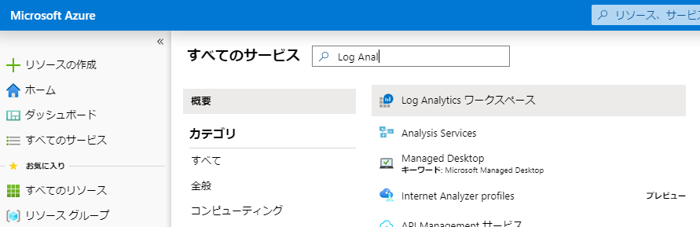

2.  **作成** を選択してから、次の項目の選択肢を選択します。

       * 新しい **Log Analytics ワークスペース** に *myWorkspaceDemo* などの名前を付けます。  
       * デフォルトで選択されたものが適切でない場合は、ドロップダウンリストから選択してリンクする **サブスクリプション** を選択します。
       * **リソース グループ** については、**myResourceGroup** を選択します。これは、タスク 1 で作成した VM を含むリソース グループです。
       * **米国東部** を場所として選択します。 
       * 価格レベルは **Gbあたり (2018)** のままにします
  
           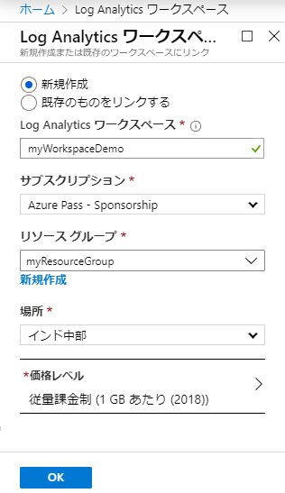

3.  **Log Analytics ワークスペース** ペインで必要な情報を提供したら、**OK** をクリックします。  

1.  情報が検証され、ワークスペースが作成されている間、メニューの **通知** で進行状況を追跡できます。 

### タスク 2：Log Analytics VM 拡張機能を有効にする


Azure に既にデプロイされている Windows および Linux 仮想マシンの場合、Log Analytics VM Extension を使用して Log Analytics エージェントをインストールします。拡張機能を使用すると、インストール プロセスが簡素化され、指定した Log Analytics ワークスペースにデータを送信するようにエージェントが自動的に構成されます。また、新しいバージョンがリリースされると、エージェントは自動的にアップグレードされ、最新の機能と修正が確実に適用されます。先に進む前に、VM が実行されていることを確認してください。実行されていない場合、プロセスは正常に完了しません。 
 

1.  Azure portal で、左側のサイドバーにある **すべてのサービス** を選択します。リソースのリストで、「 **Log Analytics**」 と入力します。入力し始めると、入力に基づいてリストがフィルター処理されます。「 **Log Analytics ワークスペース**」 を選択します。

2.  Log Analytics ワークスペースのリストで、以前に作成された **myWorkspaceDemo** を選択します。

    **注記**：ワークスペースの名前は **myWorkspaceDemo** とは異なる場合があります。


3.  左側のメニューの「ワークスペース データ ソース」で、**仮想マシン** を選択します。  

4.  **仮想マシン** のリストで、エージェントをインストールする仮想マシンを選択します。VMの **Log Analyticsの接続ステータス** は、**接続されていない** ことを示していることに注意してください。

5.  仮想マシンの詳細で、**接続** を選択します。エージェントは Log Analytics ワークスペース用に自動的にインストールおよび構成されます。このプロセスには数分かかり、その間に **ステータス** が **接続中** を示します。

6.  エージェントをインストールして接続した後、**Log Analytics の接続ステータス** は、**このワークスペース** で更新されます。

### タスク 3：Windows VM のイベントとパフォーマンスを収集します。


Azure Monitor は、Windows イベント ログまたは Linux Syslog からイベントを収集し、長期的な分析とレポート用に指定したパフォーマンス カウンターを収集し、特定の条件が検出されたときにアクションを実行できます。次の手順に従って、Windows システム ログと Linux Syslog からのイベントの収集、および開始するいくつかの一般的なパフォーマンス カウンターを構成します。  


1.  Log Analytics ワークスペース ブレードで、**高度な設定** を選択します。

       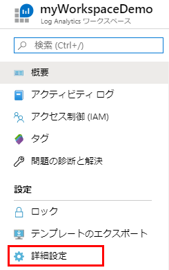

2.  **データ** を選択してから、**Windows イベント ログ** を選択します。

3.  ログの名前を入力して、イベントログを追加します。  **システム** を入力してから、プラス記号 **+** を選択します。

4.  テーブルで、重大度 **エラー** と **警告** を確認します。

5.  ページの上部で **保存** を選択して、構成を保存します。

6.  **Windows パフォーマンス データ** を選択して、Windows コンピューターでパフォーマンス カウンターのコレクションを有効にします。

7.  新しい Log Analytics ワークスペースの Windows パフォーマンス カウンターを最初に構成すると、いくつかの一般的なカウンターをすばやく作成するオプションが提供されます。それらは、それぞれの横にチェックボックス付きでリストされています。

       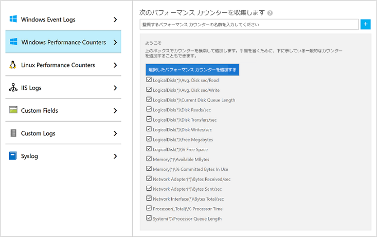

    **選択したパフォーマンス カウンターを追加する** を選択します。  それらは追加され、10 秒の収集サンプル間隔で事前設定されます。
  
8.  ページの上部で **保存** を選択して、構成を保存します。


### タスク 4：収集されたデータを表示する


データ コレクションを有効にしたので、簡単なログ検索の例を実行して、ターゲット VM の一部データを確認します。  


1.  選択したワークスペースで、左側のペインから **ログ** を選択します。

2.  「ログ」クエリページで、クエリ エディターに「Perf」と入力し、**実行** を選択します。

       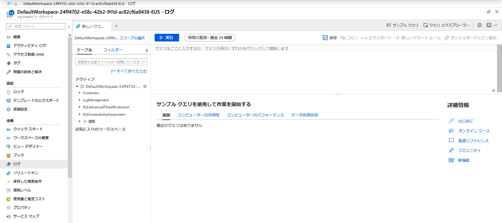

    たとえば、次の画像のクエリは 10,000 件のパフォーマンス レコードを返しました。VM は数分間しか実行されないため、結果は大幅に少なくなります。

       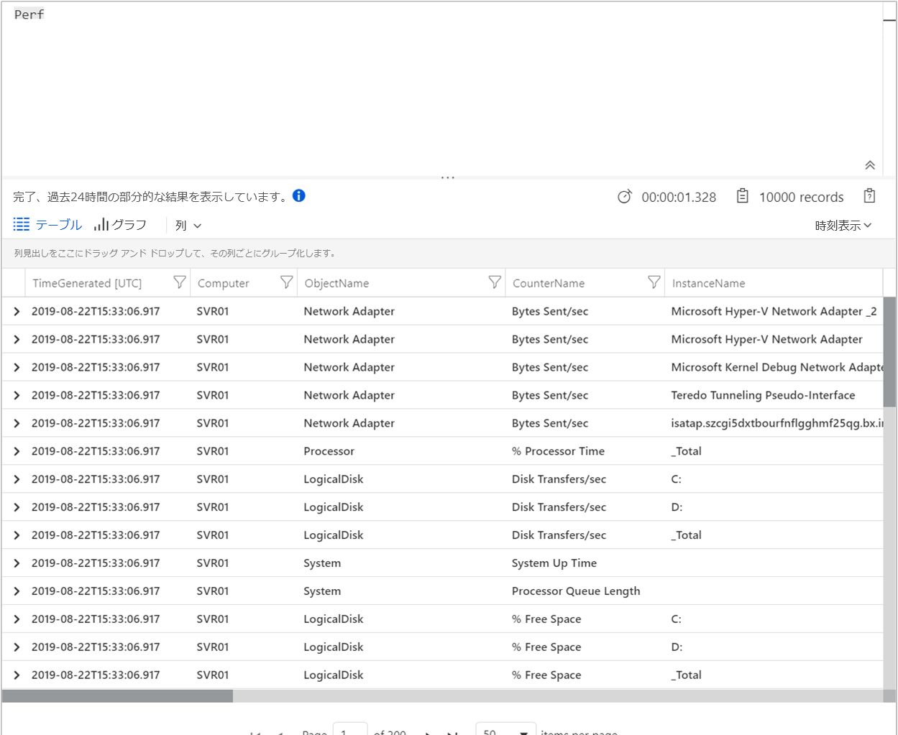

## 演習 2：Azure Monitor Application Insights で Web サイトを監視する


Azure Monitor Application Insights を使用すると、可用性、パフォーマンス、および使用状況について Web サイトを簡単に監視できます。また、ユーザーがエラーを報告するのを待たずに、アプリケーションのエラーをすばやく特定して診断することもできます。Application Insights は、サーバー側の監視機能とクライアント/ブラウザー側の監視機能の両方を提供します。

この演習では、オープンソースの Application Insights JavaScript SDK を追加して、Web サイトへの訪問者のクライアント/ブラウザー側のエクスペリエンスを理解できるようにします。


### タスク 1：Application Insights を有効にする


Application Insights は、オンプレミスまたはクラウドで実行されているインターネット接続アプリケーションから利用統計情報を収集できます。このデータの表示を開始するには、次の手順を使用します。


1.  **リソースを作成する** > **管理ツール** > **Application Insights** を選択します。

    構成ボックスが表示されます。次のテーブルを使用して、入力フィールドに入力します。

   | 設定        | 値   | 
   | ------------- |-----|
   | **名前**      | グローバルに一意の値を入力する |
   | **リソース グループ**     | mySResourceGroup |
   | **保存先** | 米国東部 |

2.  **作成** をクリックします。

### タスク 2：HTML ファイルを作成する

1.  ローカルコンピューターで、「hello_world.html」というファイルを作成します。この例では、ファイルは「C：\ hello_world.html」で C:ドライブのルートに配置されます。
2.  以下のスクリプトを「hello_world.html」にコピーします：

    ```html
    <!DOCTYPE html>
    <html>
    <head>
    <title>Azure Monitor Application Insights</title>
    </head>
    <body>
    <h1>Azure Monitor Application Insights Hello World!</h1>
    <p>You can use the Application Insights JavaScript SDK to perform client/browser-side monitoring of your website. To learn about more advanced JavaScript SDK configurations visit the <a href="https://github.com/Microsoft/ApplicationInsights-JS/blob/master/API-reference.md" title="API Reference">API reference</a>.</p>
    </body>
    </html>
    ```

### タスク 3：App Insights SDK を構成する

1.  **概要** > **Essentials** > アプリケーションの **計装キー** のコピーを選択します。

       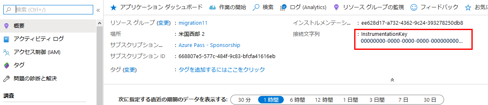

2.  ``</head>``タグを閉じる前に、以下のスクリプトを``hello_world.html``に追加します。

       ```javascript
        <script type="text/javascript">
          var sdkInstance="appInsightsSDK";window[sdkInstance]="appInsights";   var aiName=window[sdkInstance],aisdk=window[aiName]||function(e)   {function n(e){t[e]=function(){var n=arguments;t.queue.push(function   (){t[e].apply(t,n)})}}var t={config:e};t.initialize=!0;var     i=document,a=window;setTimeout(function(){var n=i.createElement ("script");n.src=e.url||"https://az416426.vo.msecnd.net/scripts/b/   ai.2.min.js",i.getElementsByTagName("script")[0]   .parentNode.appendChild(n)});try{t.cookie=i.cookie}catch(e){}t.queue=  [],t.version=2;for(var r=["Event","PageView","Exception","Trace", "DependencyData","Metric","PageViewPerformance"];r.length;)n("track" +r.pop());n("startTrackPage"),n("stopTrackPage");var s="Track"+r[0]; if(n("start"+s),n("stop"+s),n("setAuthenticatedUserContext"),n   ("clearAuthenticatedUserContext"),n("flush"),! (!0===e.disableExceptionTracking||e.extensionConfig&&    e.extensionConfig.ApplicationInsightsAnalytics&&    !0===e.extensionConfig.ApplicationInsightsAnalytics.    disableExceptionTracking)){n("_"+(r="onerror"));var o=a[r];a[r] =function(e,n,i,a,s){var c=o&&o(e,n,i,a,s);return!0!==c&&t["_"+r](   {message:e,url:n,lineNumber:i,columnNumber:a,error:s}),c}, e.autoExceptionInstrumented=!0}return t}(
          {
             instrumentationKey:"INSTRUMENTATION_KEY"
          }
          );window[aiName]=aisdk,aisdk.queue&&0===aisdk.queue.length&&  aisdk.trackPageView({});
       </script>
       ```

3.  `` hello_world.html``を編集して、インストルメンテーション キーを追加します。

4.  ローカル ブラウザー セッションで `` hello_world.html``を開きます。これにより、単一のページビューが作成されます。ブラウザーを更新して、複数のテスト ページ ビューを生成できます。

### タスク 4：Azure portal でモニタリングを開始する

1.  インストルメンテーション キーを取得した Azure portal で Application Insights **概要** ページを再度開いて、現在実行中のアプリケーションの詳細を表示できます。概要ページの 4 つのデフォルトチャートは、サーバー側のアプリケーション データを対象としています。JavaScript SDK を使用してクライアント/ブラウザー側の対話を実装しているため、サーバー側 SDK もインストールされていない限り、この特定のビューは適用されません。

2.  クリック      アプリケーションマップアイコン  **分析**。  これにより **分析** が開きます。ここでは、Application Insights によって収集されたすべてのデータを分析するための豊富なクエリ言語を提供します。クライアント側のブラウザー リクエストに関連するデータを表示するには、次のクエリを実行します。

    ```json
    //名前ごとの平均 pageView 期間
    let timeGrain=1s;
    let dataset=pageViews
    //ここで追加のフィルターを適用できます
    | where timestamp > ago(15m)
    | where client_Type == "Browser" ;
    //すべての pageView の平均 pageView 期間を計算します
    dataset
    | summarize avg(duration) by bin(timestamp, timeGrain)
    | extend pageView='Overall'
    //結果をグラフで表示します
    | render timechart
    ```

       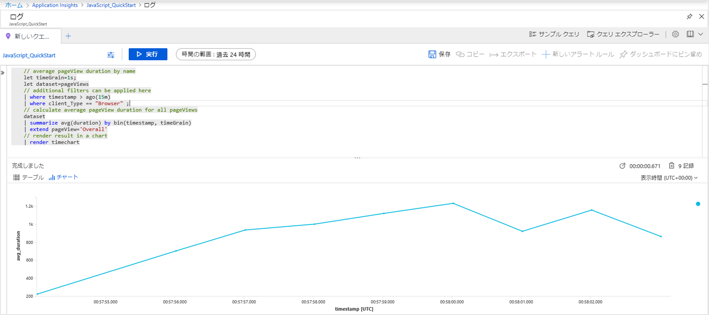

3.  **概要** ページに戻ります。**調査する** ヘッダーから **ブラウザー** をクリックしてから、**パフォーマンス** を選択します。ここでは、Web サイトのパフォーマンスに関連するメトリックがあります。また、Web サイトの失敗と例外を分析する対応ビューもあります。**サンプル** をクリックして、個々のトランザクションの詳細を分析します。ここから、エンドツーエンドのトランザクションの詳細にアクセスできます。

       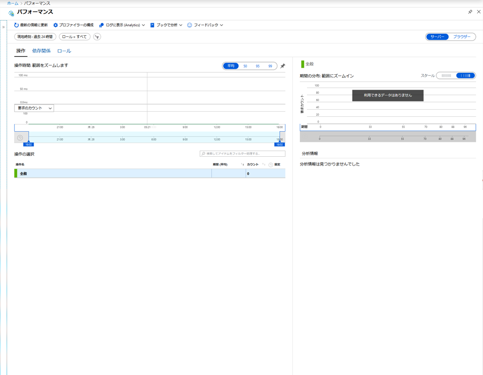

4.  ユーザー行動分析ツールの探索を開始するには、メインの Application Insights メニューから、**使用法** ヘッダーで **ユーザー** を選択します。単一のマシンからテストしているため、1 人のユーザーのデータのみが表示されます。ライブ Web サイトの場合、ユーザーの分布は次のようになります。

       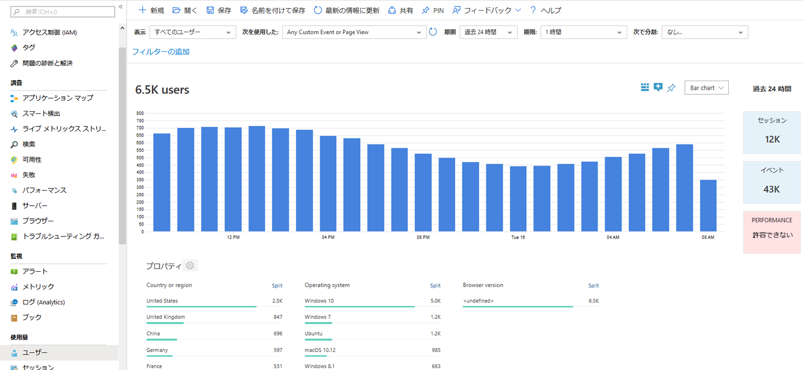
    
5.  複数のページを持つより複雑な Web サイトをインスツルメント化した場合、別の便利なツールは[**ユーザーフロー**](../../azure-monitor/app/usage-flows.md)です。**ユーザー フロー** を使用すると、Web サイトのさまざまな部分を訪問者がたどる経路を追跡できます。

      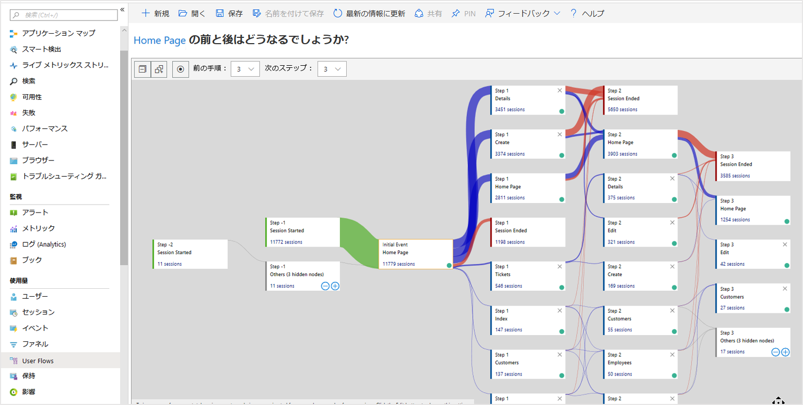

1.  すべてのリソースを残します。  これらは将来のラボで使用します。


**結果**：このラボでは、Azure Monitor を使用してリソースを監視する方法を学びました。

