---
lab:
    title: 'ラボ 2 - Security Center'
    module: 'モジュール 3：セキュリティ操作の管理'
---

# モジュール 3：ラボ 2 - Security Center

Azure Security Center は、データ センターのセキュリティ体制を強化し、Azure 内であろうとオンプレミスであろうと、クラウド内のハイブリッド ワークロード全体の高度な脅威保護を備えた統合インフラストラクチャ セキュリティ管理システムです。

リソースを安全に保つことは、クラウド プロバイダーである Azure とお客様であるあなたとの共同して行うことです。クラウドへの移行時にワークロードが安全であることを確認する必要があります。同時に、IaaS (サービスとしてのインフラストラクチャ) に移行すると、PaaS (サービスとしてのプラットフォーム) および SaaS (サービスとしてのソフトウェア) よりも顧客の責任が大きくなります。Azure Security Center は、ネットワークを強化し、サービスを保護し、セキュリティ体制を確実に整えるために必要なツールを提供します。

## 演習 1：Security Center Standard への Azure サブスクリプションのオンボード

Azure Security Center は、ハイブリッド クラウド ワークロード全体で統一されたセキュリティ管理と脅威保護を提供します。Free レベルでは Azure リソースに対してのみ限定的なセキュリティが提供されますが、Standard レベルではこれらの機能をオンプレミスやその他のクラウドに拡張します。Security Center の Standard レベルは、セキュリティの脆弱性の検出と修正、悪意のあるアクティビティをブロックするためのアクセス制御とアプリケーション制御の適用、分析とインテリジェンスを使用した脅威の検出、攻撃を受けたときのすばやい対応を支援します。Security Center Standard を無料で試すことができます。詳細については、価格のページをご覧ください。

この演習では、セキュリティを強化するために Standard レベルにアップグレードし、仮想マシンに Microsoft Monitoring Agent をインストールして、セキュリティの脆弱性と脅威を監視します。

### タスク 1：データ管理の自動化

Security Center は、Azure VM および Azure 以外のコンピューターからデータを収集して、セキュリティの脆弱性と脅威を監視します。データは、Microsoft Monitoring Agent を使用して収集されます。MicrosoftMonitoring Agent は、マシンからさまざまなセキュリティ関連の構成とイベント ログを読み取り、分析のためにデータをワークスペースにコピーします。デフォルトでは、Security Center が新しいワークスペースを作成します。

自動プロビジョニングを有効にすると、Security Center は、サポートされているすべての Azure VM および作成される新しい Azure VM に Microsoft Monitoring Agent をインストールします。自動プロビジョニングを強くお勧めします。

Microsoft Monitoring Agent の自動プロビジョニングを有効にするには：

1.  Azure Portal で、ハブ メニューから **Security Center** を選択します。

     

1.  **開始** ブレードで、**アップグレード** をクリックします。

     
     
1.  Security Center のメインメニューで、**価格と設定** を選択します。

2.  サブスクリプションの行で、設定を変更するサブスクリプションをクリックします。
3.  **「データ収集」** タブで、 **「自動プロビジョニング」** を **「オン」** に設定します。
4.  ブレードを保存 **せずに** 終了します。

    **注記**：保存をクリックしないようにしてください。保存をクリックすると、次の演習が期待どおりに機能します。

 
     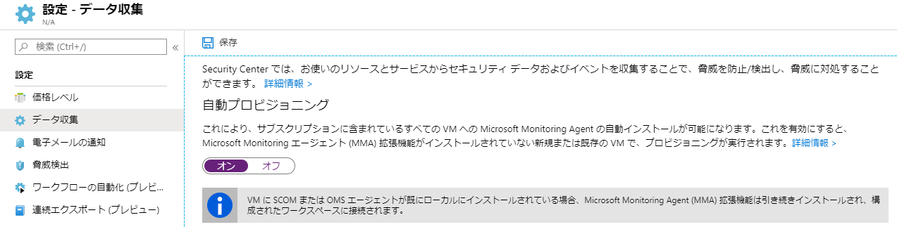

 Azure VM に関するこの新しい分析情報により、Security Center は、システム更新ステータス、OS セキュリティ構成、エンドポイント保護に関連する追加のレコメンデーションを提供し、追加のセキュリティの通知を生成できます。

## 演習 2：Azure Security Center への Windows コンピューターのオンボード

Azure サブスクリプションをオンボードした後、Microsoft Monitoring Agent をプロビジョニングすることにより、Azure の外部 (オンプレミスまたは他のクラウドなど) で実行されるリソースの Security Center を有効にできます。

この演習では、Windows コンピューターに Microsoft Monitoring Agent をインストールする方法を示します。

### タスク 1：新しい Windows コンピューターを追加する

1.  Azure Portal で、**Security Center** をクリックします。**Security Center  - 概要** が開きます。

       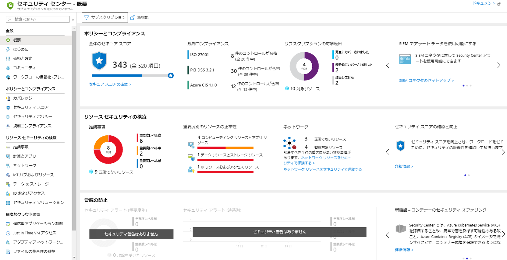

3.  Security Center のメインメニューで、**開始** を選択する。
4.  **エージェントをインストールする** タブを選択します。

       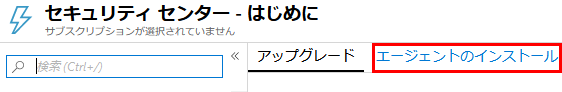

5.  「エージェントを自動的にインストールする」セクションまでスクロールし、**エージェントをインストールする** をクリックします。

     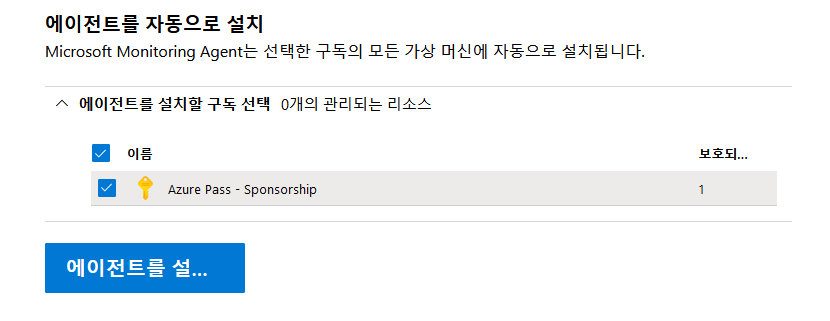

1.  デプロイを監視して、エージェントがインストールされるまで待ちます。

     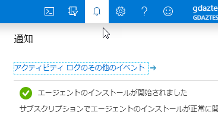
 
1.  **Security Center** を開いて、**コンピューティングとアプリ** をクリックしてから、**VM とコンピューター** をクリックします。

     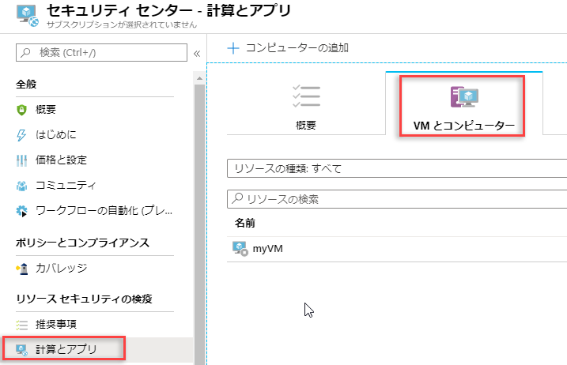
 
1.  仮想マシンが監視されていることに注意してください。

## 演習 3：Azure Security Center でアラートを管理して対応する

Security Center では、真の脅威を検出し、誤検知を減らすために、Azure のリソースやネットワークから、ログ データを自動的に収集、分析、統合します。 接続されているパートナー ソリューション (ファイアウォールやエンドポイント保護ソリューションなど) とも連動します。Security Center では、アラートに優先順位を付け、問題の迅速な調査に必要な情報と共に一覧表示します。また、攻撃をどのように修復できるかに関するレコメンデーションも提供します。

### タスク 1：アラートを管理する
 
1.  Security Center のダッシュボードから、**脅威からの保護** タイルを表示して、アラートの概要を表示します。

    **注記**：タイルが **セキュリティの通知なし** を表示する場合、評価が実行されるまでしばらく待つ必要があります。

       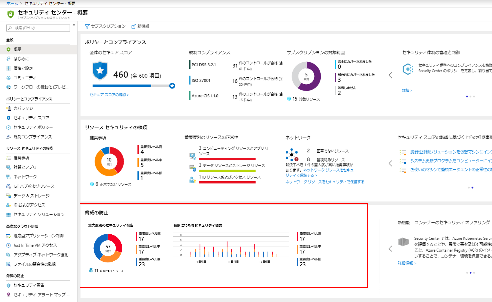

1.  アラートの詳細を表示するには、タイルをクリックします。  以下のスクリーンショットは、実際に表示される可能性のあるアラートを示しています。

       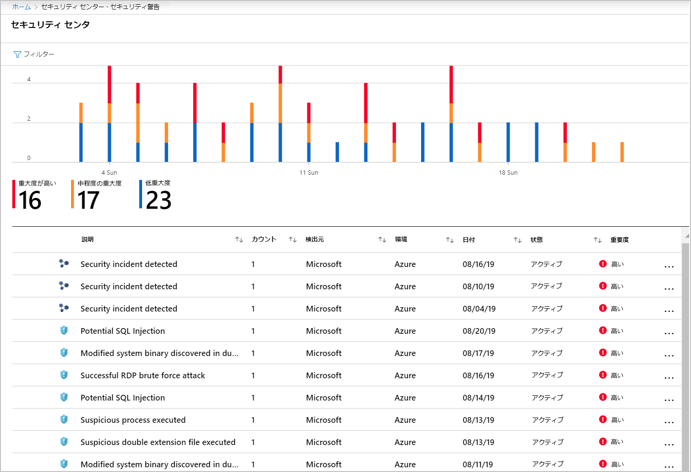

1.  表示されるアラートをフィルタリングするには、**フィルター** をクリックして、開いた **フィルター** ブレードから、適用するフィルターオプションを選択します。選択したフィルターに従ってリストが更新されます。フィルタリングは非常に役立つ場合があります。たとえば、システムの潜在的な侵害を調査しており、直近 24 時間以内に発生したセキュリティの通知に対処したい場合などです。

       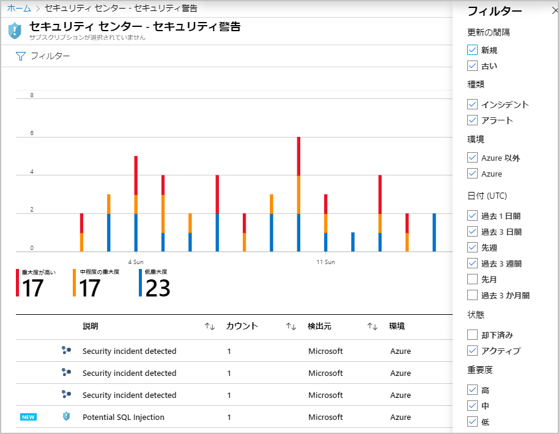

### タスク 2：レコメンデーションへの対応

1.  Azure Security Center で、**概要** をクリックします。

1.  **リソース セキュリティ衛生状態** リストから、**重大度別によるリソースの正常性** セクションで、**計算とアプリのリソース** を選択します

     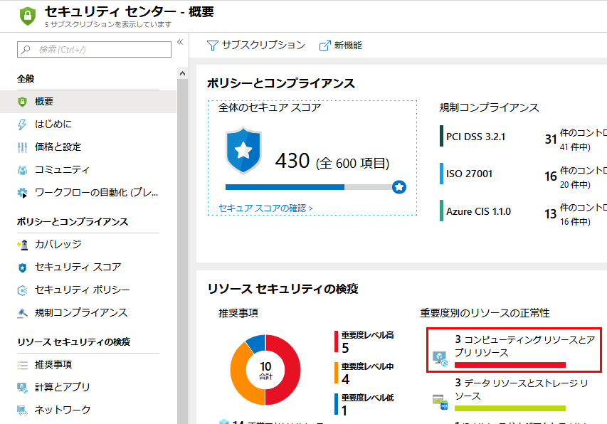

1.  レコメンデーションをレビューします。

       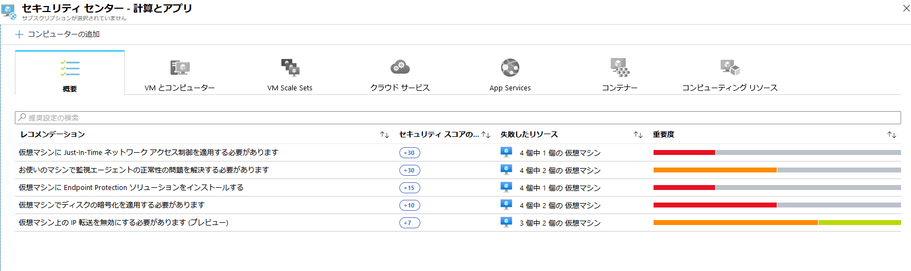

| 警告：続行する前に、このラボで使用したすべてのリソースを削除する必要があります。  **Azure Portal** でこれを行うには、**リソース グループ** をクリックします。  作成したリソース グループを選択します。  リソース グループ ブレードで、**リソース グループを削除** をクリックし、リソース グループ名を入力して、**削除** をクリックします。  作成した可能性のある追加のリソース グループに対してプロセスを繰り返します。**これを行わないと、他のラボで問題が発生する可能性があります。** |
| --- |

**結果**：これで、このラボは完了し、シリーズの次の実習ラボに進むことができます

