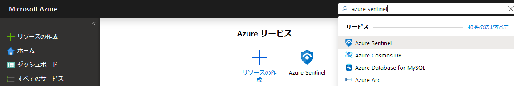
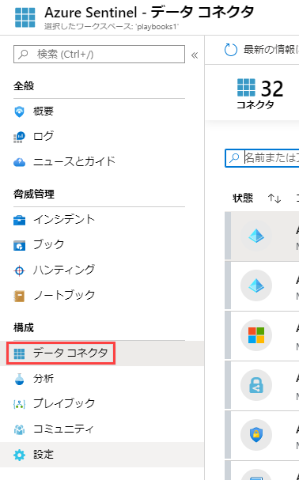
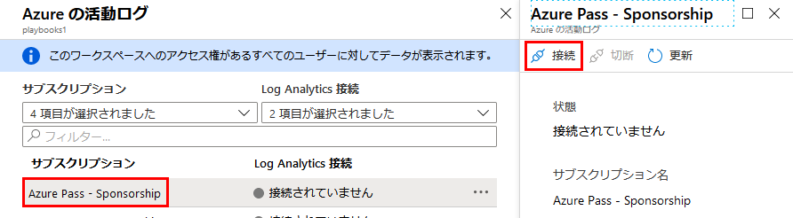

---
lab:
    title: 'ラボ 4 - Azure Sentinel'
    module: 'モジュール 3：セキュリティ操作の管理'
---

# モジュール 3：ラボ 4 - Azure Sentinel

Azure Sentinel は、企業全体の鳥瞰図です。数十年にわたるマイクロソフトのセキュリティ エクスペリエンスによる、クラウドと大規模なインテリジェンスを活用してください。人工知能 (AI) を使用して、脅威の検出と対応をよりスマートかつ高速に行います

## 演習 1：Azure Sentinel をオンボードにする

Azure Sentinel をオンボードするには、最初に Azure Sentinel を有効にしてから、データソースを接続する必要があります。Azure Sentinel には、Microsoft Threat Protection ソリューション、Office 365 などの Microsoft 365 ソース、Azure AD、Azure ATP、Microsoft Cloud App Security など、Microsoft ソリューション用のコネクタがすぐに利用でき、リアルタイム統合を提供します。さらに、Microsoft 以外のソリューション向けのより広範なセキュリティ エコシステムへの組み込みコネクタがあります。一般的なイベント形式、Syslog、または REST-API を使用して、データソースを Azure Sentinel に接続することもできます。  

データソースを接続したら、データに基づいて洞察を明らかにする専門的に作成されたワークブックのギャラリーから選択します。これらのワークブックは、ニーズに合わせて簡単にカスタマイズできます。

### タスク 1：Azure Sentinel を有効にする

1.  Azure portal で、Azure Sentinel を検索します。 

       

1.  **+ 追加** をクリックします。
1.  必要に応じて、米国東部地域を使用して、新しいリソース グループに新しいワークスペースを作成します。

    **注記**：  - Azure Security Center によって作成されたデフォルトのワークスペースはリストに表示されません。Azure Sentinel をそれらにインストールすることはできません。  - Azure Sentinel は、中国、ドイツ、Azure Government リージョンを除く、Log Analytics の GA リージョンのワークスペースで実行できます。Azure Sentinel によって生成されたデータ (インシデント、ブックマーク、アラート ルールなど、これらのワークスペースからの顧客データを含む場合があります) は、西ヨーロッパ (ヨーロッパにあるワークスペースの場合) または米国東部 (すべての米国ベースのワークスペースの場合およびヨーロッパを除くその他の地域) に保存されます。

6.  **Azure Sentinel を追加** をクリックします。
  

### タスク 3：データ ソースに接続する

Azure Sentinel は、サービスに接続し、イベントとログを Azure Sentinel に転送することで、サービスとアプリへの接続を作成します。マシンと仮想マシンの場合は、ログを収集して Azure Sentinel に転送する Azure Sentinel エージェントをインストールできます。ファイアウォールとプロキシの場合、Azure Sentinel は Linux Syslog サーバーを使用します。エージェントは、それにインストールされ、そこからエージェントがログ ファイルを収集し、Azure Sentinel に転送します。 

1.  Azure Portal で「すべてのリソース」を選択し、前のタスクで作成した Log Analytics ワークスペースを選択します。

1.  メニューで、 **データ コネクタ** を選択します。このページでは、Azure Sentinel が提供するコネクタの完全なリストとそのステータスを確認できます。接続するコネクタを選択して、**コネクタページを開く** を選択します。 

       

1.  **Azure Activity** を選択して、**コネクタ ページを開く** をクリックします。

1.  **Azure Activity ログを構成する** を選択します。

     

1.  特定のコネクタページで、すべての前提条件を満たしていることを確認し、指示に従ってデータを Azure Sentinel に接続します。ログが Azure Sentinel との同期を開始するまでに時間がかかる場合があります。接続すると、**受信データ** グラフにデータの概要とデータ型の接続性ステータスが表示されます。

   

1.  Azure サブスクリプションを選択して、**接続** をクリックします。

     
 

**結果**：これで、このラボを完了しました。
