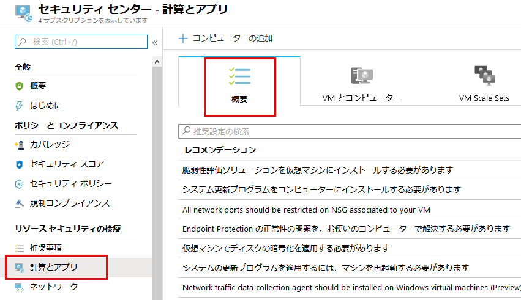
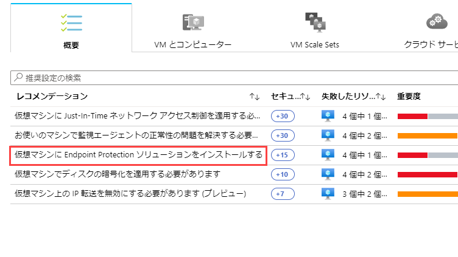
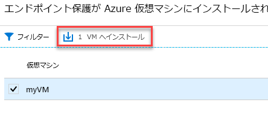

---
lab:
    title: 'ラボ 5 - Azure Security Center でエンドポイント保護の問題を管理する'
    module: 'モジュール 3：セキュリティ操作の管理'
---

# モジュール 3：ラボ 5 - Azure Security Center でエンドポイント保護の問題を管理する

Azure Security Center は、マルウェア保護の状態を監視し、「Endpoint protection issues」 (Endpoint Protection の問題) ブレードでこれを報告します。Security Center では、仮想マシン (VM) やコンピューターをマルウェアのの脅威に対して脆弱にする可能性のある問題 (検出された脅威や不十分な保護など) が示されます。**「Endpoint protection issues」 (Endpoint Protection の問題)**に表示される情報を使用して、特定された問題に対処する計画を立てることができます。

Security Center では、次の Endpoint Protection の問題が報告されます。

- Azure VM にインストールされていないエンドポイント保護 - サポートされているマルウェア対策ソリューションがこれらの Azure VM にインストールされていません。
- Endpoint Protection が Azure 以外のコンピューターにインストールされていません - サポートされているマルウェア対策がこれらの Azure 以外のコンピューターにインストールされていません。
- エンドポイント保護の正常性：

  - シグネチャが最新ではありません - これらの VM とコンピューターにはマルウェア対策ソリューションがインストールされていますが、ソリューションに最新のマルウェア対策シグネチャがありません。
  - リアルタイム保護なし - これらの VM とコンピューターにはマルウェア対策ソリューションがインストールされていますが、リアルタイム保護を使用するようにソリューションが構成されていません。 
  - レポートなし - マルウェア対策ソリューションはインストールされていますが、データが報告されていません。
  - 不明 - マルウェア対策ソリューションはインストールされていますが、状態が不明であるか、不明なエラーが報告されています。

## 演習 1：推奨事項を実装する

エンドポイント保護イシューは、Security Centerでレコメンデーションとして提示されます。  環境がマルウェアの脅威に対して脆弱であると判断された場合、**レコメンデーション** と **コンピューティング**にこのレコメンデーションが表示されます。**Endpoint Protection イシュー ダッシュボード** を表示するには、コンピューティング ワークフローに従います。

この演習では、**コンピューティング** を使用します。  Azure VM および Azure 以外のコンピューターにマルウェア対策をインストールする方法を見ていきます。

### タスク 1：Azure VM にマルウェア対策をインストールする

1.  Security Center のメイン メニューまたは **概要** で、**コンピューティングおよびアプリ** を選択します。

       

2.  **コンピューティング** で、**仮想マシンにエンドポイント保護ソリューションをインストールする** を選択します。**Endpoint Protection の問題** ダッシュボードが開きます。

       

1.  **Endpoint Protection が Azure VMにインストールされていません** ブレードで、**1 VM にインストール** をクリックします。

     

5.  **「Endpoint Protection の選択」** で、使用する Endpoint Protection ソリューションを選択します。この例では、**「 Microsoft Antimalware」**  を選択します。

6.  エンドポイント保護ソリューションに関する追加情報が表示されます。**OK** を選択します。

**結果**：これで、このラボを完了しました。
