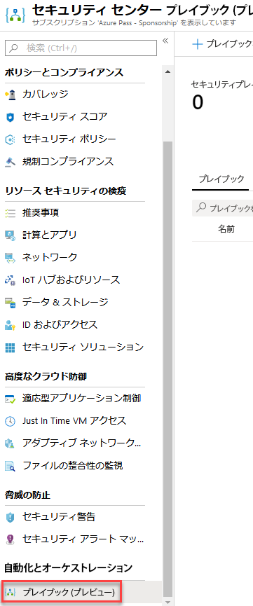
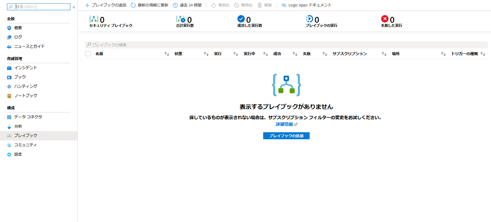
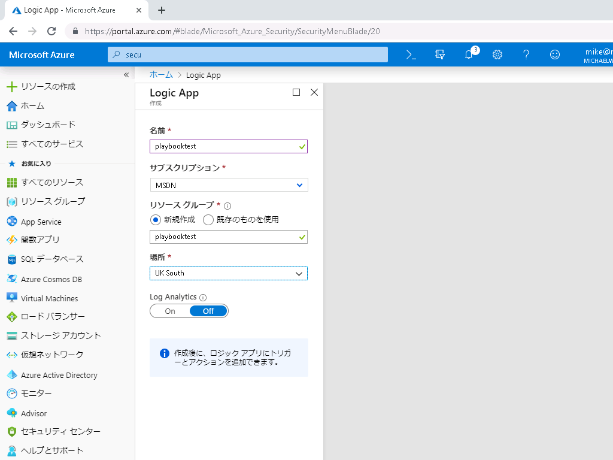
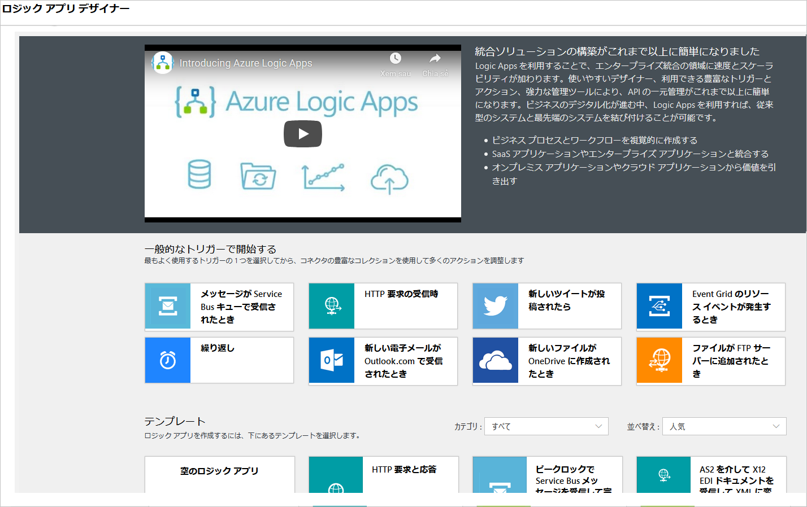
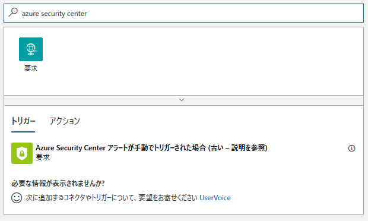
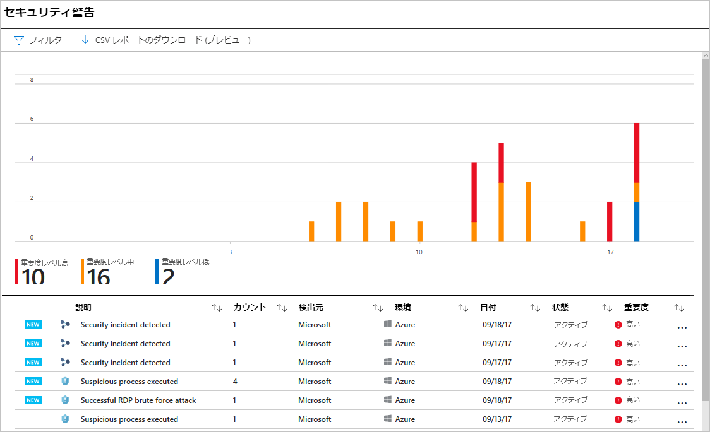
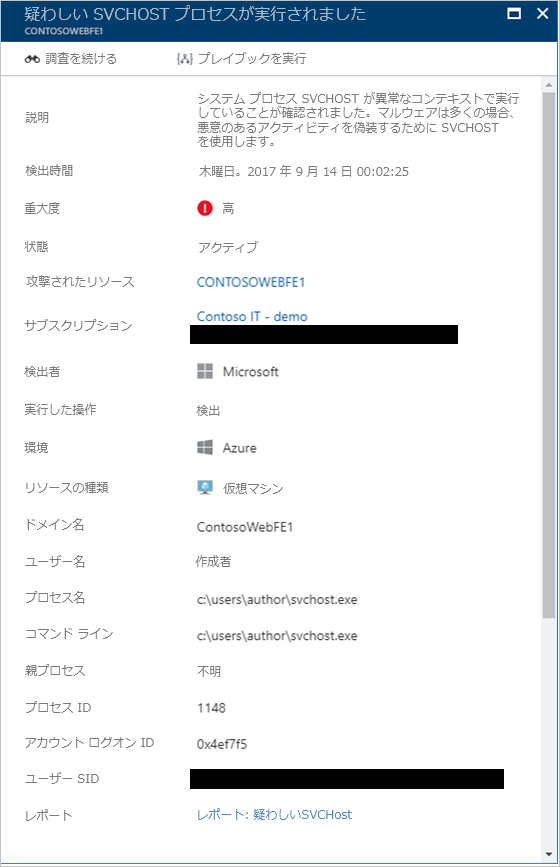
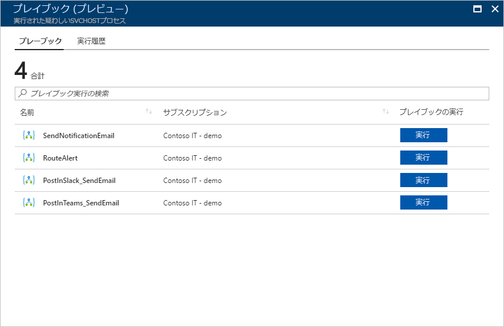
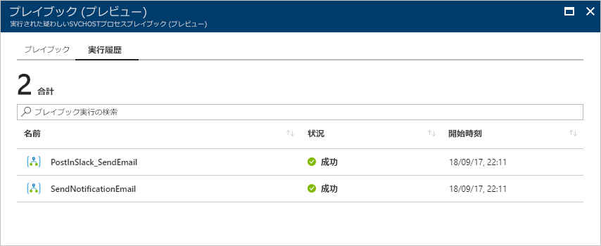

---
lab:
    title: 'ラボ 6 - Azure Security Center のセキュリティ プレイブック'
    module: 'モジュール 3：セキュリティ操作の管理'
---

# モジュール 3：ラボ 6 - Azure Security Center のセキュリティ プレイブック

セキュリティ プレイブックとは、選択したアラートから特定のプレイブックがトリガーされると、Security Center から実行できるプロシージャのコレクションです。セキュリティ プレイブックは、Security Center で検出された特定のセキュリティの通知への応答を自動化および調整するのに役立ちます。Security Center のセキュリティ プレイブックは、Azure Logic Apps に基づいています。つまり、Logic Apps テンプレートのセキュリティ カテゴリに用意されているテンプレートを使用することも、必要に応じてそれらを変更することもできます。また、Azure Logic Apps ワークフロー を使用し、Security Center をトリガーとして使用して、新しいプレイブックを作成することもできます。

## 演習 1：Azure でセキュリティ プレイブックを作成および管理します。

### タスク 1：Security Center からセキュリティ プレイブックを作成するには方法

次の手順に従って、Security Center から新しいセキュリティ プレイブックを作成します。

1.  **Security Center** ダッシュボードを開きます。

Security Center のオプションがグレー表示されている場合は、「はじめに」ペインで、**試用を開始** をクリックします

2.  左ペインの **自動化とオーケストレーション** セクションで、**プレイブック (プレビュー)** をクリックします。

       

	

3.  **Security Center - プレイブック (プレビュー)** ページで、**プレイブックを追加** ボタンをクリックします。

     

 

4.  **ロジック アプリを作成する** ページで、一意の名前を入力して新しいロジックアプリを作成し、**作成** ボタンをクリックします。**一意の名前で新しいリソース グループを作成する** 作成が完了すると、新しいプレイブックがリストに表示されます。表示されない場合は、**更新** ボタンをクリックします。表示されたら、クリックしてこのプレイブックの編集を開始します。

      
    
5.  **ロジック アプリ デザイナー** が表示されます。**空のロジック アプリ** をクリックすると、新しいプレイブックを作成します。カテゴリで **セキュリティ** を選択して、テンプレートのいずれかを使用することもできます。

    

6.  **すべてのコネクタとトリガーを検索する** フィールドで、*Azure Security Center* を入力して、**Azure Security Center アラートへの応答がトリガーされたとき** を選択します。

    

7.  これで、プレイブックをトリガーしたときに何が起こるかを定義できます。アクション、論理条件、スイッチケース条件、またはループを追加できます。**新しいステップ** をクリックして、セキュリティの通知で発生する可能性のあるアクションのリストを参照します。カスタムアクションとコードは、アラートでトリガーすることもできます。

8.  保存をクリックして、トリガー アクションの有無にかかわらずプレイブックを保存します

### タスク 2：Security Center でセキュリティ プレイブックを実行する方法

調整したいとき、他のサービスからより多くの情報を取得したいとき、または修正したいときに、Security Center でセキュリティ プレイブックを実行できます。プレイブックにアクセスするには、次の手順に従います。

1.  **Security Center** ダッシュボードを開きます。

2.  左側のペインで、**脅威からの保護** で、**セキュリティの通知** をクリックします。

    

3.  調査するアラートをクリックします。

**注記**：ラボ環境にセキュリティの通知がない場合があります。この場合、スクリーンショットを参照してアラートの外観をプレビューできます

4.  アラートのページの上部で、**プレイブックを実行する** ボタンをクリックします。

    
    
5.  プレイブック ページで、実行するプレイブックを選択し、**実行** ボタンをクリックします。トリガーする前にプレイブックを表示したい場合は、クリックしてデザイナーを開きます。

    

### タスク 3：履歴

プレイブックを実行した後、以前の実行、および以前に実行されたプレイブックのステータスに関する詳細情報を含むステップにアクセスすることもできます。履歴はアラートごとにコンテキスト化されます。つまり、このページに表示されるプレイブックの履歴は、このプレイブックをトリガーしたアラートと相関しています。

   

1.  特定のプレイブックの実行に関する詳細を確認するには、プレイブック自体をクリックすると、ロジック アプリの実行ページにワークフロー全体が表示されます。

     

2.  このワークフローでは、各タスクの実行にかかった時間を確認でき、各タスクを展開して結果を確認できます。

**注記**：Azure Logic Apps を使用して独自のプレイブックを作成する方法の詳細については、 [クラウド アプリとクラウド サービス間のプロセスを自動化する最初のロジック アプリ ワークフローを作成する](https://docs.microsoft.com/azure/logic-apps/logic-apps-create-a-logic-app)を読んでください。

**結果**：このラボでは、Azure Security Center でプレイブックを使用する方法を学びました。

