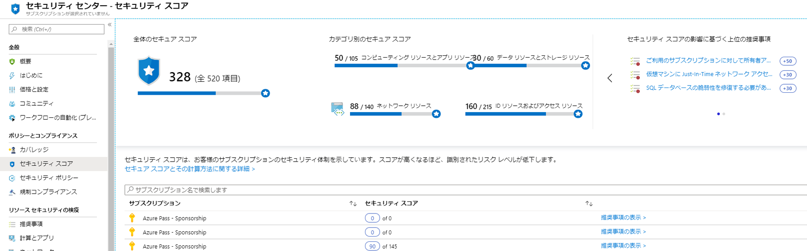
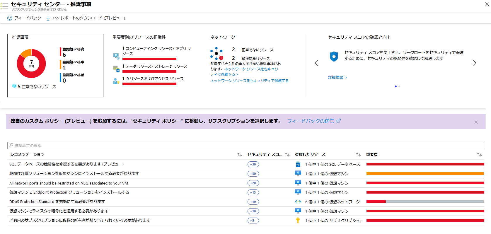
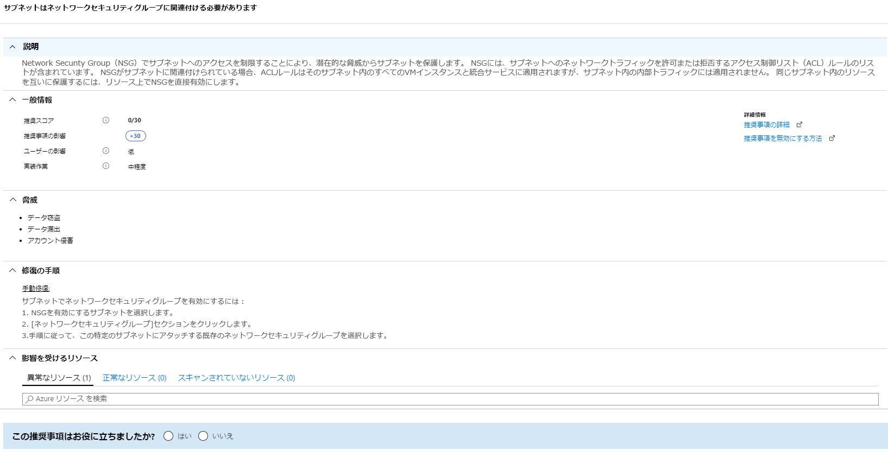

---
lab:
    title: 'ラボ 7 - Azure Security Center のセキュア スコア'
    module: 'モジュール 3：セキュリティ操作の管理'
---

# モジュール 3：ラボ 7 - Azure Security Center のセキュア スコア

セキュリティ上のベネフィットを提供する非常に多くのサービスでは、通常、ワークロードのセキュリティ保護と強化のために最初に実行する手順を知るのが困難です。Azure セキュア スコアでは、セキュリティに関するレコメンデーションがレビューされ、それらの優先順位が示されるので、ユーザーはどのレコメンデーションを最初に実行するかが分かります。これにより、最も重大なセキュリティの脆弱性を見つけやすくなるため、調査に優先順位を付けることができます。セキュア スコアは、ワークロードのセキュリティ状態を評価するのに役立つツールです。

**セキュア スコアの計算**

Security Center では、セキュリティ アナリストの作業を模倣して、セキュリティに関するレコメンデーションをレビューし、各レコメンデーションの重要度を判断する高度なアルゴリズムを適用します。
Azure Security Center は、アクティブなレコメンデーションを常にレビューし、それに基づいてセキュア スコアを計算します。レコメンデーションのスコアは、ワークロードのセキュリティに最も影響を与える重大度とセキュリティのベストプラクティスから導出されます。

Security Center では、全体的なセキュア スコアも提供されます。 

全体的なセキュア スコアは、すべてのレコメンデーションのスコアを累積したものです。選択した項目に応じて、サブスクリプションまたは管理グループ全体で、全体的なセキュア スコアを表示できます。スコアは、選択したサブスクリプションと、それらのサブスクリプションに対するアクティブなレコメンデーションによって異なります。

 
## 演習 1：Azure Security Center でセキュア スコアを向上させます。

### タスク 1：Azure Portal でセキュア スコアを表示します。

1.  Azure ダッシュボードで、**Security Center** をクリックし、**セキュア スコア** をクリックします。
2.  上部には、セキュア スコアのハイライトが表示されます。

       - **総合セキュア スコア** は、選択されたサブスクリプションごとの各ポリシーのスコアを表します
       - **カテゴリ別セキュア スコア** は、最も注意が必要なリソースがどれかを示します
       - **セキュア スコアの影響による上位のレコメンデーション** は、実装した場合に最もセキュア スコアが最も向上するレコメンデーションの一覧を示します。

 
       

    
      **注記**：各サブスクリプションのセキュア スコアの合計は、総合セキュア スコアと一致しません。総合セキュア スコアは、正常なリソースとレコメンデーションごとのリソースの合計間の比率に基づく計算値であり、サブスクリプションのセキュア スコアの合計ではありません。 

3.  セキュア スコアを向上させるために修復できるサブスクリプションのレコメンデーションを表示するには、**レコメンデーションの表示** をクリックします。
4.  レコメンデーションのリストで、各レコメンデーションについて、**セキュア スコアの影響** を表す列があることがわかります。この数字は、推奨事項に従った場合に、全体的なセキュリティ スコアがどの程度向上するかを表します。たとえば、次の画面で、**コンテナーセキュリティ構成の脆弱性を修正する** と、セキュア スコアが 35 ポイント増加します。

       

### タスク 2：個々のセキュア スコアを表示します。

さらに、個々のセキュア スコアを表示するには、個々のレコメンデーション ブレード内でこれらを見つけることができます。  

**レコメンデーション セキュア スコア** は、正常なリソースとリソースの合計間の比率に基づいて計算されます。正常なリソースの数がリソースの総数と等しい場合に、レコメンデーションの最大セキュア スコアである 50 を得ることになります。最大スコアに近いセキュア スコアを取得するには、レコメンデーションに従って、異常なリソースを修正します。

**レコメンデーションの影響** では、レコメンデーションの手順を適用すると、セキュア スコアがどれだけ向上するかを知ることができます。たとえば、セキュア スコアが42で、 **レコメンデーションの影響** が +3 である場合、レコメンデーションに記載されている手順を実行すると、スコアが45に改善されます。

1.  「セキュア スコア」ブレードのいずれかのレコメンデーションをクリックします。

    レコメンデーションは、修復手順が実行されない場合にワークロードがさらされる脅威を示しています。

     

**結果**：このラボでは、Azure Security Center でセキュア スコアを改善する方法を学びました
