---
lab:
    title: 'ラボ 8 - セキュリティ ベースラインを作成する'
    module: 'モジュール 3：セキュリティ操作の管理'
---

# モジュール 3：ラボ 8 - セキュリティ ベースラインを作成する 

Azure はお客様の責任範囲内のセキュリティ インシデントについては監視や対応を行いません。Azure には、この目的に使用される多くのツール (Azure Security Center、 Azure Sentinel など) が用意されています。また、既定ですべてのサービスを可能な限り安全にする取り組みもあります。つまり、すべてのサービスには、最も一般的なユース ケースにセキュリティを提供するために既に設計されているベースラインが付属しています。ただし、Azure にはサービスの利用方法を予測できないため、これらのセキュリティ制御をレビューして、リスクを適切に軽減するかどうかを評価する必要があります。

このラボでは、Azure サービスのセキュリティベースラインについて説明します。各ユニットは、アーキテクチャで使用しているサービスについて確認するためのチェックリストを提供します。

このラボでは、次の内容を学習します。

- Azure プラットフォームのセキュリティ ベースラインとその作成方法を学ぶ
- 最も一般的に使用される Azure サービスのセキュリティ ベースラインを作成および検証する

 
## 演習 1：ID およびアクセス管理 (IAM) ベースラインの作成

ID 管理は、アクセス権を付与し、企業資産のセキュリティ強化を行ううえで重要です。クラウドベースの資産を保護および制御するには、Azure 管理者、アプリケーション開発者、アプリケーションユーザーの ID とアクセスを管理する必要があります。

**IAM のレコメンデーション**

ID およびアクセス管理のレコメンデーションを以下に示します。各レコメンデーションには、Azure portal で実行する基本的な手順が含まれています。 

### タスク 1：Azure AD 管理ポータルへのアクセスを制限する

機密データと最小限の特権のルールのため、管理者以外はアクセスするべきではありません。

1.  Azure portal にサインインします。

2.  左側で、**Azure Active Directory** > **ユーザーとグループ** を選択します。

3.  **ユーザー設定** に移動します。

4.  Azure AD administration portal へのアクセスの制限が「はい」に設定されていることを確認します。この値を「はい」に設定すると、管理者以外のすべてのユーザーが管理ポータルの Azure AD データにアクセスできなくなりますが、PowerShell や Visual Studio などの別のクライアントを使用したアクセスは制限されません。

       

1.  [**保存**] をクリックします。

### タスク 2：多要素認証 (MFA) を有効にする

特権ユーザーと非特権ユーザーに対して有効にします。

1.  Azure portal にサインインします。

2.  左側で、**Azure Active Directory** > **ユーザーとグループ** を選択します。

3.  **+ 新しいユーザー** をクリックします。

1.  「新しいユーザー」ブレードで、次の詳細を入力し、「作成」をクリックします。

      - **ユーザー名**： アッビ
      - **名前**: アッビ・スキナー
      - **名**： アッビ 
      - **姓**： スキナー
      - **ロール**： グローバル管理者を選択

2.  左側で、**Azure Active Directory** > **ユーザー** > **すべてのユーザー** を選択します。

3.  「Multi-Factor Authentication」を選択します。これにより、新しいウィンドウが開きます。

4.  アッビ・スキナーを選択して、**有効にする** をクリックします

       

1.  **多要素認証を有効にする** を選択してから、**閉じる** をクリックします。

     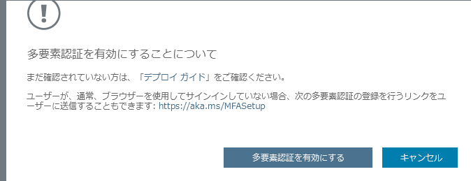
 
1.  アッビが MFA で有効になりました。

### タスク 3：信頼済みデバイス上で MFA の記憶をブロックする 

ユーザーが信頼できるデバイスとブラウザーの Multi-Factor Authentication の記憶機能は、すべての Multi-Factor Authentication のユーザーの無料機能です。ユーザーは、Multi-Factor Authentication を使用してデバイスに正常にサインインした後、指定した日数のその続の検証をバイパスできます。アカウントまたはデバイスが侵害された場合、信頼できるデバイスの Multi-Factor Authentication が記憶されると、セキュリティに悪影響を及ぼす場合があります。

1.  Azure portal にサインインします。

2.  左側で、**Azure Active Directory** > **ユーザー** > **すべてのユーザー** を選択します。

3.  「Multi-Factor Authentication」を選択します。

4.  **アッビ・スキナー** を選択してから、**ユーザー設定を管理する** をクリックします。

5.  **記憶されているすべてのデバイスで多要素認証を復元する** が選択されていることを確認してから、**保存** をクリックします。

       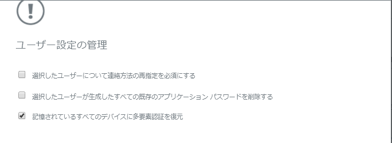

### タスク 4：ゲストについて 

このタスクでは、ゲストユーザーが存在しないことを確認します。または、ビジネスでゲストユーザーが必要な場合は、必ずアクセス許可を制限してください。

1.  Azure portal にサインインします。

2.  左側で、**Azure Active Directory** > **ユーザー** > **すべてのユーザー** を選択します。

3.  「表示」ドロップダウンを選択し、**ゲスト ユーザーのみ** を選択します。

4.  ゲスト ユーザーが一覧表示されていないことを確認します (「ユーザーのタイプ=ゲスト」)。

       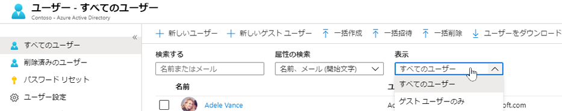

### タスク 5：パスワード オプション

デュアル ID を設定すると、攻撃者はユーザーのパスワードを悪意を持ってリセットする前に両方の ID フォームに不正アクセスしなければならなくなります。

1.  Azure portal にサインインします。

2.  左側で、**Azure Active Directory** > **ユーザーとグループ** を選択します。

3.  **パスワードのリセット** を選択します。

4.  「認証方法」に移動します。

5.  「リセットのために必要な方法の数」を 2 に設定します。

1.  2 つの方法を選択して、**保存** をクリックします。
    

### タスク 6：ユーザー認証方法を再確認するためのサイクル間隔を確立する 

認証の再確認が無効に設定されている場合、登録ユーザーは認証情報の再確認を求められません。

1.  Azure portal にサインインします。

2.  左側で、**Azure Active Directory** > **ユーザーとグループ** を選択します。

3.  **パスワードのリセット** に移動します。

4.  **登録** に移動します。

5.  「ユーザーが認証情報を再確認するように求められるまでの日数」が「0」に設定されていないことを確認します。デフォルトは 180 日です。

       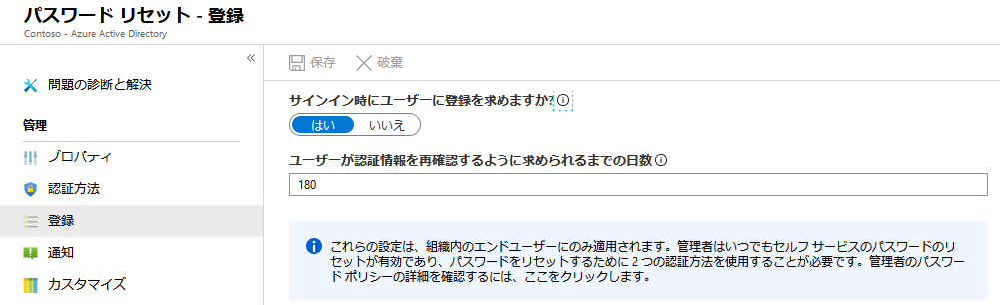

### タスク 7：メンバーとゲストは次のユーザーを招待できます 

これは「いいえ」に設定する必要があります。管理者が招待を制限すると、許可されたアカウントのみが Azure リソースにアクセスできるようになります。

1.  Azure portal にサインインします。

2.  左側で、**Azure Active Directory** > **ユーザーとグループ** を選択します。

3.  **ユーザー設定** に移動します。

4.  「外部ユーザー」に移動し、**外部コラボレーション設定を管理する** をクリックします。

5.  「メンバーが招待できる」が **いいえ** に設定されていることを確認します。

       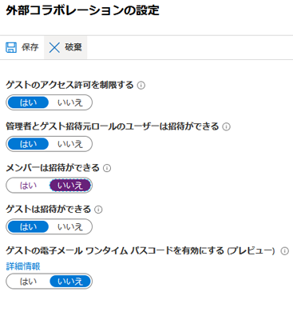

### タスク 8：セキュリティ グループを作成および管理するユーザー 

この機能を有効にすると、AAD のすべてのユーザーは新しいセキュリティ グループを作成できます。セキュリティ グループの作成は、管理者に制限する必要があります。

1.  Azure portal にサインインします。

2.  左側で、**Azure Active Directory** > **グループ** を選択します。

3.  設定セクションの **全般** に移動します。

4.  「ユーザーはセキュリティ グループを作成できる」が **いいえ** に設定されていることを確認します。

       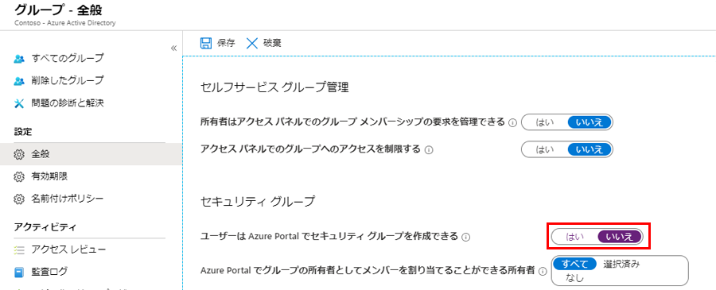

### タスク 9：セルフサービス グループ管理を有効にする 

ビジネスでさまざまなユーザーにこの委任が必要になるまで、この機能を無効にすることがベスト プラクティスです。

1.  Azure portal にサインインします。

2.  左側で、**Azure Active Directory** > **グループ** を選択します

3.  設定セクションの **全般** に移動します。

4.  「セルフサービス グループ管理が有効にする」が **いいえ** に設定されていることを確認します。

       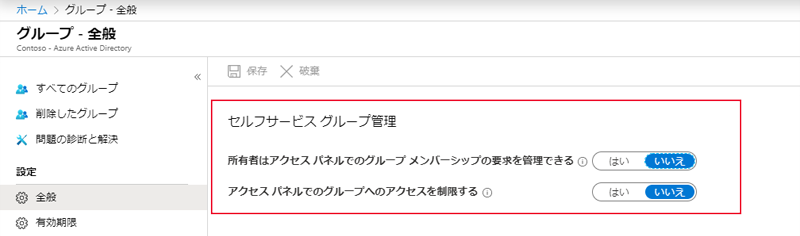

### タスク 10：アプリケーション オプション - ユーザーがアプリを登録できるようにする

管理者にカスタム アプリケーションの登録を要求します。

1.  Azure portal にサインインします。

2.  左側で、**Azure Active Directory** > **ユーザー** を選択します

3.  「ユーザー設定」に移動します。

4.  「ユーザーがアプリケーションを登録できる」が **いいえ** に設定されていることを確認してから、**保存** をクリックします。

       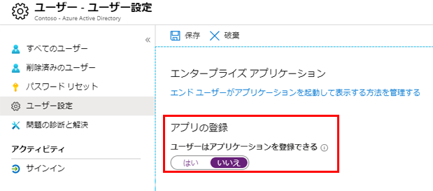

## 演習 2：Azure Security Center ベースラインを作成する

Azure Security Center  (ASC) は、Azure、オンプレミス、およびその他のクラウドで実行されているワークロードに対して、統合されたセキュリティ管理と高度な脅威保護を提供します。次に示すのは、従った場合、Azure サブスクリプションでさまざまなセキュリティ ポリシーを設定する Security Center のレコメンデーションです。

これらのポリシーは、Azure サブスクリプションを使用してリソースに推奨される一連の制御を定義します。

### タスク 1：システムの更新プログラムを有効にする 

Azure Security Center は、更新されていないオペレーティング システムがないか、Windows や Linux の仮想マシン (VM) とコンピューターを毎日監視します。Security Center は、Windows コンピューターに構成されているサービスに応じて、Windows Update または Windows Server Update Services (WSUS) から利用可能なセキュリティ更新プログラムと重要な更新プログラムの一覧を取得します。また、Security Center は、Linux システムにおける最新の更新プログラムについても確認します。VM またはコンピューターでシステムの更新プログラムが不足している場合、Security Center は、それらを適用することを推奨します。

1.  Azure portal にサインインします。

2.  **Security Center** のメイン メニューで **セキュリティ ポリシー** を選択します。

3.  **ポリシー管理** 画面が表示されます。

4.  表示されたリストからサブスクリプションを選択します。

5.  **システムアップデートをマシンにインストールする必要があります** がポリシーの1つとなっていることを確認します。

6.  「Azure Security Center で監視を有効にする」リンクをクリックします (これは、GUID で ASC Default として表示される場合もあります)。

       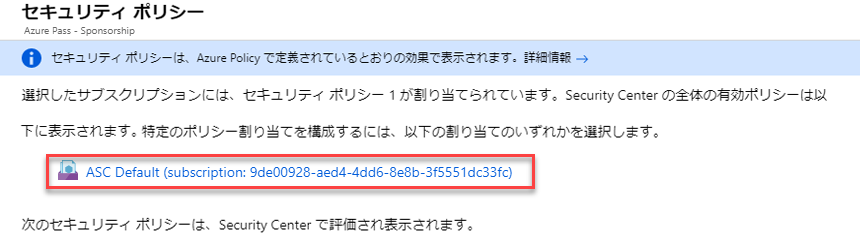

7.  この例では、ASC エージェントが VM または物理マシンにデプロイされていないため、メッセージ AuditIfNotExists が表示されます。AuditIfNotExists は、if 条件に一致するリソースの監査を有効にします。リソースがデプロイされていない場合、NotExists が表示されます。

       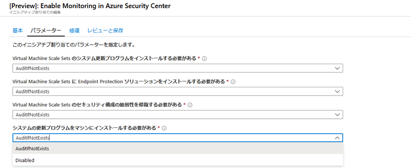

    有効にすると、監査が表示されます。デプロイされているが無効になっている場合は、無効が表示されます。

       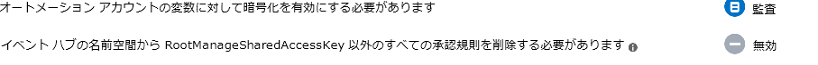

### タスク 2：セキュリティ構成を有効にする

Azure Security Center は、ファイアウォール、監査、パスワード ポリシーなどに関連する規則を含め、OS を強化するための 150 を超える推奨の規則のセットを適用して、セキュリティ構成を監視します。脆弱な構成を持つマシンが見つかった場合は、Security Center はセキュリティに推奨事項を生成します。

1.  Azure portal にサインインします。

2.  **Security Center** のメイン メニューで **セキュリティ ポリシー** を選択します。

3.  「ポリシー管理」画面が表示されます。

4.  表示されたリストからサブスクリプションを選択します。

5.  **仮想マシンスケールセットのセキュリティ構成の脆弱性を修正する必要があります** がポリシーの1つとなっていることを確認します。

       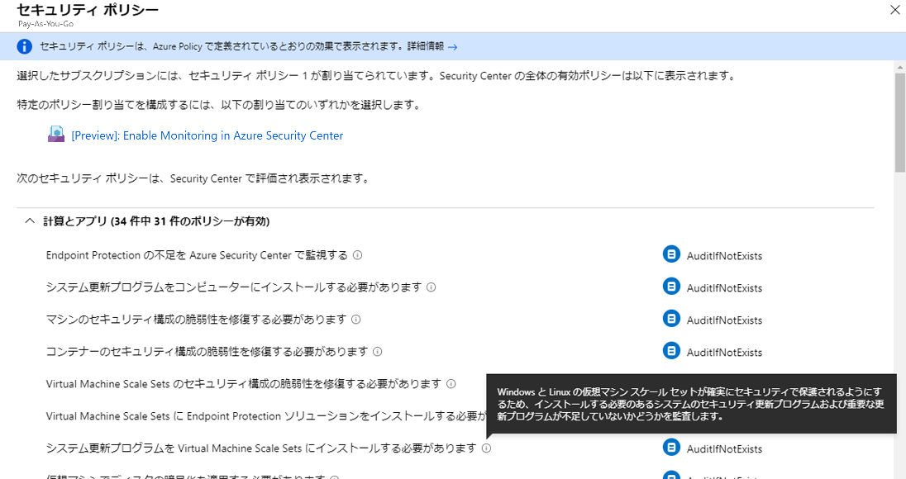

    **注記**：タイトルに (*) が含まれる以下のポリシーはすべて、上記のようにセキュリティ ポリシー ブレードにリストされます

      - **Endpoint Protection を有効にする** - _すべての仮想マシンに Endpoint Protection を推奨します。_
      - **Disk Encryption を有効にする** - _お使いの Windows または Linux VM ディスクが Azure Disk Encryption を使用して暗号化されていない場合、Azure Security Center により、ディスク暗号化を適用することが推奨されます。Disk Encryption を使用すると、Windows および Linux IaaS VM ディスクを暗号化できます。暗号化は、VM 上の OS  とデータ ボリュームの両方を暗号化することをお勧めします。_
      - **ネットワーク セキュリティ グループを有効にする** _Azure Security Center では、ネットワーク セキュリティ グループ (NSG) がまだ有効になっていない場合は、有効にすることをお勧めします。NSG には、仮想ネットワーク内の VM インスタンスに対するネットワーク トラフィックを許可または拒否するアクセス制御リスト (ACL) ルールの一覧が含まれています。NSG は、サブネットまたはそのサブネット内の個々の VM インスタンスと関連付けることができます。NSG がサブネットと関連付けられている場合、ACL ルールはそのサブネット内のすべての VM インスタンスに適用されます。さらに、NSG をその VM と直接関連付けることによって、個々の VM へのトラフィックをさらに制限できます。_
      - **Web アプリケーション ファイアウォールを有効にする** - _Azure Security Center では、Web アプリケーションをセキュリティで保護するために、Microsoft パートナーの Web アプリケーション ファイアウォール (WAF) を追加することをお勧めします。_
      - **脆弱性評価を有効にする** - _Azure Security Center の脆弱性評価は、Security Center 仮想マシン (VM) のレコメンデーションの一部です。Security Center  が VM にインストールされている脆弱性評価ソリューションを見つけられない場合は、インストールすることをお勧めします。パートナー エージェントは、デプロイ後、パートナーの管理プラットフォームに脆弱性データを報告し始めます。次に、パートナーの管理プラットフォームは、脆弱性と正常性の監視データを戻して Security Center  に提供します。_
      - **Storage 暗号化を有効にする** - _この設定を有効にすると、Azure BLOB およびファイル内の新しいデータが暗号化されます。_
      - **JIT ネットワーク アクセスを有効にする** - _Just-In-Time (JIT) 仮想マシン (VM) アクセスを使用すると、Azure VM への受信トラフィックをロックダウンすることができるので、攻撃に対する露出が減り、必要に応じて VM への接続が必要な場合は簡単にアクセスできます。_
      - **適応型アプリケーション制御を有効にする** - _適応型アプリケーション制御は、Azure Security Center で提供される、自動化されたインテリジェントなエンド ツー エンドのアプリケーション ホワイトリスト登録ソリューションです。このソリューションにより、ご自身の Azure および Azure 以外の VM (Windows と Linux) で実行できるアプリケーションを制御しやすくなります。Security Center では、機械学習を使用して VM で実行中のアプリケーションを分析されます。Security Center はこのインテリジェンスによってお客様がホワイトリスト登録に関する特定の規則を適用するのを支援します。この機能を使用すると、アプリケーションのホワイトリスト登録ポリシーを構成および保守するプロセスが非常にシンプルになり、ます。_
      - **SQL 監査と脅威の検出を有効にする** -  Azure Security Center では、監査がまだ有効になっていない場合は、Azure SQL サーバー上のすべてのデータベースの監査と脅威の検出を有効にすることをお勧めします。監査は、規定のコンプライアンスの維持、データベース活動の理解、およびビジネス上の懸念やセキュリティ違犯の疑いを示す差異や異常に対する洞察が容易になります｡
      - **SQL 暗号化を有効にする** - _Azure Security Center では、TDE がまだ有効になっていない場合は、SQL データベースでTransparent Data Encryption (TDE) を有効にすることをお勧めします。TDE はデータを保護し、アプリケーションを変更することなく、データベース、関連するバックアップ、トランザクション ログ ファイルを保存時に暗号化することで、コンプライアンス要件を満たすのに役立ちます。_
      - **セキュリティ連絡先のメールを設定する** - _Azure Security Center では、Azure サブスクリプションに対してセキュリティ連絡先の詳細をまだ指定していない場合、それを指定するよう推奨されます。この情報は、Microsoft セキュリティ レスポンス センター (MSRC) で、または権限のないユーザーによる顧客データへのアクセスが検出された場合に、Microsoft からの連絡先として使用されます。MSRC では、Azure noネットワークとインフラストラクチャの選択的なセキュリティ監視をを行い、第三者からの脅威インテリジェンスと不正使用の苦情報告を受け取ります。_

2.  **コスト管理 + 請求** を選択します。

    **注記**：次の手順は、Azure Pass サブスクリプションでは機能しませんが、実世界のシナリオで必要な手順を特定するために、このラボで学習しました。

3.  連絡先情報画面が表示されます。

4.  表示される連絡先情報を入力または検証します。

       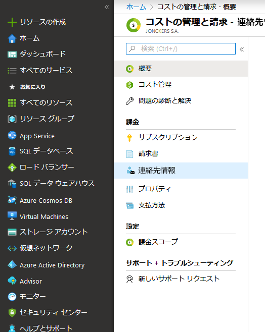

### タスク 3：アラートに関するメールの送信を有効にする 

Azure Security Center では、Azure サブスクリプションに対してセキュリティ連絡先の詳細をまだ指定していない場合、それを指定するよう推奨されます。

1.  **コスト管理 + 請求** を選択します。
3.  「価格と設定」画面が表示されます。
4.  サブスクリプションをクリックします。
5.  **メール通知** をクリックします。
6.  **保存** を選択します。 

     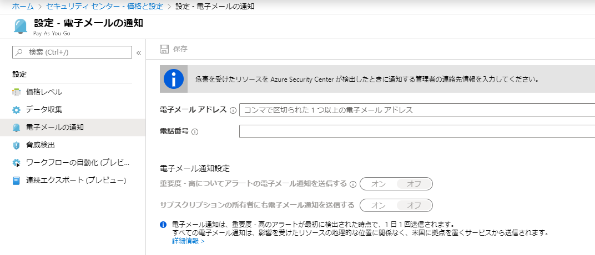

### タスク 4：サブスクリプションの所有者にもメールを送信を有効にする 

Azure Security Center では、Azure サブスクリプションに対してセキュリティ連絡先の詳細をまだ指定していない場合、それを指定するよう推奨されます。

1.  上記のメール通知フォームを使用して、カンマで区切って追加のメールを追加できます。

1.  [**保存**] をクリックします。

## 演習 3：Azure ストレージ アカウント ベースライン を作成する 

Azure ストレージ アカウントでは、Azure Storage データ オブジェクトの保存とアクセスを行うための一意の名前空間が提供されます。  ストレージ アカウントも保護する必要があります。

### タスク 1：セキュリティ強化された転送を要求する

Azure Storage データのセキュリティを確保するために必要なもう 1 つの手順は、クライアントと Azure Storage の間のデータを暗号化することです。最初のレコメンデーションは、HTTPS プロトコルを常に使用して、パブリック インターネット上の安全な通信を確保することです。REST API を呼び出すときや、ストレージ アカウント内のオブジェクトにアクセスするときは、HTTPS を使用することを強制できます。このオプションを有効にすると、HTTP を使った接続は拒否されます。

1.  **すべてのサービス** で、**ストレージ アカウント** に移動します。

3.  ストレージ アカウントを選択します。

4.  **設定** で、**構成** を選択します。

5.  **セキュアな転送が必須** を **有効** に設定します。

       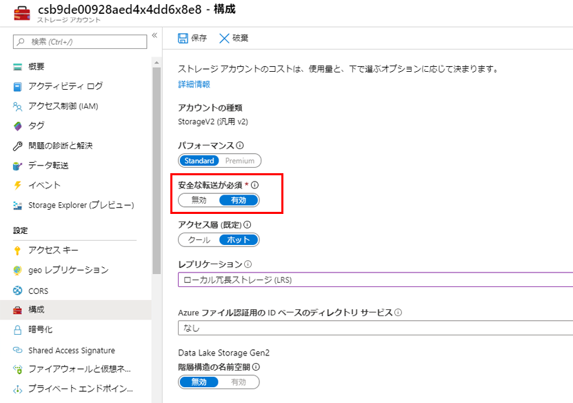

### タスク 2：バイナリ ラージ オブジェクト (BLOB) 暗号化を有効にする

Azure Blob Storage　は、クラウド向けのMicrosoftのオブジェクト　ストレージ　ソリューションです。Blob ストレージは、大量の非構造化データを保存するために最適化されている。非構造化データは、テキストデータやバイナリデータなど、特定のデータモデルや定義に従わないデータである。Storage Service Encryption により、保存中のデータが保護されます。Azure Storage は、データがデータセンターに書き込まれたとき、データを暗号化し、アクセスするとき、自動的に復号化します。

1.  Azure サービスで、ストレージ アカウントに移動します。
3.  ストレージ アカウントを選択します。
4.  **設定** で、**暗号化** を選択します。
5.  Azure Storage の暗号化は、すべての新規および既存のストレージ アカウントに有効になり、無効にすることはできません。

     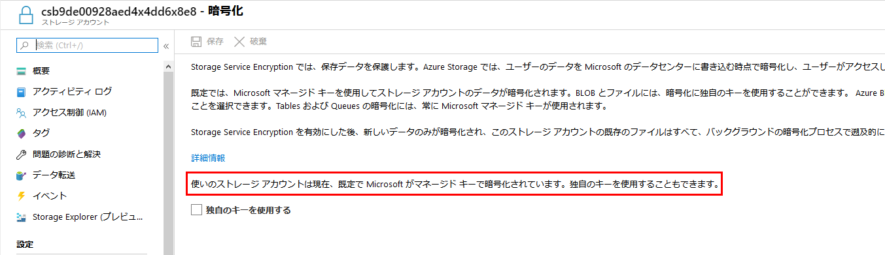

### タスク 3：アクセス キーを定期的に再生成する

ストレージ アカウントを作成すると、Azure により 512 ビットのストレージ アクセス キーが 2 つ生成されます。これらはストレージ アカウントにアクセスするときに認証に使用されます。これらのキーを定期的に回転させると、これらのキーへの不注意なアクセスや露出が損なわれる場合があります。

1.  Azure サービスで **ストレージ アカウント** に移動します。

3.  ストレージ アカウントを選択します。
4.  ストレージ アカウントについては、**アクティビティ ログ** に移動します。
5.  「タイムスパン」ドロップダウンで、**カスタム** を選択し、「開始時刻」と「終了時刻」を選択して 90 日間の範囲を作成します。
6.  **適用** をクリックします。 
 
     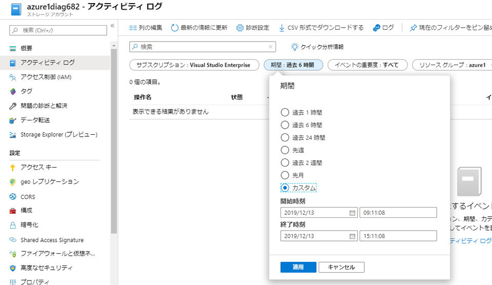

### タスク 4：Shared Access Signature (SAS) トークンを 1 時間以内に期限切れにする

Shared Access Signature(SAS) とは、Azure Storage  リソースに対する制限付きのアクセス権を許可する URI です。Shared Access Signature は、ストレージ アカウント キーで信頼できないが、特定のストレージ アカウント リソースに対するアクセス権を委任したいクライアントに提供することができます。Shared Access Signature URI をこれらのクライアントに配布することで、特定の期間にわたってリソースに対するアクセス権を付与することができます。

現在、SAS トークンの有効期限の検証を実行できません。Microsoft がトークンの有効期限を、トークン作成パラメータではなく設定として行うまで、この推奨事項を手動で検証する必要があります。

1.  **ストレージ アカウント** に移動します。

3.  既存のアカウントを選択します。
4.  ストレージ アカウントについては、**Shared Access Signature** に移動します。
5.  開始日と有効期限/時間を設定します。
6.  「許可されたプロトコル」を「HTTPS のみ」に設定します。

    両方の SAS 機能を以下に示します。 
 
    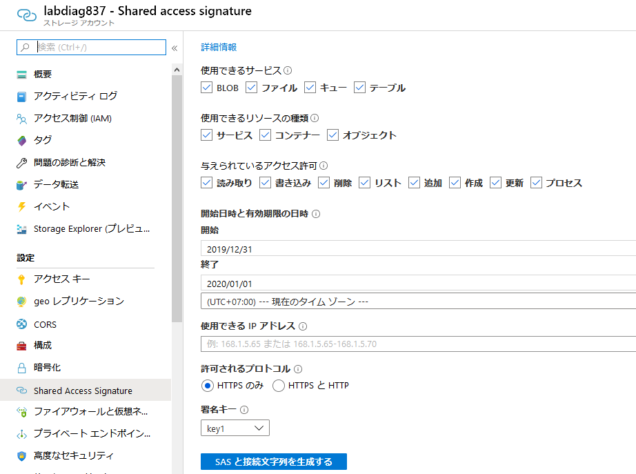
 

### タスク 5：BLOB コンテナーへのプライベート アクセスのみを要求する 

Azure Blob Storage のコンテナーとその BLOB に対する匿名のパブリック読み取りアクセスを有効にすることができます。そうすることで、アカウント キーを共有せず、Shared Access Signature (SAS) も必要とせずに、これらのリソースに対する読み取り専用アクセスを付与できます。既定では、コンテナーとその中のすべての BLOB には、適切なアクセス許可を与えられたユーザーのみがアクセスできます。匿名ユーザーにコンテナーとその BLOB に対する読み取りアクセスを許可するには、コンテナーのパブリック アクセス レベルを設定できます。コンテナーへのパブリック アクセスを許可すると、匿名ユーザーは、要求を認可しなくても、パブリックにアクセスできるコンテナー内の BLOB を読み取ることができます。

1.  **ストレージ アカウント** に移動します。
3.  ストレージ アカウントについては、**BlOB Service** の **Containers** に移動します。
1.  **+ コンテナー** をクリックします。
1.  コンテナーに **az500** と名前を付け、**OK** をクリックします。

4.  「パブリック アクセス レベル」は「プライベート」に変更されていることを確認します。

     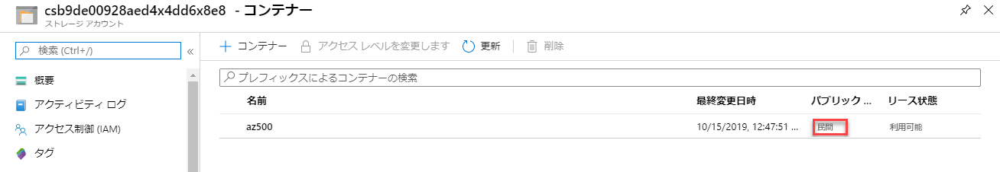

## 演習 4：Azure SQL Database ベースラインを作成する

Azure SQL Server は、Microsoft SQL Server と同じ機能の多くをサポートするクラウドベースのリレーショナル データベース サーバーです。オンプレミスのデータベースから、組み込みの診断、冗長性、セキュリティ、およびスケーラビリティを備えたクラウドベースのデータベースに簡単に移行できます。  この演習では、Azure SQL Server ポリシーを設定するためのセキュリティに関するレコメンデーションを確認します。

### タスク 1：監査を有効にする

Azure SQL Database および SQL Data Warehouse の監査では、データベース イベントを追跡され、Azure ストレージ アカウント、OMS ワークスペース、または Event Hubs の監査ログにイベントが書き込まれます。また、監査によって以下を行うことができます。

-   規定コンプライアンスの維持、データベース活動の理解、およびビジネス上の懸念やセキュリティ違犯の疑いを示す差異や異常に対する洞察が容易になります｡
-   コンプライアンスを保証するものではありませんが、標準へのコンプライアンスを可能にし、容易にします。

1.  Azure portal で、**SQL データベース** に移動します。
1.  **+Add** をクリックします。
1.  次の設定でデータベースを作成し、**「確認および作成」** をクリックしてから、**「作成」** をクリックします。

      - **リソース グループ**: myResourceGroup を選択します
      - **データベース名**: az500
      - **サーバー**: **新規作成**
         - **サーバー名** サーバーに一意の名前を付けます
         - **サーバー管理者のログイン**: localadmin
         - **パスワード**: Pa55w.rd1234
         - **保存先**: EastUS

1.  デプロイが完了したら、**リソースに移動** をクリックします。

4.  **セキュリティ** セクションで、**監査** を選択します。

1.  **サーバー設定を表示する** をクリックします。

     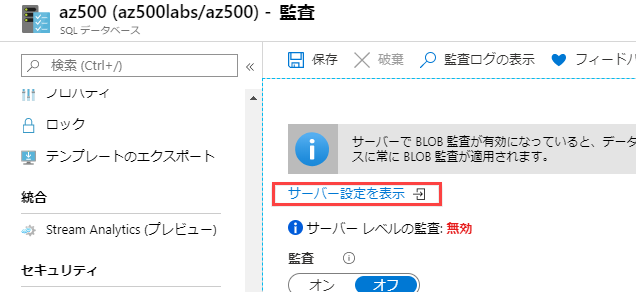
 
1.  **オン** を選択し、**ログ分析** の横にあるボックスをチェックします。

1.  以前のラボで作成された Log Analyics ワークスペースを選択してから、**保存** をクリックします。

     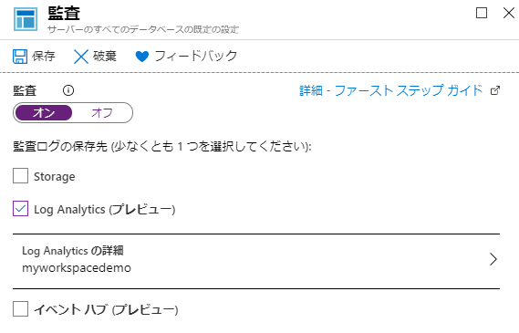

1.  監査ブレードを終了します。

5.  監査が **オン** に設定されていることを確認してから、**ログ分析** の横にあるボックスをチェックします。

1.  以前のラボで作成された Log Analyics ワークスペースを選択してから、**保存** をクリックします。

     

### タスク 2：脅威検出サービスを有効にする

シングルおよびプールされたデータベースの脅威検出では、データベースへのアクセスやデータベースの悪用を試みる、害を及ぼす可能性のある異常なアクティビティが検出されます。脅威検出によって、SQL インジェクションの可能性、通常とは異なる場所またはデータ センターからのアクセス、通常とは異なるプリンシパルまたは有害な可能性があるアプリケーションからのアクセス、SQL 資格情報に対するブルート フォース攻撃を特定できます。脅威検出は、高度な SQL セキュリティ機能の統合パッケージである Advanced Data Security  (ADS) オファリングの一部です。脅威検出は、 SQL ADS ポータルを使用して一元的にアクセスおよび管理できます。

1.  Azure portal で、**SQL データベース** に移動します。

2.  **セキュリティ** で、**Advanced Data Security** に移動します。
3.  **設定** をクリックします。
4.  **サーバーで高度なデータセキュリティを有効にする** を選択して、**はい** をクリックしてから、**保存** をクリックします。

### タスク 3：すべての脅威検出タイプを有効にする 

Advanced Data Security (ADS) は、データの検出と分類、脆弱性評価、Advanced Threat Protection (ATP) など、一連の高度な SQL セキュリティ機能を提供します。

Advanced Threat Protection は、高度なデータセキュリティ (ADS) オファリングの一部であり、詳細な SQL セキュリティ戦略の防御の一部です。Advanced Threat Protection は、中央の SQL ADS ポータルを介してアクセスおよび管理できます。

1.  Azure portal で、**SQL データベース** に移動します。
4.  **セキュリティ** で、**Advanced Data Security** に移動します。
1.  **設定** をクリックします。

7.  **アラートの送信** が必要に応じて設定されていることを確認します。

     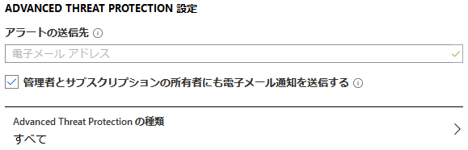

## 演習 5：ロギングと監視のベースラインを作成する

セキュリティの脅威を特定、検出、および軽減しようとする場合、ログと監視は重要な要件です。適切なログ記録ポリシーを設定することで、セキュリティ違反がいつ発生したかを確実に特定できますが、犯人を特定できる可能性もあります。Azure アクティビティ ログは、リソースへの外部アクセスと診断ログの両方に関するデータを提供し、特定のリソースの操作に関する情報を提供します。

### タスク 1：ログ プロファイルが存在することを確認する

Azure アクティビティ ログは、Azure で発生したサブスクリプション レベルのイベントに関する分析情報を提供します。たとえば、Azure Resource Manager の運用データから、サービスの正常性イベントの更新までの範囲のデータが含まれています。管理者のカテゴリではサブスクリプションのコントロール プレーン イベントが報告されるため、アクティビティ ログは以前は監査ログまたは操作ログと呼ばれていました。各 Azure サブスクリプションに 1 つのアクティビティ ログがあります。これは、外部から行われるリソースの操作に関するデータを提供します。診断ログは、リソースによって出力され、そのリソースの操作に関する情報を提供します。各リソースの診断設定を有効にする必要があります。

1.  Azure Portal で、**モニター** に移動してから、**アクティビティ ログ** を選択します。

3.  **Event Hub へのエクスポート** をクリックします。
5.  次の設定を構成してから、**保存** をクリックします。

      - **リージョン**: EastUS
      - **選択**: ストレージ アカウントへのエクスポート
      - **ストレージアカウント**: ストレージ アカウントを選択して、OK をクリックします。
      - **リテンション期間**：90 日間

6.  **保存** を選択します。

     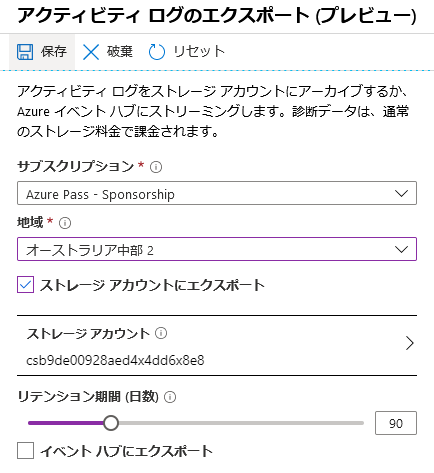

### タスク 2：変更アクティビティ ログのリテンション期間が 365 日以上に設定されています

リテンション期間 (日数)を 0 に設定すると、データが永久に保持されます。

1.  上記の手順に従ってください。「リテンション期間日数」スライダー バーを調整します。

### タスク 3：「ネットワーク セキュリティ グループの作成、更新、削除」のアクティビティ ログ アラートを作成する 

デフォルトでは、NSG の作成/更新/削除時に監視アラートは作成されません。セキュリティ グループを変更または削除すると、不適切なソースから内部リソースにアクセスしたり、予期しない送信ネットワーク トラフィックが発生したりする可能性があります。

1.  Azure portal で、**モニター** に移動してから、**アラート** を選択します。

3.  **+ 新しいアラート ルール** を選択します。

4.  **リソース** セクションで、**選択** をクリックします。

1.  サブスクリプションを選択して、**完了** をクリックします。

4.  **条件** セクションで、**追加** をクリックします。

1.  **ネットワーク セキュリティ グループの作成または更新** を検索し、それを選択します。

1.  「シグナル ロジックの構成」ブレードで、**任意** を入力して開始されたイベントで、**完了** をクリックします。

     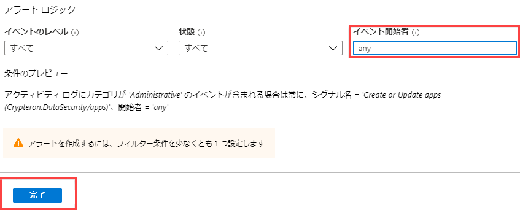

1.  **アクション** セクションで、**アクション グループを作成する** をクリックします。

1.  「アクショングループの追加」ブレードで、次の詳細を入力します。

      - **アクション グループ名**：NSG アラート
      - **短い名前**：NSGAlert
      - **アクション名**：NSG アラート
      - **アクション タイプ**：メール/SMS/プッシュ/音声

1.  **メール/SMS/プッシュ/音声** ブレードで、メールボックスをチェックし、メールアドレスを入力して、**OK** をクリックします。

     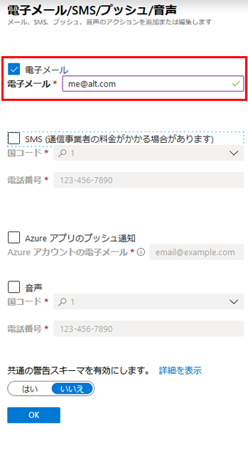

1.  「アクション グループの追加」ブレードで、**OK** をクリックします。

     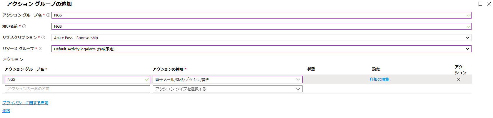

1.  「ルールの作成」ブレードで、**アラートの詳細** セクションに次の詳細を入力します。

      - **アラート ルール名**: NSG アラート
      - **リソース グループに保存**：myResourceGroup

     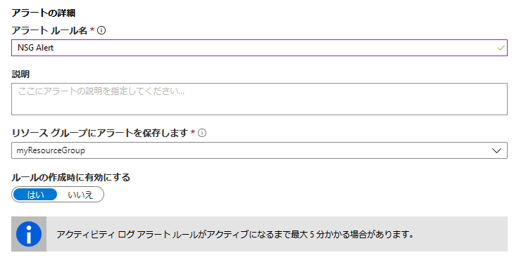

6.  **アラート ルールの作成** をクリックします

## 演習 5：ネットワーク ベースラインを作成する

Azure のネットワーク サービスは、柔軟性、可用性、回復性、セキュリティ、および整合性を最大化するように設計されています。ネットワーク接続性は、Azure 内のリソース間、オンプレミスと Azure ホストのリソース間、インターネットと Azure の間で可能です。

### タスク 1：インターネットからの RDP および SSH アクセスを制限する 

リモート デスクトップ プロトコル (RDP) とセキュア シェル (SSH) プロトコルを使用して Azure Virtual Machines にリーチできるようになります。これらのプロトコルによりは、遠隔地からの管理 VM が有効になります。これらは、データセンター コンピューティングにおける標準プロトコルです。

これらのプロトコルをインターネット経由で使用すると、攻撃者がブルート フォース手法を使って Azure  Virtual Machines へのアクセス権を取得できるという潜在的なセキュリティの問題が生じます。攻撃者がアクセス権を取得すると、VM を起点として仮想ネットワーク上の他のマシンを侵害したり、Azure の外部にあるネットワーク接続されたデバイスを攻撃したりすることができます。

インターネットから Azure VM への直接の RDP および SSH アクセスを無効にすることをお勧めします。インターネットからの RDP および SSH の直接アクセスを無効にした場合、リモート管理のためのこれらの VM へのアクセスに他のオプションを使用できます。

- ポイント対サイト VPN
- サイト間 VPN
- Azure ExpressRoute
- Azure Bastion ホスト

1.  Azure portal で、**仮想マシン** をクリックします。

1.  **myVM** を選択します。

1.  **ネットワーク** ブレードを開きます。

1.  RDP (ポート 3389) を許可するルールを選択し、**削除** をクリックします。

     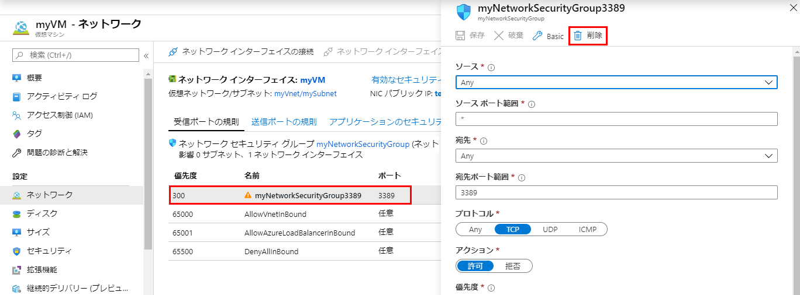

## タスク 2：インターネットからの SQL Server アクセスを制限する 

ファイアウォール システムは、コンピューター リソースへの不正アクセスの防止に役立ちます。ファイアウォールがオンになっていても正しく構成されていない場合は、SQL Server への接続の試みがブロックされている可能性があります。

ファイアウォールを経由して SQL Server のインスタンスにアクセスする場合、SQL Server を実行しているコンピューターで、ファイアウォールを構成する必要があります。IP 範囲「0.0.0.0/0」 (「0.0.0.0」の開始 IP と「0.0.0.0.0」の終了 IP) のイングレスを許可すると、SQL Database が攻撃に対して脆弱になる可能性のあるすべてのトラフィックへのオープン アクセスが可能になります。SQL  Database がインターネットからのイングレスを許可していないことを確認します。

1.  Azure portal で、**SQLサーバー** に移動し、SQL Server を選択します。

4.  **ファイアウォールと仮想ネットワーク** をクリックします。

     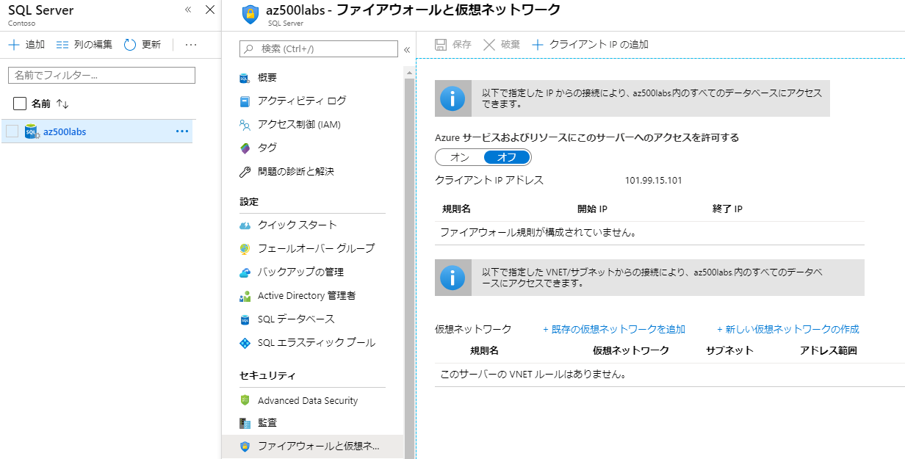

5.  ファイアウォール規則が存在し、規則に開始 IP が「0.0.0.0」と終了 IP が「0.0.0.0」、またはより広いパブリック IP 範囲へのアクセスを許可するその他の組み合わせが存在しないことを確認します。

6.  ブレードを閉じます。

### タスク 3：NSG フロー ログを構成する

サブスクリプションで仮想ネットワークを作成または更新すると、Network Watcher は仮想ネットワークのリージョンで自動的に有効になります。Network Watcher を自動的に有効にしても、リソースや関連する料金に影響はありません。

ネットワーク セキュリティ グループ (NSG) のフロー ログは、NSG を使用したイングレスおよびエグレス IP トラフィックに関する情報を表示できる Network Watcher の機能です。フロー ログは JSON 形式で記述され、規則ごとの送信フローと受信フロー、フローが適用されるネットワーク インターフェイス (NIC)、フローに関する 5 組の情報 (送信元/宛先 IP、送信元/宛先ポート、プロトコル、トラフィックが許可されているか拒否されているかが示されます。また、バージョン 2 ではスループット情報 (バイトとパケット) も示されます。ログを使用して、異常をチェックし、違反の疑いについて洞察が得られます。

1.  Azure portal で、**すべてのサービス** を選択します。

3.  **ネットワーク** を選択します。

4.  **Network Watcher** を選択します。

5.  ログで **NSG フロー ログ** を選択します。

1.  **オン** を選択します。

1.  ストレージ アカウントを選択して、**保存** をクリックします。

 

### タスク 4：Network Watcher を有効にする 

ネットワーク セキュリティ グループ (NSG) のフロー ログは、NSG を使用したイングレスおよびエグレス IP トラフィックに関する情報を表示できる Network Watcher の機能です。

1.  Azure portal で、「すべてのサービス」を選択します。「フィルター ボックス」に、**Network Watcher** と入力します。Network Watcher が結果に表示されたら、それを選択します。

3.  「リージョン」を選択して展開し、有効になっていないリージョンの省略記号 (...) ボタンを選択します。

4.  **Network Watcher を有効にする** を選択します。

     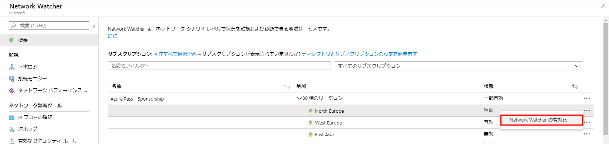

## 演習 7：Azure VM ベースラインを作成する

Azure Policy は、ポリシーの作成、割り当て、管理に使用する Azure のサービスです。これらのポリシーは、リソースにさまざまなルールと効果を適用して、それらのリソースが会社の標準とサービス レベル アグリーメント (SLA) に準拠した状態に保たれるようにします。Azure Policy では、割り当て済みのポリシーでリソースの非準拠を評価することによって、このニーズが満たされます。たとえば、環境内で特定のSKU サイズの仮想マシン (VM) のみを許可するポリシーを作成できます。このポリシーが実装された後は、新規および既存のリソースのコンプライアンス評価されます。適切な種類のポリシーにより、既存リソースのコンプライアンスを実現できます。

**Azure ネットワーク セキュリティのレコメンデーション**

Azure サブスクリプションで仮想マシン（VM）ポリシーを設定するために従うべきセキュリティの推奨事項を以下に示します。各レコメンデーションには、Azure portal で実行する基本的な手順が含まれています。それぞれのセキュリティを検証するには、独自のリソースを使用して、独自のサブスクリプションでこれらの手順を実行する必要があります。それを念頭に置いて レベル 2 オプションによって一部の機能やアクティビティが制限される場合があるため、どのセキュリティオプションを適用するかを慎重に検討してください。

### タスク 1：OS ディスクが暗号化されていることを確認します

Azure Disk Encryption は、データを保護して、組織のセキュリティおよびコンプライアンス コミットメントを満たすのに役立ちます。これは、Azure Virtual Machines (VM) の OS およびデータ ディスクのボリュームを暗号化するために、Windows の BitLocker 機能と Linux の DM-Crypt 機能を使用します。また、Azure Key Vault と統合されています。これにより、ディスク暗号化キーとシークレットを制御および管理するのが容易になり、Azure Storage で保存中の VM ディスクの全データが確実に暗号化されます。Windows および Linux VM 用の Azure Disk Encryption は、すべての Azure パブリック リージョンおよび Azure Government リージョンの Standard VM と Azure Premium Storage を使用する VM で一般に提供されています。

Azure Security Center(推奨) を使用している場合、暗号化されていない VM があると警告を受け取ります。

1.  Azure portal で、**KeyVault** を検索します。

1.  **Key Vault** を選択し、**作成** をクリックします。

1.  次の詳細を入力します。

      - **リソース グループ**: myResourceGroup
      - **キー コンテナー名**: _一意なものを入力してください_
      - **リージョン**: EastUS
   
     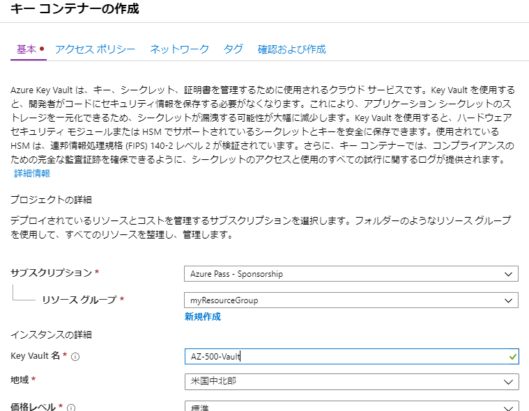

1.  **アクセスポリシー** タブを選択し、ボリューム暗号化に **Azure Disk Encryption** を選択します。

     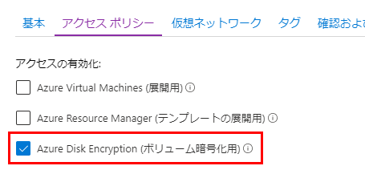

1.  **「確認および作成」** をクリックしてから、**「作成」** をクリックします。

1.  デプロイメントが完了するのを待ってから続行します。

1.  Azure portal で、**仮想マシン** を選択します。

1.  **myVM** 仮想マシンを設定します。

3.  **設定** セクションで、**Disk** を選択します。

1.  ディスクが暗号化されていないことに注意してください。

     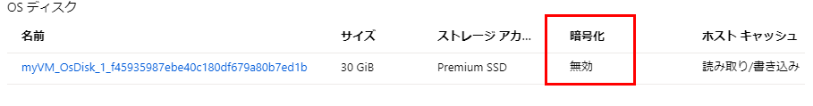

1.  **暗号化** をクリックします。

     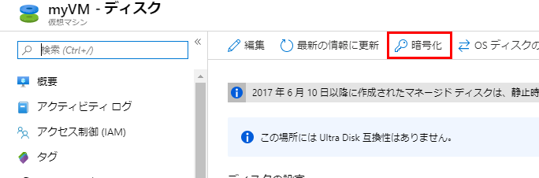

5.  **OS およびデータ ディスク** を選択し、暗号化します。

1.  **暗号化するキー コンテナーとキーを選択する** をクリックして、コンテナーを選択して **選択** をクリックします。

1.  **保存** をクリックし、**はい** をクリックして確認します。

### タスク 2：承認された拡張機能のみがインストールされていることを確認してください

Azure 仮想マシン (VM) 拡張機能は、Azure VM でデプロイ後の構成と自動化タスクを提供する小規模なアプリケーションです。たとえば、仮想マシンでソフトウェアのインストールやウイルス対策保護、あるいは、仮想マシン内でスクリプトを実行するために、VM 拡張機能を使用できます。Azure VM 拡張機能は、Azure CLI、PowerShell、Azure Resource Manager テンプレート、および Azure portal を使って実行できます。拡張機能は、新しい VM の展開にバンドルすることも、既存の任意のシステムに対して実行することもできます。

1.  Azure portal で、**仮想マシン** を選択します。

3.  **myVM** を選択してから、**設定** セクションで **拡張機能** をクリックします。
5.  一覧表示されている拡張機能の使用が承認されていることを確認します。

     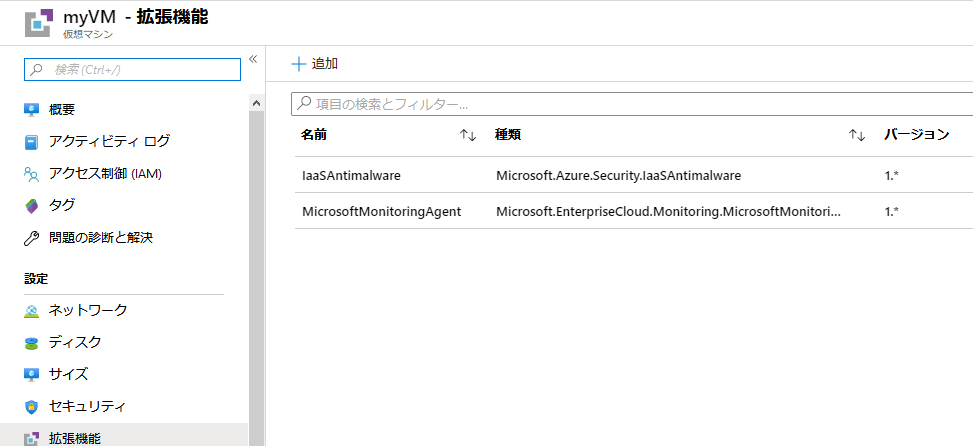

**結果**：これで、このラボを完了しました。

