---
lab:
    title: 'ラボ 9 - JIT'
    module: 'モジュール 3：セキュリティ操作の管理'
---

# モジュール 3：ラボ 9 - JIT

**シナリオ**

Just-In-Time (JIT) 仮想マシン (VM) アクセスを使用すると、Azure VM への受信トラフィックをロックダウンすることができるので、攻撃に対する露出が減り、必要に応じて VM への接続が必要な場合は簡単にアクセスできます。

ブルート フォース攻撃では、 VM  にアクセスする手段として一般に管理ポートがターゲットとされます。アクセスに成功した場合、攻撃者は VMの制御を奪い、環境への足掛かりを築くことができます。

ブルート フォース攻撃への露出を減らす方法の  1 つとして、ポートの開放時間を制限するという方法があります。管理ポートを常に開放しておく必要はありません。管理ポートを開放しておく必要があるのは、管理タスクやメンテナンス タスクを実行する場合など、VM に接続している間だけです。Just-In-Time が有効になっている場合、Security Center ではネットワーク セキュリティ グループ (NSG) と Azure Firewall ルールが使用されます。これにより、管理ポートへのアクセスが制限され、攻撃者が目標にすることはできなくなります。

## 演習 1：Just-In-Time を使用して仮想マシンのアクセスを管理する

VM で JIT ポリシーを構成するには、3つの方法があります。

- Azure Security Center で JIT アクセスを構成する
- Azure VM ブレードで JIT アクセスを構成する
- プログラムで VM に JIT ポリシーを構成する

### タスク 1：Azure Security Center の VM で JIT アクセスを構成する

1.  Azure Portal で **Security Center** を開いてから、**開始** をクリックします。

1.  **エージェントをインストールする** をクリックします。

     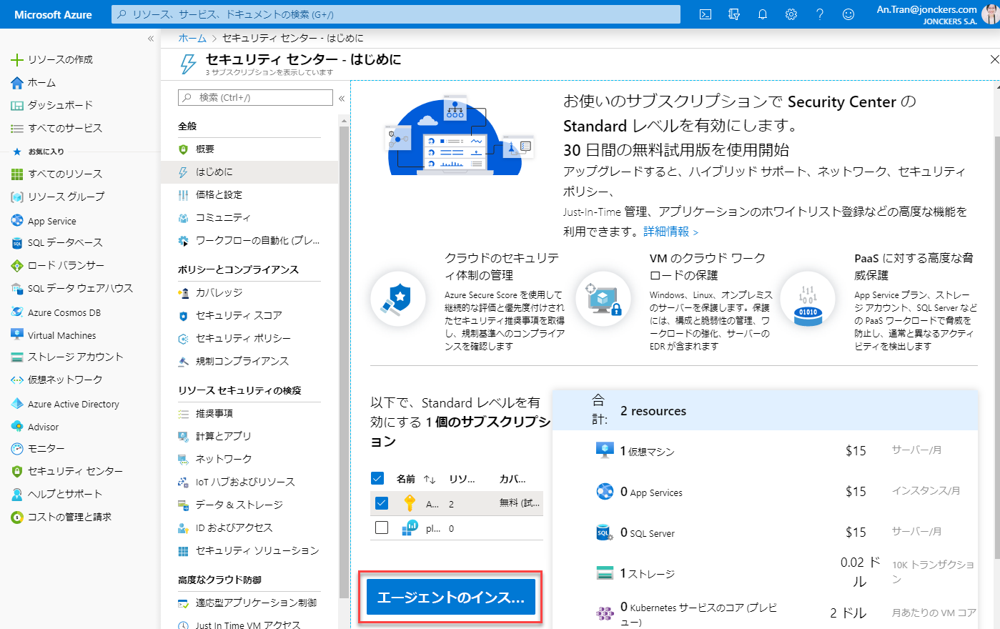

**注記**：エージェントがデプロイされるまで最大5分待たなければならない場合があります。

2.  左側のペインで、**概要** を選択します。

1.  **コンピューティングとアプリのリソース** を選択します。

     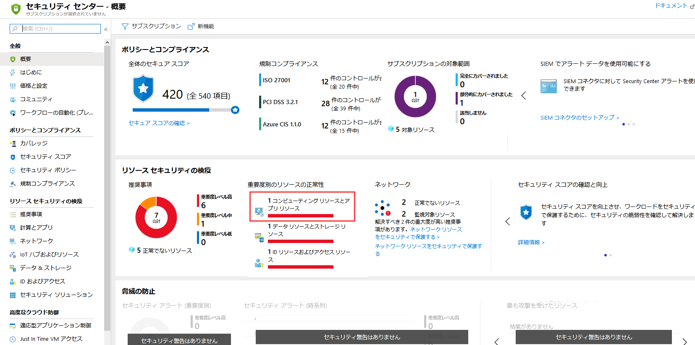

1.  コンピューティング ブレードで、レコメンデーションに注意してください。

1.  **Just-In-Time ネットワーク アクセス制御は仮想マシンに適用する必要があります** を選択します。

     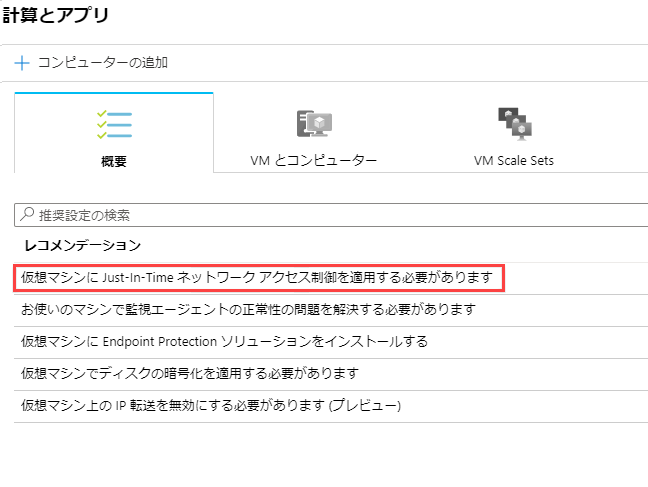

1.  4 つの仮想マシンすべてを選択して、**4 つの VM で JIT を有効にする** をクリックします。

     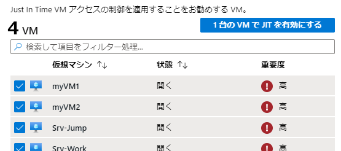

1.  **JIT VM アクセス構成** ブレードで、**保存** をクリックします。
  - このブレードには、Azure Security Center が推奨するデフォルトポートが表示されます。
      - 22 - SSH
      - 3389 - RDP
      - 5985 - WinRM 
      - 5986 - WinRM
 
     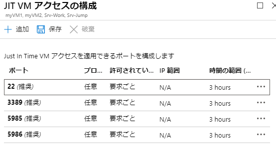

1.  すべてのブレードを閉じて、Security Center のブレードで **ジャストインタイム VM アクセス** をクリックします。

     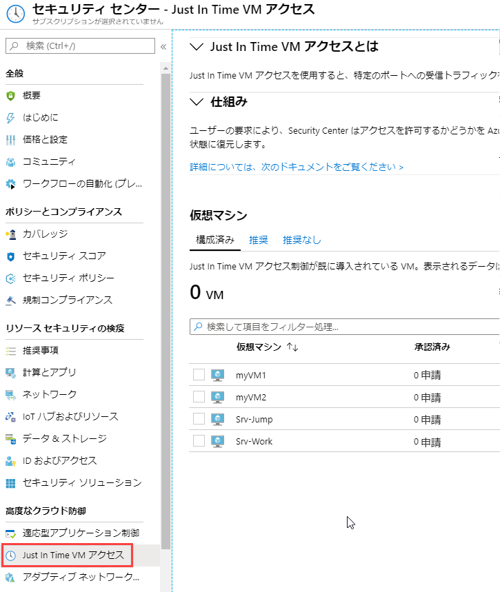

    **Just-In-Time VM アクセス** ウィンドウが開きます。
      
    **Just-In-Time VM アクセス** VM の状態に関する情報を提供します。

    - **設定済み** - Just-In-Time VM アクセスをサポートするように構成された VM。表示されるデータは先週のもので、各 VM の承認済みリクエスト数、最終アクセス日時、最終ユーザーが含まれます。
    - **推奨** - Just-In-Time VM アクセスをサポートできるが、まだ構成されていない VM。これらの VM に対して Just-In-Time VM アクセス制御を有効にすることをお勧めします。
    - **推奨なし** - VM が推奨されない原因となる理由は次のとおりです。
      - NSG の欠落 - Just-In-Time ソリューションでは、NSG が適切に配置されている必要があります。
      - 従来の VM - Security Center の Just-In-Time VM アクセスは、現在、Azure Resource Manager を介してデプロイされた VM のみをサポートしています。Just-In-Time ソリューションでは、従来のデプロイはサポートされていません。 
      - その他 - サブスクリプションまたはリソース グループのセキュリティ ポリシーで Just-In-Time ソリューションがオフになっている場合、または VM にパブリック IP がなく、NSG が配置されていない場合、VM はこのカテゴリに属します。
 

**注記**：JIT VM Access が VM に対して有効になっている場合、Azure Security Center は、関連付けられたネットワーク セキュリティ グループおよびそれに関連付けられた Azure Firewall の選択されたポートに対して「すべての受信トラフィックを拒否」ルールを作成します。選択したポートに対して他のルールが作成されている場合、既存のルールが新しい「すべての受信トラフィックを拒否」ルールよりも優先されます。選択したポートに既存のルールがない場合、新しい「すべての受信トラフィックを拒否する」ルールが、ネットワーク セキュリティ グループと Azure Firewall で最優先されます。

### タスク 2：ASC を介した JIT アクセスのリクエスト

ASC 経由で VM へのアクセスをリクエストするには：

1.  **ジャストインタイム VM アクセス** で、**構成済み** タブを選択します。

2.  **仮想マシン** で、アクセスをリクエストする VM の 1 つを選択します。これにより、VM の横にチェックマークが付きます。

    - **接続の詳細** 列にあるアイコンは、JIT が NSG または FW で有効になっているかどうかを示します。両方で有効になっている場合は、ファイアウォール アイコンのみが表示されます。

    - **接続の詳細** 列には、VM とその開いているポートを接続するために必要な情報が表示されます。

      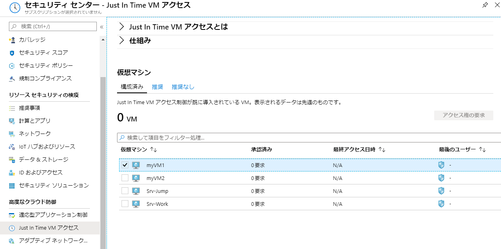

3.  **アクセスをリクエスト** をクリックします。**アクセスをリクエスト** ウィンドウが開きます。

       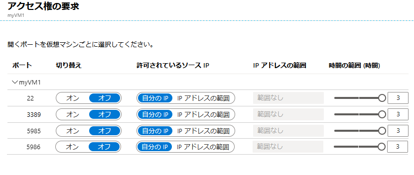

4.  **アクセスをリクエスト** で、各 VM に対して、開くポート、ポートが開かれるソース IP アドレス、およびポートが開かれる時間枠を構成します。Just-In-Time ポリシーで構成されているポートへのアクセスのみを要求できるようになります。各ポートには、Just-In-Time ポリシーから導出された最大許容時間があります。

5.  **オープンポート** をクリックします。

**注記**：アクセスをリクエストしているユーザーがプロキシの背後にいる場合、オプション **My IP** が動作しない場合があります。組織の完全な IP アドレス範囲を定義する必要がある場合があります。

### タスク 3：  ASC を介して JIT アクセス ポリシーを編集する

VM を保護する新しいポートを追加および構成するか、既に保護されているポートに関連する他の設定を変更することにより、VM の既存の Just-In-Time ポリシーを変更できます。

VM の既存の Just-In-Time ポリシーを編集するには：

1.  **設定済み** タブの **VM** で、その VM の行内の 3 点ドットをクリックして、ポートを追加する VM を選択します。 

1.  **編集** を選択します。
1.  **JIT VMアクセス構成** で、既に保護されているポートの既存の設定を編集するか、新しいカスタムポートを追加できます。 
  
      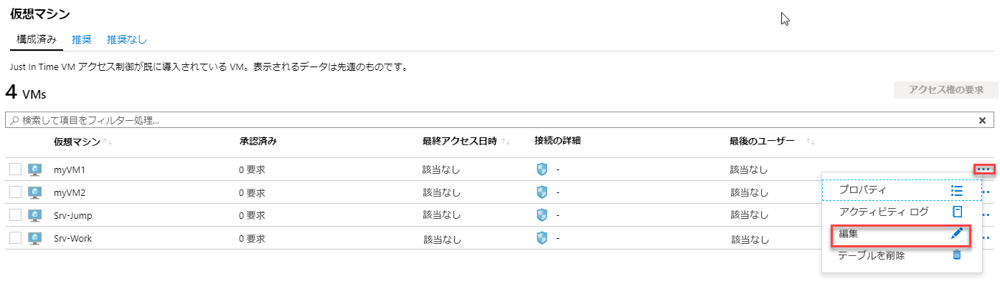

### タスク 4：  ASC での JIT アクセス アクティビティの監査

ログ検索を使用して、VM アクティビティに関する分析情報を手に入れることができます。ログを表示するには：

1.  **Just-In-Time VM アクセス** で、**構成済み** タブを選択します。
2.  **VM** で、VM の行内の 3 点ドットをクリックして情報を表示する VM を選択し、メニューで **アクティビティ ログ** を設定します。**アクティビティ ログ** を開きます。

       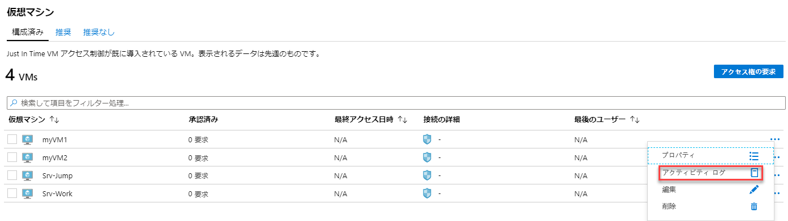

   **アクティビティ ログ** は、時刻、日付、サブスクリプションとともに、その VM に対する以前の操作のフィルター ビューを提供します。

ログ情報をダウンロードするには、**すべてのアイテムを CSV としてダウンロードするには、ここをクリックしてください** を選択します。

フィルターを変更して、**適用** をクリックして、検索とログを作成します。

### タスク 5：Azure VM ブレードを介して VM で JIT アクセスを構成する

VM 全体に Just-In-Time アクセスを簡単に展開できるようにするために、VM 内から直接 Just-In-Time アクセスのみを許可するように VM を設定できます。

1.  Azure portal で、**仮想マシン** を選択します。

2.  Just-In-Time アクセスに制限する仮想マシンをクリックします。
3.  メニューで、**構成** をクリックします。
4.  **Just-In-Time アクセス** で、**Just-In-Time ポリシーを有効にする** をクリックします。 

    これにより、次の設定を使用して VM の Just-In-Time アクセスが可能になります。

       - Windows Server：
         - RDP ポート 3389
         - 3 時間の最大アクセス許可
         - 許可されたソース IP アドレスは Any に設定されます
    
       - Linuxサーバー：
         - SSH ポート 22
         - 3 時間の最大アクセス許可
         - 許可されたソース IP アドレスは Any に設定されます
     
    VM で既に Just-In-Time が有効になっている場合、その構成ページに移動すると、Just-In-Time が有効になっていることがわかります。リンクを使用して、Azure Security Center でポリシーを開き、表示および設定を変更します。 

     

### タスク 5：  Azure VM ブレードを介して VM への JIT アクセスをリクエストする

Azure portal で VM に接続しようとすると、Azure はその VM に Just-In-Time アクセスポリシーが構成されているかどうかを確認します。

- VM で JIT ポリシーが構成されている場合は、**アクセスをリクエスト** をクリックして、VM に設定された JIT ポリシーに従ってアクセスできます。 

     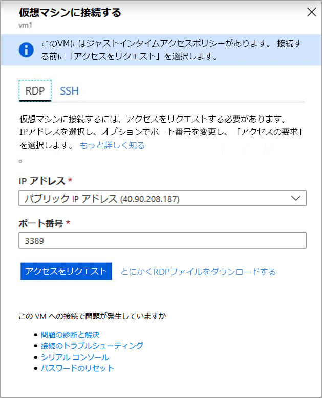

  アクセスは、次のデフォルト パラメーターで要求されます。

  - **ソース IP**：「任意」 (*) (変更できません)
  - **時間範囲**：3時間 (変更できません) 
  - **ポート番号** Windows の RDP ポート 3389 / Linux のポート 22 (変更可能)

  **注記**：Azure Firewall で保護された VM のリクエストが承認されると、Security Center は、VM への接続に使用する適切な接続の詳細 (DNAT テーブルからのポートマッピング) をユーザーに提供します。

  - VM で JIT を構成していない場合、JIT ポリシーを構成するように求められます。

      

| 警告：続行する前に、このラボで使用したすべてのリソースを削除する必要があります。  **Azure Portal** でこれを行うには、**リソース グループ** をクリックします。  作成したリソース グループを選択します。  リソース グループ ブレードで、**リソース グループを削除** をクリックし、リソース グループ名を入力して、**削除** をクリックします。
  作成した可能性のある追加のリソース グループに対してプロセスを繰り返します。**これを行わないと、他のラボで問題が発生する可能性があります。** |
| --- |

**結果**：これで、このラボを完了しました。

